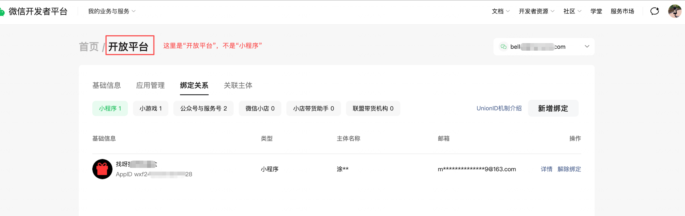

<!-- 来源: https://developers.weixin.qq.com/miniprogram/dev/framework/open-ability/union-id.html -->

# UnionID 机制说明

如果开发者拥有多个移动应用、网站应用、小程序、小游戏、公众号、服务号、微信小店、小店联盟带货机构、小店带货助手等，可通过平台开放的 API 获取 UnionID 来区分用户的唯一性，因为只要是同一个微信开放平台账号下的移动应用、网站应用、小程序、小游戏、公众号、服务号、微信小店、小店联盟带货机构、小店带货助手，用户的 UnionID 是唯一的。

## UnionID获取途径

绑定了开发者账号的小程序，可以通过以下途径获取 UnionID。

1. 开发者可以直接通过 [wx.login](https://developers.weixin.qq.com/miniprogram/dev/api/open-api/login/wx.login.html) + `code2Session` 获取到该用户 UnionID，无须用户授权。
2. 小程序端调用云函数时，可在云函数中通过 [Cloud.getWXContext](https://developers.weixin.qq.com/miniprogram/dev/wxcloudservice/wxcloud/reference-sdk-api/utils/Cloud.getWXContext.html) 获取 UnionID。
3. 用户在小程序（暂不支持小游戏）中支付完成后，开发者可以直接通过 `getPaidUnionID` 接口获取该用户的 UnionID，无需用户授权。注意：本接口仅在用户支付完成后的5分钟内有效，请开发者妥善处理。

## 小程序绑定开放平台账号的流程

- 登录 [微信开发者平台](https://developers.weixin.qq.com/platform) ，进入控制台首页，然后前往「我的业务 - 开放平台 - 绑定关系 - 小程序」
- **注意不是前往「我的业务 - 小程序 - 绑定关系 - 开放平台」**

