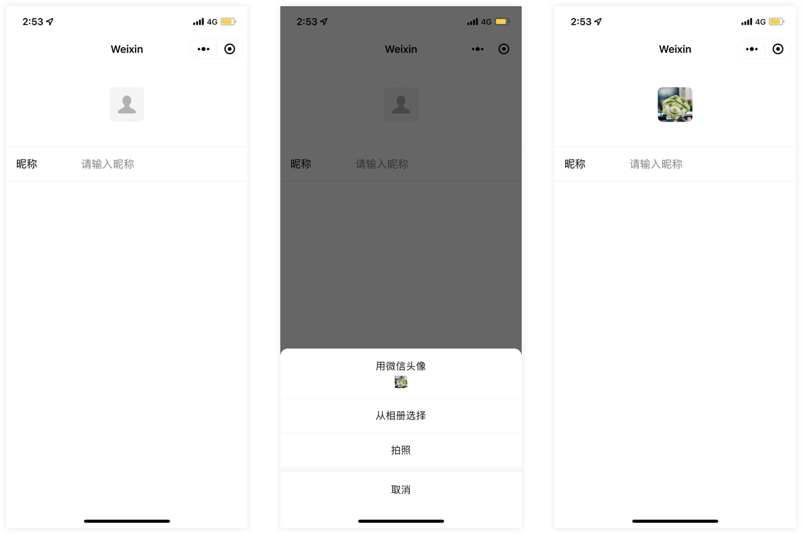
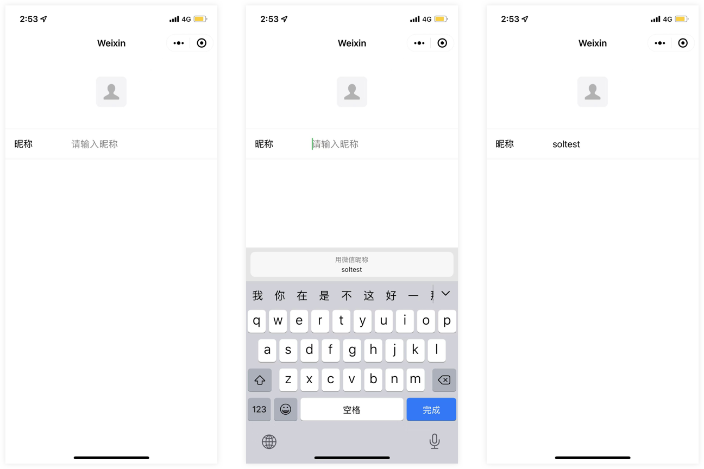

<!-- 来源: https://developers.weixin.qq.com/miniprogram/dev/framework/open-ability/userProfile.html -->

# 头像昵称填写

从基础库 [2.21.2](../compatibility.md) 开始支持

当小程序需要让用户完善个人资料时，可以通过微信提供的头像昵称填写能力快速完善。

根据相关法律法规，为确保信息安全，由用户上传的图片、昵称等信息微信侧将进行安全检测，组件从基础库2.24.4版本起，已接入内容安全服务端接口（ [mediaCheckAsync](https://developers.weixin.qq.com/miniprogram/dev/OpenApiDoc/sec-center/sec-check/mediaCheckAsync.html) 、 [msgSecCheck](https://developers.weixin.qq.com/miniprogram/dev/OpenApiDoc/sec-center/sec-check/msgSecCheck.html) ），以减少内容安全风险对开发者的影响。

## 使用方法

### 头像选择

需要将 [button](https://developers.weixin.qq.com/miniprogram/dev/component/button.html) 组件 `open-type` 的值设置为 `chooseAvatar` ，当用户选择需要使用的头像之后，可以通过 `bindchooseavatar` 事件回调获取到头像信息的临时路径。

从基础库2.24.4版本起，若用户上传的图片未通过安全监测，不触发 `bindchooseavatar` 事件。



### 昵称填写

需要将 [input](https://developers.weixin.qq.com/miniprogram/dev/component/input.html) 组件 `type` 的值设置为 `nickname` ，当用户在此input进行输入时，键盘上方会展示微信昵称。

从基础库2.24.4版本起，在 `onBlur` 事件触发时，微信将异步对用户输入的内容进行安全监测，若未通过安全监测，微信将清空用户输入的内容，建议开发者通过 [form](https://developers.weixin.qq.com/miniprogram/dev/component/form.html) 中 `form-type` 为 `submit` 的 [button](https://developers.weixin.qq.com/miniprogram/dev/component/button.html) 组件收集用户输入的内容。



在开发者工具上，input 组件是用 web 组件模拟的，因此部分情况下并不能很好的还原真机的表现，建议开发者在使用到原生组件时尽量在真机上进行调试。

## 代码示例

[在开发者工具中预览效果](https://developers.weixin.qq.com/s/AHlLS9mn7Izb)

```html
<button class="avatar-wrapper" open-type="chooseAvatar" bind:chooseavatar="onChooseAvatar">
  <image class="avatar" src="{{avatarUrl}}"></image>
</button>
<input type="nickname" class="weui-input" placeholder="请输入昵称"/>
```

```js
const defaultAvatarUrl = 'https://mmbiz.qpic.cn/mmbiz/icTdbqWNOwNRna42FI242Lcia07jQodd2FJGIYQfG0LAJGFxM4FbnQP6yfMxBgJ0F3YRqJCJ1aPAK2dQagdusBZg/0'

Page({
  data: {
    avatarUrl: defaultAvatarUrl,
  },
  onChooseAvatar(e) {
    const { avatarUrl } = e.detail
    this.setData({
      avatarUrl,
    })
  }
})
```
