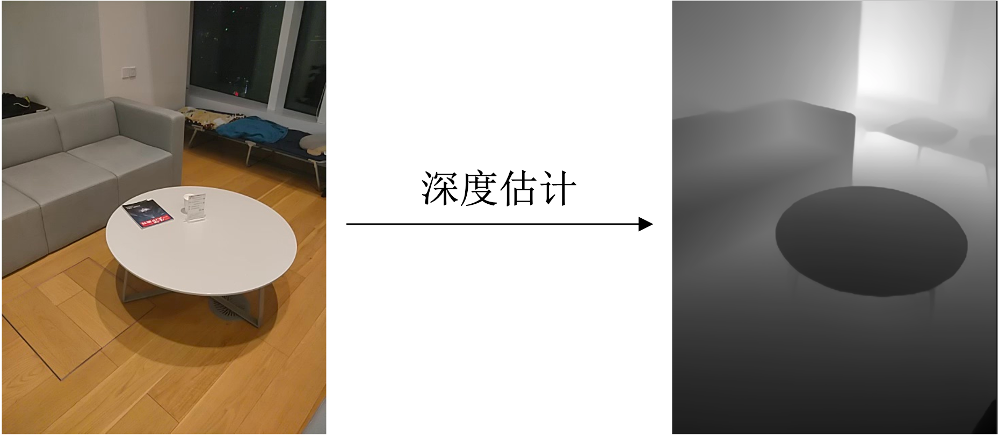
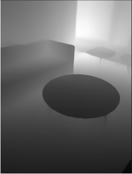
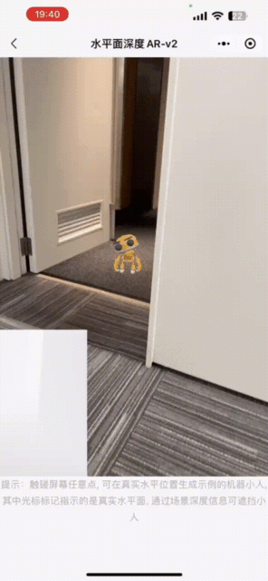

<!-- 来源: https://developers.weixin.qq.com/miniprogram/dev/framework/open-ability/visionkit/depth.html -->

# 深度估计

VisionKit提供深度估计能力。

深度估计，就是获取图像中场景里的每个点到相机的距离信息，这种距离信息组成的图我们称之为深度图。

## 方法定义

我们在这里提供了深度估计的两种模式：

**视觉模式** : (安卓微信>=8.0.37，iOS微信>=8.0.38起) 使用摄像头进行深度估计 。

**AR模式** : (安卓微信>=8.0.38同时基础库>=2.33.0，iOS微信>=8.0.39同时基础库>=3.0.0) 使用摄像头和IMU进行深度估计，输出由near和far控制的非线性深度图，用于做虚实遮挡，目前支持部分机型，支持机型列表等同于 [6Dof-水平面AR-V2平面AR接口支持列表](./plane.md) 。

<table><thead><tr><th style="text-align:center">接口类型</th> <th style="text-align:center">精度</th> <th style="text-align:center">机型覆盖率</th></tr></thead> <tbody><tr><td style="text-align:center">视觉模式</td> <td style="text-align:center">中</td> <td style="text-align:center"><font color="#dd0000">高</font><br></td></tr> <tr><td style="text-align:center">AR模式</td> <td style="text-align:center"><font color="#dd0000">高</font><br></td> <td style="text-align:center">中</td></tr></tbody></table>

### 视觉模式接口

深度估计视觉模式接口提供2种使用方法，一种是输入一张静态图片进行深度估计，另一种是通过摄像头进行实时深度估计。

1. 静态图片估计

通过 [VKSession.detectDepth接口](https://developers.weixin.qq.com/miniprogram/dev/api/ai/visionkit/VKSession.detectDepth.html) 输入一张图像，然后通过 [VKSession.on](https://developers.weixin.qq.com/miniprogram/dev/api/ai/visionkit/VKSession.on.html) 接口监听深度图信息，图中像素的值代表当前的深度值，颜色越黑，代表距离摄像头越近，反之颜色越白，代表距离深度越远。



示例代码：

```js

const session = wx.createVKSession({
  track: {
    depth: {
      mode: 2 // mode: 1 - 使用摄像头；2 - 手动传入图像
    },
  },
  gl: this.gl,
})
// 静态图片估计模式下，每调一次 detectDepth 接口就会触发一次 updateAnchors 事件
session.on('updateAnchors', anchors => {
  anchors.forEach(anchor => {
    console.log('anchor.depthArray', anchor.depthArray) // 深度图 ArrayBuffer 数据
    console.log('anchor.size', anchor.size) // 深度图大小，结果为数组[宽, 高]
  })
})

// 需要调用一次 start 以启动
session.start(errno => {
  if (errno) {
    // 如果失败，将返回 errno
  } else {
    // 否则，返回null，表示成功
    session.detectDepth({
      frameBuffer, // 待检测图片的ArrayBuffer 数据。待检测的深度图像RGBA数据，
      width, // 图像宽度
      height, // 图像高度
    })
  }
})
```

1. 通过摄像头实时估计

算法实时输出当前帧的深度图，每一帧像素的值代表当前的深度值，颜色越黑，代表距离摄像头越近，反之颜色越白，代表距离深度越远。

示例代码：

```js
const session = wx.createVKSession({
  track: {
    depth: {
      mode: 1 // mode: 1 - 使用摄像头；2 - 手动传入图像
    },
  },
})

// 需要调用一次 start 以启动
session.start(errno => {
  if (errno) {
    // 如果失败，将返回 errno
  } else {
    // 获取每一帧的信息
    const frame = session.getVKFrame(canvas.width, canvas.height)
    // 获取每帧的深度图信息
    const depthBufferRes = frame.getDepthBuffer();
    const depthBuffer = new Float32Array(depthBufferRes.DepthAddress)
    //创建渲染逻辑, 将数组值传输到一张纹理上，并渲染到屏幕
    render()
  }
})
```

### AR模式接口

详情见 [水平面AR中的V2+虚实遮挡](./plane.md)

## 实时估计输出说明

### 1. 效果展示



### 2. 深度估计关键点

深度实时关键点输出字段包括

```js
struct anchor
{
  DepthAddress, // 深度图ArrayBuffer的地址, 用法如new Float32Array(depthBufferRes.DepthAddress);
  width,    // 返回深度图的宽
  height,      // 返回深度图的高
}
```

## 应用场景示例

1. 特效场景。
2. AR游戏以及应用(如下是AR虚实遮挡的例子)。



## 程序示例

视觉模式:

1. [实时深度估计能力使用参考](https://github.com/wechat-miniprogram/miniprogram-demo/tree/master/miniprogram/packageAPI/pages/ar/depth-detect)
2. [静态图像深度估计能力使用参考](https://github.com/wechat-miniprogram/miniprogram-demo/tree/master/miniprogram/packageAPI/pages/ar/photo-depth-detect)

AR模式:

1. [V2平面+虚实遮挡](https://github.com/wechat-miniprogram/miniprogram-demo/tree/master/miniprogram/packageAPI/pages/ar/plane-ar-v2-depth)

## demo体验

视觉模式:

1. 实时深度估计能力，在小程序示例中的 **接口-VisionKit视觉能力-实时深度图检测** 中体验。
2. 照片深度估计能力，在小程序示例中的 **接口-VisionKit视觉能力-照片深度图检测** 中体验。

AR模式:

1. 在小程序示例中的 **接口-VisionKit视觉能力-水平面AR-v2-虚实遮挡** 中体验。
