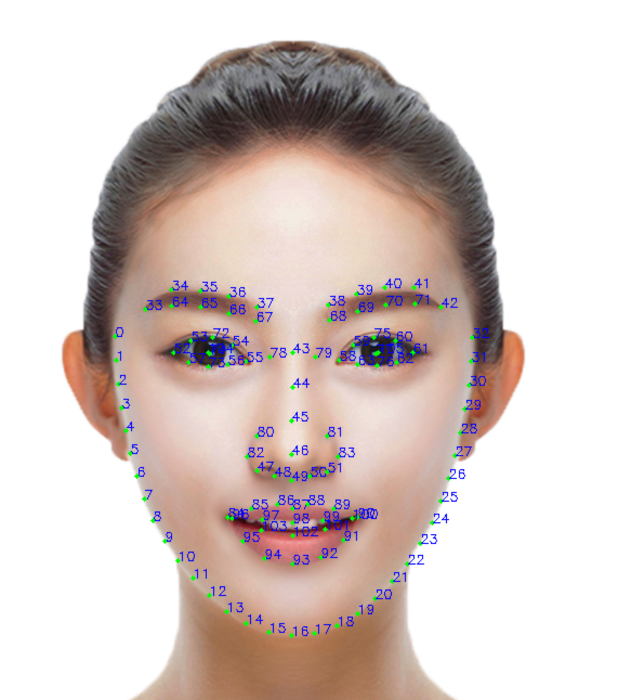

<!-- 来源: https://developers.weixin.qq.com/miniprogram/dev/framework/open-ability/visionkit/face.html -->

# 人脸关键点检测

VisionKit 从基础库 2.25.0 版本 (安卓微信>=8.0.25，iOS微信>=8.0.24) 开始提供人脸关键点检测，作为与 `marker 能力` 和 `OSD 能力` 平行的能力接口。

从 微信 >= 8.1.0 版本开始提供人脸3D关键点检测，作为人脸2D关键点检测的扩展能力接口。

## 方法定义

人脸关键点检测有2种使用方法，一种是输入一张静态图片进行检测，另一种是通过摄像头实时检测。

### 1. 静态图片检测

通过 [VKSession.detectFace 接口](https://developers.weixin.qq.com/miniprogram/dev/api/ai/visionkit/VKSession.detectFace.html) 输入一张图像，算法检测到图像中的人脸，然后通过 [VKSession.on 接口](https://developers.weixin.qq.com/miniprogram/dev/api/ai/visionkit/VKSession.on.html) 输出人脸位置坐标、106个关键点坐标以及人脸在三维坐标系中的旋转角度。


示例代码：

```js
const session = wx.createVKSession({
  track: {
    face: { mode: 2 } // mode: 1 - 使用摄像头；2 - 手动传入图像
  },
})
// 静态图片检测模式下，每调一次 detectFace 接口就会触发一次 updateAnchors 事件
session.on('updateAnchors', anchors => {
  anchors.forEach(anchor => {
    console.log('anchor.points', anchor.points)
    console.log('anchor.origin', anchor.origin)
    console.log('anchor.size', anchor.size)
    console.log('anchor.angle', anchor.angle)
  })
})

// 需要调用一次 start 以启动
session.start(errno => {
  if (errno) {
    // 如果失败，将返回 errno
  } else {
    // 否则，返回null，表示成功
    session.detectFace({
      frameBuffer, // 图片 ArrayBuffer 数据。人脸图像像素点数据，每四项表示一个像素点的 RGBA
      width, // 图像宽度
      height, // 图像高度
      scoreThreshold: 0.5, // 评分阈值
      sourceType: 1,
      modelMode: 1,
    })
  }
})
```

### 2. 通过摄像头实时检测

算法实时检测相机中的人脸，通过 [VKSession.on 接口](https://developers.weixin.qq.com/miniprogram/dev/api/ai/visionkit/VKSession.on.html) 实时输出人脸位置坐标、106个关键点坐标以及人脸在三维坐标系中的旋转角度。

示例代码：

```js
const session = wx.createVKSession({
  track: {
    face: { mode: 1 } // mode: 1 - 使用摄像头；2 - 手动传入图像
  },
})

// 摄像头实时检测模式下，监测到人脸时，updateAnchors 事件会连续触发 （每帧触发一次）
session.on('updateAnchors', anchors => {
  anchors.forEach(anchor => {
    console.log('anchor.points', anchor.points)
    console.log('anchor.origin', anchor.origin)
    console.log('anchor.size', anchor.size)
    console.log('anchor.angle', anchor.angle)
  })
})

// 当人脸从相机中离开时，会触发 removeAnchors 事件
session.on('removeAnchors', () => {
  console.log('removeAnchors')
})

// 需要调用一次 start 以启动
session.start(errno => {
  if (errno) {
    // 如果失败，将返回 errno
  } else {
    // 否则，返回null，表示成功
  }
})
```

### 3. 开启3D关键点检测

想要开启人脸3D关键点检测能力，静态图片模式仅需要在2D调用基础上增加 `open3d` 字段，如下

```js
// 静态图片模式调用
session.detectFace({
      ...,           // 同2D调用参数
      open3d: true,  // 开启人脸3D关键点检测能力，默认为false
    })
```

摄像头实时模式则在2D调用基础上增加3D开关更新函数，如下

```js
// 摄像头实时模式调用
session.on('updateAnchors', anchors => {
  this.session.update3DMode({open3d: true})  // 开启人脸3D关键点检测能力，默认为false
  ...,  // 同2D调用参数
})
```

## 输出说明

### 1. 点位定义

人脸2D关键点与人脸3D关键点均为106点，定义方式如下图所示。在脸部姿态发生变化时，人脸2D关键点的轮廓点会始终沿着可见人脸边缘，而人脸3D关键点则维持立体结构。 

### 2. 人脸2D关键点

人脸2D关键点输出字段包括

```js
struct anchor
{
  points,    // 106点在图像中的(x,y)坐标
  origin,    // 人脸框的左上角(x,y)坐标
  size,      // 人脸框的宽和高(w,h)
  angle,     // 人脸角度信息(pitch, yaw, roll)
  confidence // 人脸关键点的置信度
}
```

### 3. 人脸3D关键点

开启人脸3D关键点检测能力后，可以获取人脸2D及3D关键点信息，其中人脸3D关键点输出字段包括

```js
struct anchor
{
  ...,               // 人脸关键点2D输出信息
  points3d,          // 人脸106点的(x,y,z)3D坐标
  camExtArray,       // 相机外参矩阵，定义为[R, T \\ 0^3 , 1], 使用相机内外参矩阵可将3D点位投影回图像
  ccamIntArray       // 相机内参矩阵，参考glm::perspective(fov, width / height, near, far);
}
```

## 应用场景示例

1. 人脸检测。
2. 人脸特效。
3. 人脸姿态估计。
4. 人脸 AR 游戏。

## 程序示例

1. [实时摄像头人脸检测能力使用参考](https://github.com/wechat-miniprogram/miniprogram-demo/tree/master/miniprogram/packageAPI/pages/ar/face-detect)
2. [静态图像人脸检测能力使用参考](https://github.com/wechat-miniprogram/miniprogram-demo/tree/master/miniprogram/packageAPI/pages/ar/photo-face-detect)

## 特别说明

若小程序人脸识别功能涉及采集、存储用户生物特征（如人脸照片或视频、身份证和手持身份证、身份证照和免冠照等），此类型服务需使用 [微信原生人脸识别接口](https://developers.weixin.qq.com/community/develop/doc/000442d352c1202bd498ecb105c00d?highline=%E4%BA%BA%E8%84%B8%E6%A0%B8%E8%BA%AB)
