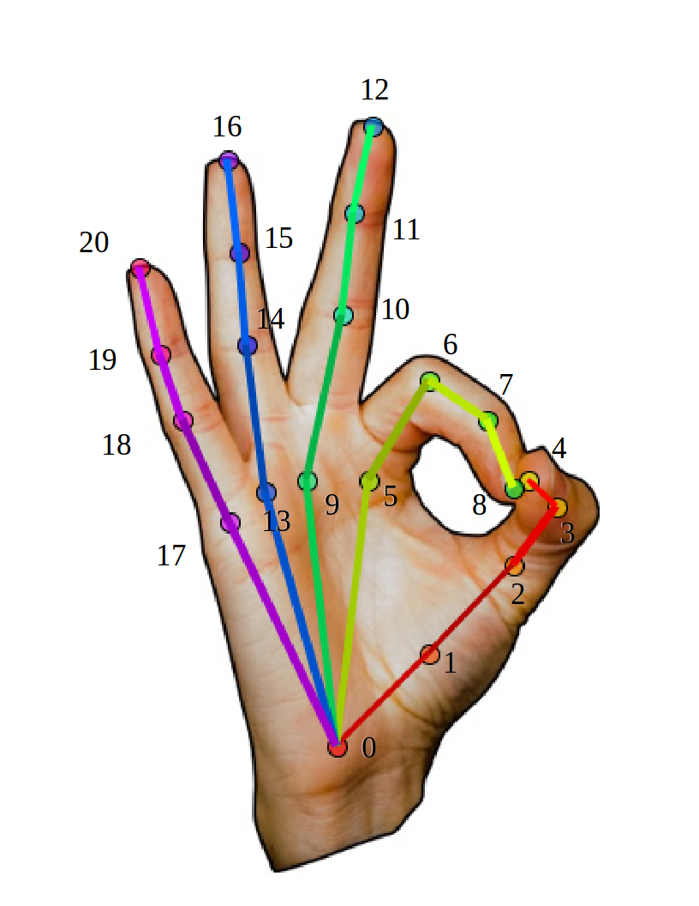
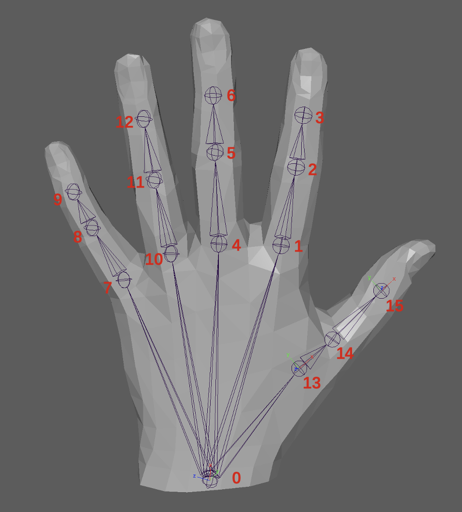

<!-- 来源: https://developers.weixin.qq.com/miniprogram/dev/framework/open-ability/visionkit/hand.html -->

# Hand检测

VisionKit从基础库 2.28.0版本开始提供hand检测能力。从 微信>=8.1.0 版本开始提供人手3D关键点检测，作为Hand检测的扩展能力接口。

## 方法定义

hand检测有2种使用方法，一种是输入一张静态图片进行检测，另一种是通过摄像头实时检测。

### 1. 静态图片检测

通过 [VKSession.detectHand 接口](https://developers.weixin.qq.com/miniprogram/dev/api/ai/visionkit/VKSession.detectHand.html) 输入一张图像，算法检测到图像中的手势，然后通过 [VKSession.on 接口](https://developers.weixin.qq.com/miniprogram/dev/api/ai/visionkit/VKSession.on.html) 输出获取的手势关键点信息。

示例代码：

```js
const session = wx.createVKSession({
  track: {
    hand: { mode: 2 } // mode: 1 - 使用摄像头；2 - 手动传入图像
  },
})

// 静态图片检测模式下，每调一次 detectHand 接口就会触发一次 updateAnchors 事件
session.on('updateAnchors', anchors => {
    this.data.anchor2DList = []
    this.setData({
        anchor2DList: anchors.map(anchor => ({
            points: anchor.points, // 关键点坐标
            origin: anchor.origin, // 识别框起始点坐标
            size: anchor.size, // 识别框的大小
            gesture: anchor.gesture // 手势分类
        })),
    })
})

// 需要调用一次 start 以启动
session.start(errno => {
  if (errno) {
    // 如果失败，将返回 errno
  } else {
    // 否则，返回null，表示成功
    session.detectHand({
      frameBuffer, // 图片 ArrayBuffer 数据。待检测图像的像素点数据，每四项表示一个像素点的 RGBA
      width, // 图像宽度
      height, // 图像高度
      scoreThreshold: 0.5, // 评分阈值
      algoMode: 2 //算法模式：0, 检测模式，输出框和点；1，手势模式，输出框和手势分类；2，同时具备0和1，输出框、点、手势分类
    })
  }
})
```

### 2. 通过摄像头实时检测

算法实时检测相机中的手势姿态，通过 [VKSession.on 接口](https://developers.weixin.qq.com/miniprogram/dev/api/ai/visionkit/VKSession.on.html) 实时输出检测到的手势关键点。

示例代码：

```js
const session = wx.createVKSession({
  track: {
    hand: { mode: 1 } // mode: 1 - 使用摄像头；2 - 手动传入图像
  },
})

// 摄像头实时检测模式下，监测到手势时，updateAnchors 事件会连续触发 （每帧触发一次）
session.on('updateAnchors', anchors => {
    this.data.anchor2DList = []
    this.data.anchor2DList = this.data.anchor2DList.concat(anchors.map(anchor => ({
        points: anchor.points,
        origin: anchor.origin,
        size: anchor.size
    })))
})

// 当手势从相机中离开时，会触发 removeAnchors 事件
session.on('removeAnchors', () => {
  console.log('removeAnchors')
})

// 需要调用一次 start 以启动
session.start(errno => {
  if (errno) {
    // 如果失败，将返回 errno
  } else {
    // 否则，返回null，表示成功
  }
})
```

### 3. 开启3D关键点检测

想要开启人手3D关键点检测能力，静态图片模式仅需要在2D调用基础上增加 `open3d` 字段，如下

```js
// 静态图片模式调用
session.detectHand({
      ...,           // 同2D调用参数
      open3d: true,  // 开启人手3D关键点检测能力，默认为false
    })
```

摄像头实时模式则在2D调用基础上增加3D开关更新函数，如下

```js
// 摄像头实时模式调用
session.on('updateAnchors', anchors => {
  this.session.update3DMode({open3d: true})  // 开启人手3D关键点检测能力，默认为false
  ...,  // 同2D调用参数
})
```

## 输出说明

### 点位说明

人手2D关键点定义与OpenPose相同，采用21点点位定义，如下图所示。



人手3D关键点采用MANO-16点关节定义，如下图所示。



### 人手检测

人手检测输出字段包括

```js
struct anchor
{
  points,     // 人手2D关键点在图像中的(x,y)坐标
  origin,     // 人手检测框的左上角(x,y)坐标
  size,       // 人手检测框的宽和高(w,h)
  score,      // 人手检测框的置信度
  confidence, // 人手关键点的置信度
  gesture     // 人手手势类别
}
```

### 人手3D关键点

开启人手3D关键点检测能力后，可以获取人手2D及3D关键点信息，其中人手3D关键点输出字段包括

```js
struct anchor
{
  ...,               // 人手检测2D输出信息
  points3d,          // 人手3D关键点的(x,y,z)3D坐标
  camExtArray,       // 相机外参矩阵，定义为[R, T \\ 0^3 , 1], 使用相机内外参矩阵可将3D点位投影回图像
  camIntArray        // 相机内参矩阵，参考glm::perspective(fov, width / height, near, far);
}
```

## 应用场景示例

1. 智能家居。
2. AR互动。
3. 智能车载。

## 程序示例

1. [实时摄像头hand检测能力使用参考](https://github.com/wechat-miniprogram/miniprogram-demo/tree/master/miniprogram/packageAPI/pages/ar/hand-detect)
2. [静态图像hand检测能力使用参考](https://github.com/wechat-miniprogram/miniprogram-demo/tree/master/miniprogram/packageAPI/pages/ar/photo-hand-detect)
