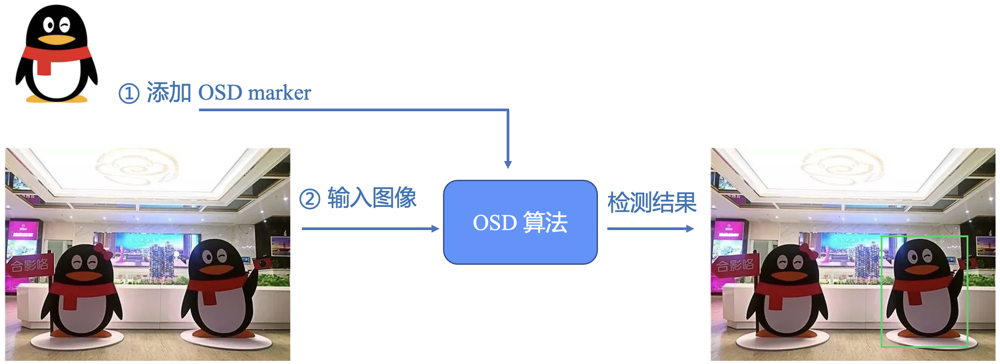

<!-- 来源: https://developers.weixin.qq.com/miniprogram/dev/framework/open-ability/visionkit/osd.html -->

# 单样本检测

## 方法定义

单样本检测（One-shot Detection, OSD）只使用一张待检测类别的图片，就能检测到输入图像中该类别的物体。 待检测类别图片被称为 `OSD marker` 。 与一般物体检测不同，OSD 理论上可以检测任意用户指定的类别。该方法允许 `OSD marker` 与输入图像中的物体有视角差异或一定程度的外形差异。

## 应用场景示例

1. 标志性建筑检测。
2. Logo检测。
3. 商品检测。
4. 宠物检测。
5. 动漫形象检测。

## 能力介绍

- 使用方法

1. 添加 `OSD marker` ：调用 [VKSession.addOSDMarker()](https://developers.weixin.qq.com/miniprogram/dev/api/ai/visionkit/VKSession.addOSDMarker.html) 设置需要检测的物体，例如一张商品图片，返回 `markerId` 。说明： (1) 可多次调用该函数来添加多张图片，用于检测多种类物体。 (2) 添加 `OSD marker` 后就可以持续输入图像来检测物体，不需要每次输入图像前都添加 `OSD marker` 。
2. 删除 `OSD marker` ：调用 [VKSession.removeOSDMarker()](https://developers.weixin.qq.com/miniprogram/dev/api/ai/visionkit/VKSession.removeOSDMarker.html) 根据 `markerId` 删除对应 `OSD marker` ，从而不再检测该物体。
3. 获取当前所有 `OSD marker` 信息：调用 [VKSession.getAllOSDMarker()](https://developers.weixin.qq.com/miniprogram/dev/api/ai/visionkit/VKSession.getAllOSDMarker.html) 得到当前所有 `OSD marker` 的列表，列表每一项包含了 `markerId` 和该图片的路径。

- 程序示例 可以在 [单样本检测(OSD)能力使用参考](https://github.com/wechat-miniprogram/miniprogram-demo/tree/master/miniprogram/packageAPI/pages/ar/osd-ar) 页面查看示例代码。
