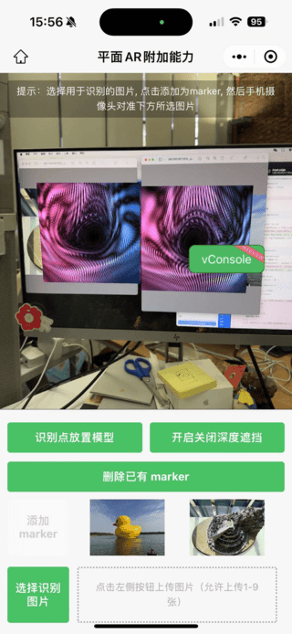

<!-- 来源: https://developers.weixin.qq.com/miniprogram/dev/framework/open-ability/visionkit/plane-options.html -->

# 平面AR 扩展能力

## 方法定义

6DoF-平面AR能力 的能力的多种扩展能力，不同能力可以组合使用。

1. marker 识别能力，即平面空间下多个不同识别目标的识别。
2. `(暂不建议使用，待优化)` 虚实遮挡的能力，即虚拟物体和真实世界的交互遮挡能力。

> 需要 在 `V2` 平面基础上开启使用。

### marker 识别能力

通过配置 VKSession 中的 `marker` 字段启用。然后与普通marker的使用流程一致，通过 `session.addMarker` ，添加不同的识别目标进行识别。示例代码：

```js
const session = wx.createVKSession({
  track: {
    plane: {
        mode: 1
    },
    marker: true,
  },
  version: 'v2'
})

// ... 初始化session相关流程

// 动态添加marker目标，使用流程与普通 marker一致
session.addMarker(filePath)
```

该模式下，marker 识别后，会放置于平面识别的世界空间。允许同时进行多个不同识别目标的识别。 目前版本，该模式适用于静态物体，识别物体更新频率相对较慢。每 `3s` ，未明显移动会更新一下位置，每 `7s` 会进行重新检测。

### 虚实遮挡能力 `(暂不建议使用，待优化)`

#### 虚实遮挡 初始化开启，不支持多扩展混用

通过配置VKSession中的depth字段启用, 示例代码：

```js
const session = wx.createVKSession({
  track: {
    depth: { mode: 1 }
  },
  version: 'v2'
})
```

#### 虚实遮挡 动态开启与关闭，支持多扩展混用

```js
let depthOpenFlag = true;
session.setDepthSwitch(depthOpenFlag) // 更改深度开启状态

// 深度开启状态后，可以通过 VKFrame 获取度缓冲
const frame = session.getVKFrame(this.canvas.width, this.canvas.height)
const depthBufferRes = frame.getDepthBuffer();
// 具体深度使用可以参考小程序示例
```

## 应用场景示例

平面模式下，多 marker 识别



## 程序示例

以上示例，可以在 [水平面+水平面 + 附加能力 示例](https://github.com/wechat-miniprogram/miniprogram-demo/tree/master/miniprogram/packageAPI/pages/ar/plane-ar-v2-options) 页面查看示例代码。
