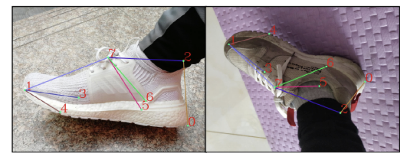
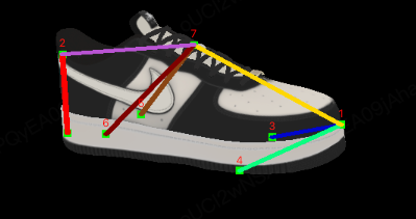

<!-- 来源: https://developers.weixin.qq.com/miniprogram/dev/framework/open-ability/visionkit/shoe.html -->

# Shoe 鞋部检测

VisionKit 从基础库 `3.2.1` 版本 `(安卓微信>=8.0.43，iOS微信>=8.0.43)` 开始支持。

`鞋子检测` 能力作为与 `其他 VisionKit 能力` 平行的能力接口。

该能力一般用于用户进行 `AR试鞋` 或者 `腿部遮挡` 等功能的开发。

## 方法定义

鞋子检测，目前只支持通过 `摄像头实时检测` 。

可以通过配置，决定是否每帧获取 用于对鞋子的腿部区域进行蒙版过滤的 `腿部遮挡纹理` 。

### 摄像头实时检测

首先需要创建 [VKSession](./base.md) 的配置，然后通过 `VKSession.start` 启动 VKSession 实例。

运行过程中，算法实时检测相机中的鞋子，通过 [VKSession.on](https://developers.weixin.qq.com/miniprogram/dev/api/ai/visionkit/VKSession.on.html) 实时输出鞋子矩阵信息（位置旋转缩放）、8个关键点坐标。

最后，实时获取 VKSession 的帧数据 `VKFrame` ，获得 `VKCamera` 。得到 `VKCamera.viewMatrix` 与 `VKCamera.getProjectionMatrix` 并结合， `鞋子矩阵` 与 `关键点信息` 进行具体渲染。

开启VKSession示例代码：

```js
// VKSession 配置
const session = wx.createVKSession({
    track: {
        shoe: {
            mode: 1 // 1 使用摄像头
        }
    }
})

// 摄像头实时检测模式下，监测到鞋子时，updateAnchors 事件会连续触发 （每帧触发一次）
session.on('updateAnchors', anchors => {
    // 目前版本能识别 1-2 双鞋子，anchors 长度为 0-2
    anchors.forEach(anchor => {
        // shoedirec 鞋子左右，0 为左，1 为右。
        console.log('anchor.shoedirec', anchor.shoedirec)
        // transform 鞋子的矩阵信息（位置旋转缩放），4*4 行主序矩阵，
        console.log('anchor.transform', anchor.transform)
        // points3d 位置，8个关键点坐标
        console.log('anchor.points3d', anchor.points3d)
    })
})

// 摄像头实时检测模式下，当鞋子从相机中丢失时，会不断触发
session.on('removeAnchors', () => {
  console.log('removeAnchors')
})

// 需要调用一次 start 以启动
session.start(errno => {
  if (errno) {
    // 如果失败，将返回 errno
  } else {
    // 否则，返回null，表示成功
  }
})
```

渲染试鞋示例代码：

```js
// 可以理解每一帧都需要执行的行为

// 1. 通过 VKSession 实例的 `getVKFrame` 方法可以获取到帧对象
const frame = this.session.getVKFrame(canvas.width, canvas.height)

// 2. 获取 VKCamera
const VKCamera = frame.camera

// 3. 获取 VKCamera 的 视图矩阵与投影矩阵
const viewMat = VKCamera.viewMatrix;
const projMat = VKCamera.getProjectionMatrix(near, far);

// 4. 结合 updateAnchors 里面返回 anchor 的 transform、points3d 进行具体渲染。（具体可以参考官方示例）
```

### 开启腿部遮挡

摄像头实时模式下，想要开启腿部分割能力。

需要保证在 [VKSession.start 接口](./base.md) 调用，开启 VKSession 后。 调用 `VKSession` 的 `updateMaskMode` 更新是否开启腿部分割纹理的返回。然后通过 `VKFrame` 的 `getLegSegmentBuffer` 获取具体的腿部遮挡纹理buffer，然后基于 buffer 创建纹理，进行对应的遮挡剔除。

示例代码：

```js
// 1. 开启腿部遮挡纹理获取开关
// VKSession.start 后，可以通过 updateMaskMode 更新是否能够获取腿部遮挡纹理buffer
this.session.updateMaskMode({
    useMask: true // 开启或关闭腿部遮挡纹理buffer (客户端 8.0.43 默认开启获取，可以手动关闭)
});

// 2. 通过 VKSession 实例的 `getVKFrame` 方法可以获取到帧对象
const frame = this.session.getVKFrame(canvas.width, canvas.height)

// 3. 通过帧对象，获取具体腿部分割纹理Buffer（160*160、单通道）
const legSegmentBuffer = frame.getLegSegmentBuffer();

// 4. 基于腿部分割纹理过滤内容（具体可以参考官方案例）
```

> PS.除了算法分割外，可以手动添加Mesh进行遮挡，可以实现类似的遮挡分割效果。具体可以参考官方案例。

## 输出说明

anchor 信息

```js
struct anchor
{
  transform,  // 鞋子矩阵信息，位置旋转缩放
  points3d,   // 鞋子关键点数组
  shoedirec,  // 鞋子左右脚，0 为左脚，1 为右脚
}
```

### 1. 鞋子矩阵 transform

长度为 16 的数组，表示 行主序 的 4\*4 矩阵。

### 2. 鞋子关键点 points3d

长度为 8 的数组，表示 鞋子识别的 8个关键点:

```js
Array<Point>(8) point3d
```

每个数组元素结构为:

```js
struct Point { x, y, z }
```

表示在 鞋子矩阵 作用后，每个点的 `三维偏移位置` 。

以下为关键点图示与点位解释：



- `点位0` 位于鞋的底部后部，脚后跟处，靠近地面的位置。
- `点位1` 位于鞋子最前面，在竖直方向上大致处于鞋子上表面和鞋子下底面的中间。
- `点位2` 位于鞋的后部，在点位0的上方，位于靠近脚踝的位置。
- `点位3、4` 位于鞋子侧面，其中3点位于左鞋的左侧，右鞋的右侧。4点位于左鞋子的右侧，右鞋的左侧。上图中的3点处于被遮挡的位置。3，4点均紧靠鞋子下底面。
- `点位5，6` 位于鞋子侧面，相对于3，4更靠后，在鞋子下底面偏上一点的位置。
- `点位7` 大致位于鞋舌的中央。

### 3.腿部分割纹理Buffer

160\*160 的 单通道浮点数颜色 ArrayBuffer，数值 0.0 对应非腿部区域，大于 0.0 代表是腿部区域，越靠近 1.0 越接近是腿部区域。

## 如何基于返回信息摆放模型



首先，可以将添加一个节点同步鞋子矩阵信息。再往该节点添加模型，基于鞋子关键点，设置对应的偏移，然后可以缩放模型适配比例，使模型贴合鞋子关键点，达到目标效果。

## 程序示例

#### 摄像头实时检测示例

小程序示例 的 `接口` - `VisionKit视觉能力` - `实时鞋部检测 - 试鞋案例`

开源地址： [实时鞋部检测-试鞋案例](https://github.com/wechat-miniprogram/miniprogram-demo/tree/master/miniprogram/packageAPI/pages/ar/shoe-detect)

识别鞋子，并将鞋子模型放置到识别出的区域。默认并支持动态开启与关闭腿部遮挡，以及显示与隐藏对应的鞋子关键点。

案例效果：
