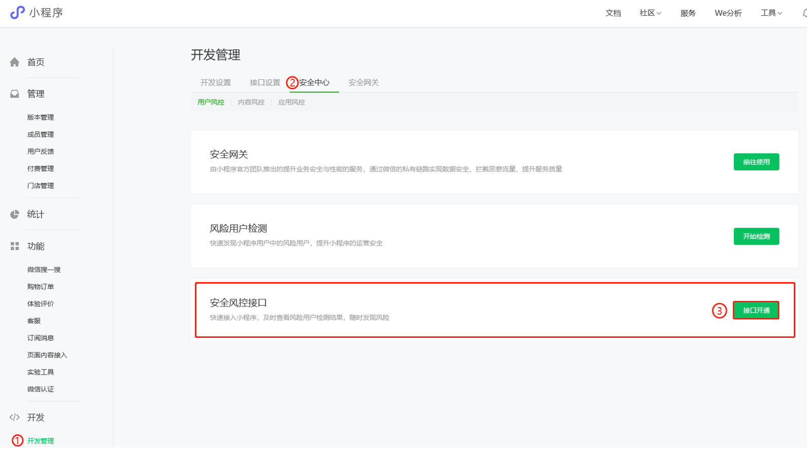

<!-- 来源: https://developers.weixin.qq.com/miniprogram/dev/framework/operation.html -->

# 健康运营指引

## 用户安全解决方案

### 安全风控接口

为提高微信开放平台生态安全性，针对小程序各应用场景中可能存在的恶意注册、营销作弊等黑产风险和安全问题，平台开放API方式向开发者提供安全风控接口协助开发者应对刷单、虚假交易、恶意骗取补贴等营销作弊风险和批量注册、伪造身份等注册黑产风险，以便开发者维护小程序运营秩序和安全。

### 安全风控接口提供能力和应用场景

- 营销作弊场景：在首单优惠和特价优惠等营销活动中有效识别刷单、虚假交易、恶意骗保骗补贴等破坏运营秩序和安全的行为。
- 恶意注册：识别并拦截机器批量注册、垃圾小号、伪造身份等恶意注册行为。

### 能力申请流程

- 登录小程序，在【开发→开发管理→安全中心→用户风控→安全风控接口】申请开通即可。 

### 风险等级说明和使用建议

开发者可根据接口返回的风险等级数判别用户的风险程度，风险等级代表的意义及对应业务的使用，可参考下方的说明及建议，具体的使用可根据业务实际情况动态调整，以达到准确的拦截，保护业务健康有序的开展。

<table><thead><tr><th>风险等级</th> <th>建议处置方案</th></tr></thead> <tbody><tr><td>风险等级0</td> <td>无风险，不做任何阻拦</td></tr> <tr><td>风险等级1</td> <td>低微可疑的风险，建议进行简单的验证（如验证码、短信等）</td></tr> <tr><td>风险等级2</td> <td>轻度可疑的风险，建议进行简单的验证（如验证码、短信等）</td></tr> <tr><td>风险等级3</td> <td>中度可疑的风险，建议根据业务场景采取一定措施避免伤害。例如，营销活动可降低高等级奖励的概率；打榜类活动对此类投票降低权重；登录注册要求二次验证等</td></tr> <tr><td>风险等级4</td> <td>高度可疑的风险，建议根据业务逻辑直接拦截。例如，红包类活动返回不中奖或最小额红包；打榜类活动不计算票数；登录/注册操作要求二次验证；高危业务可选择限制本次操作。</td></tr></tbody></table>

### 开发接入指引

[调用API](https://developers.weixin.qq.com/miniprogram/dev/framework/(getUserRiskRank))

---

## 内容安全解决方案

为提高微信开放平台生态安全性，针对小程序各内容场景中可能存在的安全问题，平台开放API方式向开发者提供内容安全解决方案协助开发者应对文本、图片、音频内容类型下的敏感内容识别、涉黄内容识别、暴恐内容识别等问题，以便开发者维护小程序运营秩序和安全。

### 文本内容安全检测：

**功能描述** ：文本审核接口能够识别文本信息中的色情、时政违规、暴恐等违法有害内容，帮助用户及时、精准地防范违规风险，可用于内容审核、敏感信息过滤、舆情监控等场景。

- 该功能基于10万级大规模敏感词库，结合多种文本对抗方法、政策权威要求等，并运用了深度学习技术，高效识别高危有害内容。同时我们会根据大规模语料和实时反误杀系统，不断更新迭代，确保效果持续提升。

**应用场景** ：用户个人资料文本内容检测；媒体新闻类用户发表文章、社区评论内容检测；游戏类用户编辑上传的素材(如答题类小程序用户上传的问题及答案)检测等。

### 图片内容安全检测：

**功能描述** ：图片内容安全基于腾讯海量数据资源和深度学习技术，为开发者提供图片内容的智能审核服务，不仅能帮助用户降低色情、时政违规、暴力恐怖等风险，还能大幅度节省人工审核成本，保护业务健康发展。

- 通过学习和分析图片影像的肤色、姿态和场景等多种维度，可对图片进行色情识别。
- 提供包括敏感人物的面部识别与敏感事件等的场景识别。
- 基于舆情分析，提供更为严格的暴恐模型，智能识别暴力、血腥场景及恐怖主义、极端主义等涉嫌违禁的图片内容。

**应用场景** ：用户自定义头像检测、涉及拍照的工具类应用(如P图，自拍类应用)用户拍照上传检测；电商类商品上架图片检测；媒体类用户文章里的图片检测；社交类用户上传的图片检测等。

### 音频内容安全检测：

**功能描述** ：识别音频中的涉黄、涉政、谩骂等违规内容，从而降低人工成本，提高审核效率。 **应用场景** ：游戏聊天频道中的语音检测；直播中的主播语音检测；论坛社区发布相关媒体内容的音频检测。

### 开发接入指引

- 文本内容安全接口文档： [msgSecCheck](https://developers.weixin.qq.com/miniprogram/dev/OpenApiDoc/sec-center/sec-check/msgSecCheck.html)
- 音频/图片内容安全异步接口文档： [mediaCheckAsync](https://developers.weixin.qq.com/miniprogram/dev/OpenApiDoc/sec-center/sec-check/mediaCheckAsync.html)

### 常见问题

#### 1、请不要完全依赖内容安全服务

- 将小程序UGC内容接入内容安全服务，可以有效缓解人工审核、降低违规风险，但接入内容安全服务并不意味着一劳永逸解决所有问题，为了进一步确保内容安全，我们仍建议在一些环节设置人工审核确认，以弥补AI算法存在的一些不足。
- 例如API判断为REVIEW的内容，说明可能存在风险，需要人工确认；API判断为PASS的内容，可能包含被漏掉的违规内容，可以按照一定比例抽查。

#### 2、如果对内容安全解决方案有使用疑问或者需求，应该如何反馈？

- 微信开放社区开设了安全风控专区，开发者可以到 [安全中心专区](https://developers.weixin.qq.com/community/minihome/question/1591986099080445956) 发帖互动交流。
