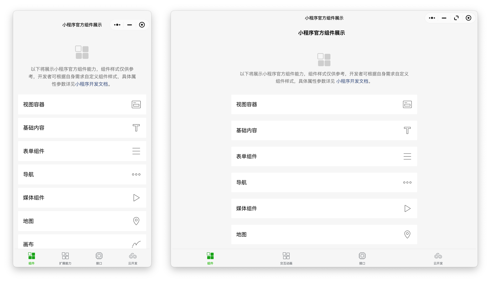
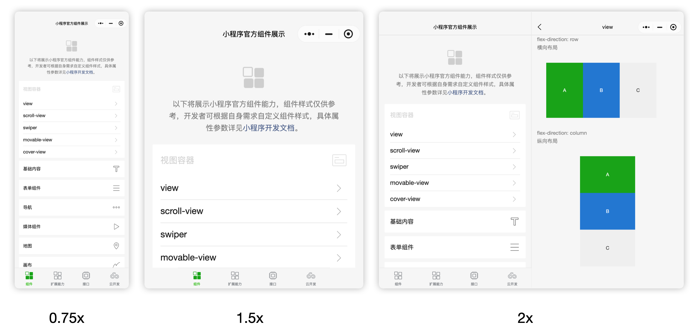
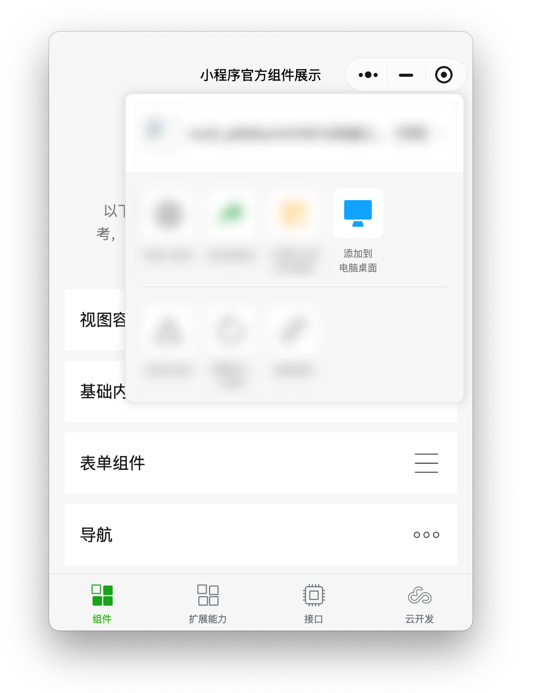
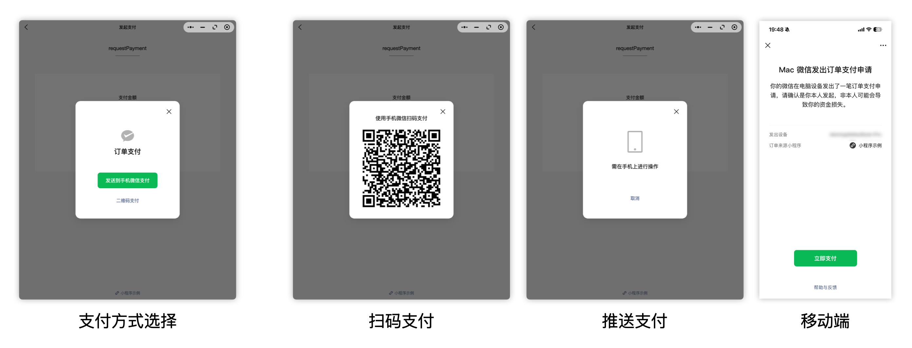
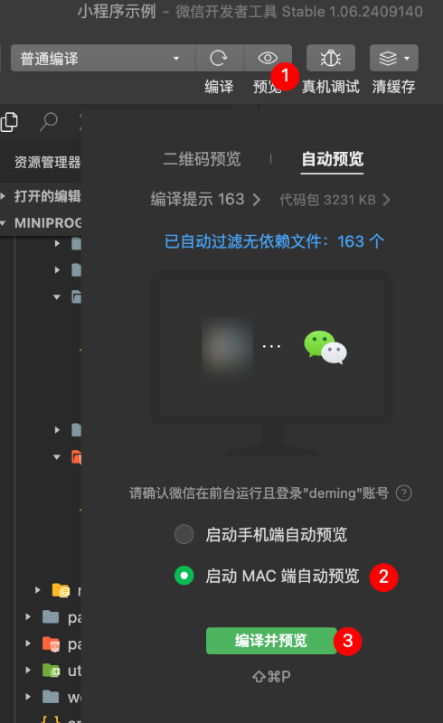

<!-- 来源: https://developers.weixin.qq.com/miniprogram/dev/framework/pc/ -->

# PC 小程序接入指南

## 1 PC 端小程序概要

PC 端小程序是指在 PC 端运行的微信小程序。开发者无需进行特殊适配，即可在 PC 端运行小程序。同时我们也针对 PC 的交互，提供了一些额外的接口与能力，来提升用户在 PC 端的使用体验。

### 1.1 平台信息获取及判断

PC 端目前主要有 Windows、Mac 两个平台。开发者可通过 [wx.getSystemInfoSync](https://developers.weixin.qq.com/miniprogram/dev/api/base/system/wx.getSystemInfoSync.html) 获取到当前设备信息，来辅助判断当前设备的运行环境。

### 1.2 框架底层能力区别

PC 端小程序均采用同套框架，由平台侧兼容了操作系统级别的接口，接口能力、上层表现几乎一致。建议开发者可以将 PC 相关的平台统一进行处理。同样的，小程序基础库也与移动端保持着版本的同步更新。

> Mac 端 3.x 版本最高支持 v3.3.5 基础库。可在 [Mac 微信官网](https://mac.weixin.qq.com/) 下载 4.0 测试版 Mac 微信体验最新效果。

## 2 大屏适配

PC 端天然有大屏体验的优势。开发者可以通过进行适配来快速开启 PC 的大屏模式，同时框架侧也提供了对于非大屏小程序的体验适配方法。

### 2.1 接入大屏适配能力

可在 app.json 中配置 `resizable` 字段来控制小程序是否支持大屏适配。

对于已经接入了大屏适配的小程序，我们将会通过 [wx.onWindowResize](https://developers.weixin.qq.com/miniprogram/dev/api/ui/window/wx.onWindowResize.html) 来通知开发者当前窗口大小。可通过此接口对小程序窗口变化进行响应。

> 因 PC 端交互需要有拖拽区域等原因，PC 的大屏小程序不支持自定义导航栏。在未适配大屏的小程序上，小程序新支持了自定义导航栏能力，可参考： [电脑端小程序导航栏优化生效](https://developers.weixin.qq.com/community/minihome/doc/0006842d5f02f0106192b552f66801?blockType=99)

### 2.2 自适应双栏模式

对于未接入大屏适配的小程序，为保证用户对于不同尺寸窗口的需求，我们将会在框架层对页面进行缩放来确保用户体验。同时如用户拉伸超过 1.5x，我们还会自动将小程序的顶层二级页面进行双栏展示，开发者无需进行适配，即可让用户享受到不同尺寸下的交互体验。

#### 2.2.1 窗口尺寸比例与效果

<table><thead><tr><th>窗口尺寸比例</th> <th>窗口效果</th></tr></thead> <tbody><tr><td>0.75x - 1x</td> <td>缩小</td></tr> <tr><td>1x - 1.5x</td> <td>放大（单窗口）</td></tr> <tr><td>1.5x - 2x</td> <td>双栏模式</td></tr></tbody></table>

### 2.2.2 适配细节

双栏模式下，小程序的顶层二级页面将会被分为左右两栏，每栏展示一个页面。效果如下：

该模式无需开发者适配，用户体验规则如下：

1. 如当前只有一个页面，则会固定呈现在窗口左侧。
2. 如当前存在 2 个及以上页面，则会根据页面打开顺序，将页面栈顶的两级页面自动分配到左右两栏。
3. 如用户在操作左侧页面时触发了 navigateTo 跳转接口，框架会认为此时应在右侧页面进行跳转，将会替换原右侧页面。

## 3 PC 小程序特有能力

为了让用户在 PC 端拥有更好的小程序体验，我们提供了一些额外的接口与功能。

### 3.1 键盘事件

为了让开发者可以更好地响应用户操作，我们提供了 [`wx.onKeyUp`](https://developers.weixin.qq.com/miniprogram/dev/api/device/keyboard/wx.onKeyUp.html) 和 [`wx.onKeyDown`](https://developers.weixin.qq.com/miniprogram/dev/api/device/keyboard/wx.onKeyDown.html) 两个接口，开发者可以监听键盘事件，并进行相应的处理。

### 3.2 拖入文件使用小程序打开

在基础库 v3.7.5 及以上版本中，如用户在 PC 端从它处拖入文件（包括但不限于系统文件夹、微信聊天记录），框架侧将会尝试是用小程序所支持打开的文件类型进行解析，如小程序支持，将会使用该小程序打开文件。

配置小程序所支持打开的文件类型可参考： [聊天素材支持小程序打开](../material/support_material.md)

### 3.3 添加到桌面

在 Windows 平台，小程序可以在菜单中将小程序添加到桌面，用户点击后可直接打开小程序。Mac 平台暂不支持该能力。

## 4 PC 端小程序支付能力

PC 端提供了二维码支付和 PC 支付推送至手机两种支付方式，可以快捷地让支付操作流转至手机完成。

### 4.1 二维码支付

PC 端小程序支持在支付环节展示二维码，用户可通过手机扫描电脑端二维码实现支付。注意事项：

1. 手机扫码的帐号需与 PC 端小程序帐号一致。
2. 二维码有 5 分钟的有效期，超时将失效。

### 4.2 PC 支付推送至手机

自基础库 v3.5.8 起，PC 端小程序新支持推送至手机支付。用户可以在交互中选择推送支付的方式，此时用户手机将会收到一条通知，确认通知后可拉起支付页进行快捷支付。开发者无需适配即可开启该能力。

交互体验如下：

## 5 PC 小程序生态能力

### 5.1 网页应用打开 PC 小程序

网站应用可以通过调用 PC 微信能力打开小程序，在微信 3.9.12 for Windows 及以上版本 与 微信 4.0.0 for Mac 及以上版本的用户，可以在网站应用中跳转至 PC 微信客户端某一小程序的指定页面。具体可参考： [网站应用拉起 PC 小程序](https://developers.weixin.qq.com/doc/oplatform/Website_App/WeChat_PC_APIs/Launching_a_Mini_Program.html)

### 5.2 网页应用分享 PC 小程序

网站应用同时也支持调用 PC 微信能力分享小程序，微信 4.0.1 for Mac 或者微信 4.0.1 for Windows 及以上版本的用户，可以将网站应用内容以小程序卡片的形式分享给微信会话。具体可参考： [网站应用分享 PC 小程序](https://developers.weixin.qq.com/doc/oplatform/Website_App/WeChat_PC_APIs/Share_a_Mini_Program.html)

### 5.3 Scheme 打开 PC 小程序

PC 同时也支持 URL Scheme 能力。开发者可以通过 URL Scheme 在网页、应用中打开小程序。具体可参考： [URL Scheme 打开小程序](../open-ability/url-scheme.md)

## 6 测试方法

### 6.1 通过开发者工具测试 PC 小程序

开发者可通过开发者工具对 PC 小程序进行测试。具体可参考： [PC 小程序开发](https://developers.weixin.qq.com/miniprogram/dev/devtools/pc-dev.html)

### 运行环境要求

下载并安装 1.02.190808 或以上版本的开发者工具， [下载地址](https://developers.weixin.qq.com/miniprogram/dev/devtools/download.html) 。

### 使用流程

1. 使用 [自动预览](./debug.md#%E8%87%AA%E5%8A%A8%E9%A2%84%E8%A7%88) 功能，点击 预览->自动预览，可以选择启动 PC 自动预览，点击编译并预览，成功的话将在微信 PC 版上自动拉起小程序。

## 7 问题反馈

可前往微信开放社区的 [PC 小程序专区](https://developers.weixin.qq.com/community/minihome/mixflow/3690550954962780162) 反馈问题。
