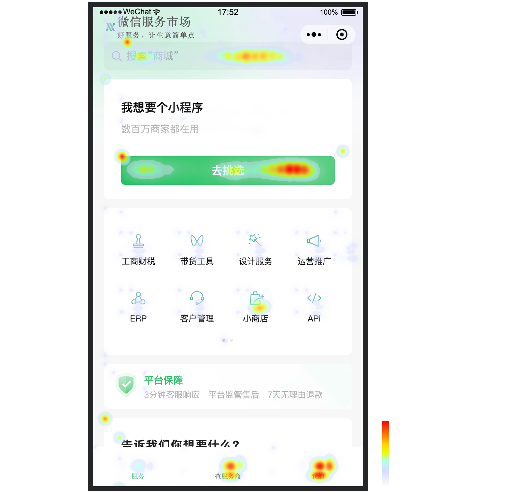

<!-- 来源: https://developers.weixin.qq.com/miniprogram/dev/framework/performance/analysis.html -->

# 产品体验分析

[查看详细介绍](https://developers.weixin.qq.com/miniprogram/analysis/experience/?utm_souce=officialdoc-anl-v202411) 产品体验分析是一款帮助小程序提升拉新、留存、付费转化率的数据分析工具。能够可视化还原用户操作现场，能够精准定位产品交互体验缺陷或者功能bug。

## 功能介绍

### 会话回放

对于用户每一次与应用交互的全部过程都真实记录并进行回放。可查看用户在此次会话中的具体操作行为

### 热力图

直观展示大多数用户是如何使用你的产品。查看用户在产品使用中鼠标点击、页面停留的位置。分析页面元素的曝光度，优化页面信息展示 

### 转化分析

探索不同页面与事件的流量流转，绘制用户体验地图，发现并优化用户流失问题，提升用户转化率与留存率

## 开始体验

[前往查看操作说明](https://developers.weixin.qq.com/miniprogram/analysis/experience/?utm_souce=officialdoc-anl-v202411)
