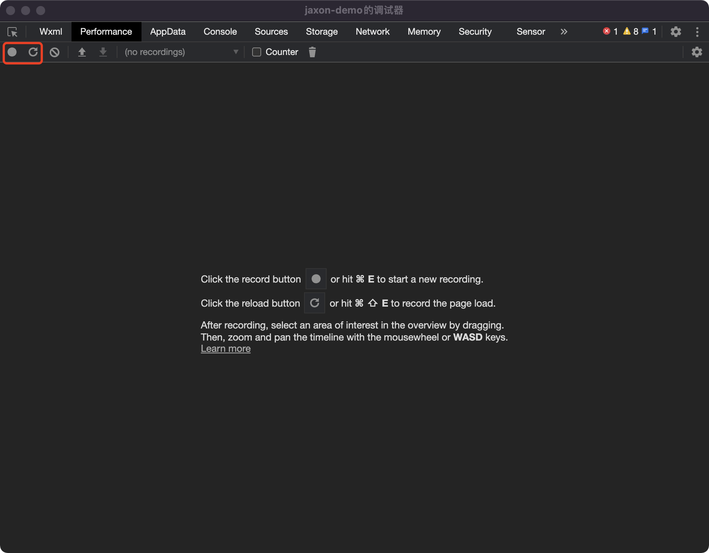
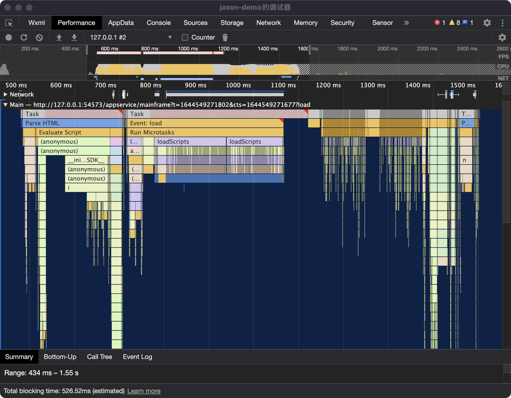
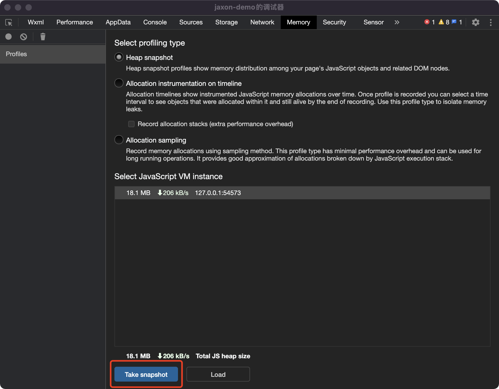
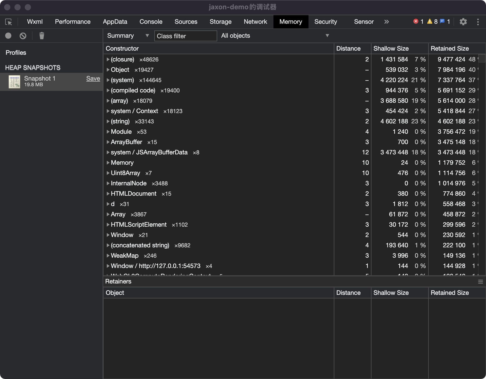
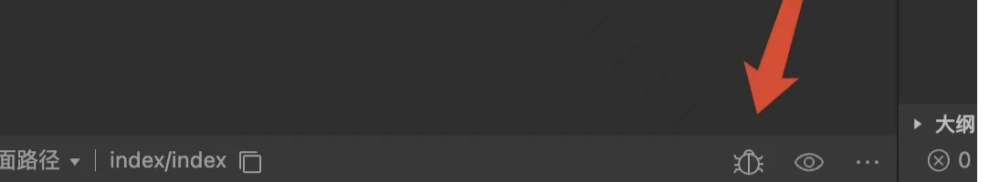
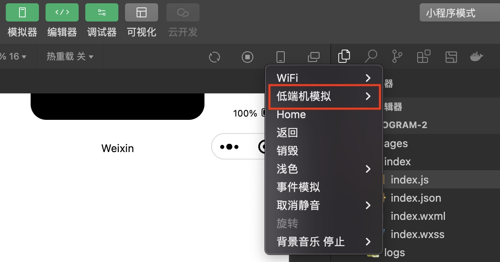

<!-- 来源: https://developers.weixin.qq.com/miniprogram/dev/framework/performance/devtools-perf.html -->

# 开发者工具「模拟器」和「调试器」

微信开发者工具的「模拟器」和「调试器」，可以帮助开发者利用工具模拟小程序的表现，也包括了性能分析的能力。

> 需要开发者工具 1.05.2201240 及以上版本支持

## 逻辑层 JavaScript Profile

开发者可以使用「模拟器」中的「Performance」或「JavaScript Profiler」面板，分析小程序逻辑层的 JS 执行情况。

> 如果要分析启动过程中小程序代码注入的情况，可以点击「Performance」左上角第二个 reload 按钮。

> 详细的使用说明可参考 Chrome 的「Performance」、「JavaScript Profiler」面板

## 逻辑层内存调试

与真机调试 2.0 类似，开发者可以使用「模拟器」中的「memory」面板，获取小程序逻辑层的 JS 堆内存快照，分析内存分布情况，排查内存泄漏问题。

> 详细的使用说明可参考 Chrome 的「Memory」面板

## 视图层调试

> 需要最新工具 nightly 版本支持

开发者可以在模拟器底部打开当前页面的「视图层」调试工具。在工具中，可以通过「Performance」、「memory」、「Layer」、「Rendering」等面板调试小程序视图层的性能。

> 详细的使用说明可参考 Chrome 的对应面板

## 低端机模拟

开发者可以在模拟器中开启「低端机模拟」，开发者工具会对 CPU 使用等进行一定限制，模拟低端机的使用体验。

