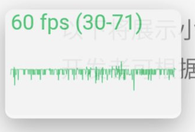

<!-- 来源: https://developers.weixin.qq.com/miniprogram/dev/framework/performance/fps_panel.html -->

# FPS 面板

> 基础库 2.22.1 开始支持，低版本不生效。

为了便于开发者调试渲染层的交互性能，小程序基础库提供了选项开启 FPS 面板，开发者可以实时查看渲染层帧率。



## 启用方式

在 app.json 中，如下配置，则可在小程序启用 FPS 面板，展示当前的实时帧率、及当前时间窗口内的帧率波动范围。

```json
{
  "debugOptions": {
    "enableFPSPanel": true
  }
}
```

**请注意不要把这个配置项带到正式版本。**

## 使用说明

- FPS 面板是通过 webview 的 `requestAnimationFrame` 回调，使用 canvas 绘制的，本身可能会有一些额外的性能开销，但一般情况下可以忽略；
- FPS 面板可以拖动到屏幕的任意位置；
- 未启用同层渲染时，FPS 面板可能会被原生组件遮挡。
