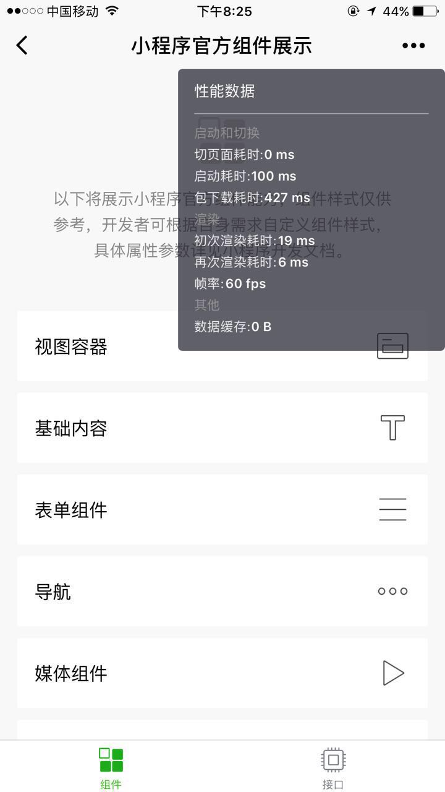

<!-- 来源: https://developers.weixin.qq.com/miniprogram/dev/framework/performance/panel.html -->

# 性能面板

从微信 6.5.8 开始，我们提供了性能面板让开发者了解小程序的性能。开发者可以在开发版小程序下打开性能面板，打开方法：进入开发版小程序，进入右上角更多按钮，点击「显示性能窗口」。

## 性能面板指标说明

<table><thead><tr><th>指标</th> <th>说明</th></tr></thead> <tbody><tr><td>CPU</td> <td>小程序进程的 CPU 占用率，仅 Android 下提供</td></tr> <tr><td>内存</td> <td>小程序进程的内存占用（Total Pss)，仅 Android 下提供</td></tr> <tr><td>启动耗时</td> <td>小程序启动总耗时</td></tr> <tr><td>下载耗时</td> <td>小程序包下载耗时，首次打开或资源包需更新时会进行下载</td></tr> <tr><td>页面切换耗时</td> <td>小程序页面切换的耗时</td></tr> <tr><td>帧率/FPS</td> <td></td></tr> <tr><td>首次渲染耗时</td> <td>页面首次渲染的耗时</td></tr> <tr><td>再次渲染耗时</td> <td>页面再次渲染的耗时（通常由开发者的 setData 操作触发）</td></tr> <tr><td>数据缓存</td> <td>小程序通过 Storage 接口储存的缓存大小</td></tr></tbody></table>
