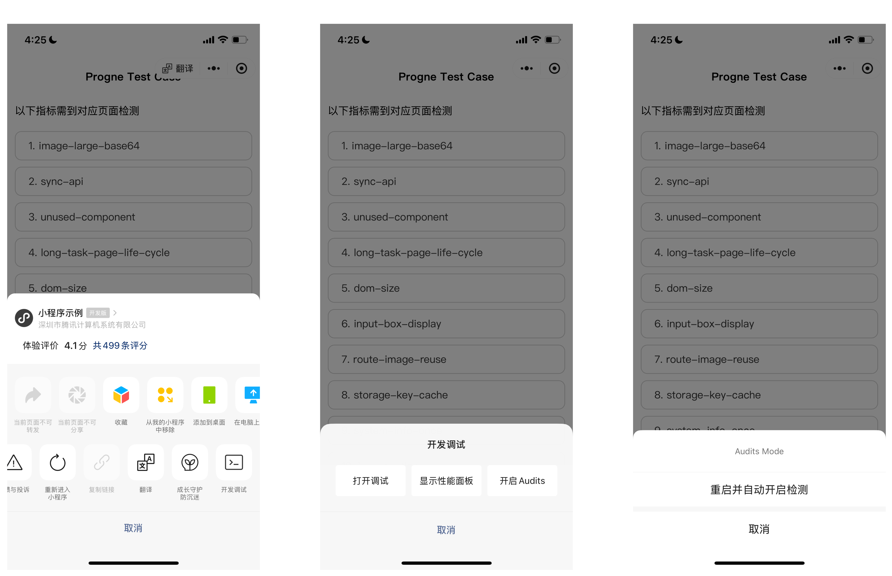
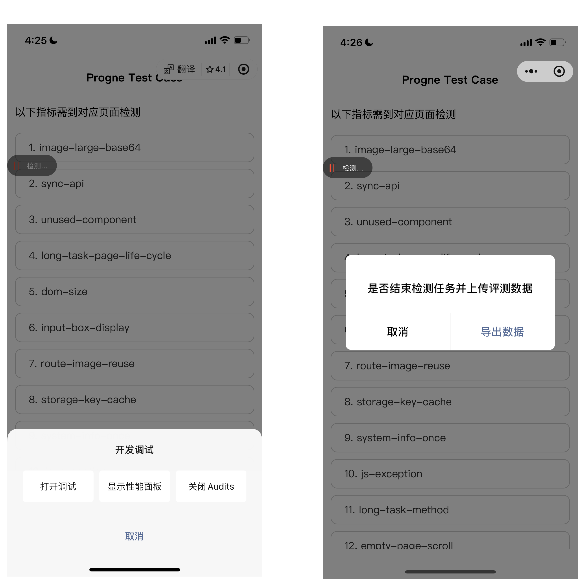
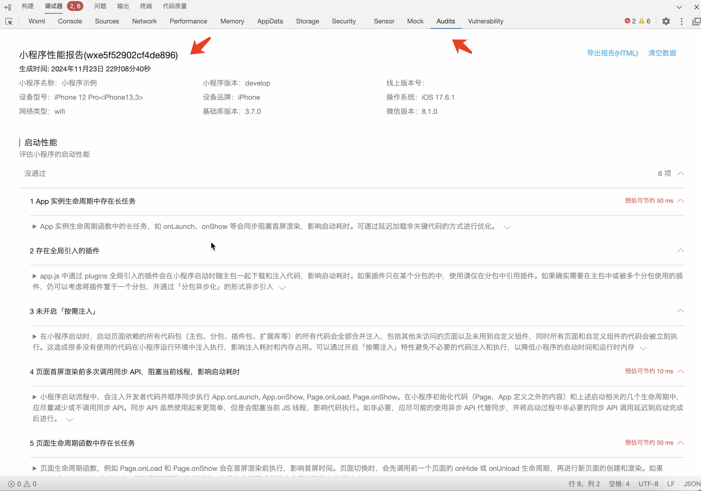

<!-- 来源: https://developers.weixin.qq.com/miniprogram/dev/framework/performance/perf_diagnostic_tool.html -->

# 性能诊断工具

## 简介

为了协助开发者更好地排查小程序的性能和体验问题，我们推出了 `微信小程序性能诊断工具` 。

诊断工具会从启动性能、跳页性能、最佳实践、操作体验和网络性能等方面对小程序进行检测，并给出针对性的优化建议，部分指标会尝试给出预估的优化空间。

## 使用方法

运行环境要求：

- 基础库使用 3.7.0 及以上版本
- iOS 客户端版本 >= 8.0.54
- Android 客户端版本 >= 8.0.55
- 开发者工具 Nightly >= 1.06.2411272

`开发版/体验版` 小程序可从小程序菜单开启诊断工具，正式版本不支持使用。

1. 右上角菜单-开发调试-开启 Audits-重启并自动开启检测

会自动关闭当前小程序，下次打开时自动检测，页面中出现“检测中”标识。进入到需要检测的页面，操作小程序。

1. 右上角菜单-开发调试-关闭 Audits

有任务结束弹窗弹出，点击导出数据有 json 文件分享到微信里。

1. 将导出的 json 文件拖拽到开发者工具 Audits 面板进行可视化

## 注意事项

1. 诊断工具仅在激活后会加载相关代码，并对 `开发版/体验版` 进行检测，正式版本即使激活也不会生效。
2. 诊断工具是在运行时检测，覆盖范围依赖开发的操作路径，开发者应可能操作关键路径，触发页面滚动、轮播之类的操作。
3. 诊断工具是体验评分的升级，少量指标会重叠，诊断工具致力于给出具体的可优化建议。
