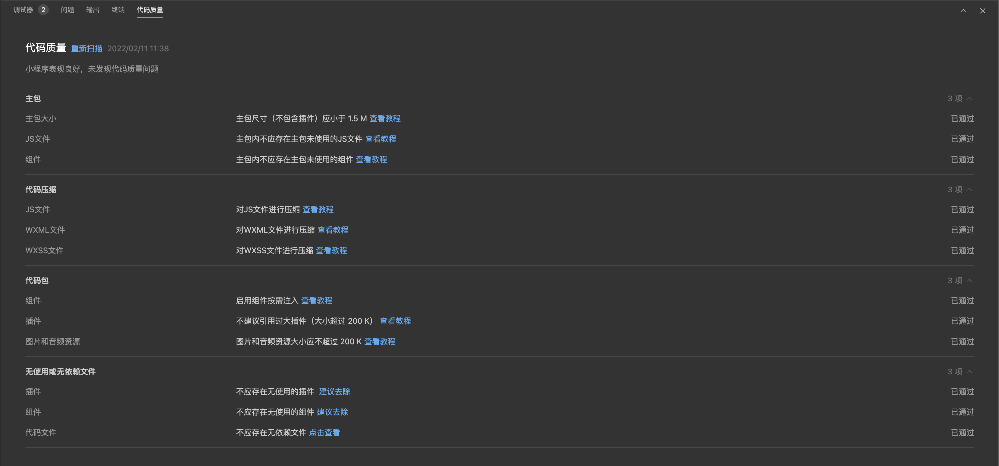

<!-- 来源: https://developers.weixin.qq.com/miniprogram/dev/framework/performance/quality-panel.html -->

# 代码质量分析面板

> 需要开发者工具 1.05.2201240 及以上版本支持

开发者可以在调试器中切换到「代码质量」面板，开发者工具会对代码进行静态分析，开发者可以根据优化建议进行优化。

