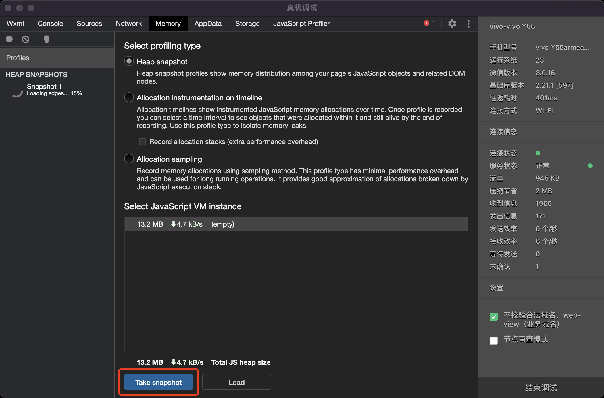
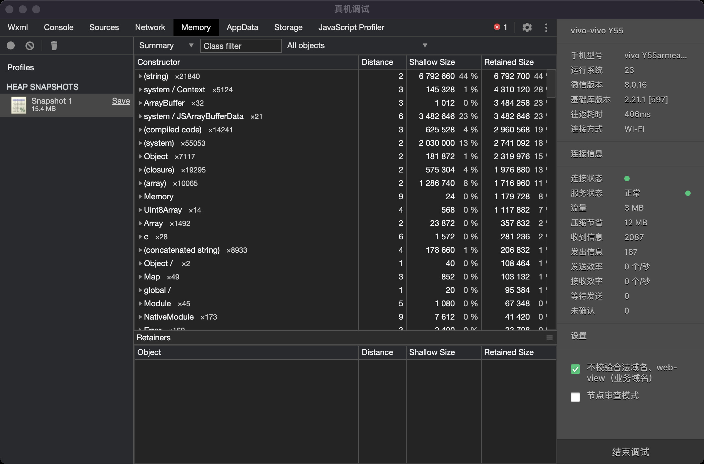
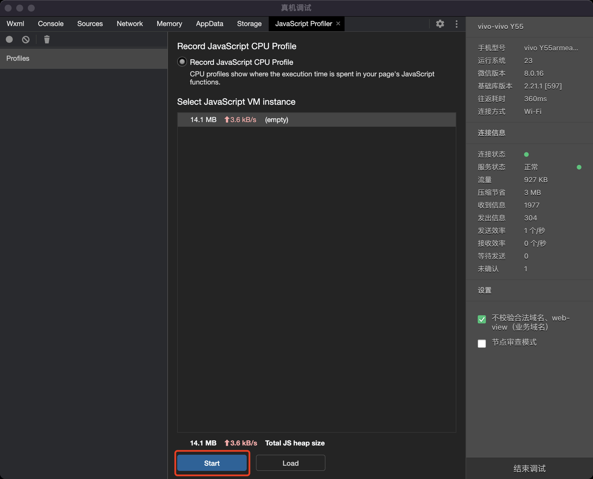
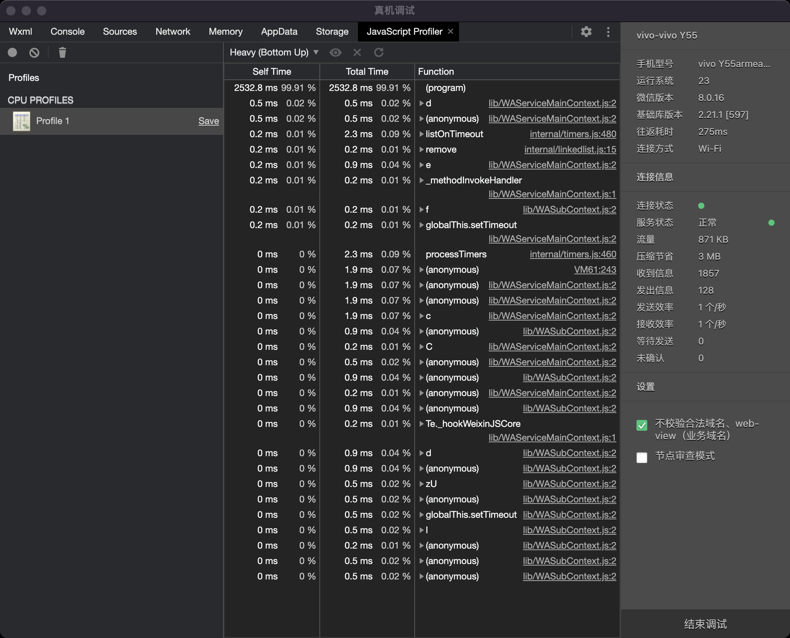

<!-- 来源: https://developers.weixin.qq.com/miniprogram/dev/framework/performance/remote_debug_2.html -->

# 真机调试 2.0

微信开发者工具的「真机调试 2.0」功能，可以帮助开发者利用工具调试真机上的小程序表现，也包括了性能分析的能力。开启真机调试 2.0 的步骤请参考 [《真机调试 2.0 文档》](https://developers.weixin.qq.com/miniprogram/dev/devtools/remote-debug-2.html) 。

## 内存调试

> 仅支持安卓设备

开发者可以使用「memory」面板，获取小程序逻辑层的 JS 堆内存快照，分析内存分布情况，排查内存泄漏问题。





> 详细的使用说明可参考 Chrome 的「Memory」面板

## JavaScript Profiler

> 仅支持安卓设备

开发者可以使用「JavaScript Profiler」面板，分析小程序逻辑层的 JS 执行情况。如果要分析启动过程中小程序代码注入的情况，可以在代码中使用 `debugger` 来断点。

```js
// app.js
debugger

App({
  onLaunch() {}
})
```





> 详细的使用说明可参考 Chrome 的「JavaScript Profiler」面板
