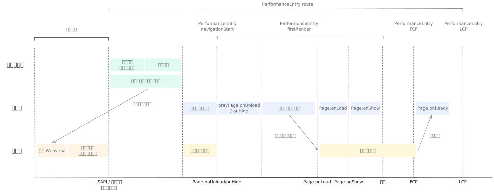
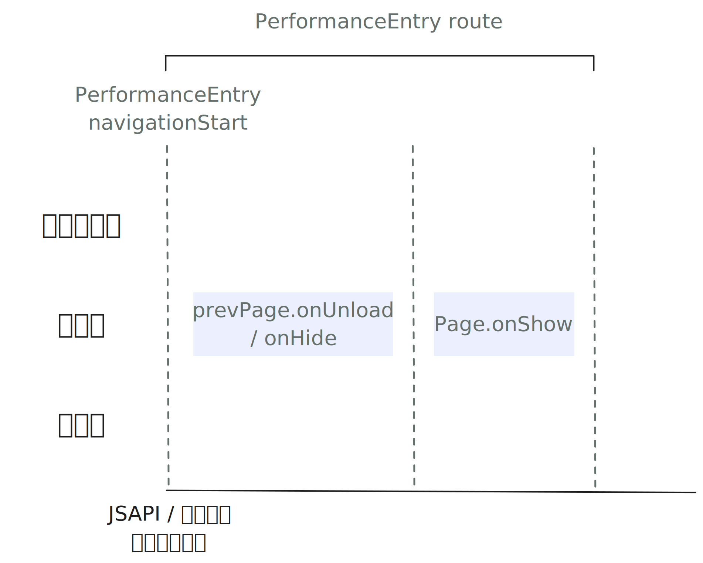
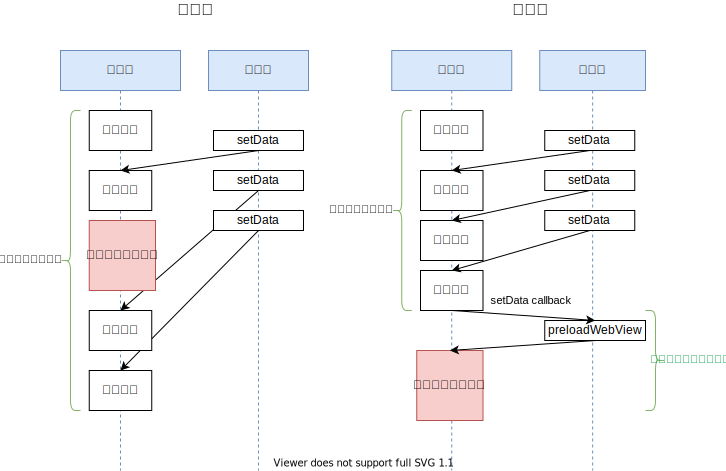

<!-- 来源: https://developers.weixin.qq.com/miniprogram/dev/framework/performance/tips/runtime_nav.html -->

# 页面切换优化

页面切换的性能影响用户操作的连贯性和流畅度，是小程序运行时性能的一个重要组成部分。

## 1. 页面切换的流程

要想优化页面切换的性能，有必要先简单了解下小程序页面切换的过程。页面切换流程如图所示：



> 开发者可以通过 [`wx.getPerformance`](https://developers.weixin.qq.com/miniprogram/dev/api/base/performance/wx.getPerformance.html) 接口中 entryType 为 navigation，name 为 route 的指标（PerformanceEntry），获取页面切换耗时时。

当切换的目标页面已加载完成时（例如：路由类型为 navigateBack，或 switchTab 到一个已加载的页面），不需要进行「视图层页面初始化」和「目标页面渲染」，「逻辑层页面初始化」也会较为简化，如下图所示：



### 1.1 触发页面切换

页面切换的流程，从用户触发页面切换开始。

> 触发时间对应 PerformanceEntry(route) 中的 startTime。

页面切换可能由以下几类操作触发：

- 小程序API调用：开发者根据用户操作，调用 [`wx.navigateTo`](https://developers.weixin.qq.com/miniprogram/dev/api/route/wx.navigateTo.html) 、 [`wx.navigateBack`](https://developers.weixin.qq.com/miniprogram/dev/api/route/wx.navigateBack.html) 、 [`wx.redirectTo`](https://developers.weixin.qq.com/miniprogram/dev/api/route/wx.redirectTo.html) 、 [`wx.reLaunch`](https://developers.weixin.qq.com/miniprogram/dev/api/route/wx.reLaunch.html) 、 [`wx.switchTab`](https://developers.weixin.qq.com/miniprogram/dev/api/route/wx.switchTab.html) 等 API。
- 用户点击 `<navigator>` 组件进行页面切换。
- 用户点击原生 UI 触发：例如点击 tabBar（自定义 tabBar 除外）、点击左上角「返回首页」按钮、点击系统返回键或左滑返回等。
- 小程序热启动时自动 reLaunch： [小程序热启动](../../runtime/operating-mechanism.md#_3-%E5%B0%8F%E7%A8%8B%E5%BA%8F%E7%83%AD%E5%90%AF%E5%8A%A8%E7%9A%84%E9%A1%B5%E9%9D%A2) 的 B 类场景

> 目前后两种情况暂时未能获取准确的触发时间，PerformanceEntry(route) 的 startTime 和 navigationStart 一致。

### 1.2 加载分包（若有）

如果页面切换的目标页面在分包中，页面切换时需要下载分包，并在逻辑层注入执行分包内的 JS 代码。

> 小程序生命周期内，每个分包只会在逻辑层注入一次。

### 1.3 视图层页面初始化

小程序视图层的每个页面都是由独立的 WebView 渲染的，因此页面切换时需要一个新的 WebView 环境。视图层页面初始化主要会做以下事情：

- 创建 WebView
- 注入视图层的小程序基础库
- 注入主包的公共代码（独立分包除外）
- （若页面位于分包中）注入分包的公共代码
- 注入页面代码

为了降低视图层页面初始化的耗时，在页面渲染完成后，通常会进行必要的预加载供页面切换时使用。预加载主要会做以下事情：

- 创建 WebView
- 注入视图层的小程序基础库
- 注入主包的公共代码（若主包已在本地）

> 如果页面切换过快，或预加载的环境被回收，则需要在页面切换时重新创建环境。

如果页面切换时有预加载好的环境，可以大大降低页面切换的耗时。

> 当切换的目标页面已加载完成时，不需要进行本阶段。

### 1.4 逻辑层页面初始化

完成分包加载和 WebView 创建后，客户端会向基础库派发路由事件。

基础库收到事件后会进行逻辑层的页面初始化，包括触发上一个页面的 `onHide` / `onUnload` 、页面组件树初始化、更新页面栈并生成初始数据发送到视图层，并依次触发目标的 `onLoad` , `onShow` 生命周期。如果启用了「 [按需注入](../../ability/lazyload.md) 」，这一阶段还会注入页面代码。

> 基础库收到事件的时间对应 PerformanceEntry(route) 中的 navigationStart，对应 PerformanceEntry(firstRender) 的开始时间。
>
> 当切换的目标页面已加载完成时，不需进行页面组件树初始化和初始数据的发送，且不会触发目标页面的 `onLoad` 。

### 1.5 目标页面渲染

页面切换的目标页面不存在时，会触发页面的首次渲染。

在完成视图层代码注入，并收到逻辑层发送的初始数据后，结合从初始数据和视图层得到的页面结构和样式信息，小程序框架会进行页面渲染，并触发页面的 `onReady` 事件。

> 视图层渲染完成，触发页面 onReady 事件的时间，对应 PerformanceEntry(firstRender) 的结束时间。
>
> 当切换的目标页面已加载完成时，不需要进行本阶段。

### 1.6 页面切换动画

页面渲染完成后，客户端会进行页面切换的动画（如：从右向左推入页面）。如果页面初始化和渲染的时间超过固定时间，为避免用户以为页面无响应，页面会提前推入。

> 页面推入动画完成的时间，对应 PerformanceEntry(route) 的结束时间。

## 2. 如何优化页面切换

### 2.1 避免在 onHide/onUnload 执行耗时操作

页面切换时，会先调用前一个页面的 onHide 或 onUnload 生命周期，然后再进行新页面的创建和渲染。如果 onHide 和 onUnload 执行过久，可能导致页面切换的延迟。

- ✅ onHide/onUnload 中的逻辑应尽量简单，若必须要进行部分复杂逻辑，可以考虑用 setTimeout 延迟进行。
- ❌ 减少或避免在 onHide/onUnload 中执行耗时逻辑，如同步接口调用、setData 等。

### 2.2 首屏渲染优化

页面首屏渲染是页面切换耗时的重要组成部分，优化手段可以参考启动性能优化中 [首屏渲染优化](./start_optimizeC.md) 部分。

### 2.3 提前发起数据请求

在一些对性能要求比较高的场景下，当使用 JSAPI 进行页面跳转时（例如 `wx.navigateTo` ），可以提前为下一个页面做一些准备工作。页面之间可以通过 [EventChannel](https://developers.weixin.qq.com/miniprogram/dev/reference/api/Page.html#%E9%A1%B5%E9%9D%A2%E9%97%B4%E9%80%9A%E4%BF%A1) 进行通信。

例如，在页面跳转时，可以同时发起下一个页面的数据请求，而不需要等到页面 onLoad 时再进行，从而可以让用户更早的看到页面内容。尤其是在跳转到分包页面时，从发起页面跳转到页面 onLoad 之间可能有较长的时间间隔，可以加以利用。

### 2.4 控制预加载下个页面的时机

> 基础库 [2.15.0](../../compatibility.md) 开始支持，仅安卓。低版本配置不生效。

如 1.3 节所述，小程序页面加载完成后，会预加载下一个页面。默认情况下，小程序框架会在当前页面 onReady 触发 200ms 后触发预加载。

在安卓上，小程序渲染层所有页面的 WebView 共享同一个线程。很多情况下，小程序的初始数据只包括了页面的大致框架，并不是完整的内容。页面主体部分需要依靠 setData 进行更新。因此，预加载下一个页面可能会阻塞当前页面的渲染，造成 setData 和用户交互出现延迟，影响用户看到页面完整内容的时机。

为了让用户能够更早看到完整的页面内容，避免预加载流程对页面加载过程的影响，开发者可以配置 `handleWebviewPreload` 选项，来控制预加载下个页面的时机。

`handleWebviewPreload` 有以下取值

- static: 默认值。在当前页面 onReady 触发 200ms 后触发预加载。
- auto: 渲染线程空闲时进行预加载。由基础库根据一段时间内 requestAnimationFrame 的触发频率算法判断。
- manual: 由开发者通过调用 [`wx.preloadWebview`](https://developers.weixin.qq.com/miniprogram/dev/api/base/performance/wx.preloadWebview.html) 触发。开发者可以在页面主要内容的 setData 结束后手动触发。

例如：

在 app.json 中（作用于全局控制）

```json
{
  "window": {
    "handleWebviewPreload": "auto"
  }
}
```

或在页面 JSON 文件中（只作用于单个页面）

```json
{
  "handleWebviewPreload": "manual"
}
```

```js
Page({
  onLoad() {
    this.setData({
      fullData: {}
    }, () => {
      // 只有配置为 manual 时需要调用
      wx.preloadWebview?.()
    })
  }
})
```

如下图所示，假设某小程序主页完整内容是分了三个 setData 进行的： 
