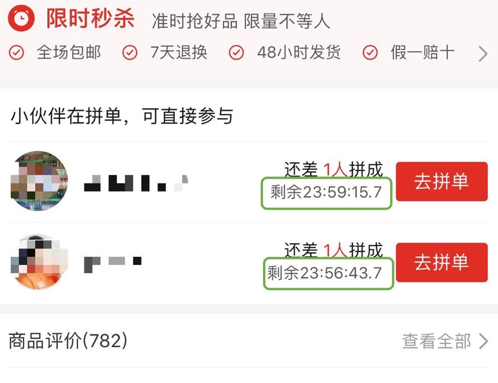

<!-- 来源: https://developers.weixin.qq.com/miniprogram/dev/framework/performance/tips/runtime_setData.html -->

# 合理使用 setData

`setData` 是小程序开发中使用最频繁、也是最容易引发性能问题的接口。

## 1. setData 的流程

`setData` 的过程，大致可以分成几个阶段：

- 逻辑层虚拟 DOM 树的遍历和更新，触发组件生命周期和 observer 等；
- 将 data 从逻辑层传输到视图层；
- 视图层虚拟 DOM 树的更新、真实 DOM 元素的更新并触发页面渲染更新。

## 2. 数据通信

对于第 2 步，由于小程序的逻辑层和视图层是两个独立的运行环境、分属不同的线程或进程，不能直接进行数据共享，需要进行数据的序列化、跨线程/进程的数据传输、数据的反序列化，因此数据传输过程是 **异步的、非实时的** 。

> iOS/iPadOS/MacOS 上，数据传输是通过 `evaluateJavascript` 实现的，还会有额外 JS 脚本解析和执行的耗时。

数据传输的耗时与 **数据量的大小** 正相关，如果对端线程处于繁忙状态，数据会在 **消息队列中等待** 。

## 3. 使用建议

### 3.1 data 应只包括渲染相关的数据

setData 应只用来进行渲染相关的数据更新。用 setData 的方式更新渲染无关的字段，会触发额外的渲染流程，或者增加传输的数据量，影响渲染耗时。

- ✅ 页面或组件的 data 字段，应用来存放和页面或组件 **渲染相关** 的数据（即直接在 wxml 中出现的字段）；
- ✅ 页面或组件渲染间接相关的数据可以设置为「 [纯数据字段](../../custom-component/pure-data.md) 」，可以使用 setData 设置并使用 observers 监听变化；
- ✅ 页面或组件渲染无关的数据，应挂在非 data 的字段下，如 `this.userData = {userId: 'xxx'}` ；
- ❌ 避免在 data 中包含 **渲染无关** 的业务数据；
- ❌ 避免使用 data 在页面或组件方法间进行 **数据共享** ；
- ❌ 避免滥用 [纯数据字段](../../custom-component/pure-data.md) 来保存可以使用非 data 字段保存的数据。

### 3.2 控制 setData 的频率

每次 setData 都会触发逻辑层虚拟 DOM 树的遍历和更新，也可能会导致触发一次完整的页面渲染流程。过于频繁（毫秒级）的调用 `setData` ，会导致以下后果：

- 逻辑层 JS 线程持续繁忙，无法正常响应用户操作的事件，也无法正常完成页面切换；
- 视图层 JS 线程持续处于忙碌状态，逻辑层 -> 视图层通信耗时上升，视图层收到消息的延时较高，渲染出现明显延迟；
- 视图层无法及时响应用户操作，用户滑动页面时感到明显卡顿，操作反馈延迟，用户操作事件无法及时传递到逻辑层，逻辑层亦无法及时将操作处理结果及时传递到视图层。

因此，开发者在调用 setData 时要注意：

- ✅ 仅在需要进行页面内容更新时调用 setData；
- ✅ 对连续的 setData 调用尽可能的进行 **合并** ；
- ❌ 避免不必要的 setData；
- ❌ 避免以过高的频率持续调用 setData，例如毫秒级的倒计时；
- ❌ 避免在 onPageScroll 回调中每次都调用 setData。

### 3.3 选择合适的 setData 范围

组件的 setData 只会引起当前组件和子组件的更新，可以降低虚拟 DOM 更新时的计算开销。

- ✅ 对于需要频繁更新的页面元素（例如：秒杀倒计时），可以封装为独立的组件，在组件内进行 setData 操作。必要时可以使用 [CSS contain 属性](https://developer.mozilla.org/en-US/docs/Web/CSS/contain) 限制计算布局、样式和绘制等的范围。

### 3.4 setData 应只传发生变化的数据

setData 的数据量会影响数据拷贝和数据通讯的耗时，增加页面更新的开销，造成页面更新延迟。

- ✅ setData 应只传入发生变化的字段；
- ✅ 建议以 [数据路径](https://developers.weixin.qq.com/miniprogram/dev/reference/api/Page.html#Page-prototype-setData-Object-data-Function-callback) 形式改变数组中的某一项或对象的某个属性，如 `this.setData({'array[2].message': 'newVal', 'a.b.c.d': 'newVal'})` ，而不是每次都更新整个对象或数组；
- ❌ 不要在 setData 中偷懒一次性传所有data： `this.setData(this.data)` 。

### 3.5 控制后台态页面的 setData

由于小程序逻辑层是单线程运行的，后台态页面去 `setData` 也会抢占前台页面的运行资源，且后台态页面的的渲染用户是无法感知的，会产生浪费。在某些平台上，小程序渲染层各 WebView 也是共享同一个线程，后台页面的渲染和逻辑执行也会导致前台页面的卡顿。

- ✅ 页面切后台后的更新操作，应尽量避免，或延迟到页面 `onShow` 后延迟进行；
- ❌ 避免在切后台后仍进行高频的 setData，例如倒计时更新。

## 4. 性能分析

开发者可以通过组件的 [setUpdatePerformanceListener](../../custom-component/update-perf-stat.md) 接口获取更新性能统计信息，来分析产生性能瓶颈的组件。
