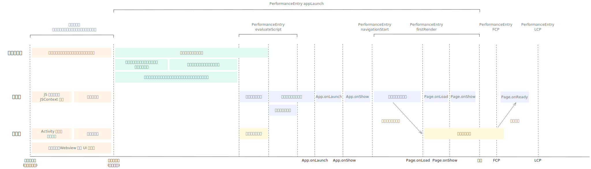
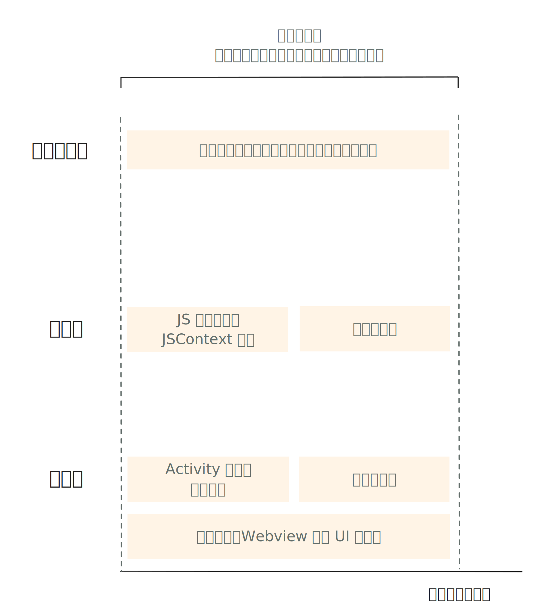

<!-- 来源: https://developers.weixin.qq.com/miniprogram/dev/framework/performance/tips/start_process.html -->

# 小程序启动流程介绍

在进行启动优化之前，我们先介绍一下小程序的启动过程。了解小程序的启动流程，可以帮助开发者更有针对性地选择性能优化的手段，分析性能优化的效果。

> 本文的启动流程以安卓和 iOS 为准，其他平台可能会略有差异。
>
> 注： **小程序启动的各流程不是串行的，会尽可能的并行。计算总启动耗时不能简单的分阶段加和。**

下列图片简要描述了部分情况下的小程序启动流程（注意：其中矩形块的宽度不与对应阶段耗时成比例）。

#### 小程序启动流程示意图

> 开发者可以通过 [`wx.getPerformance`](https://developers.weixin.qq.com/miniprogram/dev/api/base/performance/wx.getPerformance.html) 接口中 entryType 为 navigation，name 为 appLaunch 的指标（PerformanceEntry），获取页面切换耗时时。

小程序启动过程主要包括以下几个环节：

## 1. 资源准备

### 1.1 运行环境准备

小程序的运行环境包括小程序进程、客户端原生部分的系统组件和 UI 元素（如 导航栏、tabBar 等）、渲染页面使用的 WebView 容器、开发者 JavaScript 代码的运行环境、小程序基础库等等。

部分环境（如 JavaScript 引擎、小程序基础库）需要在执行小程序代码之前准备完成，其他的会在启动过程中并行进行。运行环境的准备时间相对较长（尤其是在低端设备上），会对小程序启动产生严重影响。

#### 环境预加载

为了尽可能的降低运行环境准备对启动耗时的影响，微信客户端会根据用户的使用场景和设备资源的使用情况，依照一定策略在小程序 **启动前** 对运行环境进行 **部分地预加载** ，以降低启动耗时。

我们希望小程序启动时尽可能都使用到预加载的环境，但由于受到访问场景、设备资源状况和操作系统调度的影响，并 **不能保证每次小程序启动时都可以命中预加载的环境** 。

#### 对启动耗时的影响

运行环境准备耗时较长，如果启动时没有命中预加载的环境，对小程序的启动耗时会有明显影响。耗时长短与 **平台、设备性能、预加载比例** 有关。

- 由于系统功能和启动流程实现的差异，通常安卓系统运行环境准备耗时要远高于 iOS。
- 低端机系统资源比较紧张，预加载的环境会更容易被系统清理，导致预加载比例偏低。
- 预加载比例越高，平均启动耗时一般可以越低。

这部分逻辑完全由微信客户端控制，开发者目前无法直接进行优化。

### 1.2 小程序相关信息准备

在用户访问小程序时，微信客户端需要从微信后台获取小程序的头像、昵称、版本、配置、权限等基本信息，以对小程序进行必要的版本管理、权限控制和校验等。

为了在保证信息实时性的前提下，尽量降低对启动耗时的影响，这些信息会在 **本地缓存** ，并通过一定的机制进行更新。

信息的获取和更新需要发起网络请求。请求分为两种情况：

(1) **同步请求** ：会阻塞小程序的启动流程，影响小程序的启动耗时。有以下情况需要进行同步请求：

- **首次访问** ：用户首次访问该小程序（或小程序被清理）时，客户端没有缓存，需要同步请求小程序相关信息。
- **同步更新** ：微信会在后台定期检查经常使用的小程序是否更新。如果启动时已知小程序有新版本，会同步更新信息。
- **强制更新** ：用户长时间未使用小程序时，为保障信息的实时性，会强制同步更新信息。

(2) **异步请求** ：与启动流程并行，不影响启动耗时。主要发生在：

- **异步更新** ：已使用过的小程序，定期检查暂未发现小程序有新版本，则优先使用本地缓存的信息完成启动，并异步进行更新。

#### 对启动耗时的影响

在用户首次访问小程序、小程序版本更新或使用长期未使用的小程序时，信息的获取和更新会影响小程序的启动耗时，耗时长短主要与 **网络环境** 有关。

从大盘来看，小程序版本发布时，会导致启动时需要同步请求的比例上升，进而导致平均启动耗时的上涨。因此，建议开发者 [合理规划版本发布](./start_optimizeD.md) 。

这部分逻辑完全由微信客户端控制，开发者目前无法直接进行优化。

### 1.3 代码包准备

小程序启动时，需要根据用户访问的页面，从微信后台获取代码包地址，从 CDN 下载小程序代码包，并对代码包进行校验。根据小程序页面所在分包和使用的插件不同，一次启动可能需要下载多个代码包或插件包。

> 除了启动过程，代码包下载在页面跳转、预下载、使用 [分包异步化](../../subpackages/async.md) 等过程中也会触发。

为了在保证用户尽可能访问新版本的前提下，尽量降低对启动耗时的影响，小程序代码包会在本地 **缓存** ，并通过 [更新机制](../../runtime/update-mechanism.md) 进行更新。

和相关信息准备类似，代码包下载也会有同步和异步两种情况：

(1) **同步下载** ：会阻塞小程序的启动流程，影响小程序的启动耗时。有以下情况需要进行同步下载：

- **首次下载** ：用户首次访问该小程序（或小程序被清理）时，客户端没有缓存，需要同步下载代码包。
- **同步更新** ：对于小程序信息发生「同步更新」或「强制更新」的情况，如果检测到小程序版本更新，会同步下载代码包。

(2) **异步下载** ：与启动流程并行，不影响启动耗时。主要发生在：

- **异步更新** ：对于小程序信息发生「异步更新」的情况，如果检测到小程序版本更新，会异步更新代码包。

为了降低代码包下载的耗时，我们采用了包括但不限于以下方式：

- **代码包压缩** ：采用 [Zstandard 算法](https://facebook.github.io/zstd/) 对小程序代码包进行压缩，以尽可能降低下载过程中传输的数据量。
- **增量更新** ：当代码包发生更新，不需要重新下载完整的代码包，只需要下载根据算法生成的体积很小的 **增量包** 进行更新。
- **更高效的网络协议** ：下载代码包优先使用 QUIC 和 HTTP/2。
- **预先建立连接** ：在下载发生前，提前和 CDN 建立连接，降低下载过程中 DNS 请求和连接建立的耗时。
- **代码包复用** ：对每个代码包都会计算 MD5 签名。即使发生了版本更新，如果代码包的 MD5 没有发生变化，则不需要重新进行下载。

#### 对启动耗时的影响

下载耗时是启动耗时中的重要瓶颈，在用户首次访问小程序或小程序版本更新时，代码包的下载会对启动耗时造成影响。耗时长短与 **网络环境，代码包压缩后大小，以及是否命中增量更新** 有关。

考虑到包大小对用户体验的影响，平台限制单个小程序代码包的大小上限为 2M。代码包上限的增加，对于开发者来说能够实现更丰富的功能，但对于用户来说也增加了流量和本地空间的占用。为了保证启动速度，开发者应该尽可能的控制启动时用到的代码包大小。具体方法可以参考 [《代码包体积优化》](./start_optimizeA.md) 。

## 2. 小程序代码注入（逻辑层）

小程序启动时需要从代码包内读取小程序的配置和代码，并注入到 JavaScript 引擎中。在主包代码注入过程中，会触发小程序的 `App.onLaunch` 和 `App.onShow` 生命周期。如果小程序使用了插件或扩展库，在注入开发者代码之前，还会先注入对应插件和扩展库的代码。

为了降低小程序代码注入的耗时，我们采用了包括但不限于以下方式：

- **Code Caching** ：在部分平台上，微信客户端会使用 V8 引擎的 [Code Caching](https://v8.dev/blog/code-caching-for-devs) 技术对代码编译结果进行缓存，降低 **非首次注入** 时的编译耗时。

**注意** ：如果代码中使用了 `use asm` ，会导致 V8 的 Code Caching 失效。

#### 对启动耗时的影响

小程序代码的注入耗时直接影响小程序的启动耗时。耗时长短与 **代码复杂度、同步接口调用和一些复杂的计算** 有关。如果未启用「 [按需注入](../../ability/lazyload.md#%E6%8C%89%E9%9C%80%E6%B3%A8%E5%85%A5) 」，耗时还会与 **启动使用到分包内的页面和自定义组件总数有关** 。

由于「首页渲染」需要使用逻辑层发送的数据，如果小程序代码注入耗时过长，会延迟「首页渲染」开始的时间。建议开发者参考 [《代码注入优化》](./start_optimizeB.md) 章节进行优化。

## 3. 小程序代码注入（视图层）

开发者的 WXSS 和 WXML 会编译成 JavaScript 代码注入到视图层，包含页面渲染需要的页面结构和样式信息。

我们采用和「小程序代码注入（逻辑层）」相似的方式优化注入耗时。

**视图层和逻辑层的小程序代码注入是并行进行的** 。

#### 对启动耗时的影响

小程序代码的注入耗时直接影响小程序的启动耗时。耗时长短与 **当前页面结构复杂度和页面使用的自定义组件数量** 有关。如果未启用「 [按需注入](../../ability/lazyload.md#%E6%8C%89%E9%9C%80%E6%B3%A8%E5%85%A5) 」，耗时还会与 **启动使用到分包内的页面和自定义组件总数有关** 。

由于「首页渲染」需要使用视图层的页面结构和样式信息，如果小程序代码注入耗时过长，会影响渲染数据从逻辑层到达视图层的时间，影响「首页渲染」的耗时。

虽然开发者不能直接修改视图层生成的 JS 代码，但是可以通过使用「按需注入」、移除未使用的自定义组件等方式降低这部分耗时。

## 4. 首页（初次）渲染

在逻辑层小程序代码注入完成后，小程序框架会根据用户访问的页面，进行页面组件树初始化，生成 **首屏渲染相关数据** 发送到视图层，并依次触发首页的 `Page.onLoad` , `Page.onShow` 生命周期。

> 首屏渲染相关数据包括 Page 初始化参数中 data 属性值，和部分比较早发出的 setData 数据（哪些 setData 可以计入首页渲染与渲染层和逻辑层之间的初始化时序相关，目前没有可以保证一定能够计入的情况）。

在完成视图层代码注入，并收到逻辑层发送的首屏渲染相关数据后，结合从初始数据和视图层得到的页面结构和样式信息，小程序框架会进行小程序首页的渲染，展示小程序首屏，并触发首页的 `Page.onReady` 事件。

如果开启了「 [初始渲染缓存](../../view/initial-rendering-cache.md) 」，「首页渲染」可以直接使用缓存完成，不依赖逻辑层的初始数据，降低启动耗时。

**小程序框架层面，以 `Page.onReady` 事件触发标志小程序启动过程完成** 。

#### 对启动耗时的影响

首页渲染耗时是启动过程的最后一环，直接影响小程序的启动耗时。耗时长短与 **页面结构复杂度、参与渲染的自定义组件数量** 有关。建议开发者参考 [《首屏渲染优化》](./start_optimizeC.md) 章节进行优化。

如果启用了「 [按需注入](../../ability/lazyload.md#%E6%8C%89%E9%9C%80%E6%B3%A8%E5%85%A5) 」，部分组件代码注入会被延迟到本阶段执行，导致阶段耗时上涨，但总耗时一般会下降。

## 5. 首屏内容展示

「首页渲染」完成后，小程序启动流程完成，Loading 消失，此时一般情况下用户应该能立刻看到首屏内容。

但是如果首页的主体内容依赖网络请求（例如 `wx.request` ）等异步来源，用户并不一定能立刻看到有意义的完整界面，可能看到的仍然是白屏界面。需要等待网络请求异步返回后，调用 setData 进行页面更新，才能呈现真正的页面。

通常情况下，开发者也会选择先展示「骨架屏」来避免白屏，以优化用户体验。

#### 对启动耗时的影响

异步 setData 触发绘制的首屏内容展示不一定会计入启动耗时统计，但是会延迟用户看到页面内容的时间，影响用户体验。建议开发者参考 [《首屏渲染优化》](./start_optimizeC.md) 章节进行优化。

## 常见问题

**(1) 为什么「开发版」和「体验版」小程序启动比「正式版」慢一些？**

「开发版」和「体验版」小程序的启动流程和代码包下载链路会和「正式版」有所差别，也会有更严格的权限控制，因此启动耗时要慢于「正式版」小程序。

对于「开发版」小程序，为了方便开发调试，基础库会启用很多调试相关的能力，例如 vConsole、sourceMap 等，日志输出的等级也会更低，因此启动耗时和页面切换耗时也会有一定延长。

**(2) 为什么安卓和 iOS 的启动耗时差异那么大？**

两个平台的设备性能、系统功能和启动流程实现存在一定差异：

- iOS 设备的平均性能要好于安卓；
- iOS 小程序和微信共用进程，而 Android 上小程序运行在独立进程，需要额外的进程创建和一些基础模块的初始化流程；
- iOS 上需要使用系统提供的 WebView 和 JavaScript Core，初始化开销几乎可以忽略；
- 安卓 UI 和系统组件的创建的开销远高于 iOS。
