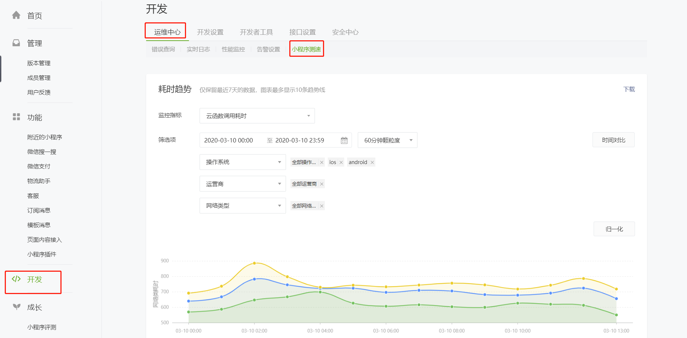
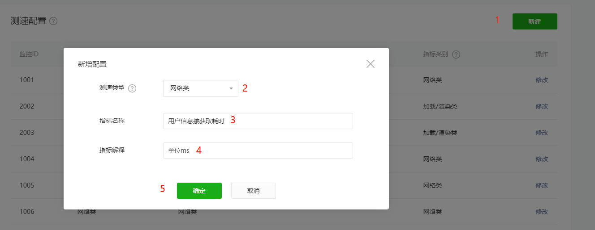
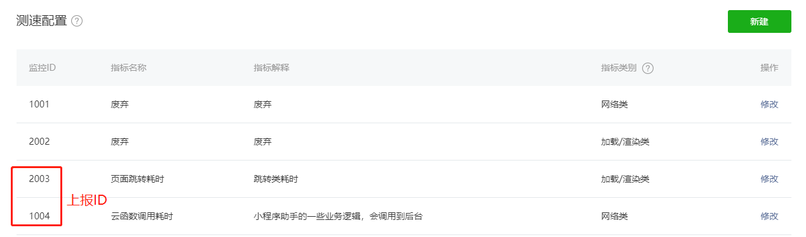
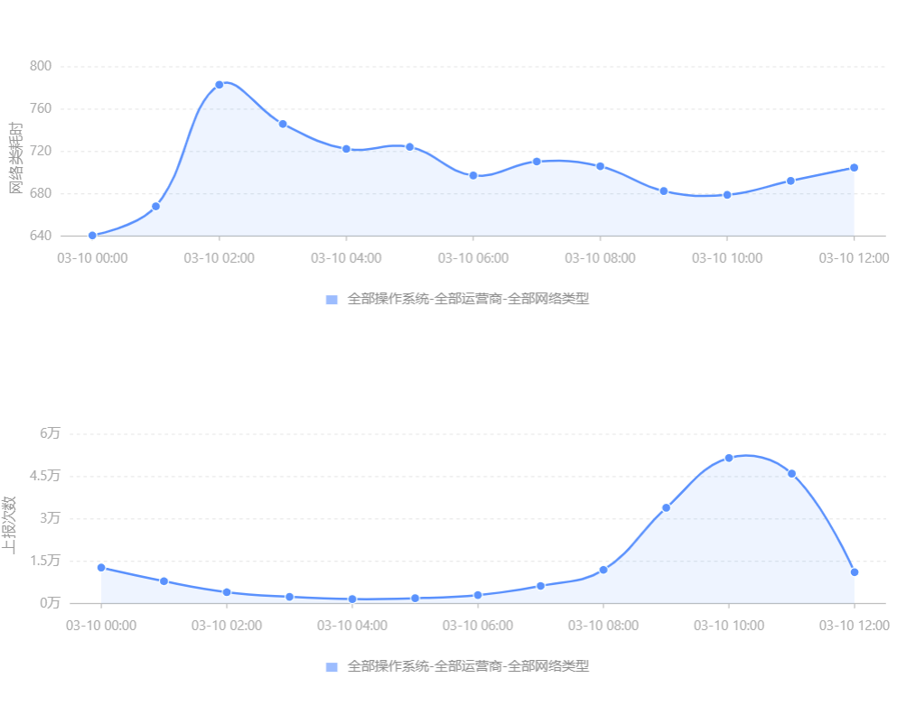
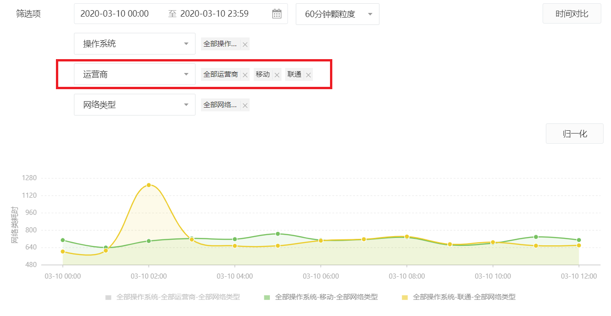
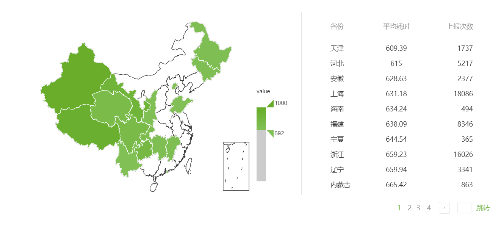
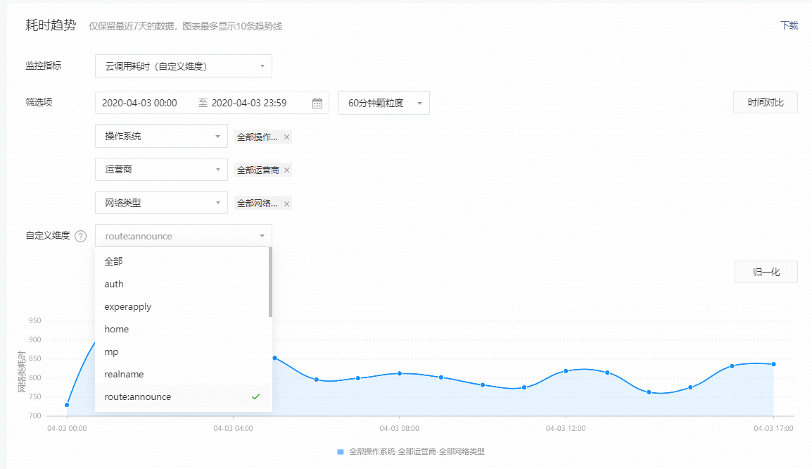

<!-- 来源: https://developers.weixin.qq.com/miniprogram/dev/framework/performanceReport/index.html -->

# 小程序测速

本能力已下架，请迁移到 [We分析](https://developers.weixin.qq.com/miniprogram/analysis/wedata/intro/) 使用相关能力。

为帮助开发者优化小程序性能，我们推出了"小程序测速"功能。"小程序测速"可以简单方便地统计小程序内某一事件的实时耗时情况，并可根据地域、运营商、操作系统、网络类型、机型等关键维度进行实时交叉分析。从基础库2.9.2开始，开发者通过“测速上报”接口上报某一指标的耗时情况后，可在小程序管理后台"开发 -运维中心 -小程序测速" 查看各指标耗时趋势，并支持分钟级数据实时查看。

## 新建监控 ID

为了实现对某一指标的耗时监控，开发者需要先定义监控指标。在小程序管理后台（ [mp.weixin.qq.com](http://mp.weixin.qq.com/) ）的 ："开发 -运维中心 -小程序测速"中新建监控 ID，并填写监控指标的名称和解释。



点击"新建"可以新建 ID ，你需要选择指标类型，并填写指标名称和指标对应的解释。 监控指标分为两类：

**网络请求类** ： 此类耗时主要受网络环境影响，包含操作系统、运营商、网络环境、地区等统计维度。如：网络 api 耗时、云调用耗时、网络数据读写耗时等。注意此类指标最多可创建20个。

**加载/渲染类** ：此类耗时主要受设备性能影响，包含操作系统、机型类别等统计维度。可以用来测量页面切换耗时、组件渲染耗时等。 注意此类指标最多可创建20个。



新建后，可以看到上报需要使用的监控 ID 。



## 测速上报

开发者定义监控ID后，需要在小程序代码中调用 [wx.reportPerformance](https://developers.weixin.qq.com/miniprogram/dev/api/base/performance/wx.reportPerformance.html) 接口上报耗时数值，才可实现耗时监控：

上报方法1： 使用 canIUse 进行判断

```
// * 需要使用 canIUse 判断接口是否可用
if (wx.canIUse('reportPerformance')) {
  wx.reportPerformance(id, val)
}
```

上报方法2：使用 compareVersion 进行判断

```
// * 需要先使用 compareVersion 判断接口是否可用
const sdkVersion = wx.getSystemInfoSync().SDKVersion
if (compareVersion(sdkVersion, '2.9.2') >= 0) {
  wx.reportPerformance(id, val)
}
```

id 和 val 均为 uint32 类型，其中 id 为小程序管理后台定义的监控 ID，val 为本次要上报的耗时数值（由开发者自行计算）。接口调用需要基础库的版本号高于 2.9.2，否则在一些低版本基础库可能报错。

(compareVersion [定义](../compatibility.md) )

## 数据观察

完成代码上报后，可在小程序管理后台"开发 -运维中心 -小程序测速" 查看各指标耗时趋势。目前线上数据约有15分钟数据时延，上报数据保留 7 天，可按照 1 分钟 - 1 小时等不同的时间粒度进行聚合。

每个指标可以观察到两条曲线，分别为平均值曲线和上报次数曲线。



同时对于不同维度的数据，我们提供了交叉对比功能，以帮助大家快速便捷的完成分析，注意交叉对比的曲线数最多不能超过10条。 

对于网络请求类指标，我们提供了区域地图，以帮助大家快速的定位区域资源问题。 

## 自定义维度(可选功能)

对于更复杂的用户场景，用户可能需要将测速数据根据url、页面等维度进行细分，所以我们提供了自定义维度，用户可以将一些业务层面的维度字符串填入至自定义维度中，以方便业务分析。 目前每个指标的自定义纬度值的数量需要限制在50以内（超限制的数据会被丢弃），自定义维度值的长度需要限制在256字节内（超限制的值会被截断）。自定义维度的使用效果如下：  想要使用自定义维度，只需要给wx.reportPerformance加上第三个参数dimensions，即可上报自定义维度：

```
wx.reportPerformance(id, value, dimensions)
```

[wx.reportPerformance 文档](https://developers.weixin.qq.com/miniprogram/dev/api/base/performance/wx.reportPerformance.html)

## Q&A

Q : 测速系统可以在哪些场景发挥作用？

A : 可以测量网络类指标（如网络调用/云调用耗时、网络数据读写速度等）和非网络类指标（页面切换加载速度、组件渲染速度等）。可以查看这些指标在不同维度下的数量分布和性能差异。在一些计算视频首屏时延、帧率等场景也可以发挥作用。

Q ：上报API需要的基础库版本是多少？

A ： 需要基础库版本 2.9.2 以上。在一些低版本基础库上可能报错，后续会支持用 canIUse 接口来进行判断。

Q： 系统是否可以在测试版使用？上报的时延大概是多少？数据保存的时间是多久？

A ： 可以在测试版使用，目前上报的时延为 15 分钟左右。数据会保存 7 天。

Q： 我可以定义多少指标 ID？

A ： 单个小程序每个类别可以定义 20 个 ID。
