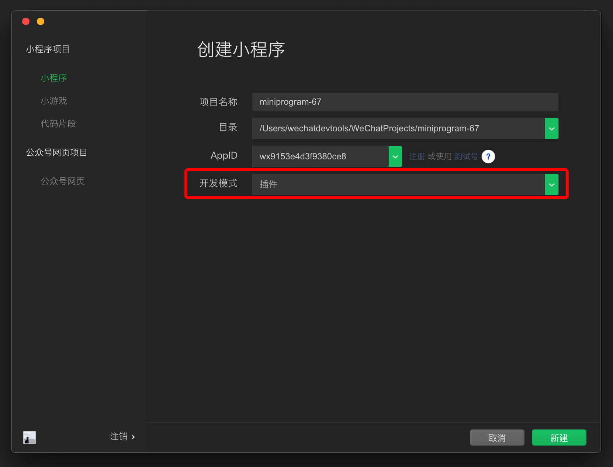

<!-- 来源: https://developers.weixin.qq.com/miniprogram/dev/framework/plugin/development.html -->

# 开发插件

开发插件前，请阅读了解 [《小程序插件接入指南》](https://developers.weixin.qq.com/miniprogram/introduction/plugin.html) 了解开通流程及开放范围，并开通插件功能。如果未开通插件功能，将无法上传插件。

## 创建插件项目

插件类型的项目可以在开发者工具中直接创建。 [详情](https://developers.weixin.qq.com/miniprogram/dev/devtools/plugin.html)



新建插件类型的项目后，如果创建示例项目，则项目中将包含三个目录：

- `plugin` 目录：插件代码目录。
- `miniprogram` 目录：放置一个小程序，用于调试插件。
- `doc` 目录：用于放置插件开发文档。

`miniprogram` 目录内容可以当成普通小程序来编写，用于插件调试、预览和审核。下面的内容主要介绍 `plugin` 中的插件代码及 `doc` 中的插件开发文档。

我们提供了 [一个可以直接在微信开发者工具中查看的完整插件示例](https://developers.weixin.qq.com/s/NrPCBmmT7B1B) ，开发者可以和本文互相对照以便理解。请注意：

1. 由于插件需要 appid 才能工作，请填入一个 appid；
2. 由于当前代码片段的限制，打开该示例后请 **手动将 appid 填写到 `miniprogram/app.json` 中（如下图）使示例正常运行。**


## 插件目录结构

一个插件可以包含若干个自定义组件、页面，和一组 js 接口。插件的目录内容如下：

```
plugin
├── components
│   ├── hello-component.js   // 插件提供的自定义组件（可以有多个）
│   ├── hello-component.json
│   ├── hello-component.wxml
│   └── hello-component.wxss
├── pages
│   ├── hello-page.js        // 插件提供的页面（可以有多个，自小程序基础库版本 2.1.0 开始支持）
│   ├── hello-page.json
│   ├── hello-page.wxml
│   └── hello-page.wxss
├── index.js                 // 插件的 js 接口
└── plugin.json              // 插件配置文件
```

## 插件配置文件

向使用者小程序开放的所有自定义组件、页面和 js 接口都必须在插件配置文件 `plugin.json` 列出，格式如下：

**代码示例：**

```json
{
  "publicComponents": {
    "hello-component": "components/hello-component"
  },
  "pages": {
    "hello-page": "pages/hello-page"
  },
  "main": "index.js"
}
```

这个配置文件将向使用者小程序开放一个自定义组件 `hello-component` ，一个页面 `hello-page` 和 `index.js` 下导出的所有 js 接口。

## 进行插件开发

请注意：在插件开发中，只有 [部分接口](./api-limit.md) 可以直接调用；另外还有部分能力（如 获取用户信息 和 发起支付 等）可以通过 [插件功能页](./functional-pages.md) 的方式使用。

### 自定义组件

插件可以定义若干个自定义组件，这些自定义组件都可以在插件内相互引用。但提供给使用者小程序使用的自定义组件必须在配置文件的 `publicComponents` 段中列出（参考上文）。

除去接口限制以外，自定义组件的编写和组织方式与一般的自定义组件相同，每个自定义组件由 `wxml` , `wxss` , `js` 和 `json` 四个文件组成。具体可以参考 [自定义组件的文档](../custom-component/README.md) 。

### 页面

插件从小程序基础库版本 [2.1.0](../compatibility.md) 开始支持页面。插件可以定义若干个插件页面，可以从本插件的自定义组件、其他页面中跳转，或从使用者小程序中跳转。所有页面必须在配置文件的 `pages` 段中列出（参考上文）。

除去接口限制以外，插件的页面编写和组织方式与一般的页面相同，每个页面由 `wxml` , `wxss` , `js` 和 `json` 四个文件组成。具体可以参考其他关于页面的文档。

插件执行页面跳转的时候，可以使用 `navigator` 组件。当插件跳转到自身页面时， `url` 应设置为这样的形式： `plugin-private://PLUGIN_APPID/PATH/TO/PAGE` 。需要跳转到其他插件时，也可以这样设置 `url` 。

**代码示例：**

```html
<navigator url="plugin-private://wxidxxxxxxxxxxxxxx/pages/hello-page">
  Go to pages/hello-page!
</navigator>
```

自基础库版本 [2.2.2](../compatibility.md) 开始，在插件自身的页面中，插件还可以调用 [wx.navigateTo](https://developers.weixin.qq.com/miniprogram/dev/api/route/wx.navigateTo.html) 来进行页面跳转， `url` 格式与使用 `navigator` 组件时相仿。

### 接口

插件可以在接口文件（在配置文件中指定，详情见上文）中 export 一些 js 接口，供插件的使用者调用，如：

**代码示例：**

```js
module.exports = {
  hello: function() {
    console.log('Hello plugin!')
  }
}
```

### 获取小程序导出

> [在开发者工具中预览效果](https://developers.weixin.qq.com/s/GbXmMLml7vjC) ，需要手动填写一下 `miniprogram/app.json` 中的插件 AppID

从基础库 [2.11.1](../compatibility.md) 起，在插件中有全局函数 `requireMiniProgram` ，可以获取由使用者小程序导出的内容。

例如，使用者小程序做了如下导出：

```js
// 使用者小程序
module.exports = {
  greeting() {
    return 'Greetings from Weixin MiniProgram!';
  }
}
```

那么在插件中，可以这样获得内容：

```js
// 插件
const miniProgramExports = requireMiniProgram();
miniProgramExports.greeting(); // 'Greetings from Weixin MiniProgram!'
```

另外也可以 [参考使用者小程序的相关文档](./using.md#%E5%AF%BC%E5%87%BA%E5%88%B0%E6%8F%92%E4%BB%B6)

### 引用小程序的自定义组件

> [在开发者工具中预览效果](https://developers.weixin.qq.com/s/QRRovLmu7Xjm) ，需要手动填写一下 `miniprogram/app.json` 中的插件 AppID

有时，插件可能需要在页面或者自定义组件中，将一部分区域交给使用的小程序来渲染，因此需要能够引用小程序的自定义组件。但由于插件中不能直接指定小程序的自定义组件路径，因此无法直接通过 `usingComponents` 的方式来引用。这里介绍通过 [抽象节点（generics）](../custom-component/generics.md) 来实现引用的方式。

如果是插件自定义组件（例如 `plugin-view` ），那么我们可以通过声明一个 generic：

```json
// plugin/components/plugin-view.json
{ "componentGenerics": { "mp-view": true } }
```

并在希望显示小程序组件的位置引用：

```html
<!-- plugin/components/plugin-view.wxml -->
<view>小程序组件：</view>
<mp-view /><!-- 这里是一个小程序自定义组件 -->
```

在小程序中引用 `plugin-view` 时，就可以传递组件给插件进行渲染了：

```html
<!-- miniprogram/page/index.wxml -->
<plugin-view generic:mp-view="comp-from-miniprogram" />
```

如果是插件页，插件页本身就是一个页面顶层组件，小程序不会引用它，无法通过 `generic:xxx=""` 的方式来指定抽象节点实现；因此，从基础库 [2.12.2](../compatibility.md) 起，小程序可以在插件的配置里为插件页指定抽象节点实现。例如插件页面名为 `plugin-index` ，则可以：

```json
{
  "myPlugin": {
    "provider": "wxAPPID",
    "version": "1.0.0",
    "genericsImplementation": {
      "plugin-index": {
        "mp-view": "components/comp-from-miniprogram"
      }
    }
  }
}
```

另外也可以 [参考使用者小程序的相关文档](./using.md#%E4%B8%BA%E6%8F%92%E4%BB%B6%E6%8F%90%E4%BE%9B%E8%87%AA%E5%AE%9A%E4%B9%89%E7%BB%84%E4%BB%B6)

## 预览、上传和发布

插件可以像小程序一样预览和上传，但插件没有体验版。

插件会同时有多个线上版本，由使用插件的小程序决定具体使用的版本号。

手机预览和提审插件时，会使用一个特殊的小程序来套用项目中 `miniprogram` 文件夹下的小程序，从而预览插件。

- （建议的方式）如果当前开发者有 [测试号](https://developers.weixin.qq.com/miniprogram/dev/devtools/sandbox.html) ，则会使用这个测试号；在测试号的设置页中可以看到测试号的 `appid` 、 `appsecret` 并设置域名列表。
- 否则，将使用“插件开发助手”，它具有一个特定的 `appid` 。

## 在开发版小程序中测试

通常情况下，可以将 `miniprogram` 下的代码当做使用插件的小程序代码，来进行插件的调试和测试。

但有时，需要将插件的代码放在实际运行的小程序中进行调试、测试。此时，可以使用开发版的小程序直接引用开发版插件。方法如下：

1. 在开发者工具的插件项目中上传插件，此时，在上传成功的通知信息中将包含这次上传获得的插件开发版 ID （一个英文、数字组成的随机字符串）；
2. 点击开发者工具右下角的通知按钮，可以打开通知栏，看到新生成的 ID ；
3. 在需要使用开发版本插件的小程序项目中，将插件 version 设置为 `"version": "dev-[开发版 ID]"` 的形式，如 `"version": "dev-abcdef0123456789abcdef0123456789"` 即可。

如果开发版小程序引用了开发版插件，此时这个小程序就不能上传发布了。必须要将插件版本设为正式版本之后，小程序才可以正常上传、发布。

注意事项：

- 每次上传插件所生成的 ID 不一定相同，即使是同一个插件和同一个开发者，多次上传也可能会改变 ID；
- 每个开发者在每个插件中只会同时存在一个有效的开发版插件，即只有最新上传的开发版 ID 有效（使用旧的 ID 会提示失效）；
- 同一个插件不同开发者上传的开发版互不影响，可以同时有效；
- 开发版插件没有时间限制，长期有效。

## 插件开发文档

在使用者小程序使用插件时，插件代码并不可见。因此，除了插件代码，我们还支持插件开发者上传一份插件开发文档。这份开发文档将展示在插件详情页，供其他开发者在浏览插件和使用插件时进行阅读和参考。插件开发者应在插件开发文档中对插件提供的自定义组件、页面、接口等进行必要的描述和解释，方便使用者小程序正确使用插件。

插件开发文档必须放置在插件项目根目录中的 `doc` 目录下，目录结构如下：

```
doc
├── README.md   // 插件文档，应为 markdown 格式
└── picture.jpg // 其他资源文件，仅支持图片
```

其中， `README.md` 的编写有一定的 **限制条件** ，具体来说：

1. 引用到的图片资源不能是网络图片，且必须放在这个目录下；
2. 文档中的链接只能链接到：
    - 微信开发者社区（developers.weixin.qq.com）
    - 微信公众平台（mp.weixin.qq.com）
    - GitHub（github.com）

编辑 `README.md` 之后，可以在开发者工具左侧资源管理器的文件栏中右键单击 `README.md` ，并选择上传文档。发布上传文档后，文档不会立刻发布。此时可以使用账号和密码登录 [管理后台](https://mp.weixin.qq.com/) ，在 小程序插件 > 基本设置 中预览、发布插件文档。

插件文档总大小不能大于 2M，超过时上传将返回错误码 `80051` 。

## 其他注意事项

### 插件间互相调用

插件不能直接引用其他插件。但如果小程序引用了多个插件，插件之间是可以互相调用的。

一个插件调用另一个插件的方法，与插件调用自身的方法类似。可以使用 `plugin-private://APPID` 访问插件的自定义组件、页面（暂不能使用 `plugin://` ）。

对于 js 接口，可使用 `requirePlugin` ，但目前尚不能在文件一开头就使用 requirePlugin ，因为被依赖的插件可能还没有初始化，请考虑在更晚的时机调用 `requirePlugin` ，如接口被实际调用时、组件 attached 时。（未来会修复这个问题。）

### 插件请求签名

插件在使用 [wx.request](https://developers.weixin.qq.com/miniprogram/dev/api/network/request/wx.request.html) 等 API 发送网络请求时，将会额外携带一个签名 `HostSign` ，用于验证请求来源于小程序插件。这个签名位于请求头中，形如：

```
X-WECHAT-HOSTSIGN: {"noncestr":"NONCESTR", "timestamp":"TIMESTAMP", "signature":"SIGNATURE"}
```

其中， `NONCESTR` 是一个随机字符串， `TIMESTAMP` 是生成这个随机字符串和 `SIGNATURE` 的 UNIX 时间戳。它们是用于计算签名 `SIGNATRUE` 的参数，签名算法为：

```js
SIGNATURE = sha1([APPID, NONCESTR, TIMESTAMP, TOKEN].sort().join(''))
```

其中， `APPID` 是 **所在小程序** 的 AppId （可以从请求头的 `referrer` 中获得）； `TOKEN` 是插件 Token，可以在小程序插件基本设置中找到。

网络请求的 referer 格式固定为 https://servicewechat.com/{appid}/{version}/page-frame.html，其中 {appid} 为小程序的 appid，{version} 为小程序的版本号，版本号为 0 表示为开发版、体验版以及审核版本，版本号为 devtools 表示为开发者工具，其余为正式版本。

插件开发者可以在服务器上按以下步骤校验签名：

1. `sort` 对 `APPID` `NONCESTR` `TIMESTAMP` `TOKEN` 四个值表示成字符串形式，按照字典序排序（同 JavaScript 数组的 sort 方法）；
2. `join` 将排好序的四个字符串直接连接在一起；
3. 对连接结果使用 `sha1` 算法，其结果即 `SIGNATURE` 。

自基础库版本 [2.0.7](../compatibility.md) 开始，在小程序运行期间，若网络状况正常， `NONCESTR` 和 `TIMESTAMP` 会每 10 分钟变更一次。如有必要，可以通过判断 `TIMESTAMP` 来确定当前签名是否依旧有效。
