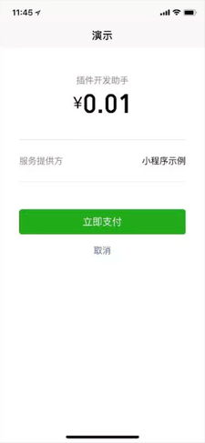

<!-- 来源: https://developers.weixin.qq.com/miniprogram/dev/framework/plugin/functional-pages/request-payment.html -->

# 支付功能页

**自2025年6月26日起，不再支持新申请插件支付功能，如果要在小程序中实现给向第三方支付，请使用 [「打开半屏小程序」功能](../../open-ability/openEmbeddedMiniProgram.md) 。**

支付功能页用于帮助插件完成支付，相当于 [wx.requestPayment](https://developers.weixin.qq.com/miniprogram/dev/api/payment/wx.requestPayment.html) 的功能。

自基础库版本 [2.22.1](../../compatibility.md) 起，可以直接在插件中调用 [wx.requestPluginPayment](https://developers.weixin.qq.com/miniprogram/dev/api/payment/wx.requestPluginPayment.html) 实现跳转支付；通过 [functional-page-navigator](https://developers.weixin.qq.com/miniprogram/dev/component/functional-page-navigator.html) 跳转将会被废弃。

在满足以下条件时，调用 `wx.requestPluginPayment` 或点击 `navigator` 都将直接拉起支付收银台，跳过支付功能页：

- 小程序与插件绑定在同一个 open 平台账号上
- 小程序与插件均为 open 账号的同主体 / 关联主体时。

需要注意的是：插件使用支付功能，需要进行额外的权限申请，申请位置位于 [管理后台](https://mp.weixin.qq.com/) 的“小程序插件 -> 基本设置 -> 支付能力”设置项中。另外，无论是否通过申请，主体为个人小程序在使用插件时，都无法正常使用插件里的支付功能。

## 调用参数

**参数说明：**

<table><thead><tr><th>参数名</th> <th>类型</th> <th>必填</th> <th>说明</th></tr></thead> <tbody><tr><td>fee</td> <td>Number</td> <td>是</td> <td>需要显示在页面中的金额，单位为分</td></tr> <tr><td>paymentArgs</td> <td>Object</td> <td>否</td> <td>任意数据，传递给功能页中的响应函数</td></tr> <tr><td>currencyType</td> <td>String</td> <td>否</td> <td>需要显示在页面中的货币符号的代码，默认为 CNY</td></tr></tbody></table>

**currencyType 的合法值：**

<table><thead><tr><th>值</th> <th>说明</th> <th>最低版本</th></tr></thead> <tbody><tr><td>CNY</td> <td>货币符号 ¥</td> <td></td></tr> <tr><td>USD</td> <td>货币符号 US$</td> <td></td></tr> <tr><td>JPY</td> <td>货币符号 J¥</td> <td></td></tr> <tr><td>EUR</td> <td>货币符号 €</td> <td></td></tr> <tr><td>HKD</td> <td>货币符号 HK$</td> <td></td></tr> <tr><td>GBP</td> <td>货币符号 ￡</td> <td></td></tr> <tr><td>AUD</td> <td>货币符号 A$</td> <td></td></tr> <tr><td>MOP</td> <td>货币符号 MOP$</td> <td></td></tr> <tr><td>KRW</td> <td>货币符号 ₩</td> <td></td></tr></tbody></table>

## 示例代码

### wx.requestPluginPayment 方式

自基础库版本 [2.22.1](../../compatibility.md) 起，推荐使用该方式。

```html
<!-- plugin/components/pay.wxml -->
<button bindtap="handlePay">支付 0.01 元</button>
```

```javascript
// plugin/components/pay.js
Component({
  data: {
    fee: 1,             // 支付金额，单位为分
    paymentArgs: 'A', // 将传递到功能页函数的自定义参数
    currencyType: 'USD' // 货币符号，页面显示货币简写 US$
    version: 'develop', // 上线时，version 应改为 "release"，并确保插件所有者小程序已经发布
  },
  methods: {
    handlePay() {
        const { fee, paymentArgs, currencyType, version } = this.data
        wx.requestPluginPayment({
            fee,
            paymentArgs,
            currencyType,
            version,
            success(r) {
                console.log(r)
            },
            fail(e) {
                console.error(e)
            }
        })
    }
  }
})
```

### functionl-page-navigator 方式（将废弃）

**该方式将会被废弃，仅供参考**

```html
<!-- plugin/components/pay.wxml -->
<!-- 上线时，version 应改为 "release"，并确保插件所有者小程序已经发布 -->
<!-- name 参数固定为 "requestPayment" -->
<functional-page-navigator
  version="develop"
  name="requestPayment"
  args="{{ args }}"
  bind:success="paymentSuccess"
  bind:fail="paymentFailed"
>
  <button class="payment-button">支付 0.01 元</button>
</functional-page-navigator>
```

```javascript
// plugin/components/pay.js
Component({
  data: {
    args: {
      fee: 1,             // 支付金额，单位为分
      paymentArgs: 'A', // 将传递到功能页函数的自定义参数
      currencyType: 'USD' // 货币符号，页面显示货币简写 US$
    }
  },
  methods: {
    // 支付成功的回调接口
    paymentSuccess: function (e) {
      console.log(e);
      e.detail.extraData.timeStamp // 用 extraData 传递数据，详见下面功能页函数代码
    },
    // 支付失败的回调接口
    paymentFailed: function (e) {
      console.log(e);
    }
  }
})
```

用户调用 `wx.requestPluginPayment` 或点击 `navigator` 后，将会进行权限判断，然后直接拉起支付收银台或跳转到如下的支付功能页：



## 配置功能页函数

支付功能页需要插件开发者在插件所有者小程序中提供一个函数来响应插件中的支付调用。即，在插件中跳转到支付功能页或调用 `wx.requestPluginPayment` 时，这个函数就会在合适的时机被调用，来帮助完成支付。如果不提供功能页函数，功能页调用将通过 `fail` 事件返回失败。

支付功能页函数应以导出函数的形式提供在插件所有者小程序的根目录下的 `functional-pages/request-payment.js` 文件中，名为 `beforeRequestPayment` 。该函数应接收两个参数：

<table><thead><tr><th>参数名</th> <th>类型</th> <th>说明</th></tr></thead> <tbody><tr><td>paymentArgs</td> <td>Object</td> <td>即通过 <a href="../../../component/functional-page-navigator.html">functional-page-navigator</a> 的 <code>arg</code> 参数中的 <code>paymentArgs</code> 字段传递到功能页的自定义数据</td></tr> <tr><td>callback</td> <td>Function</td> <td>回调函数，调用该函数后，小程序将发起支付（类似于 <a href="../../../api/payment/wx.requestPayment.html">wx.requestPayment</a>）</td></tr></tbody></table>

**callback 函数的参数：**

<table><thead><tr><th>参数名</th> <th>类型</th> <th>说明</th></tr></thead> <tbody><tr><td>error</td> <td>Object</td> <td>失败信息，若无失败，应返回 <code>null</code></td></tr> <tr><td>requestPaymentArgs</td> <td>Object</td> <td>支付参数，用于调用 <a href="../../../api/payment/wx.requestPayment.html">wx.requestPayment</a>，参数如下</td></tr></tbody></table>

**requestPaymentArgs 的参数：**

用于发起支付，和 [wx.requestPayment](https://developers.weixin.qq.com/miniprogram/dev/api/payment/wx.requestPayment.html) 的参数相同，但没有回调函数（ `success` , `fail` , `complete` ）：

<table><thead><tr><th>参数</th> <th>类型</th> <th>必填</th> <th>说明</th></tr></thead> <tbody><tr><td>timeStamp</td> <td>String</td> <td>是</td> <td>时间戳从 1970 年 1 月 1 日 00:00:00 至今的秒数，即当前的时间</td></tr> <tr><td>nonceStr</td> <td>String</td> <td>是</td> <td>随机字符串，长度为 32 个字符以下。</td></tr> <tr><td>package</td> <td>String</td> <td>是</td> <td>统一下单接口返回的 prepay_id 参数值，提交格式如：prepay_id=***</td></tr> <tr><td>signType</td> <td>String</td> <td>是</td> <td>签名算法，暂支持 MD5</td></tr> <tr><td>paySign</td> <td>String</td> <td>是</td> <td>签名，具体签名方案参见 <a href="https://pay.weixin.qq.com/doc/v2/merchant/4011938514" target="_blank" rel="noopener noreferrer">小程序支付接口文档<span></span></a>;</td></tr> <tr><td>extraData</td> <td>any</td> <td>否</td> <td>由开发者决定的自定义数据段，该字段将被无修改地透传到支付成功的回调参数中，具体见代码示例中的使用方法。基础库 <a href="../../compatibility.html">2.9.1</a> 开始支持</td></tr></tbody></table>

了解更多信息，请查看 [微信支付接口文档](https://pay.weixin.qq.com/doc/v2/merchant/4011937313)

**功能页函数代码示例：**

```js
// functional-pages/request-payment.js
exports.beforeRequestPayment = function (paymentArgs, callback) {
  // 注意：
  // 功能页函数（这个函数）不应 require 其他非 functional-pages 目录中的文件，
  // 其他非 functional-pages 目录中的文件也不应 require 这个目录中的文件，
  // 这样的 require 调用在未来将不被支持。
  //
  // 同在 functional-pages 中的文件可以 require
  var getOpenIdURL = require('./URL').getOpenIdURL;
  var paymentURL = require('./URL').paymentURL;

  // 自定义的参数，此处应为从插件传递过来的 'A'
  var customArgument = paymentArgs.customArgument;

  // 第一步：调用 wx.login 方法获取 code，然后在服务端调用微信接口使用 code 换取下单用户的 openId
  // 具体文档参考 https://mp.weixin.qq.com/debug/wxadoc/dev/api/api-login.html?t=20161230#wxloginobject
  wx.login({
    success: function (data) {
      wx.request({
        url: getOpenIdURL,
        data: { code: data.code },
        success: function (res) {
          // 拉取用户 openid 成功
          // 第二步：在服务端调用支付统一下单，返回支付参数。这里的开发和普通的 wx.requestPayment 相同
          // 文档可以参考 https://pay.weixin.qq.com/doc/v2/merchant/4011938514
          wx.request({
            url: paymentURL,
            data: { openid: res.data.openid },
            method: 'POST',
            success: function (res) {
              console.log('unified order success, response is:', res);
              var payargs = res.data.payargs;
              // 第三步：调用回调函数 callback 进行支付
              // 在 callback 中需要返回两个参数： err 和 requestPaymentArgs：
              // err 应为 null （或者一些失败信息）；
              // requestPaymentArgs 将被用于调用 wx.requestPayment，除了 success/fail/complete 不被支持外，
              // 应与 wx.requestPayment 参数相同。
              var error = null;
              var requestPaymentArgs = {
                timeStamp: payargs.timeStamp,
                nonceStr: payargs.nonceStr,
                package: payargs.package,
                signType: payargs.signType,
                paySign: payargs.paySign,
                extraData: { // 用 extraData 传递自定义数据
                  timeStamp: payargs.timeStamp
                },
              };
              callback(error, requestPaymentArgs);
            }
          });
        },
        fail: function (res) {
          console.log('拉取用户 openid 失败，将无法正常使用开放接口等服务', res);
          // callback 第一个参数为错误信息，返回错误信息
          callback(res);
        }
      });
    },
    fail: function (err) {
      console.log('wx.login 接口调用失败，将无法正常使用开放接口等服务', err)
      // callback 第一个参数为错误信息，返回错误信息
      callback(err);
    }
  });
}
```

**注意：功能页函数不应 `require` 其他非 `functional-pages` 目录中的文件，其他非 `functional-pages` 目录中的文件也不应 `require` 这个目录中的文件。这样的 `require` 调用在未来将不被支持。**

**这个目录和文件应当被放置在插件所有者小程序代码中（而非插件代码中），它是插件所有者小程序的一部分（而非插件的一部分）。** 如果需要新增或更改这段代码，需要发布插件所有者小程序，才能在正式版中生效；需要重新预览插件所有者小程序，才能在开发版中生效。
