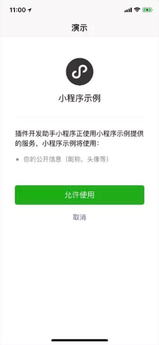
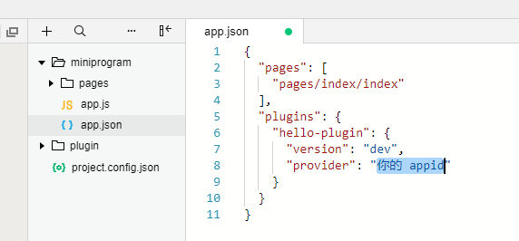

<!-- 来源: https://developers.weixin.qq.com/miniprogram/dev/framework/plugin/functional-pages/user-info.html -->

# 用户信息功能页

用户信息功能页用于帮助插件获取用户信息，包括 `openid` 和昵称等，相当于 [wx.login](https://developers.weixin.qq.com/miniprogram/dev/api/open-api/login/wx.login.html) 和 [wx.getUserInfo](https://developers.weixin.qq.com/miniprogram/dev/api/open-api/user-info/wx.getUserInfo.html) 的功能。

在基础库版本 [2.3.1](../../compatibility.md) 前，用户信息功能页是插件中唯一的获取 code 和用户信息的方式；

自基础库版本 [2.3.1](../../compatibility.md) 起，用户在该功能页中进行过授权后，插件可以直接调用 [wx.login](https://developers.weixin.qq.com/miniprogram/dev/api/open-api/login/wx.login.html) 和 [wx.getUserInfo](https://developers.weixin.qq.com/miniprogram/dev/api/open-api/user-info/wx.getUserInfo.html) ：

- 授权是以【用户 + 小程序 + 插件】为维度进行授权的，即同一个用户在不同小程序中使用同一个插件，或同一个小程序中使用不同插件，都需要单独进行授权
- 自基础库版本 [2.6.3](../../compatibility.md) 起，可以使用 [wx.getSetting](https://developers.weixin.qq.com/miniprogram/dev/api/open-api/setting/wx.getSetting.html) 来查询用户是否授权过

另外，在满足以下任一条件时，插件可以直接调用 [wx.login](https://developers.weixin.qq.com/miniprogram/dev/api/open-api/login/wx.login.html) ：

1. 使用插件的小程序与插件拥有相同的 AppId
2. 使用插件的小程序与插件绑定了同一个 [微信开放平台](https://open.weixin.qq.com/) 账号，且使用插件的小程序与插件均与开放平台账号为同主体或关联主体

不满足以上条件时， [wx.login](https://developers.weixin.qq.com/miniprogram/dev/api/open-api/login/wx.login.html) 和 [wx.getUserInfo](https://developers.weixin.qq.com/miniprogram/dev/api/open-api/user-info/wx.getUserInfo.html) 将返回失败。

## 调用参数

用户信息功能页使用 [functional-page-navigator](https://developers.weixin.qq.com/miniprogram/dev/component/functional-page-navigator.html) 进行跳转时，对应的参数 name 应为固定值 `loginAndGetUserInfo` ，其余参数与 [wx.getUserInfo](https://developers.weixin.qq.com/miniprogram/dev/api/open.html#wxgetuserinfoobject) 相同，具体来说：

**args 参数说明：**

<table><thead><tr><th>参数名</th> <th>类型</th> <th>必填</th> <th>说明</th></tr></thead> <tbody><tr><td>withCredentials</td> <td>Boolean</td> <td>否</td> <td>是否带上登录态信息</td></tr> <tr><td>lang</td> <td>String</td> <td>否</td> <td>指定返回用户信息的语言，zh_CN 简体中文，zh_TW 繁体中文，en 英文。默认为 en。</td></tr> <tr><td>timeout</td> <td>Number</td> <td>否</td> <td>超时时间，单位 ms</td></tr></tbody></table>

**注：当 withCredentials 为 true 时，返回的数据会包含 encryptedData, iv 等敏感信息。**

**bindsuccess 返回参数说明：**

<table><thead><tr><th>参数</th> <th>类型</th> <th>说明</th></tr></thead> <tbody><tr><td>code</td> <td>String</td> <td>同 <a href="../../../api/open-api/login/wx.login.html">wx.login</a> 获得的用户登录凭证（有效期五分钟）。开发者需要在开发者服务器后台调用 api，使用 code 换取 openid 和 session_key 等信息</td></tr> <tr><td>errMsg</td> <td>String</td> <td>调用结果</td></tr> <tr><td>userInfo</td> <td>OBJECT</td> <td>用户信息对象，不包含 openid 等敏感信息</td></tr> <tr><td>rawData</td> <td>String</td> <td>不包括敏感信息的原始数据字符串，用于计算签名。</td></tr> <tr><td>signature</td> <td>String</td> <td>使用 sha1( rawData + sessionkey ) 得到字符串，用于校验用户信息，参考文档 <a href="../../open-ability/signature.html">signature</a>。</td></tr> <tr><td>encryptedData</td> <td>String</td> <td>包括敏感数据在内的完整用户信息的加密数据，详细见 <a href="../../open-ability/signature.html">加密数据解密算法</a></td></tr> <tr><td>iv</td> <td>String</td> <td>加密算法的初始向量，详细见 <a href="../../open-ability/signature.html">加密数据解密算法</a></td></tr></tbody></table>

**userInfo 参数说明：**

<table><thead><tr><th>参数</th> <th>类型</th> <th>说明</th></tr></thead> <tbody><tr><td>nickName</td> <td>String</td> <td>用户昵称</td></tr> <tr><td>avatarUrl</td> <td>String</td> <td>用户头像，最后一个数值代表正方形头像大小（有 0、46、64、96、132 数值可选，0 代表 132*132 正方形头像），用户没有头像时该项为空。若用户更换头像，原有头像 URL 将失效。</td></tr> <tr><td>gender</td> <td>String</td> <td>用户的性别，值为 1 时是男性，值为 2 时是女性，值为 0 时是未知</td></tr> <tr><td>city</td> <td>String</td> <td>用户所在城市</td></tr> <tr><td>province</td> <td>String</td> <td>用户所在省份</td></tr> <tr><td>country</td> <td>String</td> <td>用户所在国家</td></tr> <tr><td>language</td> <td>String</td> <td>用户的语言，简体中文为 zh_CN</td></tr></tbody></table>

## 示例代码

```html
<!--plugin/components/hello-component.wxml-->
  <functional-page-navigator
    name="loginAndGetUserInfo"
    args="{{ args }}"
    version="develop"
    bind:success="loginSuccess"
    bind:fail="loginFail"
  >
    <button class="login">登录到插件</button>
  </functional-page-navigator>
```

```javascript
// plugin/components/hello-component.js
Component({
  properties: {},
  data: {
    args: {
      withCredentials: true,
      lang: 'zh_CN'
    }
  },
  methods: {
    loginSuccess: function (res) {
      console.log(res.detail);
    },
    loginFail: function (res) {
      console.log(res);
    }
  }
});
```

用户点击该 `navigator` 后，将跳转到如下的用户信息功能页：



[在微信开发者工具中查看示例](https://developers.weixin.qq.com/s/Uof4Iomt731Z) ：

1. 由于插件需要 appid 才能工作，请填入一个 appid；
2. 由于当前代码片段的限制，打开该示例后请 **手动将 appid 填写到 `miniprogram/app.json` 中（如下图）使示例正常运行。**


