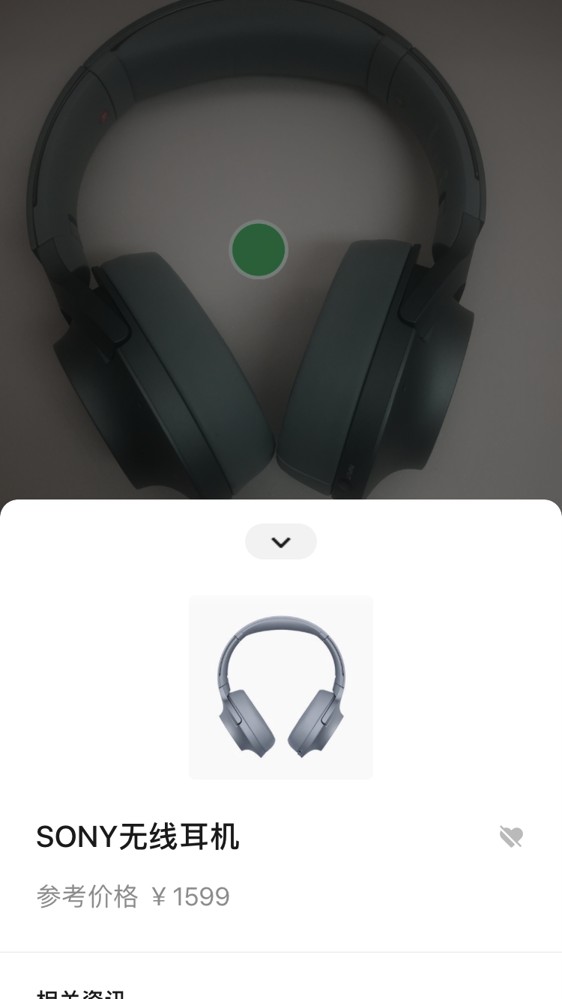
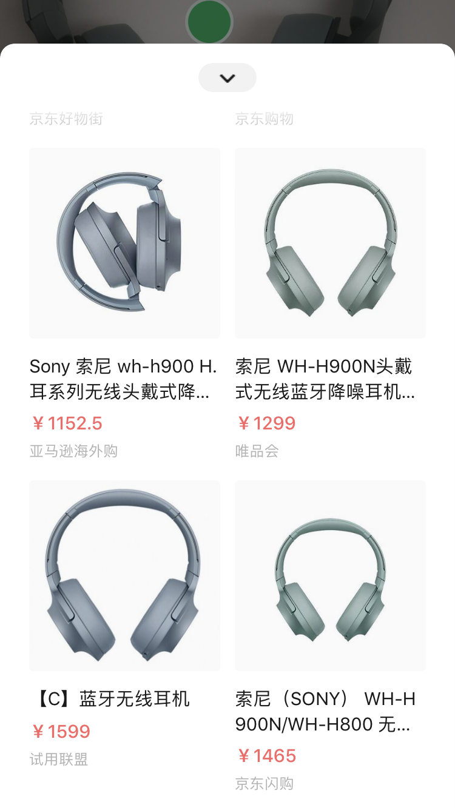
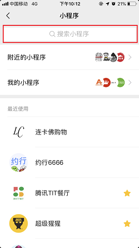
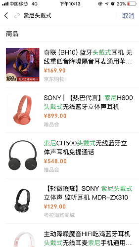
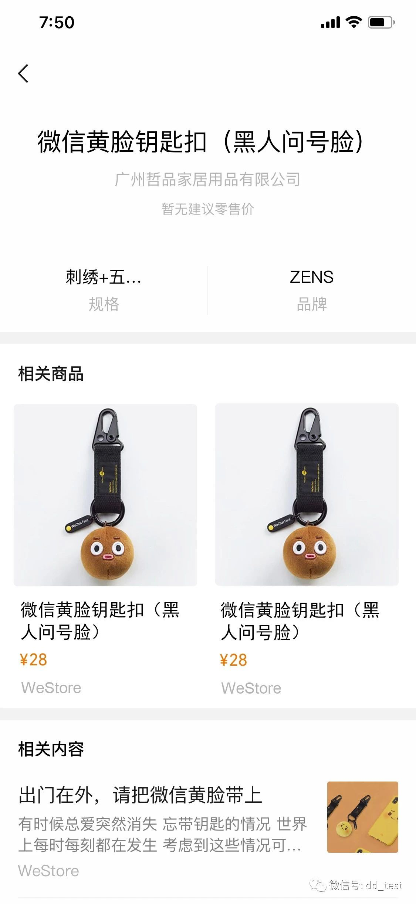
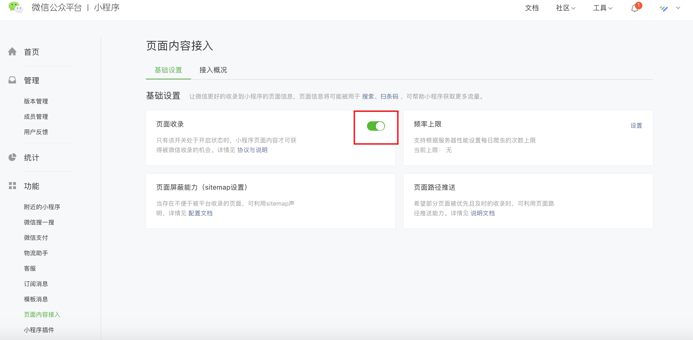

<!-- 来源: https://developers.weixin.qq.com/miniprogram/dev/framework/product/ -->

# 商品数据接入（内测）

## 商品数据应用场景

商品数据目前应用于 **微信扫一扫识物功能** 、 **小程序商品搜索功能** 和 **扫条码** 三个功能。 这些功能可以很好的满足微信用户对商品的信息获取诉求，同时也能为商家小程序带来曝光流量和建立用户品牌认知的机会。

**扫一扫识物- 效果图**

**小程序商品搜索- 效果图**

**扫一扫商品条码- 效果图**

## 商品数据接入

目前微信已经爬得部分商品详情页，并对页面的商品信息进行了一定的分析理解。商家小程序可以配合接入商品数据，帮助微信更好地发现更多更丰富的商品信息，提高商品的曝光机会。

成功接入需要完成以下三步：

### 第一步：开启「爬虫开关」

确保爬虫开关处于开启状态，保证小程序页面内容获得被微信收录的机会。爬虫开关在微信公众平台上设置，可参考如下示意图。

### 第二步：推送「页面路径」

通过接口主动推送商品详情页的页面路径至微信后台，保证推送页面被微信爬虫及时发现，获得曝光机会。具体参考： [小程序search.submitPages接口文档](https://developers.weixin.qq.com/miniprogram/dev/api-backend/open-api/search/search.submitPages.html)

### 第三步：接入「数据更新协议」

接入数据更新协议，可支持微信实时的获取到商品的价格、上下架状态等最新信息，避免由于信息不准确而影响商品的曝光效果。

具体参考文档: [小程序商品数据实时更新文档](https://git.weixin.qq.com/wechat-miniprogram-search-open/document/blob/master/merchant/merchant_callback.md)

完成以上三步后，商家小程序的商品详情页将被收录，获得在“扫一扫识物功能”、“小程序商品搜索功能”和“扫条码”的曝光机会。

此外，我们建议商家小程序还可继续标记页面结构化内容和优化页面结构：

**一、标记「页面结构化内容」**

通过对页面结构化内容的标记，帮助微信爬虫更好的理解页面信息，提高页面的召回排序精准度和曝光转化率。具体参考： [页面标记商品结构化数据文档](https://git.weixin.qq.com/wechat-miniprogram-search-open/document/blob/master/merchant/merchant_structdata.md)

**二、优化页面结构设计**

基于小程序搜索优化指南，优化页面结构设计，提高页面对爬虫的友好度。具体参考： [小程序SEO建议](../search/seo.md)

如本文档版本过旧，请访问Git查看最新版本： [点我](https://git.weixin.qq.com/wechat-miniprogram-search-open/document/tree/master/merchant/README.md)
