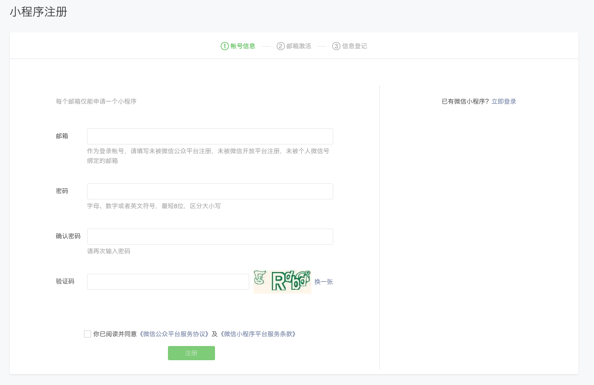
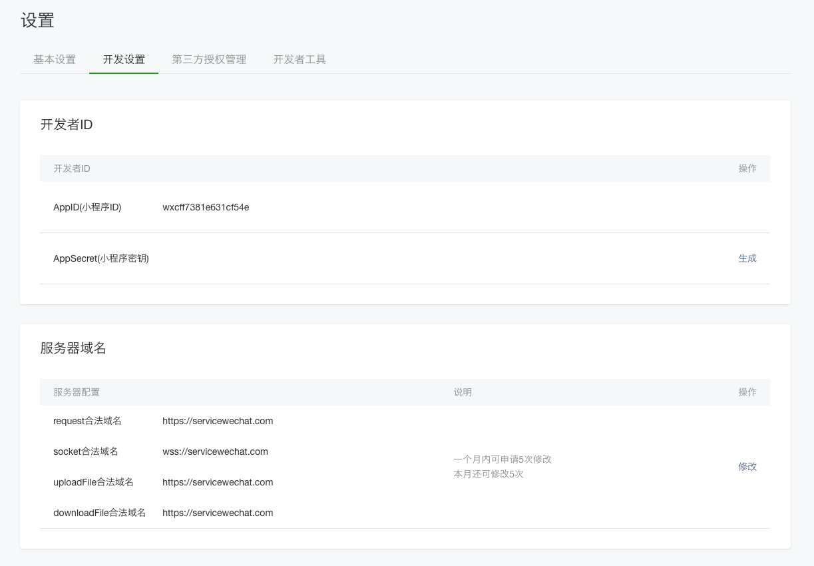
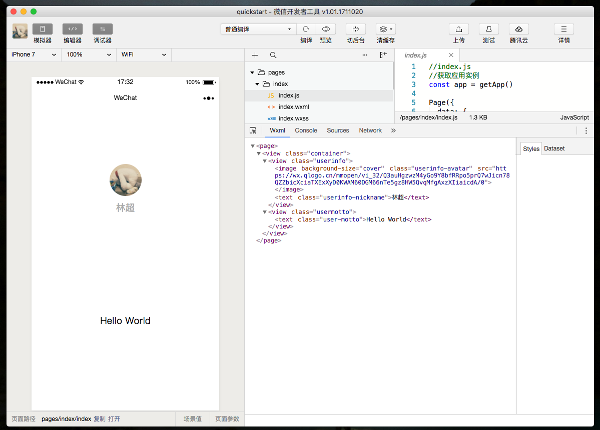
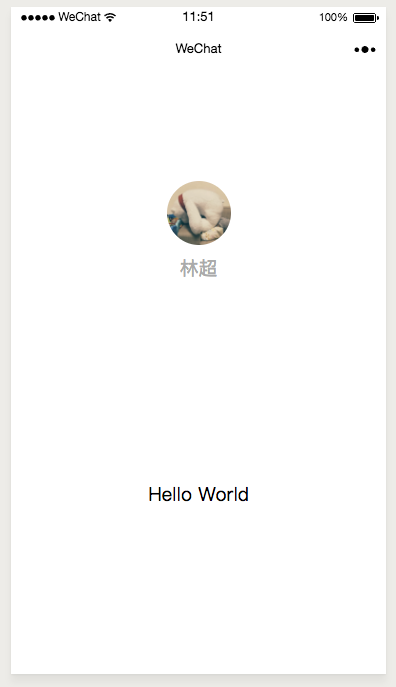

<!-- 来源: https://developers.weixin.qq.com/miniprogram/dev/framework/quickstart/getstart.html -->

# 开始

开发小程序的第一步，你需要拥有一个小程序账号，通过这个账号你就可以管理你的小程序。

跟随这个教程，开始你的小程序之旅吧！

## 申请账号

进入 [小程序注册页](https://mp.weixin.qq.com/wxopen/waregister?action=step1) 根据指引填写信息和提交相应的资料，就可以拥有自己的小程序账号。

在这个小程序管理平台，你可以管理你的小程序的权限，查看数据报表，发布小程序等操作。

登录 [小程序后台](https://mp.weixin.qq.com/) ，我们可以在菜单 “开发”-“开发设置” 看到小程序的 **AppID** 了 。

小程序的 AppID 相当于小程序平台的一个身份证，后续你会在很多地方要用到 AppID （注意这里要区别于服务号或订阅号的 AppID）。

有了小程序账号之后，我们需要一个工具来开发小程序。

## 安装开发工具

前往 [开发者工具下载页面](https://developers.weixin.qq.com/miniprogram/dev/devtools/download.html) ，根据自己的操作系统下载对应的安装包进行安装，有关开发者工具更详细的介绍可以查看 [《开发者工具介绍》](https://developers.weixin.qq.com/miniprogram/dev/devtools/devtools.html) 。

打开小程序开发者工具，用微信扫码登录开发者工具，准备开发你的第一个小程序吧！

## 你的第一个小程序

新建项目选择小程序项目，选择代码存放的硬盘路径，填入刚刚申请到的小程序的 AppID，给你的项目起一个好听的名字，勾选 "不使用云服务" （注意: 你要选择一个空的目录才可以创建项目），点击新建，你就得到了你的第一个小程序了，点击顶部菜单编译就可以在微信开发者工具中预览你的第一个小程序。

接下来我们来预览一下这个小程序的效果。

## 编译预览

点击工具上的编译按钮，可以在工具的左侧模拟器界面看到这个小程序的表现，也可以点击预览按钮，通过微信的扫一扫在手机上体验你的第一个小程序。

通过这个章节，你已经成功创建了你的第一个小程序，并且在微信客户端上体验到它流畅的表现。

[下个章节](./code.md) ，我们一起来看看这个小程序的代码构成。
