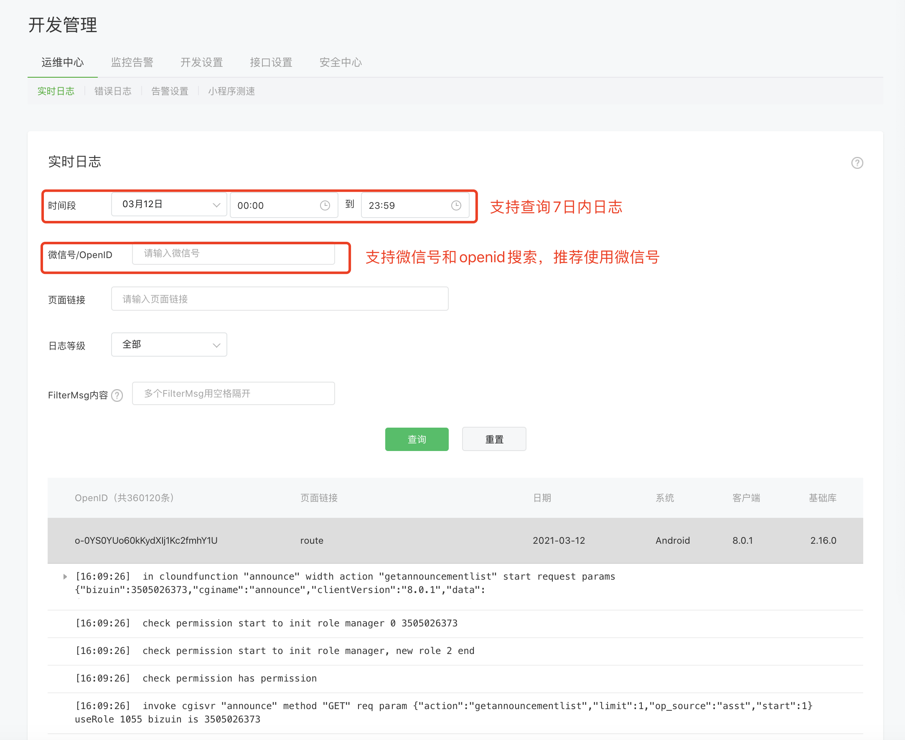
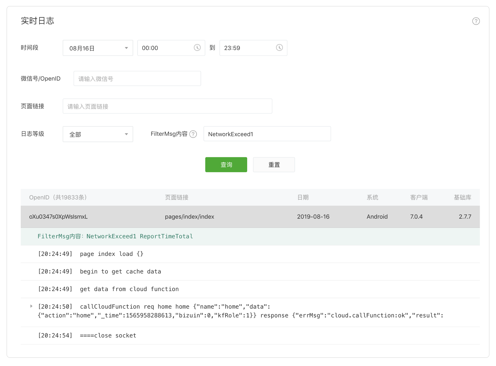

<!-- 来源: https://developers.weixin.qq.com/miniprogram/dev/framework/realtimelog/ -->

# 实时日志

## 背景

为帮助小程序开发者快捷地排查小程序漏洞、定位问题，我们推出了实时日志功能。开发者可通过提供的接口打印日志，日志汇聚并实时上报到小程序后台。开发者可从We分析“性能质量->实时日志->小程序日志”进入小程序端日志查询页面，或从“性能质量->实时日志->插件日志”进入插件端日志查询页面，进而查看开发者打印的日志信息。

## 如何使用

### 小程序/小游戏端

从基础库 `2.7.1` 开始，小程序端即可使用实时日志，小游戏端则从基础库 `2.14.4` 开始支持。

1、调用相关接口。打日志的接口是 `wx.getRealtimeLogManager` ，为了兼容旧的版本，建议使用如下代码封装一下，例如封装在 `log.js` 文件里面：

```js
var log = wx.getRealtimeLogManager ? wx.getRealtimeLogManager() : null

module.exports = {
  debug() {
    if (!log) return
    log.debug.apply(log, arguments)
  },
  info() {
    if (!log) return
    log.info.apply(log, arguments)
  },
  warn() {
    if (!log) return
    log.warn.apply(log, arguments)
  },
  error() {
    if (!log) return
    log.error.apply(log, arguments)
  },
  setFilterMsg(msg) { // 从基础库2.7.3开始支持
    if (!log || !log.setFilterMsg) return
    if (typeof msg !== 'string') return
    log.setFilterMsg(msg)
  },
  addFilterMsg(msg) { // 从基础库2.8.1开始支持
    if (!log || !log.addFilterMsg) return
    if (typeof msg !== 'string') return
    log.addFilterMsg(msg)
  }
}
```

2、在页面的具体位置打印日志：

```js
var log = require('./log.js') // 引用上面的log.js文件
log.info('hello test hahaha') // 日志会和当前打开的页面关联，建议在页面的onHide、onShow等生命周期里面打
log.warn('warn')
log.error('error')
log.setFilterMsg('filterkeyword')
log.addFilterMsg('addfilterkeyword')
```

完整的例子可以参考代码片段：https://developers.weixin.qq.com/s/aFYw1BmC7eak

### 插件端

从基础库 `2.16.0` 开始支持，插件端也支持了实时日志。为了让日志更具有结构性，以便后续进行更为复杂的分析，因此插件端采用新设计的格式。

1、调用相关接口 `wx.getRealtimeLogManager` ，获取实时日志管理器实例：

```js
const logManager = wx.getRealtimeLogManager()
```

2、在需要打日志的逻辑中，获取日志实例：

```js
// 标签名可以是任意字符串，一个标签名对应一组日志；同样的标签名允许被重复使用，具有相同标签名的日志在后台会被汇总到一个标签下
// 标签可为日志进行分类，因此建议开发者按逻辑来进行标签划分
const logger = logManager.tag('plugin-onUserTapSth')
```

3、在合适位置打印日志：

```js
logger.info('key1', 'value1') // 每条日志为一个 key-value 对，key 必须是字符串，value 可以是字符串/数值/对象/数组等可序列化类型
logger.error('key2', {str: 'value2'})
logger.warn('key3', 'value3')
logger.setFilterMsg('filterkeyword') // 和小程序/小游戏端接口一致
logger.setFilterMsg('addfilterkeyword') // 和小程序/小游戏端接口一致
```

## 如何查看日志

登录We分析，从“性能质量->实时日志”进入日志查询页面。开发者可通过设置时间、微信号/OpenID、页面链接、FilterMsg内容（基础库2.7.3及以上支持setFilterMsg）等筛选条件查询指定用户的日志信息。如果是插件上报的实时日志，可从“小程序插件->实时日志”进入日志查询页面进行查询。



## 注意事项

由于后台资源限制，“实时日志”使用规则如下：

1. 为了定位问题方便，日志是按页面划分的，某一个页面，在一定时间内（最短为5秒，最长为页面从显示到隐藏的时间间隔）打的日志，会聚合成 **一条日志** 上报，并且在小程序管理后台上可以根据页面路径搜索出 **该条日志** 。
2. 每个小程序账号，We分析基础版每天限制5000条日志，We分析专业版为50000条，且支持购买配置升级或购买额外的上报扩充包。日志根据版本配置，会保留7天/14天/30天不等，建议遇到问题及时定位。
3. **一条日志** 的上限是5KB，最多包含200次打印日志函数调用（info、warn、error调用都算），所以要谨慎打日志，避免在循环里面调用打日志接口，避免直接重写console.log的方式打日志。
4. 意见反馈里面的日志，可根据OpenID搜索日志。
5. setFilterMsg和addFilterMsg 可设置类似日志tag的过滤字段。如需添加多个关键字，建议使用addFilterMsg。例如addFilterMsg('scene1'), addFilterMsg('scene2'),addFilterMsg('scene3')，设置后在小程序管理后台可随机组合三个关键字进行检索，如：“scene1 scene2 scene3”、“scene1 scene2”、 “scene1 scene3” 或 “scene2”等（以空格分隔，故addFilterMsg不能带空格）。以上几种检索方法均可检索到该条日志，检索条件越多越精准。
6. 目前为了方便做日志分析，插件端实时日志只支持 key-value 格式。
7. 实时日志目前只支持在 **手机端** 测试。工具端的接口可以调用，但不会上报到后台。
8. 开发版、体验版的实时日志，不计入相关quota，即无使用上限。


