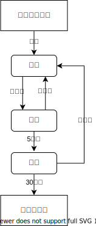

<!-- 来源: https://developers.weixin.qq.com/miniprogram/dev/framework/runtime/operating-mechanism.html -->

# 小程序运行机制

## 1. 小程序的生命周期

小程序从启动到最终被销毁，会经历很多不同的状态，小程序在不同状态下会有不同的表现。



### 1.1 小程序启动

从用户认知的角度看，广义的小程序启动可以分为两种情况，一种是 **冷启动** ，一种是 **热启动** 。

- 冷启动：如果用户首次打开，或小程序销毁后被用户再次打开，此时小程序需要重新加载启动，即冷启动。
- 热启动：如果用户已经打开过某小程序，然后在一定时间内再次打开该小程序，此时小程序并未被销毁，只是从后台状态进入前台状态，这个过程就是热启动。

从小程序生命周期的角度来看，我们一般讲的「 **启动** 」专指冷启动，热启动一般被称为后台切前台。

### 1.2 前台与后台

小程序启动后，界面被展示给用户，此时小程序处于「 **前台** 」状态。

当用户「关闭」小程序时，小程序并没有真正被关闭，而是进入了「 **后台** 」状态，此时小程序还可以短暂运行一小段时间，但部分 API 的使用会受到限制。切后台的方式包括但不限于以下几种：

- 点击右上角胶囊按钮离开小程序
- iOS 从屏幕左侧右滑离开小程序
- 安卓点击返回键离开小程序
- 小程序前台运行时直接把微信切后台（手势或 Home 键）
- 小程序前台运行时直接锁屏

当用户再次进入微信并打开小程序，小程序又会重新进入「 **前台** 」状态。

### 1.3 挂起

小程序进入「后台」状态一段时间后（目前是 5 秒），微信会停止小程序 JS 线程的执行，小程序进入「 **挂起** 」状态。此时小程序的内存状态会被保留，但开发者代码执行会停止，事件和接口回调会在小程序再次进入「前台」时触发。

当开发者使用了 [后台音乐播放](https://developers.weixin.qq.com/miniprogram/dev/api/media/background-audio/wx.getBackgroundAudioManager.html) 、 [后台地理位置](https://developers.weixin.qq.com/miniprogram/dev/api/location/wx.startLocationUpdateBackground.html) 等能力时，小程序可以在「后台」持续运行，不会进入到「挂起」状态

### 1.4 小程序销毁

如果用户很久没有使用小程序，或者系统资源紧张，小程序会被「 **销毁** 」，即完全终止运行。具体而言包括以下几种情形：

- 当小程序进入后台并被「挂起」后，如果很长时间（目前是 30 分钟）都未再次进入前台，小程序会被销毁。
- 当小程序占用系统资源过高，可能会被系统销毁或被微信客户端主动回收。
    - 在 iOS 上，当微信客户端在一定时间间隔内连续收到系统内存告警时，会根据一定的策略，主动销毁小程序，并提示用户 「运行内存不足，请重新打开该小程序」。具体策略会持续进行调整优化。
    - 建议小程序在必要时使用 [wx.onMemoryWarning](https://developers.weixin.qq.com/miniprogram/dev/api/device/memory/wx.onMemoryWarning.html) 监听内存告警事件，进行必要的内存清理。

> 基础库 1.1.0 及以上，1.4.0 以下版本: 当用户从扫一扫、转发等入口（ [场景值](https://developers.weixin.qq.com/miniprogram/dev/component/xr-frame/core/scene.html) 为1007, 1008, 1011, 1025）进入小程序，且没有置顶小程序的情况下退出，小程序会被销毁。

## 2. 小程序冷启动的页面

小程序冷启动时，打开的页面有以下情况

- （A 类场景）若启动的场景中不带 path
    - 基础库 2.8.0 以下版本，进入首页
    - 基础库 2.8.0 及以上版本遵循「重新启动策略」，可能是首页或上次退出的页面
- （B 类场景）若启动的场景中带有 path，则启动进入对应 path 的页面

### 2.1 重新启动策略

> 基础库 2.8.0 开始支持，低版本需做 [兼容处理](../compatibility.md) 。

小程序冷启动时，如果启动时不带 path（A 类场景），默认情况下将会进入小程序的首页。 在页面对应的 json 文件中（也可以全局配置在 app.json 的 window 段中），指定 `restartStrategy` 配置项可以改变这个默认的行为，使得从某个页面退出后，下次 A 类场景的冷启动可以回到这个页面。

**代码示例：**

```json
{
  "restartStrategy": "homePage"
}
```

`restartStrategy` 可选值：

<table><thead><tr><th>可选值</th> <th>含义</th></tr></thead> <tbody><tr><td>homePage</td> <td>（默认值）如果从这个页面退出小程序，下次将从首页冷启动</td></tr> <tr><td>homePageAndLatestPage</td> <td>如果从这个页面退出小程序，下次冷启动后立刻加载这个页面，页面的参数保持不变（不可用于 tab 页）</td></tr></tbody></table>

注意：即使不配置为 `homePage` ，小程序如果退出过久（当前默认一天时间，可以使用 **退出状态** 来调整），下次冷启动时也将不再遵循 `restartStrategy` 的配置，而是直接从首页冷启动。

无论如何，页面中的状态并不会被保留，如输入框中的文本内容、 checkbox 的勾选状态等都不会还原。如果需要还原或部分还原，需要利用 **退出状态** 。

## 3. 小程序热启动的页面

小程序热启动时，打开的页面有以下情况

- （A 类场景）若启动的场景中不带 path，则保留上次的浏览的状态
- （B 类场景）若启动的场景中带有 path，则 reLaunch 到对应 path 的页面

A 类场景常见的有下列 [场景值](https://developers.weixin.qq.com/miniprogram/dev/component/xr-frame/core/scene.html) ：

<table><thead><tr><th>场景值ID</th> <th>说明</th></tr></thead> <tbody><tr><td>1001</td> <td>发现栏小程序主入口，「最近使用」列表（基础库2.2.4版本起包含「我的小程序」列表）</td></tr> <tr><td>1003</td> <td>星标小程序列表</td></tr> <tr><td>1023</td> <td>系统桌面小图标打开小程序</td></tr> <tr><td>1038</td> <td>从其他小程序返回小程序</td></tr> <tr><td>1056</td> <td>聊天顶部音乐播放器右上角菜单，打开小程序</td></tr> <tr><td>1080</td> <td>客服会话菜单小程序入口，打开小程序</td></tr> <tr><td>1083</td> <td>公众号会话菜单小程序入口 ，打开小程序（只有腾讯客服小程序有）</td></tr> <tr><td>1089</td> <td>聊天主界面下拉，打开小程序/微信聊天主界面下拉，「最近使用」栏（基础库2.2.4版本起包含「我的小程序」栏）</td></tr> <tr><td>1090</td> <td>长按小程序右上角菜单，打开小程序</td></tr> <tr><td>1103</td> <td>发现-小程序主入口我的小程序，打开小程序</td></tr> <tr><td>1104</td> <td>聊天主界面下拉，从我的小程序，打开小程序</td></tr> <tr><td>1113</td> <td>安卓手机负一屏，打开小程序</td></tr> <tr><td>1114</td> <td>安卓手机侧边栏，打开小程序</td></tr> <tr><td>1117</td> <td>后台运行小程序的管理页中，打开小程序</td></tr></tbody></table>

## 4. 退出状态

> 基础库 2.7.4 开始支持，低版本需做 [兼容处理](../compatibility.md) 。

每当小程序可能被销毁之前，页面回调函数 `onSaveExitState` 会被调用。如果想保留页面中的状态，可以在这个回调函数中“保存”一些数据，下次启动时可以通过 `exitState` 获得这些已保存数据。

**代码示例：**

```json
{
  "restartStrategy": "homePageAndLatestPage"
}
```

```js
Page({
  onLoad: function() {
    var prevExitState = this.exitState // 尝试获得上一次退出前 onSaveExitState 保存的数据
    if (prevExitState !== undefined) { // 如果是根据 restartStrategy 配置进行的冷启动，就可以获取到
      prevExitState.myDataField === 'myData'
    }
  },
  onSaveExitState: function() {
    var exitState = { myDataField: 'myData' } // 需要保存的数据
    return {
      data: exitState,
      expireTimeStamp: Date.now() + 24 * 60 * 60 * 1000 // 超时时刻
    }
  }
})
```

`onSaveExitState` 返回值可以包含两项：

<table><thead><tr><th>字段名</th> <th>类型</th> <th>含义</th></tr></thead> <tbody><tr><td>data</td> <td>Any</td> <td>需要保存的数据（只能是 JSON 兼容的数据）</td></tr> <tr><td>expireTimeStamp</td> <td>Number</td> <td>超时时刻，在这个时刻后，保存的数据保证一定被丢弃，默认为 (当前时刻 + 1 天)</td></tr></tbody></table>

一个更完整的示例： [在开发者工具中预览效果](https://developers.weixin.qq.com/s/ELP5uTmN7E8l)

## 注意事项

- 如果超过 `expireTimeStamp` ，保存的数据将被丢弃，且冷启动时不遵循 `restartStrategy` 的配置，而是直接从首页冷启动。
- `expireTimeStamp` 有可能被自动提前，如微信客户端需要清理数据的时候。
- 在小程序存活期间， `onSaveExitState` 可能会被多次调用，此时以最后一次的调用结果作为最终结果。
- 在某些特殊情况下（如微信客户端直接被系统杀死），这个方法将不会被调用，下次冷启动也不遵循 `restartStrategy` 的配置，而是直接从首页冷启动。
