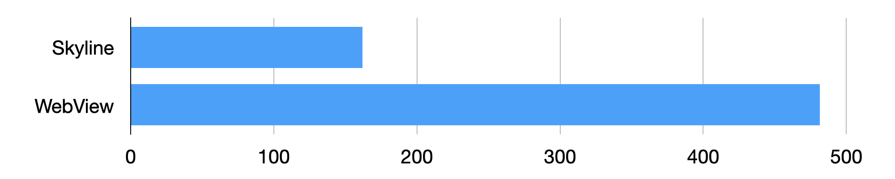
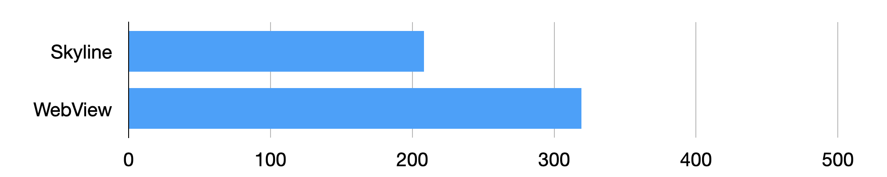
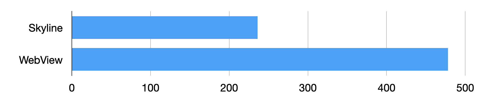
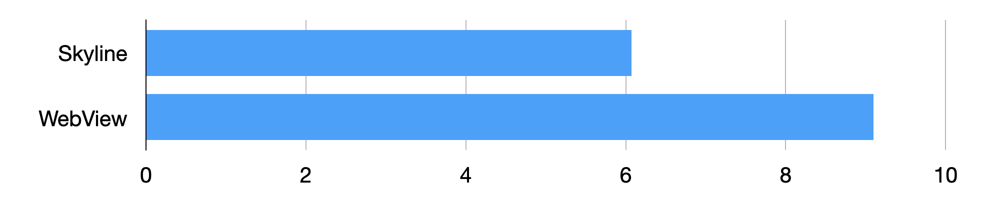

<!-- 来源: https://developers.weixin.qq.com/miniprogram/dev/framework/runtime/skyline/comparation.html -->

## 性能对比

首屏耗时是衡量渲染性能一个最重要的指标。小程序的首屏耗时可以从上一个页面的点击到下一个页面 FCP（First Contentful Paint）的时间来衡量，首屏性能的好坏会影响上一个页面点击时的响应速度，以及下一个页面的白屏时间。

目前已经有一些小程序以 Skyline 模式在线上运行，以下取小程序助手的线上数据，可以看出 Skyline 的首屏时间比 WebView 快 66%，并且手机性能越低端，差异就越明显。

在内存占用方面，由于线上小程序未能较准确获取内存数据，我们在本地收集了一些测量数据，测量方法均是测 n 次取平均值，并且采用两个指标，一个是打开小程序示例首页，静置 30s 后采集数据，另一个是切 Tab 页面，同样静默后采集数据。

测量数据如下图所示（单位 M），可以看出，单个页面 Skyline 的占用比 WebView 减少 35%，两个页面 Skyline 的内存占用比 WebView 减少 50%，随着打开的页面变多，内存差距越明显。

与内存占用的测量类似，CPU 利用率的测量数据如下图所示（单位 %），也能看出，Skyline 相对 WebView 也有不错的提升。

## 效果对比

这里，我们分别录制了小程序助手在 Skyline 与 WebView 下的操作视频，从视频中的对比可以更直观地感受到区别。

> 视频录制的测试机为 OPPO R17，其中左边是 Skyline，右边是 WebView
