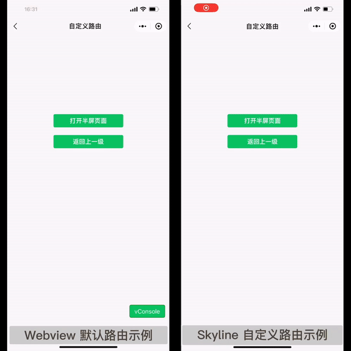
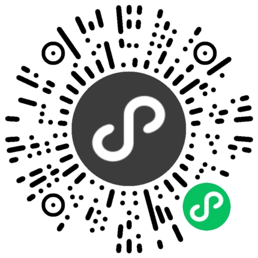
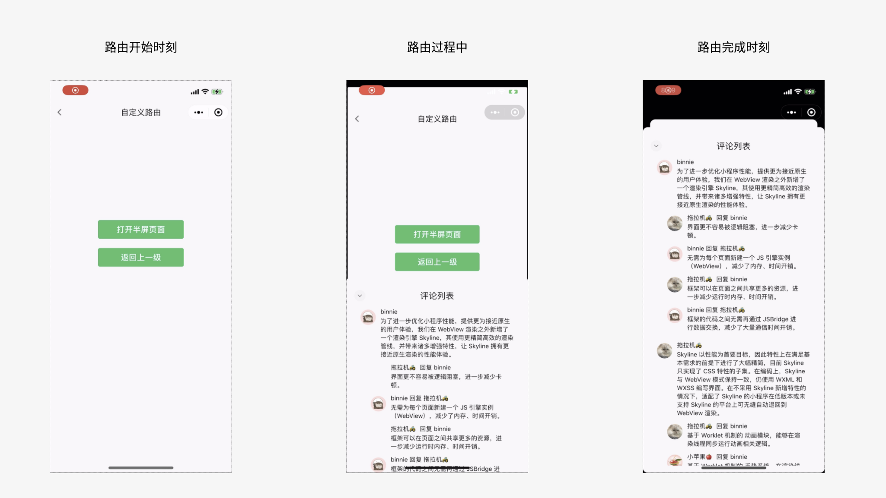
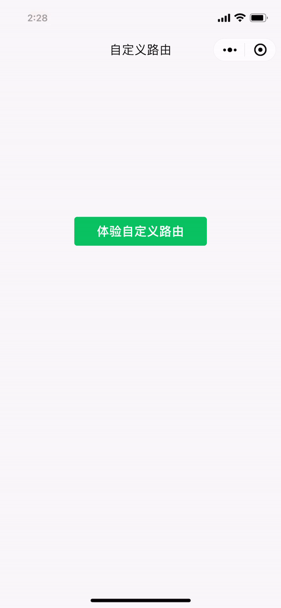
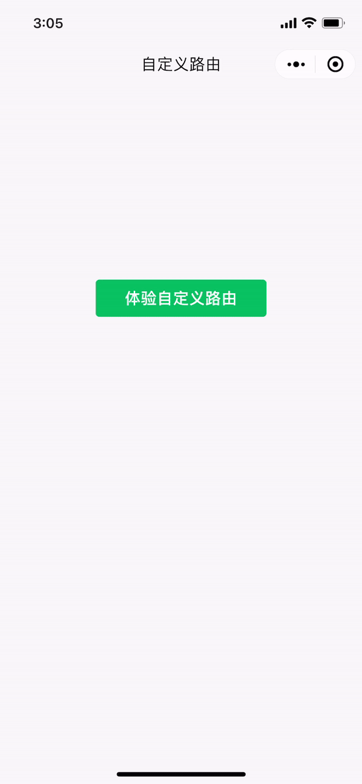
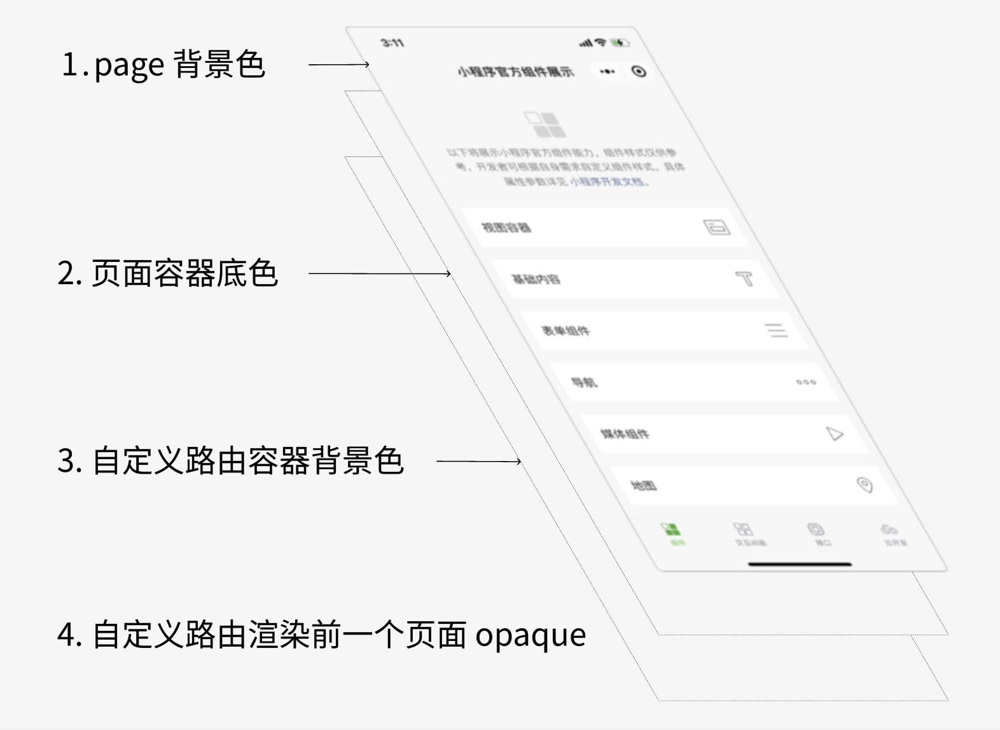
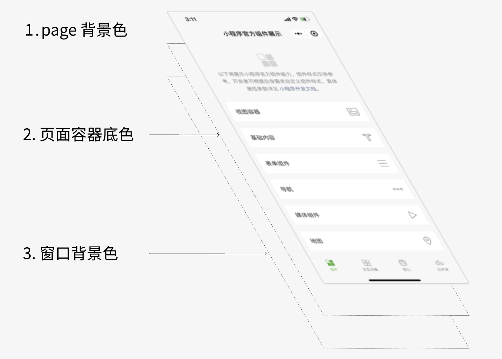

<!-- 来源: https://developers.weixin.qq.com/miniprogram/dev/framework/runtime/skyline/custom-route.html -->

# 自定义路由

小程序采用多 `WebView` 架构，页面间跳转形式十分单一，仅能从右到左进行动画。而原生 `App` 的动画形式则多种多样，如从底部弹起，页面下沉，半屏等。

`Skyline` 渲染引擎下，页面有两种渲染模式: `WebView` 和 `Skyline` ，它们通过页面配置中的 `renderer` 字段进行区分。在 **连续的 `Skyline` 页面** 间跳转时，可实现自定义路由效果。

## 效果展示

下方为半屏页面效果， [点击可查看更多 Skyline 示例](./experience.md) 。



扫码打开小程序示例，交互动画 - 基础组件 - 自定义路由 即可体验。



## 使用方法

建议先阅读完 [worklet 动画](./worklet.md) 和 [手势系统](./gesture.md) 两个章节，它们是自定义路由的基础内容。

### 接口定义

自定义路由相关的接口

- 页面跳转 [wx.navigateTo](https://developers.weixin.qq.com/miniprogram/dev/api/route/wx.navigateTo.html)
- 路由上下文对象 [wx.router.getRouteContext](https://developers.weixin.qq.com/miniprogram/dev/api/route/router/base/router.getRouteContext.html)
- 注册自定义路由 [wx.router.addRouteBuilder](https://developers.weixin.qq.com/miniprogram/dev/api/route/router/base/router.addRouteBuilder.html)

```js
type AddRouteBuilder = (routeType: string, routeBuilder: CustomRouteBuilder) => void

type CustomRouteBuilder = (routeContext: CustomRouteContext, routeOptions: Record<string, any>) => CustomRouteConfig

interface SharedValue<T> {
  value: T;
}

interface CustomRouteContext {
  // 动画控制器，影响推入页面的进入和退出过渡效果
  primaryAnimation: SharedValue<number>
  // 动画控制器状态
  primaryAnimationStatus: SharedValue<number>
  // 动画控制器，影响栈顶页面的推出过渡效果
  secondaryAnimation: SharedValue<number>
  // 动画控制器状态
  secondaryAnimationStatus: SharedValue<number>
  // 当前路由进度由手势控制
  userGestureInProgress: SharedValue<number>
  // 手势开始控制路由
  startUserGesture: () => void
  // 手势不再控制路由
  stopUserGesture: () => void
  // 返回上一级，效果同 wx.navigateBack
  didPop: () => void
}

interface CustomRouteConfig {
  // 下一个页面推入后，不显示前一个页面
  opaque?: boolean;
  // 是否保持前一个页面状态
  maintainState?: boolean;
  // 页面推入动画时长，单位 ms
  transitionDuration?: number;
  // 页面推出动画时长，单位 ms
  reverseTransitionDuration?: number;
  // 遮罩层背景色，支持 rgba() 和 #RRGGBBAA 写法
  barrierColor?: string;
  // 点击遮罩层返回上一页
  barrierDismissible?: boolean;
  // 无障碍语义
  barrierLabel?: string;
  // 是否与下一个页面联动，决定当前页 secondaryAnimation 是否生效
  canTransitionTo?: boolean;
  // 是否与前一个页面联动，决定前一个页 secondaryAnimation 是否生效
  canTransitionFrom?: boolean;
  // 处理当前页的进入/退出动画，返回 StyleObject
  handlePrimaryAnimation?: RouteAnimationHandler;
  // 处理当前页的压入/压出动画，返回 StyleObject
  handleSecondaryAnimation?: RouteAnimationHandler;
  // 处理上一级页面的压入/压出动画，返回 StyleObject 基础库 <3.0.0> 起支持
  handlePreviousPageAnimation?: RouteAnimationHandler;
  // 页面进入时是否采用 snapshot 模式优化动画性能 基础库 <3.2.0> 起支持
  allowEnterRouteSnapshotting?: boolean
  // 页面退出时是否采用 snapshot 模式优化动画性能 基础库 <3.2.0> 起支持
  allowExitRouteSnapshotting?: boolean
  // 右滑返回时，可拖动范围是否撑满屏幕，基础库 <3.2.0> 起支持，常用于半屏弹窗
  fullscreenDrag?: boolean
  // 返回手势方向 基础库 <3.4.0> 起支持
  popGestureDirection?: 'horizontal' | 'vertical' | 'multi'
}

type RouteAnimationHandler = () => { [key: string] : any}
```

### 默认路由配置

```js
const defaultCustomRouteConfig = {
  opaque: true,
  maintainState: true,
  transitionDuration: 300,
  reverseTransitionDuration: 300,
  barrierColor: '',
  barrierDismissible: false,
  barrierLabel: '',
  canTransitionTo: true,
  canTransitionFrom: true,
  allowEnterRouteSnapshotting: false,
  allowExitRouteSnapshotting: false,
  fullscreenDrag: false,
  popGestureDirection: 'horizontal'
}
```

### 示例模板

以下是注册自定义路由的一份示例模板（未添加手势处理部分），完整实现半屏路由效果见示例代码。

```js
const customRouteBuiler = (routeContext: CustomRouteContext) : CustomRouteConfig => {
  const {
    primaryAnimation,
    secondaryAnimation,
    userGestureInProgress
  } = routeContext

  const handlePrimaryAnimation: RouteAnimationHandler = () => {
    'worklet'
    let t = primaryAnimation.value
    if (!userGestureInProgress.value) {
      // select another curve, t = xxx
    }
    // StyleObject
    return {}
  }

  const handleSecondaryAnimation: RouteAnimationHandler = () => {
    'worklet'
    let t = secondaryAnimation.value
    if (!userGestureInProgress.value) {
      // select another curve, t = xxx
    }
    // StyleObject
    return {}
  }

  return {
    opaque: true,
    handlePrimaryAnimation,
    handleSecondaryAnimation
  }
}

// 在页面跳转前定义好 routeBuilder
wx.router.addRouteBuilder('customRoute', customRouteBuiler)

// 跳转新页面时，指定对应的 routeType
wx.navigateTo({
  url: 'xxxx',
  routeType: 'customRoute'
})
```

## 工作原理

以半屏效果为例，路由前后页面记为 `A` 页、 `B` 页，一个路由的生命周期中，会经历如下阶段：

1. `push` 阶段 ：调用 `wx.navigateTo` ， `B` 页自底向上弹出， `A` 页下沉收缩
2. 手势拖动：在 `B` 页上下滑动时，路由动画随之变化
3. `pop` 阶段 ：调用 `wx.navigateBack` ， `B` 页向下关闭， `A` 恢复原样

细分到每个页面，在上述阶段会有以下动画方式

1. 进入/退出动画
2. 压入/压出动画
3. 手势拖动

- 在 `push` 阶段， `B` 页进行的是进入动画， `A` 页进行的是压入动画；
- 在 `pop` 阶段， `B` 页进行的是退出动画， `A` 页进行的是压出动画；

可以看到在路由过程中，前后两个页面动画进行了联动。在自定义路由模式下，我们可以对动画各个阶段的时长、曲线、效果以及是否联动进行自定义，以实现灵活多变的页面专场效果。

### 路由控制器

当打开新页面时，框架会为其创建两个 `SharedValue` 类型的动画控制器 `primaryAnimation` 和 `secondaryAnimation` ，分别控制进入/退出动画和压入/压出动画。

页面的进入和退出可指定不同的时长，但进度变化始终在 `0～1` 之间。仍以半屏效果为例，路由前后页面记为 `A` 页、 `B` 页。

#### `push` 阶段

1. `B` 页对应的 `primaryAnimation` 从 `0 -> 1` 变化，做进入动画
2. `A` 页对应的 `secondaryAnimation` 从 `0 -> 1` 变化，做压入动画

#### `pop` 阶段

1. `B` 页对应的 `primaryAnimation` 从 `1 -> 0` 变化，做退出动画
2. `A` 页对应的 `secondaryAnimation` 从 `1 -> 0` 变化，做压出动画

**其中， `A` 页 `secondaryAnimation` 的值始终与 `B` 页 `primaryAnimation` 的值同步变化。**

通常页面的进入和退出可能采用不同的动画曲线，可通过对应的状态变量 `primaryAnimationStatus` 和 `secondaryAnimationStatus` 来区分当前处于哪一阶段， `ts` 定义如下

```js
enum AnimationStatus {
  // 动画停在起点
  dismissed = 0,
  // 动画从起点向终点进行
  forward = 1,
  // 动画从终点向起点进行
  reverse = 2,
  // 动画停在终点
  completed = 3,
}
```

以 `primaryAnimationStatus` 为例，页面进入和退出过程中变化情况如下

1. `push` 阶段： `dismissed` -> `forward` -> `completed`
2. `pop` 阶段： `completed` -> `reverse` -> `dismissed`

### 路由手势

在页面推入后，除了调用 `wx.navigateBack` 接口返回上一级外，还可以通过手势来处理，例如 `iOS` 上常见的右滑返回。自定义路由模式下，开发者可根据不同的页面转场效果，来选取所需的退出方式，如半屏效果可采用下滑返回。关于手势监听的内容，可参考 [手势系统](./gesture.md) 一章，路由手势仅是在其基础上，补充了几个路由相关的接口。

`startUserGesture` 和 `stopUserGesture` 两个函数总是成对调用的， `startUserGesture` 调用后 `userGestureInProgress` 的值会加 `1` 。

**当开发者自行修改 `primaryAnimation` 的值来控制路由进度的时候，就需要调用这两个接口** 。由于手势拖动过程中通常采用不同的动画曲线，可通过 `userGestureInProgress` 值进行判断。

当手势处理后确定需要返回上一级页面时，调用 `didPop` 接口，作用等同 `wx.navigateBack` 。

### 路由联动

路由动画过程中，默认前后两个页面是一起联动的，可通过配置项关闭。

1. `canTransitionTo` ：是否与下一个页面联动，栈顶页面该属性置为 `false` ，推入下一页面时，则栈顶页面始终不动
2. `canTransitionFrom` ：是否与前一个页面联动，新推入页面该属性置为 `false` ，则栈顶页面始终不动

### 路由上下文对象

由示例模版可见，自定义路由的动画效果就是根据 `CustomRouteContext` 上下文对象上的路由控制器，编写适当的动画更新函数来实现。

`CustomRouteContext` 上下文对象还可在页面/自定义组件中通过 `wx.router.getRouteContext(this)` 读取，进而在手势处理过程中访问，通过对 `primaryAnimation` 值的改写实现页面手势返回。

小技巧：可在 `CustomRouteContext` 对象上添加一些私有属性，在页面中进行读取/修改。

### 多类型路由跳转

考虑这样的场景，从页面 `A` 可能跳转到 `B` 页和 `C` 页，但具有不同的路由动画

1. `A` -> `B` 时，希望实现半屏效果， `A` 需要下沉收缩
2. `A` -> `C` 时，希望采用普通路由， `A` 需要向左移动

跳转下一级页面时的动画由 `handleSecondaryAnimation` 控制，这样就需要在定义 `A` 的 `CustomRouteBuilder` 时考虑所有的路由类型，实现较为繁琐。

基础库 `3.0.0` 版本起，自定义路由新增 `handlePreviousPageAnimation` 接口，用于控制上一级页面的压入/压出动画。

```js
const customRouteBuiler = (routeContext: CustomRouteContext) : CustomRouteConfig => {
  const { primaryAnimation } = routeContext

  const handlePrimaryAnimation: RouteAnimationHandler = () => {
    'worklet'
    let t = primaryAnimation.value
    // 控制当前页的进入和退出
  }

  const handlePreviousPageAnimation: RouteAnimationHandler = () => {
    'worklet'
    let t = primaryAnimation.value
    // 控制上一级页面的压入和退出
  }

  return {
    handlePrimaryAnimation,
    handlePreviousPageAnimation
  }
}
```

**`A` 跳转到 `B` 时， `A` 页 `secondaryAnimation` 的值始终与 `B` 页 `primaryAnimation` 的值同步变化。**

我们可以在定义 `B` 的 `CustomRouteBulder` 时，通过 `primaryAnimation` 得知当前路由进度， `handlePreviousPageAnimation` 返回的 `StyleObject` 会作用于上一级页面。

同时也不再需要提前声明 `A` 为自定义路由，在此之前 `A` 跳转 `B` 希望实现半屏效果时， `A` 也必须定义为自定义路由。

完整的示例可参考如下代码，借助 `handlePreviousPageAnimation` 可去掉对 `secondaryAnimation` 的依赖，简化代码逻辑。

[在开发者工具中预览效果](https://developers.weixin.qq.com/s/Dc8ksymP7jM5)

## 实际案例

下面以半屏效果为例，讲解自定义路由的具体实现过程，完整代码见示例代码。



路由前后页面分别记为 `A` 页和 `B` 页，需要分别为其注册自定义路由。 **未注册任何自定义路由效果时，新打开的页面 `B` 会立即覆盖显示在 `A` 页上。**

### Step-1 页面进入动画

我们先分别简单实现 首页 -> `A` 页 -> `B` 页的进入动画，再一步步进行完善。

对于 `A` 页面，进入方式为自右向左，通过 `transform` 平移实现。

```js
function ScaleTransitionRouteBuilder(customRouteContext) {
  const {
    primaryAnimation
  } = customRouteContext

  const handlePrimaryAnimation = () => {
    'worklet'
    let t = primaryAnimation.value
    const transX = windowWidth * (1 - t)
    return {
      transform: `translateX(${transX}px)`,
    }
  }
  return {
    handlePrimaryAnimation
  }
}
```

对于 `B` 页面，进入方式为自底向上，也是通过 `transform` 平移实现，但需要对页面大小、圆角进行修改。

```js
const HalfScreenDialogRouteBuilder = (customRouteContext) => {
  const {
    primaryAnimation,
  } = customRouteContext

  const handlePrimaryAnimation = () => {
    'worklet'
    let t = primaryAnimation.value
    // 距离顶部边距因子
    const topDistance = 0.12
    // 距离顶部边距
    const marginTop = topDistance * screenHeight
    // 半屏页面大小
    const pageHeight = (1 - topDistance) * screenHeight
    // 自底向上显示页面
    const transY = pageHeight * (1 - t)
    return {
      overflow: 'hidden',
      borderRadius: '10px',
      marginTop: `${marginTop}px`,
      height: `${pageHeight}px`,
      transform: `translateY(${transY}px)`,
    }
  }

  return {
    handlePrimaryAnimation,
  }
}
```

页面跳转效果如下，可以看到由于采用线性曲线（未对 `t` 做任何变换），动画有些呆板，同时未区分进入/退出动画。在 `B` 页完全进入后， `A` 页变的不可见。



### Step-2 自定义动画曲线

以 `B` 页为例，根据 `AnimationStatus` 值，采用不同的动画曲线，同时设置 `opaque` 为 `false` ，使得路由动画完成后仍显示 `A` 页面。

```js
const { Easing, derived } = wx.workelt

const Curves = {
  linearToEaseOut: Easing.cubicBezier(0.35, 0.91, 0.33, 0.97),
  easeInToLinear: Easing.cubicBezier(0.67, 0.03, 0.65, 0.09),
  fastOutSlowIn: Easing.cubicBezier(0.4, 0.0, 0.2, 1.0),
  fastLinearToSlowEaseIn: Easing.cubicBezier(0.18, 1.0, 0.04, 1.0),
}

function CurveAnimation({ animation, animationStatus, curve,reverseCurve }) {
  return derived(() => {
    'worklet'
    const useForwardCurve = !reverseCurve || animationStatus.value !== AnimationStatus.reverse
    const activeCurve = useForwardCurve ? curve : reverseCurve
    const t = animation.value
    if (!activeCurve) return t
    if (t === 0 || t === 1) return t
    return activeCurve(t)
  })
}
```

```js
const HalfScreenDialogRouteBuilder = (customRouteContext) => {
  const {
    primaryAnimation,
    primaryAnimationStatus,
  } = customRouteContext

  // 1. 页面进入时，采用 Curves.linearToEaseOut 曲线
  // 2. 页面退出时，采用 Curves.easeInToLinear 曲线
  const _curvePrimaryAnimation = CurveAnimation({
    animation: primaryAnimation,
    animationStatus: primaryAnimationStatus,
    curve: Curves.linearToEaseOut,
    reverseCurve: Curves.easeInToLinear,
  })

  const handlePrimaryAnimation = () => {
    'worklet'
    let t = _curvePrimaryAnimation.value
    ... // 其余内容等上面的代码一致
  }

  return {
    opaque: false,
    handlePrimaryAnimation,
  }
}
```

这里的区别仅在于，当前的进度不再直接读取 `primaryAnimation` 的值。封装的 `CurveAnimation` 函数会根据 `AnimationStatus` 判断是处于进入还是退出状态，从而选择不同的动画曲线。框架提供了多种曲线类型，可进一步参考 [worklet.Easing](https://developers.weixin.qq.com/miniprogram/dev/api/ui/worklet/animation/worklet.Easing.html) 。改进后的页面转场效果如下



### Step-3 页面联动效果

`B` 页进入时， `A` 页作压入动画，由 `secondaryAnimation` 控制。接下来，我们为其添加下沉效果，实现和 `B` 页的联动。

```js
function ScaleTransitionRouteBuilder(customRouteContext) {
  const {
    primaryAnimation
  } = customRouteContext

  const handlePrimaryAnimation = () => {
    'worklet'
    ...
  }

  const _curveSecondaryAnimation = CurveAnimation({
    animation: secondaryAnimation,
    animationStatus: secondaryAnimationStatus,
    curve: Curves.fastOutSlowIn,
  })

  const handleSecondaryAnimation = () => {
    'worklet'
    let t = _curveSecondaryAnimation.value
    // 页面缩放大小
    const scale = 0.08
    // 距离顶部边距因子
    const topDistance = 0.1
    // 估算的偏移量
    const transY = screenHeight * (topDistance - 0.5 * scale) * t
    return {
      overflow: 'hidden',
      borderRadius: `${ 12 * t }px`,
      transform: `translateY(${transY}px) scale(${ 1 - scale * t })`,
    }
  }

  return {
    handlePrimaryAnimation,
    handleSecondaryAnimation
  }
}
```

通过对 `A` 页作 `scale` 和 `translate` 变换实现下沉效果。 `A` 页 `secondaryAnimation` 的值始终与 `B` 页 `primaryAnimation` 的值保持同步。


页面是否联动还可通过 `canTransitionTo` 和 `canTransitionFrom` 两个属性进行配置，可在开发者工具上修改体验。

### Step-4 手势返回

目前动画效果已经基本实现，还需要最后一步，手势返回。对于半屏效果，我们为 `A` 页添加右滑返回手势， `B` 页添加下滑返回手势。

以最常见的右滑返回为例，这里只截取松手后的手势处理部分代码，拖动过程实现较为简单，可参考示例代码。

```js
page({
  handleDragEnd(velocity) {
    'worklet';
    const {
        primaryAnimation,
        stopUserGesture,
        didPop
    } = this.customRouteContext;

    let animateForward = false;
    if (Math.abs(velocity) >= 1.0) {
      animateForward = velocity <= 0;
    } else {
      animateForward = primaryAnimation.value > 0.5;
    }
    const t = primaryAnimation.value;
    const animationCurve = Curves.fastLinearToSlowEaseIn;
    if (animateForward) {
        const duration = Math.min(
          Math.floor(lerp(300, 0, t)),
          300,
        );
        primaryAnimation.value = timing(
          1.0, {
            duration,
            easing: animationCurve,
          },
          () => {
            'worklet'
            stopUserGesture();
          },
        );
    } else {
      const duration = Math.floor(lerp(0, 300, t));
      primaryAnimation.value = timing(
        0.0, {
          duration,
          easing: animationCurve,
        },
        () => {
          'worklet'
          stopUserGesture();
          didPop();
        },
      );
    }
  },
})
```

首先根据松手时的速度和位置，决定是否要真正返回上一级。

1. 向右滑动且速度大于 `1`
2. 或者速度较小时，已拖动超过屏幕 `1/2`

满足以上条件时，确定返回。通过 `timing` 接口，为 `primaryAnimation` 添加过渡动画，使其变化到 `0` ，最后调用 `didPop` 。否则使其变化到 `1` ，恢复到拖动前的状态。

这里需要注意的是，当需要对 `primaryAnimation` 值手动修改，自由掌控其过渡方式时，才需要调用 `startUserGesture` 和 `stopUserGesture` 接口。

右滑手势已经在示例代码中封装成 `swipe-back` 组件，开发者可直接使用。下滑手势返回逻辑基本一致，仅一些数值上略有差异。

最后的实现效果如图


## 设置页面透明

一些自定义路由效果下，需要实现页面透明背景，这里对 `Skyline` 和 `webview` 模式下背景色的层级关系进行说明。

### 自定义路由下的页面背景色

`Skyline` 模式下使用自定义路由方式跳转页面，页面背景色有如下几层

1. 页面背景色：可通过 `page` 选择器在 `wxss` 中定义，默认为白色
2. 页面容器背景色：可在页面 `json` 文件中通过 `backgroundColorContent` 属性定义，支持 `#RRGGBBAA` 写法，默认白色
3. 自定义路由容器背景色，由路由配置项中返回的 `StyleObject` 控制，默认透明
4. 控制是否显示前一个页面，由路由配置项中的 `opaque` 字段控制，默认不显示



当需要设置下一个页面渐显进入时，可简单设置

1. 页面背景色透明： `page { background-color: transparent; }`
2. 页面容器背景色透明： `backgroundColorContent: "#ffffff00"`

[查看自定义路由页面渐显示例](https://developers.weixin.qq.com/s/rL8dGymj7pMu)

### webview 下的页面背景色

对比看下， `webview` 模式下的页面背景色

1. 页面背景色：可通过 `page` 选择器在 `wxss` 中定义，默认为透明
2. 页面容器背景色：可在页面 `json` 文件中通过 `backgroundColorContent` 属性定义，支持 `#RRGGBB` 写法，默认白色
3. 窗口背景色：可通过 [wx.setBackgroundColor](https://developers.weixin.qq.com/miniprogram/dev/api/ui/background/wx.setBackgroundColor.html) 接口或页面配置修改，默认为白色



## 示例代码

[在开发者工具中预览效果](https://developers.weixin.qq.com/s/lg8NoymD7AMK)
