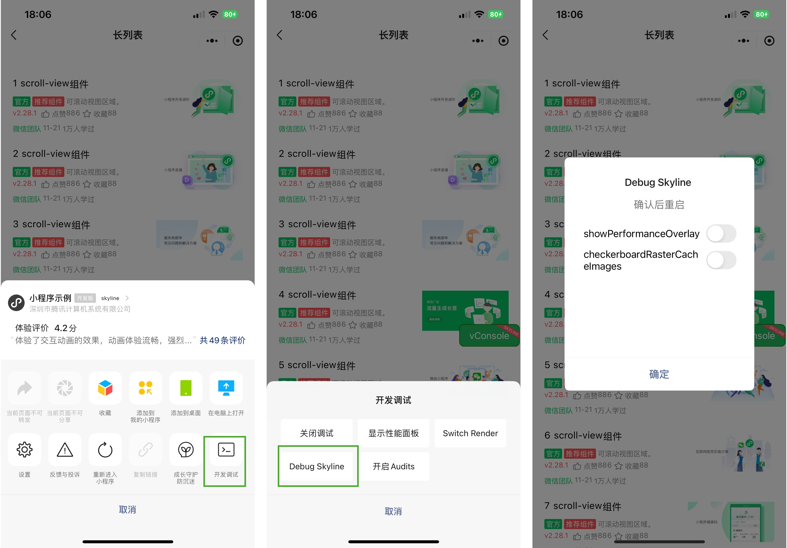
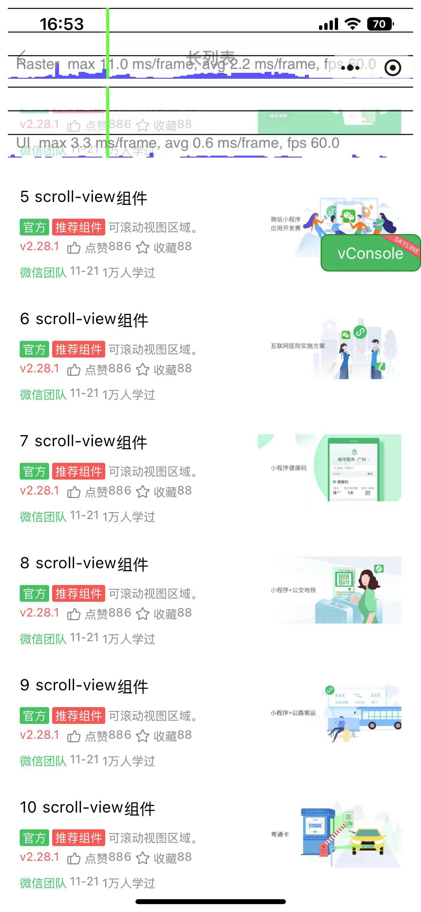
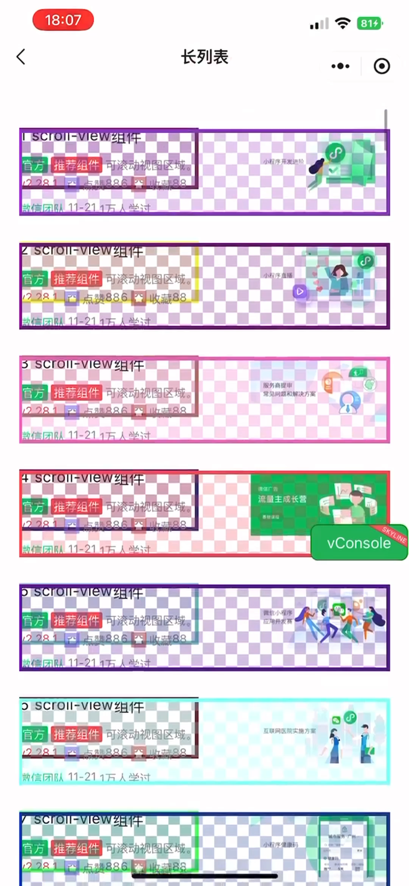

<!-- 来源: https://developers.weixin.qq.com/miniprogram/dev/framework/runtime/skyline/debug.html -->

# 性能调试工具入口

## showPerformanceOverlay

显示 raster 线程 和 ui（渲染）线程的使用情况，线程繁忙则表现为红色

- raster线程： 如果发现耗时很高的话，可能是绘制内容太复杂了，例如用了大量的 backdrop-filter, overflow: hidden, opacity 这些属性对光栅化耗时有影响， 可以建议减少这些属性的使用。 另外还可以在频繁更新的节点上添加一个 will-change: contents 这个 wxss 属性来避免大范围的重绘 (但是这个属性也要避免过多使用，否则会有反效果)
- ui线程: 一般要看是不是没有用上 type="list"，没用的话布局和 paint 耗时都会比较高
- [线程相关参考](./introduction.md)

## checkerboardRasterCacheImages

在屏幕上显示一个棋盘格，显示棋盘格的组件表示被缓存了

- 如果发现棋盘格颜色改变，则表示该组件重新渲染
- 如果滚动时且元素还在屏的时候，颜色一直在变化的话，说明有问题，说明没有 cache，这时候会影响滚动性能。 这时候可能 list-view (type=list) 没用对，也可以用 will-change: contents 来手动加一个绘制边界
- 不是所有的组件都会形成 RasterCache，需要结构复杂一些才会

