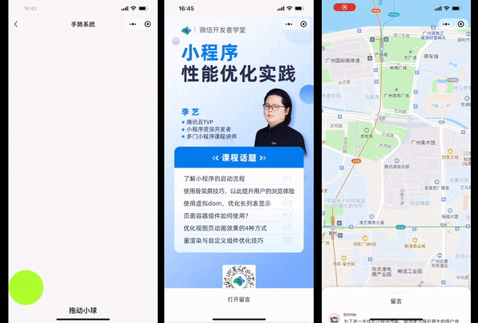

<!-- 来源: https://developers.weixin.qq.com/miniprogram/dev/framework/runtime/skyline/gesture.html -->

# 手势系统

业务开发中，我们常需要监听节点 `touch` 事件，处理拖拽、缩放相关逻辑。由于 `Skyline` 采用双线程架构，在进行这样的交互动画时，会具有较大的异步延迟，这点可以参考 [wxs 响应事件](../../view/interactive-animation.md) 。

`Skyline` 中 `wxs` 代码运行在 `JS` 线程，而事件产生在 `UI` 线程，因此 `wxs 动画` 性能有所降低，为了提升小程序交互体验的效果，我们内置了一批手势组件，使用手势组件的优势包括

1. 免去开发者监听 `touch` 事件，自行计算手势逻辑的复杂步骤
2. 手势组件直接在 `UI` 线程响应，避免了传递到 `JS` 线程带来的延迟

## 效果展示

下图演示了使用手势、协商手势实现的拖动小球，半屏弹窗手势拖动关闭，分段半屏等效果。 [点击查看更多 Skyline 示例](./experience.md) 。



扫码小程序示例，分别体验 `基础手势` 和 `协商手势` 新特性

 

## 手势组件

<table><thead><tr><th>组件名称</th> <th>触发时机</th></tr></thead> <tbody><tr><td><code>&lt;tap-gesture-handler&gt;</code></td> <td>点击时触发</td></tr> <tr><td><code>&lt;double-tap-gesture-handler&gt;</code></td> <td>双击时触发</td></tr> <tr><td><code>&lt;scale-gesture-handler&gt;</code></td> <td>多指缩放时触发</td></tr> <tr><td><code>&lt;force-press-gesture-handler&gt;</code></td> <td>iPhone 设备重按时触发</td></tr> <tr><td><code>&lt;pan-gesture-handler&gt;</code></td> <td>拖动（横向/纵向）时触发</td></tr> <tr><td><code>&lt;vertical-drag-gesture-handler&gt;</code></td> <td>纵向滑动时触发</td></tr> <tr><td><code>&lt;horizontal-drag-gesture-handler&gt;</code></td> <td>横向滑动时触发</td></tr> <tr><td><code>&lt;long-press-gesture-handler&gt;</code></td> <td>长按时触发</td></tr></tbody></table>

### 工作原理

**手势组件为虚组件** ，真正响应事件的是其直接子节点。下方代码中，我们给 `container` 节点添加了两种类型的手势监听。

1. 当在屏幕上横向滑动时， `horizontal-drag` 手势节点的回调将被触发；
2. 当在屏幕上纵向滑动时， `vertical-drag` 手势节点的回调将被触发。

```html
<horizontal-drag-gesture-handler>
  <vertical-drag-gesture-handler>
     <view id="container"></view>
  </vertical-drag-gesture-handler>
</horizontal-drag-gesture-handler>
```

触摸屏幕时，渲染引擎会从内到外对手势监听器进行手势识别，当某个手势监听器满足条件时，其余的手势监听器将会失效。如在 `scroll-view` 内部添加纵向的手势监听时，将会阻断 `scroll-view` 内的手势监听器，导致无法滑动。

```html
<scrol-view>
  <vertical-drag-gesture-handler>
     <view id="container"></view>
  </vertical-drag-gesture-handler>
</scroll-view>
```

需要注意的是， `pan` 类型的判定条件比 `vertical-drag` 要宽松，因此纵向滑动时， `vertical-drag` 将会响应，而 `pan` 则会失效。当横向滑动时， `pan` 类型则会响应。

```html
<vertical-drag-gesture-handler>
  <pan-gesture-handler>
     <view id="container"></view>
  </pan-gesture-handler>
</vertical-drag-gesture-handler>
```

### 通用属性

<table><thead><tr><th>属性</th> <th>类型</th> <th>默认值</th> <th>必填</th> <th>说明</th></tr></thead> <tbody><tr><td>tag</td> <td><code>string</code></td> <td>无</td> <td>否</td> <td>声明手势协商时的组件标识</td></tr> <tr><td>worklet:ongesture</td> <td><code>eventhandler</code></td> <td>无</td> <td>否</td> <td>手势处理回调</td></tr> <tr><td>worklet:should-response-on-move</td> <td><code>callback</code></td> <td>无</td> <td>否</td> <td>手指移动过程中手势是否响应</td></tr> <tr><td>worklet:should-accept-gesture</td> <td><code>callback</code></td> <td>无</td> <td>否</td> <td>手势是否应该被识别</td></tr> <tr><td>simultaneous-handlers</td> <td><code>Array&lt;string&gt;</code></td> <td><code>[]</code></td> <td>否</td> <td>声明可同时触发的手势节点</td></tr> <tr><td>native-view</td> <td><code>string</code></td> <td>无</td> <td>否</td> <td>代理的原生节点类型</td></tr></tbody></table>

`native-view` 支持的枚举值有 `scroll-view` 和 `swiper` 。滚动容器纵向滚动时，使用 `<vertical-drag-gesture-handler>` 手势组件代理内部手势，横向滚动时，则使用 `<horizontal-drag-gesture-handler>` 。

- `eventhandler` 类型是事件回调，无返回值
- `callback` 类型是开发者注册到组件的回调函数，会在适当时机被执行以读取返回值
- 所有的回调都只能传入一个 worklet 回调

### 事件回调参数

#### `worklet:should-response-on-move`

返回的参数 `pointerEvent` 各字段如下。每次触摸移动时进行回调，返回 `false` 时，则对应的手势组件无法收到该次 `move` 事件。

<table><thead><tr><th>属性</th> <th>类型</th> <th>说明</th></tr></thead> <tbody><tr><td>identifier</td> <td>number</td> <td>Touch 对象的唯一标识符</td></tr> <tr><td>type</td> <td>string</td> <td>事件类型</td></tr> <tr><td>deltaX</td> <td>number</td> <td>相对上一次，X 轴方向移动的坐标</td></tr> <tr><td>deltaY</td> <td>number</td> <td>相对上一次，Y 轴方向移动的坐标</td></tr> <tr><td>clientX</td> <td>number</td> <td>触点相对于可见视区左边缘的 X 坐标</td></tr> <tr><td>clientY</td> <td>number</td> <td>触点相对于可见视区上边缘的 Y 坐标</td></tr> <tr><td>radiusX</td> <td>number</td> <td>返回能够包围接触区域的最小椭圆的水平轴 (X 轴) 半径</td></tr> <tr><td>radiusY</td> <td>number</td> <td>返回能够包围接触区域的最小椭圆的垂直轴 (Y 轴) 半径</td></tr> <tr><td>rotationAngle</td> <td>number</td> <td>返回一个角度值，表示上述由radiusX 和 radiusY 描述的椭圆为了尽可能精确地覆盖用户与平面之间的接触区域而需要顺时针旋转的角度</td></tr> <tr><td>force</td> <td>number</td> <td>用户对触摸平面的压力大小</td></tr> <tr><td>timeStamp</td> <td>number</td> <td>事件触发的时间戳</td></tr></tbody></table>

```js
Page({
  shouldResponseOnMove(pointerEvent) {
    'worklet'
    return false
  }
})
```

#### `worklet:should-accept-gesture`

用法如下，框架手势识别生效时进行回调，由开发者决定手势是否生效。以 `Pan` 手势为例。

手指触摸屏幕时进入 `State.Possible` 状态， `shouldAcceptGesture` 返回 `false` 后进入 `State.CANCELLED` 状态，返回 `true` 后进入 `State.Begin` 状态，可继续接收手续 `move` 事件。

```js
Page({
  shouldAcceptGesture() {
    'worklet'
    return false
  }
})
```

#### `worklet:ongesture`

不同类型手势组件返回的参数如下

#### tap / double-tap

<table><thead><tr><th>属性</th> <th>类型</th> <th>说明</th></tr></thead> <tbody><tr><td>state</td> <td>number</td> <td>手势状态</td></tr> <tr><td>absoluteX</td> <td>number</td> <td>相对于全局的 X 坐标</td></tr> <tr><td>absoluteY</td> <td>number</td> <td>相对于全局的 Y 坐标</td></tr></tbody></table>

#### pan / vertical-drag / horizontal-drag

<table><thead><tr><th>属性</th> <th>类型</th> <th>说明</th></tr></thead> <tbody><tr><td>state</td> <td>number</td> <td>手势状态</td></tr> <tr><td>absoluteX</td> <td>number</td> <td>相对于全局的 X 坐标</td></tr> <tr><td>absoluteY</td> <td>number</td> <td>相对于全局的 Y 坐标</td></tr> <tr><td>deltaX</td> <td>number</td> <td>相对上一次，X 轴方向移动的坐标</td></tr> <tr><td>deltaY</td> <td>number</td> <td>相对上一次，Y 轴方向移动的坐标</td></tr> <tr><td>velocityX</td> <td>number</td> <td>手指离开屏幕时的横向速度（pixel per second)</td></tr> <tr><td>velocityY</td> <td>number</td> <td>手指离开屏幕时的纵向速度（pixel per second)</td></tr></tbody></table>

#### scale

<table><thead><tr><th>属性</th> <th>类型</th> <th>说明</th></tr></thead> <tbody><tr><td>state</td> <td>number</td> <td>手势状态</td></tr> <tr><td>focalX</td> <td>number</td> <td>中心点相对于全局的 X 坐标</td></tr> <tr><td>focalY</td> <td>number</td> <td>中心点相对于全局的 Y 坐标</td></tr> <tr><td>focalDeltaX</td> <td>number</td> <td>相对上一次，中心点在 X 轴方向移动的坐标</td></tr> <tr><td>focalDeltaY</td> <td>number</td> <td>相对上一次，中心点在 Y 轴方向移动的坐标</td></tr> <tr><td>scale</td> <td>number</td> <td>放大或缩小的比例</td></tr> <tr><td>horizontalScale</td> <td>number</td> <td><code>scale</code> 的横向分量</td></tr> <tr><td>verticalScale</td> <td>number</td> <td><code>scale</code> 的纵向分量</td></tr> <tr><td>rotation</td> <td>number</td> <td>旋转角（单位：弧度）</td></tr> <tr><td>velocityX</td> <td>number</td> <td>手指离开屏幕时的横向速度（pixel per second)</td></tr> <tr><td>velocityY</td> <td>number</td> <td>手指离开屏幕时的纵向速度（pixel per second)</td></tr> <tr><td>pointerCount</td> <td>number</td> <td>跟踪的手指数</td></tr></tbody></table>

- 多指滑动时， `focalX` 和 `focalY` 为多个触摸点中心焦点的坐标
- 单指滑动时， `pointerCount = 1` ，此时效果同 `pan-gesture-handler` ， `scale` 手势是 `pan` 的超集。

#### long-press

<table><thead><tr><th>属性</th> <th>类型</th> <th>说明</th></tr></thead> <tbody><tr><td>state</td> <td>number</td> <td>手势状态</td></tr> <tr><td>absoluteX</td> <td>number</td> <td>相对于全局的 X 坐标</td></tr> <tr><td>absoluteY</td> <td>number</td> <td>相对于全局的 Y 坐标</td></tr> <tr><td>translationX</td> <td>number</td> <td>相对于初始触摸点的 X 轴偏移量</td></tr> <tr><td>translationY</td> <td>number</td> <td>相对于初始触摸点的 Y 轴偏移量</td></tr> <tr><td>velocityX</td> <td>number</td> <td>手指离开屏幕时的横向速度（pixel per second)</td></tr> <tr><td>velocityY</td> <td>number</td> <td>手指离开屏幕时的纵向速度（pixel per second)</td></tr></tbody></table>

#### force-press

<table><thead><tr><th>属性</th> <th>类型</th> <th>说明</th></tr></thead> <tbody><tr><td>state</td> <td>number</td> <td>手势状态</td></tr> <tr><td>absoluteX</td> <td>number</td> <td>相对于全局的 X 坐标</td></tr> <tr><td>absoluteY</td> <td>number</td> <td>相对于全局的 Y 坐标</td></tr> <tr><td>pressure</td> <td>number</td> <td>压力大小</td></tr></tbody></table>

### 手势状态

所有手势 `worklet:ongesture` 回调均会返回一个 `state` 状态字段。

```ts
enum State {
  // 手势未识别
  POSSIBLE = 0,
  // 手势已识别
  BEGIN = 1,
  // 连续手势活跃状态
  ACTIVE = 2,
  // 手势终止
  END = 3,
  // 手势取消
  CANCELLED = 4,
}
```

我们将手势分为如下两种类型：

1. 离散手势： `tap` 和 `double-tap` ，仅触发一次
2. 连续手势：其它类型的手势组件，随手指拖动会触发多次

`tap-gesture-handler` 手势组件返回的 `state` 始终为 1。

`pan-gesture-handler` 手势组件在一个完整的拖动过程中， `state` 会按如下方式改变

1. 手指刚接触屏幕时， `state = 0`
2. 移动一小段距离， `pan` 手势判定生效时， `state = 1`
3. 继续移动， `state = 2`
4. 手指离开屏幕 `state = 3`

由于嵌套的手势会产生冲突（仅有一个最终判定识别生效），因此连续手势 `state` 的变化可能有如下一些情景，开发者需要根据 `state` 值来处理一些异常情况。

1. `POSSIBLE -> BEGIN -> ACTIVE -> END` 正常流程
2. `POSSIBLE -> BEGIN -> ACTIVE -> CANCELLED` 提前中断
3. `POSSIBLE -> CANCELLED` 手势未识别

并不是所有的连续手势均有 `POSSIBLE` 状态，如 `scale-gesture-handler` 手势组件，当双指触摸后松手， `state` 变化如下：

1. 双指触摸屏幕， `state = 1, pointerCount = 2`
2. 双指放大操作， `state = 2, pointerCount = 2`
3. 双指离开屏幕， `state = 3, pointerCount = 1` ，之后会相继回调 a. `state = 1, pointerCount = 1` b. `state = 2, pointerCount = 1` c. `state = 3, pointerCount = 0`

### 注意事项

- 手势组件仅在 `Skyline` 渲染模式下才能使用
- 手势组件为虚组件，不会进行布局，手势组件上设置 `style` 、 `class` 是无效的
- 手势组件仅能含有一个直接子节点，否则不生效
- 手势组件的父组件样式会直接影响其子节点
- 手势组件的回调函数均需声明为 [`worklet`](./worklet.md) 函数
- 手势不同于普通 `touch` 事件，不会进行冒泡
- 手势组件的 `eventhandler / callback` 均需声明为 `worklet` 函数，回调在 `UI` 线程触发

## 使用方法

### 示例代码

[在开发者工具中预览效果](https://developers.weixin.qq.com/s/Fu8MaymS7HM3)

### Chaining API init 函数示例代码

[在开发者工具中预览效果](https://developers.weixin.qq.com/s/d9ChR5mt77St)

### 示例一：监听拖动手势

```html
<pan-gesture-handler on-gesture-event="handlePan">
  <view></view>
</pan-gesture-handler>
```

```js
Page({
  handlePan(evt) {
    "worklet";
    console.log(evt.translateX);
  },
});
```

### 示例二：监听嵌套的手势

```html
<horizontal-drag-gesture-handler on-gesture-event="handleHorizontalDrag">
  <vertical-drag-gesture-handler on-gesture-event="handleVerticalDrag">
    <view class="circle">one-way drag</view>
  </vertical-drag-gesture-handler>
</horizontal-drag-gesture-handler>
```

### 示例三：代理原生组件内部手势

对于 `<scroll-view>` 和 `<swiper>` 这样的滚动容器，内部也是基于手势来处理滚动操作的。相比于 `web` ， `skyline` 提供了更底层的访问机制，使得在做一些复杂交互时，可以做到更细粒度、分阶段的控制。

```html
<vertical-drag-gesture-handler
  native-view="scroll-view"
  should-response-on-move="shouldScrollViewResponse"
  should-accept-gesture="shouldScrollViewAccept"
  on-gesture-event="handleGesture"
>
  <scroll-view
    scroll-y
    type="list"
    adjust-deceleration-velocity="adjustDecelerationVelocity"
    bindscroll="handleScroll"
  >
    <view class="item" wx:for="{{list}}">
      <view class="avatar" />
      <view class="comment" />
    </view>
  </scroll-view>
</vertical-drag-gesture-handler>
```

以纵向滚动的 `<scroll-view>` 为例，可使用 `<vertical-drag-gesture-handler>` 手势组件，并声明 `native-view="scroll-view"` 来代理其内部手势。

#### 滚动事件

当滚动列表时，手势组件的事件回调和 `<scroll-view>` 的 `scroll` 事件回调均会触发，它们的区别在于：

1. `scroll` 事件仅在滚动时触发，当触顶/底后，不再回调
2. `on-gesture-event` 手势回调当手指在屏幕上滑动时会一直触发，直到松手

#### 手势控制

在前面介绍连续手势状态时，我们知道手势有自身的识别过程。例如 `vertical-drag` 手势，当手指触摸时为 `POSSIBLE` 状态，移动一小段距离后才识别为 `BEGIN` 状态，此时称手势被识别（ `ACCEPT` )。

##### 1. 手势识别

`should-accept-gesture` 属性允许开发者注册一个 `callback` ，并返回一个布尔值，参与到 **手势识别** 的过程。当返回 `false` 时，本次触摸手势不再生效，相关联的 `<scroll-view>` 组件也无法滚动。

##### 2. 事件派发

`should-response-on-move` 属性允许开发者注册一个 `callback` ，并返回一个布尔值，参与到 **事件派发** 的过程。当返回 `false` 时，当次 `move` 的事件不再派发，相关联的 `<scroll-view>` 不继续滚动。该回调在手指移动过程中会持续触发，可随时改变，进而控制滚动容器继续/暂停滚动。

```js
Page({
  // 这里返回 false，则 scroll-view 无法滚动
  // should-accept-gesture 会在手势识别的一开始触发一次
  // should-response-on-move 是在 move 过程中不断触发
  shouldScrollViewAccept() {
    'worklet'
    return true
  },

  // 这里返回 false，则 scroll-view 无法滚动
  shouldScrollViewResponse(pointerEvent) {
    'worklet';
    return true;
  },

  // 手指滑动离开滚动组件时，指定衰减速度
  adjustDecelerationVelocity(velocity) {
    'worklet';
   return velocity;
  },

  // scroll-view 滚动到边界后，手指滑动，scroll 事件不再触发
  handleScroll(evt) {
    'worklet';
  },

  // scroll-view 滚动到边界后，手指滑动，手势回调仍然会触发
  handleGesture(evt) {
    'worklet'
  },
});
```

### 示例四：手势协商

一些场景下，我们会遇到 **手势冲突** 。如下代码所示，存在嵌套的 `<vertical-drag-gesture-handler>` 组件，我们希望 `outer` 手势组件来处理纵向的拖动， `inner` 手势组件处理列表的滚动，但实际仅 `inner` 的手势回调会触发。

**嵌套的同类型手势组件，当内层的手势识别后，外层的手势组件将不会被识别。**

```html
<vertical-drag-gesture-handler tag="outer">
  <vertical-drag-gesture-handler tag="inner" native-view="scroll-view">
    <scroll-view scroll-y></scroll-view>
  </vertical-drag-gesture-handler>
</vertical-drag-gesture-handler>
```

但上述场景又是很常见的，例如视频号的评论列表，列表的滚动和整个评论区的拖动衔接的十分流畅。手势协商机制用于解决该类问题，使用上也十分简单， `simultaneous-handlers` 属性声明多个手势可同时触发。

```html
<vertical-drag-gesture-handler tag="outer" simultaneous-handlers="{{["inner"]}}">
  <vertical-drag-gesture-handler tag="inner" simultaneous-handlers="{{["outer"]}}" native-view="scroll-view">
    <scroll-view scroll-y></scroll-view>
  </vertical-drag-gesture-handler>
</vertical-drag-gesture-handler>
```

此时， `outer` 和 `inner` 手势组件的 `on-gesture-event` 回调会依次触发，结合上面提到的 **手势控制** 原理，可以实现预期的效果。完整代码参考 [示例 demo](https://developers.weixin.qq.com/s/uZ8sCymt7LME) 。
