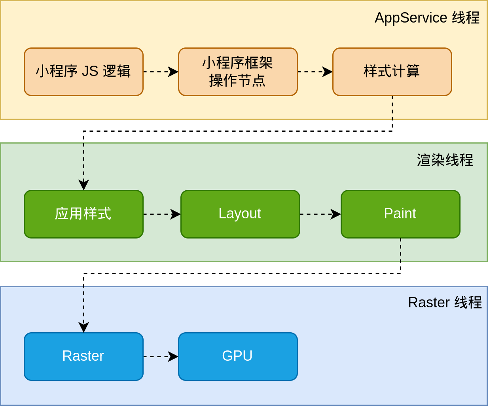

<!-- 来源: https://developers.weixin.qq.com/miniprogram/dev/framework/runtime/skyline/introduction.html -->

## 简介

小程序一直以来采用的都是 AppService 和 WebView 的双线程模型，基于 WebView 和原生控件混合渲染的方式，小程序优化扩展了 Web 的基础能力，保证了在移动端上有良好的性能和用户体验。Web 技术至今已有 30 多年历史，作为一款强大的渲染引擎，它有着良好的兼容性和丰富的特性。 尽管各大厂商在不断优化 Web 性能，但由于其繁重的历史包袱和复杂的渲染流程，使得 Web 在移动端的表现与原生应用仍有一定差距。

为了进一步优化小程序性能，提供更为接近原生的用户体验，我们在 WebView 渲染之外新增了一个渲染引擎 Skyline，其使用更精简高效的渲染管线，并带来诸多增强特性，让 Skyline 拥有更接近原生渲染的性能体验。

## 架构

当小程序基于 WebView 环境下时，WebView 的 JS 逻辑、DOM 树创建、CSS 解析、样式计算、Layout、Paint (Composite) 都发生在同一线程，在 WebView 上执行过多的 JS 逻辑可能阻塞渲染，导致界面卡顿。以此为前提，小程序同时考虑了性能与安全，采用了目前称为「双线程模型」的架构。

在 Skyline 环境下，我们尝试改变这一情况：Skyline 创建了一条渲染线程来负责 Layout, Composite 和 Paint 等渲染任务，并在 AppService 中划出一个独立的上下文，来运行之前 WebView 承担的 JS 逻辑、DOM 树创建等逻辑。这种新的架构相比原有的 WebView 架构，有以下特点：

- 界面更不容易被逻辑阻塞，进一步减少卡顿
- 无需为每个页面新建一个 JS 引擎实例（WebView），减少了内存、时间开销
- 框架可以在页面之间共享更多的资源，进一步减少运行时内存、时间开销
- 框架的代码之间无需再通过 JSBridge 进行数据交换，减少了大量通信时间开销

而与此同时，这个新的架构能很好地保持和原有架构的兼容性，基于 WebView 环境的小程序代码基本上无需任何改动即可直接在新的架构下运行。WXS 由于被移到 AppService 中，虽然逻辑本身无需改动，但询问页面信息等接口会变为异步，效率也可能有所下降；为此，我们同时推出了新的 [Worklet](./worklet.md) 机制，它比原有的 WXS 更靠近渲染流程，用以高性能地构建各种复杂的动画效果。

新的渲染流程如下图所示：

# 需要帮助

如果在使用过程中遇到任何问题，可以前往「 [Skyline 渲染引擎](https://developers.weixin.qq.com/community/minihome/mixflow/3081976366428028932) 」专区查看说明。
