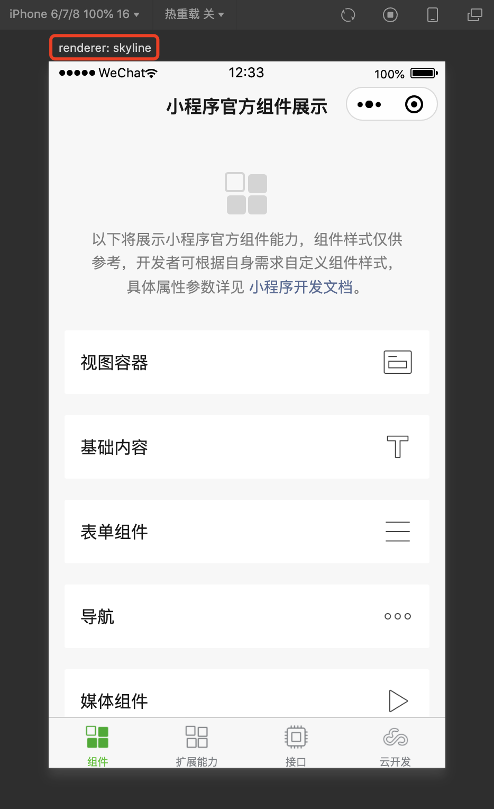
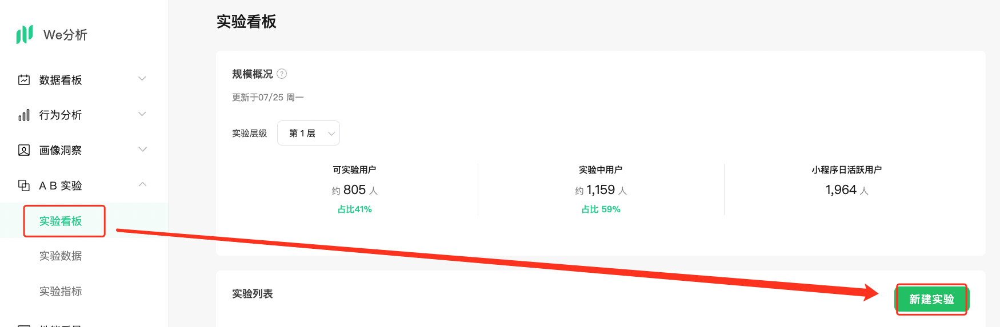
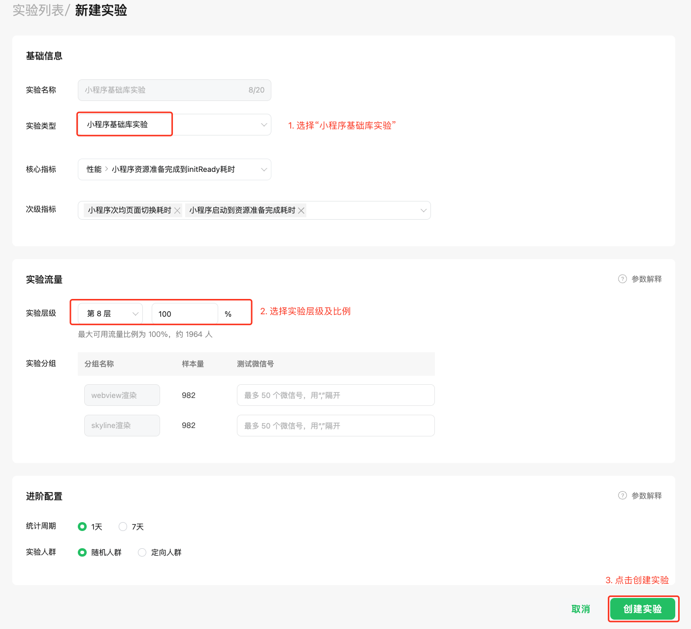
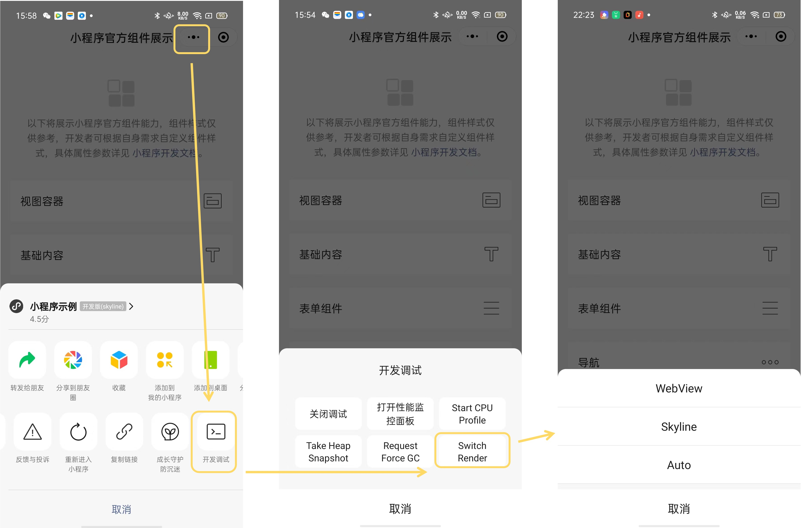
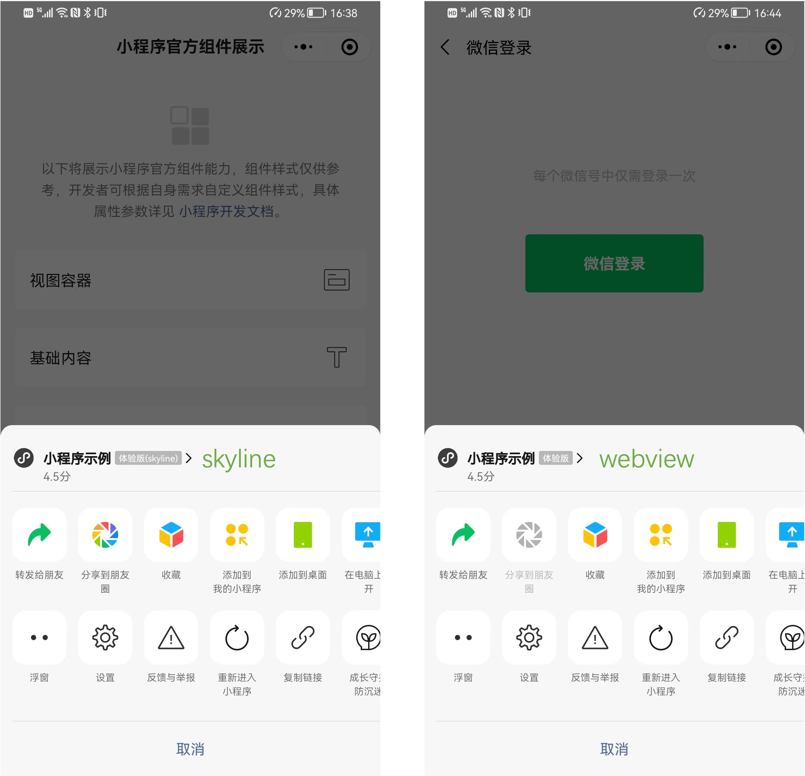

<!-- 来源: https://developers.weixin.qq.com/miniprogram/dev/framework/runtime/skyline/migration/ -->

## 环境准备

Skyline 具体支持版本如下：

- 微信安卓客户端 8.0.40 或以上版本（对应基础库为 3.0.2 或以上版本）
- 微信 iOS 客户端 8.0.40 或以上版本（对应基础库为 3.0.2 或以上版本）
- 微信 OHOS 客户端 1.0.10 或以上版本（对应基础库为 3.11.3 或以上版本）
- 开发者工具 Stable 1.06.2307260 或以上版本（建议使用 Nightly 最新版）

扫码快速确认环境是否正确


## 使用开发者工具调试

开发者工具提供了对齐移动端的 Skyline 渲染引擎，支持 WXML 调试、 WXSS 样式错误提示、新增的特性等

按以下步骤切换到 Skyline 模式：

1. 在 app.json 或 page.json 中配上 `renderer: skyline` ，并按 [下一节](#%E5%BC%80%E5%A7%8B%E8%BF%81%E7%A7%BB) 添加好配置项，或者按开发者工具的提示逐个加上配置项
2. 确保右上角 > 详情 > 本地设置里的 `开启 Skyline 渲染调试` 选项被勾选上
3. 使用 `worklet` 动画特性时，确保右上角 > 详情 > 本地设置里的 `编译 worklet 代码` 选项被勾选上 (代码包体积会少量增加)
4. 调试基础库切到 3.0.0 或以上版本

> 若切换期间出现报错、白屏等问题，可尝试重启开发者工具解决
>
> 已知问题：热重载暂未支持

此时，在模拟器左上角能够看到当前的 renderer 为 skyline，见下图



## 开始迁移

迁移到 Skyline，无需大动干弋，我们保持了上层框架的语法、接口基本不变，只需要做局部的调整，主要是加强了 WXSS 样式、内置组件及部分特性的约束，基本流程如下：

1. 在 `app.json` 加上如下必要配置项，若只想在某些页面开启，可将 `renderer` `componentFramework` 配置在页面 json 中

```json
"lazyCodeLoading": "requiredComponents",
"renderer": "skyline",
"componentFramework": "glass-easel",
"rendererOptions": {
  "skyline": {
    "defaultDisplayBlock": true,
    "defaultContentBox": true,
    "tagNameStyleIsolation": "legacy",
    "enableScrollViewAutoSize": true,
    "keyframeStyleIsolation": "legacy"
  }
}
```

1. 进行组件与 WXSS 适配，参考 [Skyline 基础组件支持与差异](../component.md) 、 [Skyline WXSS 样式支持与差异](../wxss.md)

参考 [代码模板](https://developers.weixin.qq.com/s/PnHHivmz8614)

> 按照指引适配后，可以保证在微信低版本或 PC 端 fallback 到 WebView 渲染时，也能表现正确

更多详细指引参考 [最佳实践](./best-practice.md) 和 [兼容建议](./compatibility.md)

# 在真机上预览效果

**由于 Skyline 默认接入 We 分析的 AB 实验，未配置的情况下，页面渲染仍为 WebView 引擎，可通过以下方式正确切到 Skyline 渲染**

1. 配置 We 分析 AB 实验，加上白名单，操作步骤详见 [下节](#%E9%85%8D%E7%BD%AE-we-%E5%88%86%E6%9E%90-ab-%E5%AE%9E%E9%AA%8C)
2. 关闭 We 分析 AB 实验，默认启用 Skyline 渲染，配置方式详见 [此处](./release.md#%E7%A8%B3%E5%AE%9A%E6%80%A7) 第 2 点
3. 通过快捷切换入口，强切到 Skyline 渲染，操作步骤详见 [下节](#%E5%BF%AB%E6%8D%B7%E5%88%87%E6%8D%A2%E5%85%A5%E5%8F%A3)

## 配置 We 分析 AB 实验

迁移完 Skyline 之后，为了让开发者能够针对 Skyline 逐步灰度放量，并且与 WebView 对比性能表现，我们在 [We 分析](https://wedata.weixin.qq.com/) 提供了 AB 实验机制。

因此，需要在 [We 分析](https://wedata.weixin.qq.com/) 配置之后，小程序用户才可以命中 Skyline 渲染，需要注意的是， **小程序开发者也会受 AB 实验影响** 。操作步骤如下：

首先，进入 [We 分析](https://wedata.weixin.qq.com/) ，在 AB 实验 > 实验看板，点击“新建实验”



接着，实验类型选择 `小程序基础库实验` ，然后按需选择实验层级并分配流量， **如果是小范围调试，可分配 0% 流量，并在 `Skyline 渲染` 的实验分组里填上测试微信号**



最后，创建实验即可生效。后续经 AB 实验验证稳定后，需在 We 分析上先关闭实验再选择 Skyline 全量

[点击查看更多 We 分析 AB 实验相关内容](https://developers.weixin.qq.com/miniprogram/analysis/expt/ExptMgnt.html)

## 快捷切换入口

考虑到本地调试时，配置 AB 实验会稍微繁琐一些，并且也会需要对比 WebView 的表现，我们提供了快捷切换渲染引擎的入口。

该入口只对开发版/体验版小程序生效，入口为：小程序菜单 > 开发调试 > Switch Render，会出现三个选项，说明如下：

- **Auto** ：跟随 AB 实验，即对齐小程序正式用户的表现
- **WebView** ：强制切为 WebView 渲染。 **强切后，开发版、体验版、正式版均为 WebView 渲染，需手动切到 Auto 才能恢复**
- **Skyline** ：若当前页面已迁移到 Skyline，则强制切为 Skyline 渲染。 **强切后，开发版、体验版、正式版均为 Skyline 渲染，需手动切到 Auto 才能恢复**



## 如何识别当前页面是否使用 Skyline

- 通过客户端菜单：
  打开开发版/体验版小程序，点击菜单即可查看当前页面是否使用 Skyline 渲染。 
- 通过 vConsole 按钮的右上角的红底文案识别
- vConsole 的路由日志
  路由日志中会包含页面路由的目标页面、路由类型和目标页面的渲染后端。
  一个可能的日志形如： `On app route: pages/index/index (navigateTo), renderer: skyline` ，代表通过 `navigateTo` 跳转到了 `pages/index/index` ，渲染后端为 skyline
- 通过接口判断
  页面和自定义组件示例上有属性 `renderer` ，可以用于判断当前组件的实际渲染后端，如：
  ```js
  Page({
    onLoad() {
      console.log(this.renderer)
    }
  })
  ```
