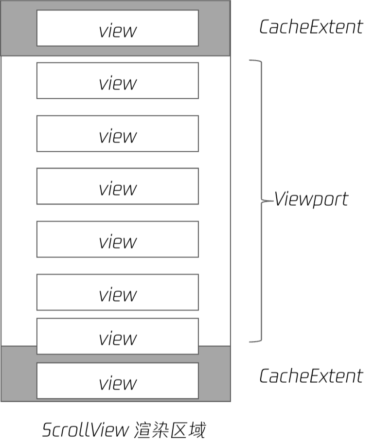
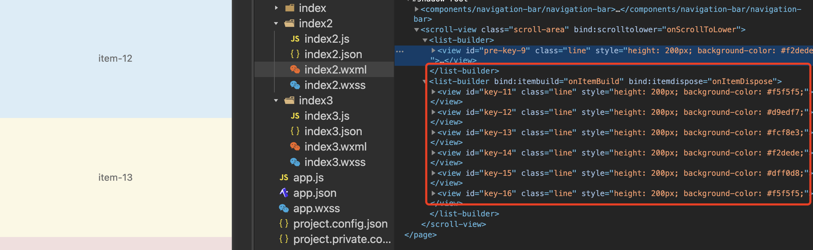
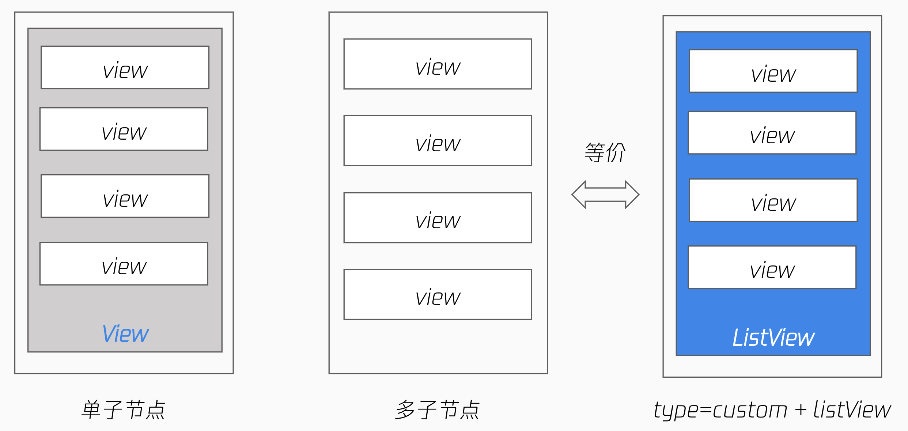
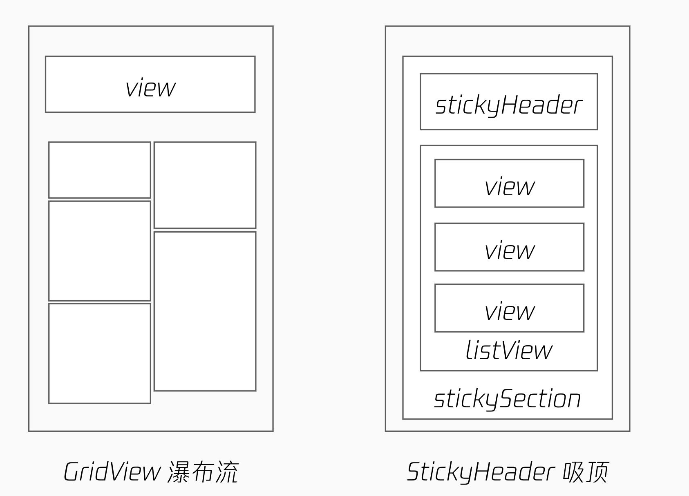
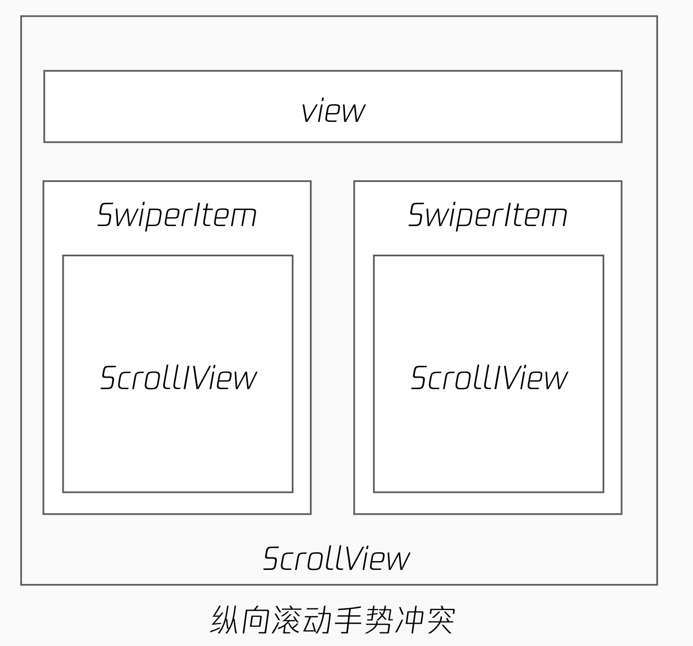

<!-- 来源: https://developers.weixin.qq.com/miniprogram/dev/framework/runtime/skyline/scroll-container.html -->

# 滚动容器及其应用场景

流畅的滚动对于提升用户体验至关重要。为了达到原生级别的滚动效果和降低开发成本， `Skyline` 扩展了旧的 `ScrollView` 组件，同时针对部分场景，新增了一些滚动容器。诸多的新能力有时会让开发者选择困难，下面对其典型应用场景进行介绍。

## 长列表

`WebView` 下的 `ScrollView` 组件，在快速滑动时容易出现白屏和渲染卡顿。对于长列表的优化，通常离不开按需渲染，即理想状态下仅渲染在屏节点，超出可视区域的节点及时进行回收。

`Skyline` 下内置了 **按需渲染** 的能力，但对于写法有一定要求，列表项需作为直接子节点，形如下面的结构。

```html
<scroll-view type="list" scroll-y>
  <view> a </view>
  <view> b </view>
  <view> c </view>
</scroll-view>
```

### 视口大小

`ScrollView` 的视口大小 = `ScrollView` 的高度 + 指定的上下缓冲区 `CacheExtent` 。

指定 `CacheExtent` 可优化滚动体验和加载速度，但会提高内存占用且影响首屏速度，可按需启用。

节点进入视口区域时开始渲染，离开视口时回收资源。资源回收的粒度为其直接子节点。当 `ScrollView` 仅有单个子节点时，为保证其渲染，所有的资源都无法回收，需全量布局和绘制所有内容，性能较差，因此才需要摊平子节点。



出于业务需要 `ScrollView` 的内容常被封装成组件，导致无法作为直接子节点。这里有一个小技巧，可将封装的组件设为虚拟的，开启 `virtualHost: true` 。真正渲染时， `virtual-comp` 节点并不存在，列表项仍是摊平的。

```html
<scroll-view type="list" scroll-y>
  <virtual-comp>
    <view> a </view>
    <view> b </view>
    <view> c </view>
  </virtual-comp>
</scroll-view>
```

### 完全的按需渲染

小程序内的按需渲染分为两个阶段。

1. 列表项按需创建其 `DOM 节点` ；
2. 列表项按需绘制上屏;

`ScrollView` 的 `list` 模式实现了按需绘制，但列表项的 `DOM 节点` 仍是全量创建的。随着节点数增多，会带来内存压力。

为此框架提供了新的 `builder` 模式，可使用 `list-builder` 、 `grid-builder` 等组件实现 `DOM 节点` 的按需创建。



上图是 `builder` 模式在开发者工具中 `wxml` 的渲染结果，仅在屏列表项会被真正创建节点，离屏后列表项会被回收，滚动时始终几个子节点。

#### 示例代码片段

[在开发者工具中预览效果](https://developers.weixin.qq.com/s/z25kA6mv7gPx)

## ScrollView 的三种模式

`ScrollView` 提供了列表 `list` 、自定义 `custom` 和 嵌套 `nested` 三种渲染模式，实际开发时如何选择呢？

### 列表模式

默认模式，实现了内置的按需渲染能力，但没有进行节点回收。当列表项比较简单，不会带来明显的内存压力时使用。

非长列表时，即使不摊平列表项也不会有明显性能问题，可使用 *单子节点* 写法。



```html
<!-- 单子节点写法，全量绘制 -->
<scroll-view type="list" scroll-y>
  <view>
    <view> a </view>
    <view> b </view>
    <view> c </view>
  </view>
</scroll-view>

<!-- 列表项作为直接子节点，有按需绘制优化 -->
<scroll-view type="list" scroll-y>
  <view> a </view>
  <view> b </view>
  <view> c </view>
</scroll-view>

<!-- 列表项作为 list-view 直接子节点，有按需绘制优化，同上 -->
<scroll-view type="custom" scroll-y>
  <list-view>
    <view> a </view>
    <view> b </view>
    <view> c </view>
  </list-view>
</scroll-view>
```

### 自定义模式

列表滚动时常会和特殊布局能力结合使用，如滚动到顶部时自动吸顶 `sticky` 效果，或瀑布流布局。

`Skyline` 内置了这部分能力，可直接使用 `sticky-header` 和 `grid-view` 组件实现。



`list-view` 组件的效果跟列表模式是等价的，如果不需要这些特殊布局能力，可任意选择写法。

需要注意的是自定义模式下， `ScrollView` 直接子节点本身并没有按需绘制优化，按需绘制的能力是 `list-view` 组件实现的， `custom` 模式组合了这些能力。

```html
<scroll-view type="custom" scroll-y>
  <sticky-section>
    <sticky-header>
      <view> h </view>
    </sticky-header>

    <!-- 非 list-view 子节点，无按需绘制优化 -->
    <view> 1</view>
    <view> 2 </view>

    <!-- 列表项作为 list-view 直接子节点，有按需绘制优化 -->
    <list-view>
      <view> a </view>
      <view> b </view>
      <view> c </view>
    </list-view>
  </sticky-section>
</scroll-view>

<scroll-view type="custom" scroll-y>
  <sticky-section>
    <sticky-header>
      <view> h </view>
    </sticky-header>

    <!-- 列表项作为 grid-view 直接子节点，有按需绘制优化 -->
    <<grid-view type="masonry">
      <view> a </view>
      <view> b </view>
      <view> c </view>
    </<grid-view>
  </sticky-section>
</scroll-view>
```

#### 示例代码片段

[在开发者工具中预览效果](https://developers.weixin.qq.com/s/hc924ymg7OMi)

### 嵌套模式

这主要是针对一类嵌套滚动场景。如下图所示， `SwiperItem` 内也有纵向滚动的 `ScrollView` 组件，当在内部 `ScrollView` 上滑动时，会与外层 `ScrollView` 产生手势冲突，导致外层的页面始终无法滚动。



- 纵轴+横轴+纵轴的嵌套组合
- 同一方向的滚动容器存在手势冲突
- 可使用手势协商解决，但过程较为烦琐

为使得内外的滚动衔接更为流畅，框架新增了 `<nested-scroll-header` 和 `nested-scroll-body` 组件结合嵌套模式使用，省去了开发者解决手势的麻烦。

```html
<scroll-view type="nested" scroll-y>
  <nested-scroll-header>
    <view></view>
  </nested-scroll-header>
  <nested-scroll-body>
    <swiper>
      <swiper-item>
        <scroll-view
          type="list"
          associative-container="nested-scroll-view"
        >
          <view>a</view>
          <view>b</view>
        </scroll-view>
      </swiper-item>
      <swiper-item>...</swiper-item>
      <swiper-item>...</swiper-item>
    </swiper>
  </nested-scroll-body>
</scroll-view>
```

#### 示例代码片段

[在开发者工具中预览效果](https://developers.weixin.qq.com/s/1IaEOym777Mx)

## 可拖拽容器

页面内的半屏可拖拽容器是很常见的一种交互，用户可通过滚动扩大列表范围。以往开发者可通过手势协商的能力来实现，但较为繁琐。

框架提供了 `draggable-sheet` 组件，封装了这一能力，包括

- 隐藏滚动条
- 滚动回弹效果
- 滚动到指定位置（ `snap` 到关键点）
- 滚动帧回调（实现滚动驱动动画）

```html
<draggable-sheet
  class="sheet"
  initial-child-size="0.5"
  min-child-size="0.2"
  max-child-size="0.8"
  snap="{{true}}"
  snap-sizes="{{[0.4, 0.6]}}"
  worklet:onsizeupdate="onSizeUpdate"
>
  <scroll-view
    scroll-y="{{true}}"
    type="list"
    associative-container="draggable-sheet"
    bounces="{{true}}"
  />
</draggable-sheet>
```
