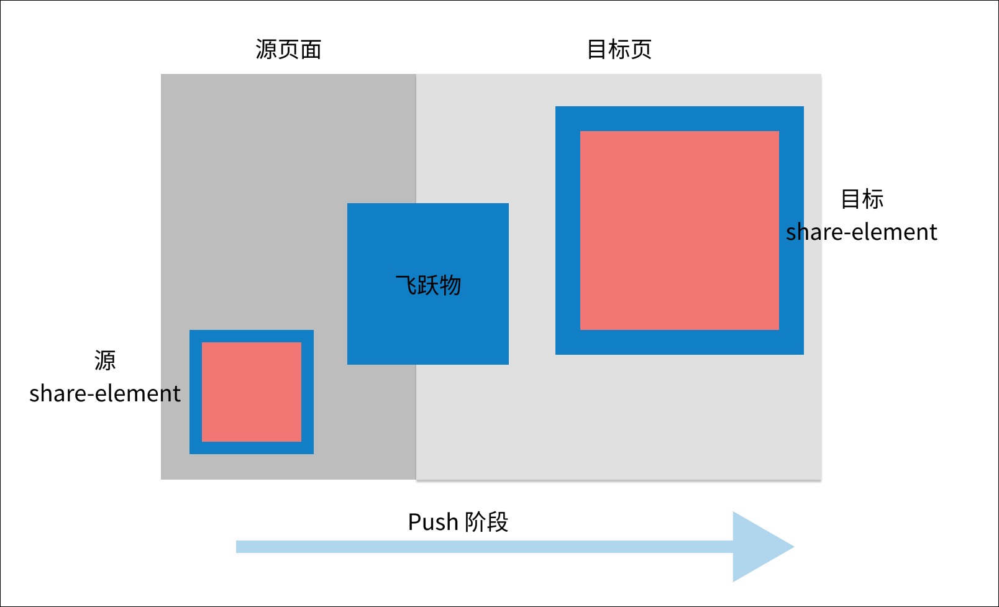
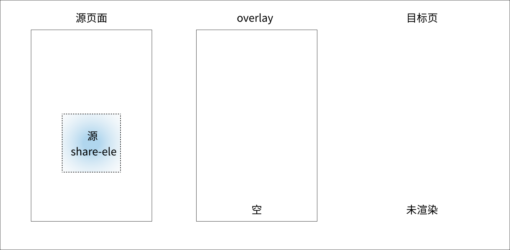
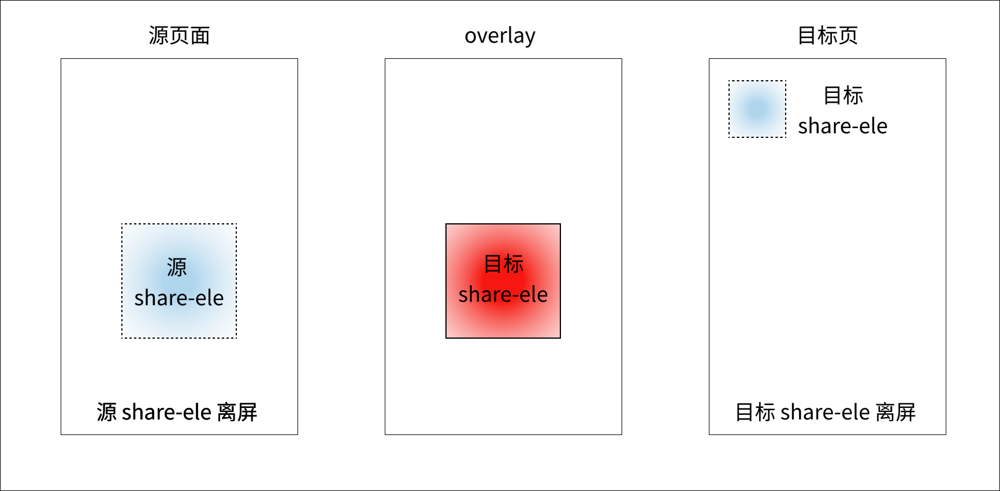
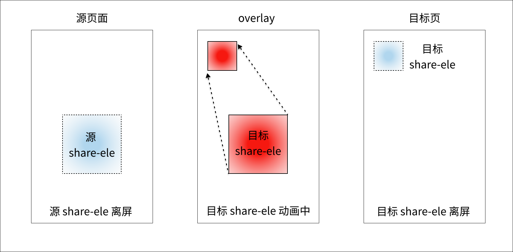
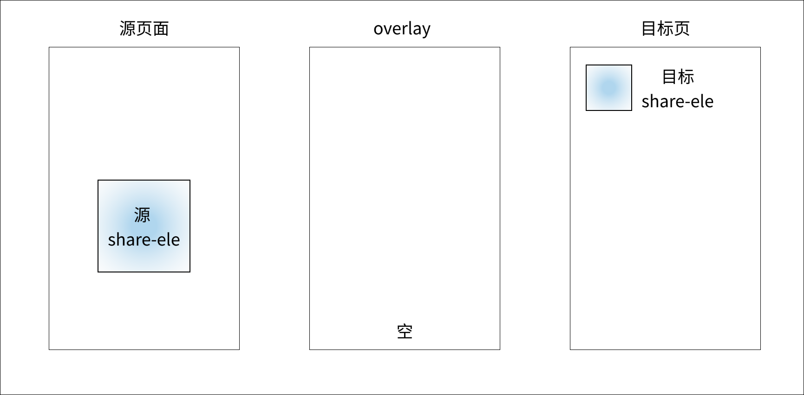
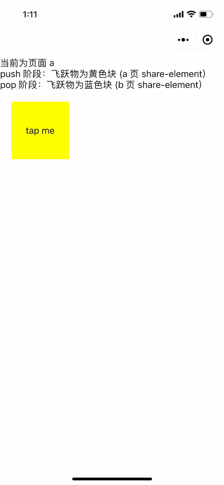
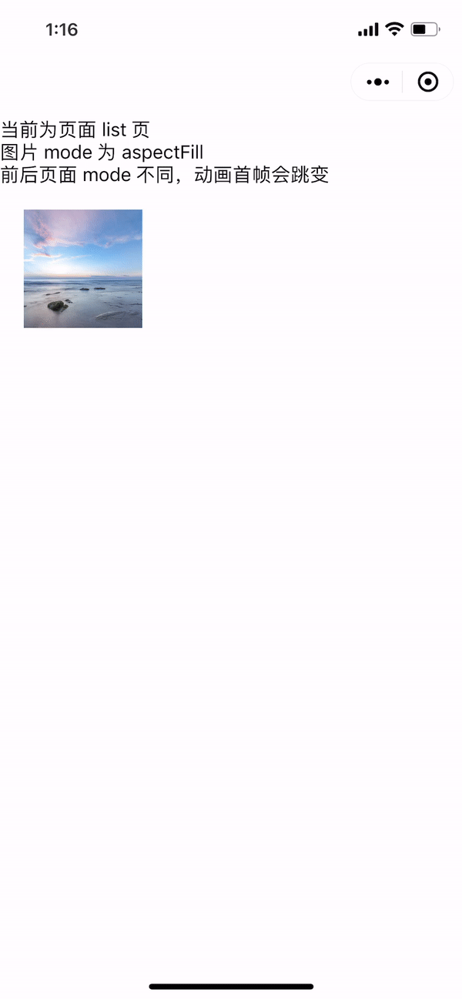
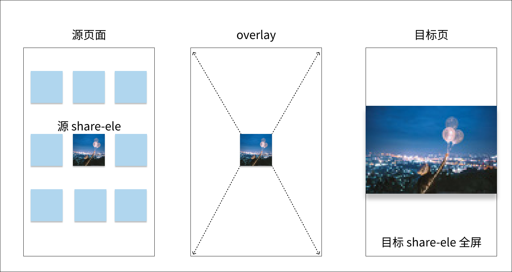
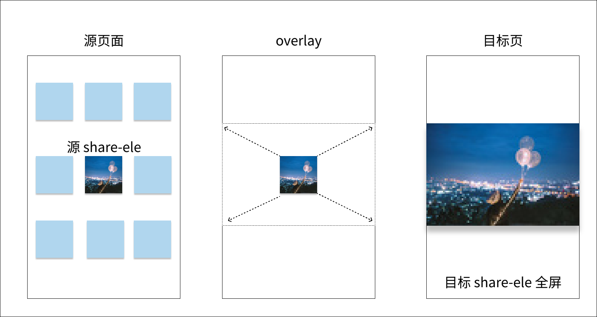

<!-- 来源: https://developers.weixin.qq.com/miniprogram/dev/framework/runtime/skyline/share-element -->

# 共享元素动画

原生 `App` 中我们常见到这样的交互，如从商品列表页进入详情页过程中，商品图片在页面间飞跃，使得过渡效果更加平滑，另一个案例是朋友圈的图片预览放大功能。在 `Skyline` 渲染模式下，我们称其为共享元素动画，可通过 `share-element` 组件来实现。

在连续的 `Skyline` 页跳转时，页面间 `key` 相同的 `share-element` 节点将产生飞跃特效，开发者可自定义插值方式和动画曲线。通常作用于图片，为保证动画效果，前后页面的 `share-element` 子节点结构应该尽量保持一致。

## 立即体验

扫码打开小程序示例，交互动画 - 基础组件 - 共享元素动画 即可体验。


## 使用方法

<table><thead><tr><th>属性</th> <th>类型</th> <th>默认值</th> <th>必填</th> <th>说明</th> <th>最低版本</th></tr></thead> <tbody><tr><td>key</td> <td>string</td> <td></td> <td>是</td> <td>映射标记，页面内唯一</td> <td><a href="../../compatibility.html">2.29.2</a></td></tr> <tr><td>transition-on-gesture</td> <td>boolean</td> <td>false</td> <td>否</td> <td>手势返回时是否进行动画</td> <td><a href="../../compatibility.html">2.29.2</a></td></tr> <tr><td>shuttle-on-push</td> <td>string</td> <td><code>to</code></td> <td>否</td> <td>指定 <code>push</code> 阶段的飞跃物</td> <td><a href="../../compatibility.html">2.30.2</a></td></tr> <tr><td>shuttle-on-pop</td> <td>string</td> <td><code>to</code></td> <td>否</td> <td>指定 <code>pop</code> 阶段的飞跃物</td> <td><a href="../../compatibility.html">2.30.2</a></td></tr> <tr><td>rect-tween-type</td> <td>string</td> <td><code>materialRectArc</code></td> <td>否</td> <td>动画插值曲线</td> <td><a href="../../compatibility.html">2.30.2</a></td></tr> <tr><td>on-frame</td> <td>worklet callback</td> <td></td> <td>否</td> <td>动画帧回调</td> <td><a href="../../compatibility.html">2.30.2</a></td></tr></tbody></table>

假定 `A` 页和 `B` 页存在对应的 `share-element` 组件

1. `push` 阶段：通过 `wx.navigateTo` 由 `A` 进入 `B` ，称 `A` 为源页面（ `from` 页)， `B` 为目标页（ `to` 页)
2. `pop` 阶段：通过 `wx.navigateBack` 由 `B` 返回 `A` ，此时 `B` 为源页面 ( `from` 页)， `A` 为目标页（ `to` 页）

### 指定飞跃物

开发者可以指定选定源页面或目标页的 `share-element` 作为飞跃物。

由于涉及两个页面的组件，这里以目标页 `share-element` 组件指定的属性为准

1. `push 阶段` ：默认采用 `B` 页的 `share-element` 组件进行飞跃，设置属性 `shuttle-on-push=from` 可切换成 `A` 页的。
2. `pop 阶段` ：默认采用 `A` 页的 `share-element` 组件，设置属性 `shuttle-on-pop=from` 可切换成 `B` 页的。

**需注意的是 `on-frame` 回调总是在指定为飞跃物的 `share-element` 组件上触发。**



### 动画帧回调

共享元素动画就是以源页面 `share-element` 所在矩形框为起点，目标页 `share-element` 所在矩形框为终点，进行插值计算的过程，动画时长与页面路由时间一致。

```js
enum FlightDirection {
  push = 0,
  pop = 1
}

interface Rect {
  top: number,
  right: number,
  bottom: number,
  left: number,
  width: number,
  height: number
}

interface ShareElementFrameData {
  // 动画进度，0～1
  progress: number,
  // 动画方向，push | pop
  direction: FlightDirection
  // 源页面 share-element 容器尺寸
  begin: Rect,
  // 目标页 share-element 容器尺寸
  end: Rect,
  // 由框架计算的当前帧飞跃物容器尺寸
  current: Rect,
}

type ShareElementOnFrameCallback = (data: ShareElementFrameData) => undefined | Rect
```

开发者可通过 `on-frame` 回调来自定义插值方式。 `ShareElementFrameData` 中包含了始末位置，以及框架按照指定的动画曲线 `rect-tween-type` 和当前进度 `progress` 计算的 `current` 位置。

**默认插值方式为对 `Rect` 的 `LTWH` 分别进行线性插值** 。当 `on-frame` 返回 `undefined` 时，当前帧飞跃物的实时位置由 `current` 决定，开发者可返回按其他方式计算的 `Rect` 对象进行改写。

```js
const lerp = (begin: number, end: number, t: number) => {
  'worklet'
  return begin + (end - begin) * t
}

const lerpRect = (begin: Rect, end: Rect, t: number) => {
  'worklet'
  const left = lerp(begin.left, end.left, t);
  const top = lerp(begin.top, end.top, t);
  const width = lerp(begin.width, end.width, t);
  const height = lerp(begin.height, end.height, t);
  const right = left + width
  const bottom = top + height

  return {
    left,
    top,
    right,
    bottom,
    width,
    height
  }
}
```

### 动画插值曲线

除了可以自定义插值方式外，还可以自定义动画曲线，默认的动画曲线为 [cubic-bezier(0.4, 0.0, 0.2, 1.0)](https://cubic-bezier.com/#.4,0,.2,1) ，记作 `fastOutSlowIn` 。

当 `rect-tween-type` 设置为如下类型时， **默认的插值方式为对 `Rect` 的 `LTWH` 分别进行线性插值** 。

- [linear](https://cubic-bezier.com/#0,0,1,1)
- [elasticIn](https://easings.net/#easeInElastic)
- [elasticOut](https://easings.net/#easeOutElastic)
- [elasticInOut](https://easings.net/#easeInOutElastic)
- [bounceIn](https://easings.net/#easeInBounce)
- [bounceOut](https://easings.net/#easeOutBounce)
- [bounceInOut](https://easings.net/#easeInOutBounce)
- [cubic-bezier(x1, y1, x2, y2)](https://cubic-bezier.com/#.17,.67,.83,.67)

此外， `rect-tween-type` 还支持两类特殊的枚举值，对于这两个值，动画曲线仍是 `fastOutSlowIn` ，但插值方式有所不同，运动轨迹为弧线。

- materialRectArc：矩形对角动画
- materialRectCenterArc： [径向动画](https://web.archive.org/web/20180223140424/https://material.io/guidelines/motion/transforming-material.html#)

## 工作原理

下面以 `push` 过程为例介绍共享元素动画的各个阶段。

**注意：实际上动画过程中 `share-element` 节点自身不进行动画，移动的是其子节点。**

### 动画开始前

目标页还未渲染，在所有页面之上创建 `overlay` 层，飞跃物将在 `overlay` 层进行动画。



### 动画开始时刻

调用 `wx.navigateTo` 推入新页面时动画触发， `progress = 0` 时刻发生如下动作

1. 目标页首帧渲染，框架计算出目标 `share-element` 节点位置大小。
2. 源 `share-element` 节点离屏（不显示）。
3. 将目标 `share-element` 节点移至 `overlay` 层，作为飞跃物，位置大小同源 `share-element` 节点。



### 动画过程中

根据指定的插值方式和动画曲线，目标 `share-element` 在 `overlay` 层进行动画，从起点向终点位置过渡。



### 动画结束时刻

`progress = 1` 时刻，将目标 `share-element` 从 `overlay` 层移动到目标页面，出现在终点位置。



## 注意事项

- `Skyline` 版本 `share-element` 无需结合 `page-container` 使用
- 给 `share-element` 组件设置 `padding` 、 `justify-content` 等影响子节点布局的样式将无法生效
- 可结合页面生命周期 [onRouteDone](https://developers.weixin.qq.com/miniprogram/dev/reference/api/Page.html#onRouteDone) 在路由完成时刻做一些状态恢复工作

## Q & A

### Q1: 设置了相同的 key，但没有看到飞跃动画

共享元素动画需保证下一个页面首帧即创建好 `share-element` 节点，并设置了 key，用于计算目标位置。

如果是通过 `setData` 设置的，可能会错过首帧。针对这种情况，可以 [使用 Component 构造器构造下一个页面](../../../custom-component/component.md) ，只要在组件 `attached` 生命周期前（含）通过 `setData` 设置上去，就会在首帧渲染。

### Q2: 飞跃过程中，子节点不会跟随放大/缩小

动画过程中，飞跃物容器会不断变化大小和位置，如果子节点想自适应跟随变化，就需要通过百分比布局，而非写死固定宽高。

```html
<!-- 由于子 view 固定大小，飞跃过程中仅位置发生变化，大小不变 -->
<share-element key="portrait">
  <view style="width: 50px; height: 50px;"></view>
</share-element>

<!-- 由于子 view 设置跟父节点一样大，飞跃过程中位置、大小均会改变 -->
<share-element key="portrait" style="width: 50px; height: 50px;">
  <view style="width: 100%; height: 100%;"></view>
</share-element>
```

### Q3: 多个 share-element 一起动画，覆盖层级问题

飞跃物在 `overlay` 层进行动画，层级在所有页面之上。飞跃物间按其在页面组件树的定义顺序（ `DFS` 遍历），越往后的层级越高。

### Q4: 自定义路由手势返回时，未看到返回动画

首先须给组件设置 `transition-on-gesture=true` 属性。同时自定义路由手势返回时，只有调用 `startUserGesture` 接口后才会触发共享元素动画。

### Q5: 共享元素动画与路由动画关系

共享元素跟随页面路由动画一同开始和结束。如果设置自定义路由的页面进入曲线和 `rect-tween-type` 一致，则 `onFrame` 返回的 `progress` 值也与 `PrimaryAnimation.value` 的值始终保持一致。

## 示例用法

### 基础用法

商品列表页

```html
<block wx:for="{{list}}" wx:key="id">
  <share-element key="box" transition-on-gesture>
    <image
    src="{{src}}"
    mode="aspectFill"
    />
  </share-element>
</block>
```

商品详情页

```html
<share-element key="box" transition-on-gesture>
  <image
  src="{{src}}"
  mode="aspectFit"
  />
</share-element>
```

[示例代码片段-基础](https://developers.weixin.qq.com/s/t584gymu7VMM)

可在开发者工具中体验效果，这里需要注意图片 `mode` 不同带来的影响。





### 进阶用法

以仿朋友圈图片预览放大功能为例，介绍通过帧回调解决图片 `mode` 不同带来的跳变问题。相关功能已封装成 `aniamted-image` 组件，开发者可在此基础上进行修改。

这里简要介绍核心思路：

1. 始终以 `list` 页 `share-element` 为飞跃物
2. 通过 `on-frame` 改写飞跃物容器的位置大小，使其充满 `overlay` 层
3. 以图片实际占据空间确定始末容器的位置大小，而不是 `share-element` 节点占据的空间
4. 飞跃过程中使用缩略图，高清图下载完成后进行替换

**默认计算方式，以 `share-element` 节点占据空间确定始末位置，会产生跳变。** 

**以图片实际占据空间确定始末位置，始终采用单一 `mode` 效果，不会产生跳变。** 

使用最新 `nightly` 工具预览，移动端安卓 8.0.33 版本。

[示例代码片段-进阶](https://developers.weixin.qq.com/s/vZ8Ydymg7ZMs)


