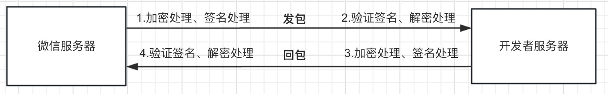
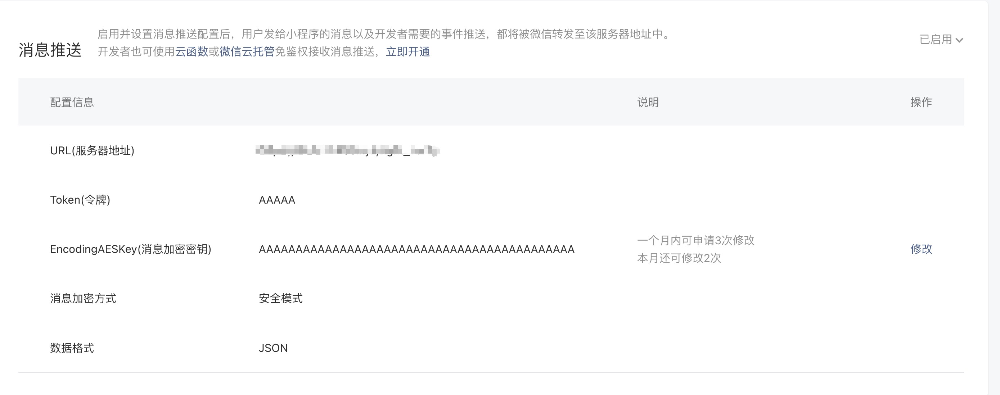
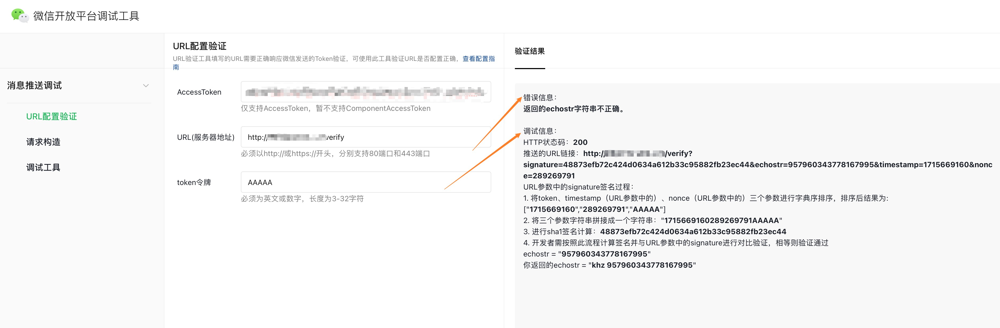
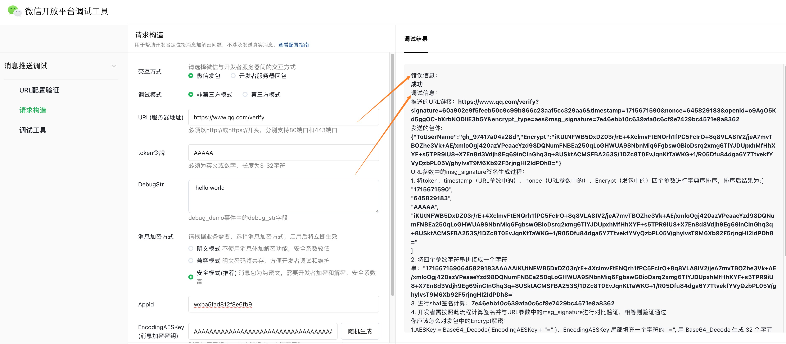
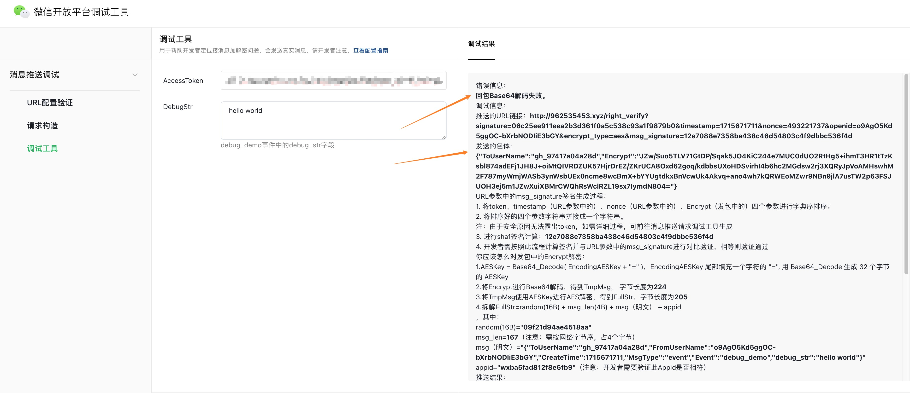
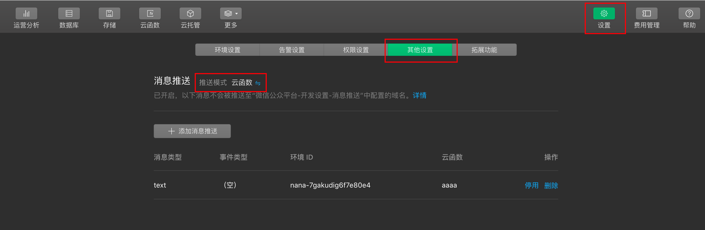
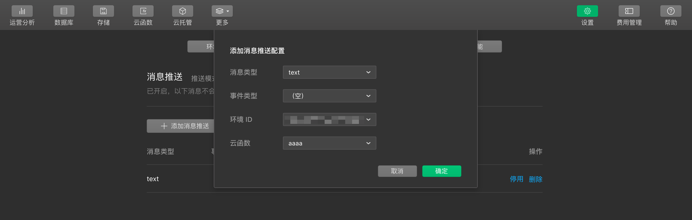
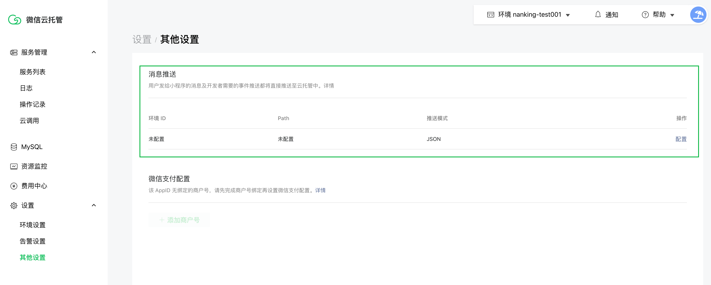

<!-- 来源: https://developers.weixin.qq.com/miniprogram/dev/framework/server-ability/message-push.html -->

# 消息推送

消息推送是开放平台推出的一种主动推送服务，基于该推送服务，开发者及时获取开放平台相关信息，无需调用API。 目前提供三种方式接入：

- [开发者服务器接收消息推送](#%E5%BC%80%E5%8F%91%E8%80%85%E6%9C%8D%E5%8A%A1%E5%99%A8%E6%8E%A5%E6%94%B6%E6%B6%88%E6%81%AF%E6%8E%A8%E9%80%81)
- [云函数接收消息推送](#%E4%BA%91%E5%87%BD%E6%95%B0%E6%8E%A5%E6%94%B6%E6%B6%88%E6%81%AF%E6%8E%A8%E9%80%81)
- [微信云托管服务接收消息推送](#%E5%BE%AE%E4%BF%A1%E4%BA%91%E6%89%98%E7%AE%A1%E6%8E%A5%E6%94%B6%E6%B6%88%E6%81%AF%E6%8E%A8%E9%80%81)

## 开发者服务器接收消息推送

总数据链路如图所示： 

### 消息推送服务器配置

消息推送服务于小程序、公众号、小游戏、视频号小店、第三方平台，这里介绍小程序平台的配置。

#### 填写相关信息

登陆 [小程序管理后台](https://mp.weixin.qq.com/) ，在「开发」-「开发管理」-「消息推送配置」中，需填写以下信息：

1. URL服务器地址：开发者用来接收微信消息和事件的接口 URL，必须以 http:// 或 https:// 开头，分别支持 80 端口和 443 端口。
2. Token令牌：用于签名处理，下文会介绍相关流程。
3. EncodingAESKey：将用作消息体加解密密钥。
4. 消息加解密方式：
    - 明文模式：不使用消息加解密，明文发送，安全系数较低，不建议使用。
    - 兼容模式：明文、密文共存，不建议使用。
    - 安全模式：使用消息加解密，纯密文，安全系数高，强烈推荐使用。
5. 数据格式：消息体的格式，可选XML或JSON。 

#### 发起验证

点击“提交”后，微信服务器会对开发者服务器发起验证，请在提交前按以下方式开发： 微信服务器将发送GET请求到填写的服务器地址URL上， GET请求携带参数如下表所示：

<table><thead><tr><th>参数</th> <th>描述</th></tr></thead> <tbody><tr><td>signature</td> <td>签名</td></tr> <tr><td>timestamp</td> <td>时间戳</td></tr> <tr><td>nonce</td> <td>随机数</td></tr> <tr><td>echostr</td> <td>随机字符串</td></tr></tbody></table>

其中，signature签名的生成方式是：

1. 将Token、timestamp、nonce三个参数进行字典序排序。
2. 将三个参数字符串拼接成一个字符串进行sha1计算签名，即可获得signature。 开发者需要校验signature是否正确，以判断请求是否来自微信服务器，验签通过后，请原样返回echostr字符串。

举例：假设填写的URL="https://www.qq.com/revice"， Token="AAAAA"。

1. 推送的URL链接：https://www.qq.com/revice?signature=f464b24fc39322e44b38aa78f5edd27bd1441696&echostr=4375120948345356249&timestamp=1714036504&nonce=1514711492
2. 将token、timestamp、nonce三个参数进行字典序排序，排序后结果为:["1514711492","1714036504","AAAAA"]。
3. 将三个参数字符串拼接成一个字符串："15147114921714036504AAAAA"
4. 进行sha1计算签名：f464b24fc39322e44b38aa78f5edd27bd1441696
5. 与URL链接中的signature参数进行对比，相等说明请求来自微信服务器，合法。
6. 构造回包返回微信，回包消息体内容为URL链接中的echostr参数4375120948345356249。

为了便于开发者调试，我们提供了 [URL验证工具](https://developers.weixin.qq.com/apiExplorer?type=messagePush) 供开发者使用。  开发者需填写 [AccessToken](https://developers.weixin.qq.com/miniprogram/dev/OpenApiDoc/mp-access-token/getAccessToken.html) 、URL地址、Token，点击“检查参数并发起验证”后，调试工具会发送GET请求到URL所指的服务器，并返回相关调试信息。

### 接收消息推送

当特定消息或事件触发时，微信服务器会将消息（或事件）的数据包以 POST 请求发送到开发者配置的 URL，下面以“debug\_demo”事件为例，详细介绍整个过程：

#### 消息解密方式为明文模式

1. 假设URL配置为https://www.qq.com/revice， 数据格式为JSON，Token="AAAAA"。
2. 推送的URL链接：https://www.qq.com/recive?signature=899cf89e464efb63f54ddac96b0a0a235f53aa78&timestamp=1714037059&nonce=486452656
3. 推送的包体：

```json
{
    "ToUserName": "gh_97417a04a28d",
    "FromUserName": "o9AgO5Kd5ggOC-bXrbNODIiE3bGY",
    "CreateTime": 1714037059,
    "MsgType": "event",
    "Event": "debug_demo",
    "debug_str": "hello world"
}
```

1. 校验signature签名是否正确，以判断请求是否来自微信服务器。
    1. 将token、timestamp（URL参数中的）、nonce（URL参数中的）三个参数进行字典序排序，排序后结果为:["1714037059","486452656","AAAAA"]
    2. 将三个参数字符串拼接成一个字符串："1714037059486452656AAAAA"
    3. 进行sha1计算签名：899cf89e464efb63f54ddac96b0a0a235f53aa78
    4. 与URL链接中的signature参数进行对比，相等说明请求来自微信服务器，合法。
2. 回包给微信，具体回包内容取决于特定接口文档要求，如无特定要求，回复空串或者success即可。

#### 消息解密方式为安全模式

1. 假设URL配置为https://www.qq.com/revice， 数据格式为JSON，Token="AAAAA"，EncodingAESKey="AAAAAAAAAAAAAAAAAAAAAAAAAAAAAAAAAAAAAAAAAAA"，小程序Appid="wxba5fad812f8e6fb9"。
2. 推送的URL链接：：https://www.qq.com/recive?signature=6c5c811b55cc85e0e1b54100749188c20beb3f5d&timestamp=1714112445&nonce=415670741&openid=o9AgO5Kd5ggOC-bXrbNODIiE3bGY&encrypt\_type=aes&msg\_signature=046e02f8204d34f8ba5fa3b1db94908f3df2e9b3
3. 推送的包体：

```json
{
    "ToUserName": "gh_97417a04a28d",
    "Encrypt": "+qdx1OKCy+5JPCBFWw70tm0fJGb2Jmeia4FCB7kao+/Q5c/ohsOzQHi8khUOb05JCpj0JB4RvQMkUyus8TPxLKJGQqcvZqzDpVzazhZv6JsXUnnR8XGT740XgXZUXQ7vJVnAG+tE8NUd4yFyjPy7GgiaviNrlCTj+l5kdfMuFUPpRSrfMZuMcp3Fn2Pede2IuQrKEYwKSqFIZoNqJ4M8EajAsjLY2km32IIjdf8YL/P50F7mStwntrA2cPDrM1kb6mOcfBgRtWygb3VIYnSeOBrebufAlr7F9mFUPAJGj04="
}
```

1. 校验msg\_signature签名是否正确，以判断请求是否来自微信服务器。注意：不要使用signature验证！
    - 将token、timestamp（URL参数中的）、nonce（URL参数中的）、Encrypt（包体内的字段）四个参数进行字典序排序，排序后结果为: ["+qdx1OKCy+5JPCBFWw70tm0fJGb2Jmeia4FCB7kao+/Q5c/ohsOzQHi8khUOb05JCpj0JB4RvQMkUyus8TPxLKJGQqcvZqzDpVzazhZv6JsXUnnR8XGT740XgXZUXQ7vJVnAG+tE8NUd4yFyjPy7GgiaviNrlCTj+l5kdfMuFUPpRSrfMZuMcp3Fn2Pede2IuQrKEYwKSqFIZoNqJ4M8EajAsjLY2km32IIjdf8YL/P50F7mStwntrA2cPDrM1kb6mOcfBgRtWygb3VIYnSeOBrebufAlr7F9mFUPAJGj04=", "1714112445", "415670741", "AAAAA"]。
    - 将四个参数字符串拼接成一个字符串，然后进行sha1计算签名：046e02f8204d34f8ba5fa3b1db94908f3df2e9b3
    - 与URL参数中的msg\_signature参数进行对比，相等说明请求来自微信服务器，合法。
2. 解密消息体"Encrypt"密文。
    1. AESKey = Base64\_Decode( EncodingAESKey + "=" )，EncodingAESKey 尾部填充一个字符的 "=", 用 Base64\_Decode 生成 32 个字节的 AESKey；
    2. 将Encrypt密文进行Base64解码，得到TmpMsg， 字节长度为224
    3. 将TmpMsg使用AESKey进行AES解密，得到FullStr，字节长度为205。AES 采用 CBC 模式，秘钥长度为 32 个字节（256 位），数据采用 PKCS#7 填充； PKCS#7：K 为秘钥字节数（采用 32），Buf 为待加密的内容，N 为其字节数。Buf 需要被填充为 K 的整数倍。在 Buf 的尾部填充(K - N%K)个字节，每个字节的内容 是(K - N%K)。微信团队提供了多种语言的示例代码（包括 PHP、Java、C++、Python、C#），请开发者尽量使用示例代码，仔细阅读技术文档、示例代码及其注释后，再进行编码调试。 [示例下载](https://wximg.gtimg.com/shake_tv/mpwiki/cryptoDemo.zip)
    4. FullStr=random(16B) + msg\_len(4B) + msg + appid，其中：
          - random(16B)为 16 字节的随机字符串；
          - msg\_len 为 msg 长度，占 4 个字节(网络字节序)；
          - msg为解密后的明文；
          - appid为小程序Appid，开发者需验证此Appid是否与自身小程序相符。
    5. 在此示例中：
          - random(16B)="a8eedb185eb2fecf"
          - msg\_len=167（注意：需按网络字节序，占4个字节）
          - msg="{"ToUserName":"gh\_97417a04a28d","FromUserName":"o9AgO5Kd5ggOC-bXrbNODIiE3bGY","CreateTime":1714112445,"MsgType":"event","Event":"debug\_demo","debug\_str":"hello world"}"
          - appid="wxba5fad812f8e6fb9"
3. 回包给微信服务器，首先需确定回包包体的明文内容，具体取决于特定接口文档要求，如无特定要求，回复空串或者success（无需加密）即可，其他回包内容需加密处理。这里假设回包包体的明文内容为"{"demo\_resp":"good luck"}"，数据格式为JSON，下面介绍如何对回包进行加密：
4. 回包格式如下，具体取决于你配置的数据格式（JSON或XML）,其中：
    - Encrypt：加密后的内容；
    - MsgSignature：签名，微信服务器会验证签名；
    - TimeStamp：时间戳；
    - Nonce：随机数
  ```json
  {
      "Encrypt": "${msg_encrypt}$",
      "MsgSignature": "${msg_signature}$",
      "TimeStamp": ${timestamp}$,
      "Nonce": ${nonce}$
  }
  ```
  ```xml
  <xml>
      <Encrypt><![CDATA[${msg_encrypt}$]]></Encrypt>
      <MsgSignature><![CDATA[${msg_signature}$]]></MsgSignature>
      <TimeStamp>${timestamp}$</TimeStamp>
      <Nonce><![CDATA[${nonce}$]]></Nonce>
  </xml>
  ```
5. Encrypt的生成方法：
    1. AESKey = Base64\_Decode( EncodingAESKey + "=" )，EncodingAESKey 尾部填充一个字符的 "=", 用 Base64\_Decode 生成 32 个字节的 AESKey；
    2. 构造FullStr=random(16B) + msg\_len(4B) + msg + appid，其中
          - random(16B)为 16 字节的随机字符串；
          - msg\_len 为 msg 长度，占 4 个字节(网络字节序)；
          - msg为明文；
          - appid为小程序Appid。
    3. 在此示例中：
          - random(16B)="707722b803182950"
          - msg\_len=25（注意：需按网络字节序，占4个字节）
          - msg="{"demo\_resp":"good luck"}"
          - appid="wxba5fad812f8e6fb9"
          - FullStr的字节大小为63
    4. 将FullStr用AESKey进行加密，得到TmpMsg，字节大小为64。AES 采用 CBC 模式，秘钥长度为 32 个字节（256 位），数据采用 PKCS#7 填充； PKCS#7：K 为秘钥字节数（采用 32），Buf 为待加密的内容，N 为其字节数。Buf 需要被填充为 K 的整数倍。在 Buf 的尾部填充(K - N%K)个字节，每个字节的内容 是(K - N%K)。微信团队提供了多种语言的示例代码（包括 PHP、Java、C++、Python、C#），请开发者尽量使用示例代码，仔细阅读技术文档、示例代码及其注释后，再进行编码调试。 [示例下载](https://wximg.gtimg.com/shake_tv/mpwiki/cryptoDemo.zip)
    5. 对TmpMsg进行Base64编码，得到Encrypt="ELGduP2YcVatjqIS+eZbp80MNLoAUWvzzyJxgGzxZO/5sAvd070Bs6qrLARC9nVHm48Y4hyRbtzve1L32tmxSQ=="。
6. TimeStamp由开发者生成，使用当前时间戳即可，示例使用1713424427。
7. Nonce回填URL参数中的nonce参数即可，示例使用415670741。
8. MsgSignature的生成方法：
    1. 将token、TimeStamp（回包中的）、Nonce（回包中的）、Encrypt（回包中的）四个参数进行字典序排序，排序后结果为: ["1713424427", "415670741", "AAAAA", "ELGduP2YcVatjqIS+eZbp80MNLoAUWvzzyJxgGzxZO/5sAvd070Bs6qrLARC9nVHm48Y4hyRbtzve1L32tmxSQ=="]
    2. 将四个参数字符串拼接成一个字符串，并进行sha1计算签名：1b9339964ed2e271e7c7b6ff2b0ef902fc94dea1
9. 最终回包为：

```json
{
    "Encrypt": "ELGduP2YcVatjqIS+eZbp80MNLoAUWvzzyJxgGzxZO/5sAvd070Bs6qrLARC9nVHm48Y4hyRbtzve1L32tmxSQ==",
    "MsgSignature": "1b9339964ed2e271e7c7b6ff2b0ef902fc94dea1",
    "TimeStamp": 1713424427,
    "Nonce": "415670741"
}
```

为了便于开发者调试，我们提供了相关的调试工具（ [请求构造](https://developers.weixin.qq.com/apiExplorer?type=messagePush) 、 [调试工具](https://developers.weixin.qq.com/apiExplorer?type=messagePush) ）供开发者使用。

- “请求构造”允许开发者填写相关参数后，生成debug\_demo事件发包或回包的相关调试信息，供开发者使用。 
- “调试工具”允许开发者填写 [AccessToken](https://developers.weixin.qq.com/miniprogram/dev/OpenApiDoc/mp-access-token/getAccessToken.html) 、Body后，微信服务器会拉取你在小程序后台配置的消息推送配置，实际推送一条debug\_demo事件供开发者调试。 

## 云函数接收消息推送

> 需开发者工具版本至少 `1.02.1906252`

开通了 [云开发](https://developers.weixin.qq.com/miniprogram/dev/wxcloud/basis/getting-started.html) 的小程序可以使用云函数接收消息推送，目前仅支持客服消息推送。

接入步骤如下：

1. 云开发控制台中填写配置并上传
2. 云函数中处理消息

### 第一步：开发者工具云开发控制台中增加配置

前往路径“「云开发」-「设置」-「其他设置」-「消息推送」”，选择推送模式为云函数；  添加消息推送配置。消息类型对应收包的 `MsgType` ，事件类型对应收包的 `Event` ，同一个 `<消息类型, 事件类型>` 二元组只能推到一个环境的一个云函数。例如客服消息文本消息对应的就是消息类型为 `text` ，事件类型为空。具体值请查看各个消息的消息格式。  多个消息类型、事件类型多次添加消息推送配置即可。

**注意** ：如在云函数中配置了某个类型的消息，该类型消息将不再推送至“微信公众平台-开发设置-消息推送”中配置的域名中。

### 第二步：云函数中处理消息

云函数被触发时，其 `event` 参数即是接口所定义的 JSON 结构的对象（统一 `JSON` 格式，不支持 `XML` 格式）。

以客服消息为例，接收到客服消息推送时， `event` 结构如下：

```json
{
  "FromUserName": "ohl4L0Rnhq7vmmbT_DaNQa4ePaz0",
  "ToUserName": "wx3d289323f5900f8e",
  "Content": "测试",
  "CreateTime": 1555684067,
  "MsgId": "49d72d67b16d115e7935ac386f2f0fa41535298877_1555684067",
  "MsgType": "text"
}
```

此时可调用客服消息 [发送](https://developers.weixin.qq.com/miniprogram/dev/framework/server-ability/(kf-message/sendCustomMessage)) 接口回复消息，一个简单的接收到消息后统一回复 “收到” 的示例如下：

```js
// 云函数入口文件
const cloud = require('wx-server-sdk')

cloud.init()

// 云函数入口函数
exports.main = async (event, context) => {
  const wxContext = cloud.getWXContext()

  await cloud.openapi.customerServiceMessage.send({
    touser: wxContext.OPENID,
    msgtype: 'text',
    text: {
      content: '收到',
    },
  })

  return 'success'
}
```

## 微信云托管接收消息推送

使用 [微信云托管](https://cloud.weixin.qq.com/cloudrun?utm_source=wxdoc&utm_content=msgpush) 的小程序/公众号可以使用云托管服务接收消息推送，只需配置一个云托管服务即可支持所有类型的消息推送。

接入步骤如下：

1. 微信云托管控制台中填写配置
2. 云托管服务中处理消息

### 第一步 云托管控制台填写配置

前往路径“「微信云托管」-「设置」-「其他设置」-「消息推送」”中配置； 

点击配置，选择目标云开发环境、填写对应的云托管服务路径（路径可前往“云托管”-“服务列表”-“路径字段”中复制）、选择推送类型；

- 环境ID：选择接收消息推送
- 服务名称：接收消息推送的服务，只需配置1个服务即可接收所有类型消息；
- path：服务下哪个接口接收即写该接口在服务内的路径即可；
- 推送模式：支持JSON、XML两种模式；

配置完成后，该云托管服务即可接收当前小程序/公众号下所有类型消息推送。

#### 配置测试

配置消息推送时，微信后台会向配置的服务发起一个检测请求。

当配置格式为 JSON 时，请求体为：

```
{ "action": "CheckContainerPath"}
```

当配置格式为 XML 时，请求体为：

```
<xml><action>CheckContainerPath</action></xml>
```

开发者回复 success 或回复空即可。

#### 确认消息来源

若云托管未开启公网访问，则可以信任所有消息推送。若云托管开启了公网访问，需要验证消息推送的请求头，带 **x-wx-sources** 的请求才是微信侧发起的推送。

### 第二步 云托管服务中处理消息

下面的例子展示如何使用云托管结合消息推送，实现客服消息回复。 注意：需要先部署好以下的镜像，再在设置-其他设置-消息推送中，填入对应服务的路径和环境 ID。

```js
const express = require('express')
const bodyParser = require('body-parser')
const axios = require('axios')

const PORT = process.env.PORT || 80
const HOST = '0.0.0.0'

// App
const app = express()

app.use(bodyParser.raw())
app.use(bodyParser.json({}))
app.use(bodyParser.urlencoded({ extended: true }))

const client = axios.default

app.all('/', async (req, res) => {
    const headers = req.headers
    const weixinAPI = `http://api.weixin.qq.com/cgi-bin/message/custom/send`
    const payload = {
        touser: headers['x-wx-openid'],
        msgtype: 'text',
        text: {
            content: `云托管接收消息推送成功，内容如下：\n${JSON.stringify(req.body, null, 2)}`
        }
    }
    // dispatch to wx server
    const result = await client.post(weixinAPI, payload)
    console.log('received request', req.body, result.data)
    res.send('success')
});

app.listen(PORT, HOST)
console.log(`Running on http://${HOST}:${PORT}`)
```

配置成功后，使用 `<button open-type="contact">` 类型的按钮唤起客服会话，发送任意消息即可看到云托管处理的回复。
