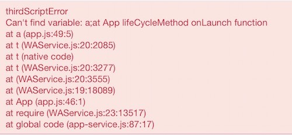

<!-- 来源: https://developers.weixin.qq.com/miniprogram/dev/framework/usability/sourceMap.html -->

# Source Map

> 目前只在 iOS 6.7.2 及以上版本支持

小程序/小游戏在打包时，会将所有 JavaScript 代码打包成一个文件，为了便于开发者在手机上调试时定位错误位置，小程序/小游戏提供了 [Source Map](https://docs.google.com/document/d/1U1RGAehQwRypUTovF1KRlpiOFze0b-_2gc6fAH0KY0k/edit) 支持。

在开发者工具中开启 ES6 转 ES5、代码压缩时，会生成 Source Map 的 `.map` 文件。 **开发版** 小程序中，基础库会使用代码包中的 `.map` 文件，对 vConsole 中展示的错误信息堆栈进行重新映射（只对开发者代码文件进行）。



如果使用外部的编译脚本对源文件进行处理，只需将对应生成的 Source Map 文件放置在源文件的相同目录下

如：

```
pages/index.js
pages/index.js.map
app.js
app.js.map
```

开发者工具会读取、解析 Source Map 文件，并进行将其上传

后续可以在小程序后台的运营中心可以利用上传的 Source Map 文件进行错误分析

## 注意事项

1. **Source Map 文件不计入代码包大小计算，也不会被包含在体验版/正式版代码包中。**
2. **inline sourcemap 不计入代码包大小计算。**
3. **开发版代码包中由于包含了 `.map` 文件，实际代码包大小会比体验版和正式版大。**
