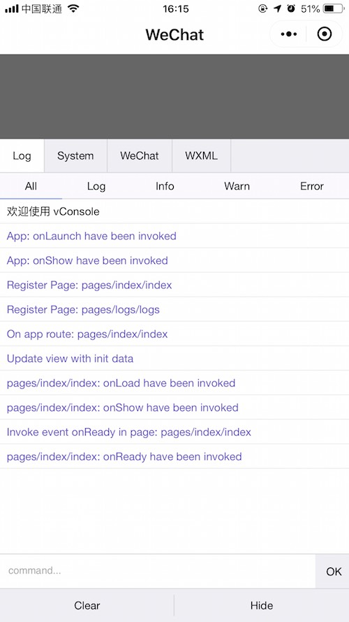
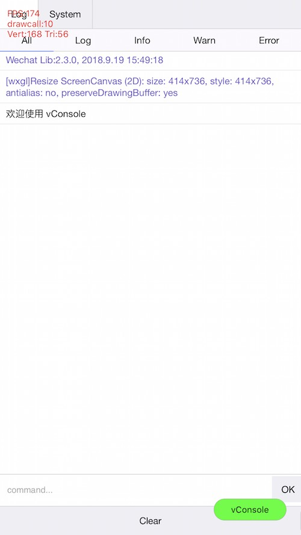

<!-- 来源: https://developers.weixin.qq.com/miniprogram/dev/framework/usability/vConsole.html -->

# vConsole

在真机上，如果想要查看 `console` API 输出的日志内容和额外的调试信息，需要在点击屏幕右上角的按钮打开的菜单里选择「打开调试」。此时小程序/小游戏会退出，重新打开后右下角会出现一个 `vConsole` 按钮。点击 `vConsole` 按钮可以打开日志面板。

小程序和小游戏的 vConsole 展示内容会有一定差别，下图左边是小程序 vConsole，右边是小游戏 vConsole

 

## vConsole 使用说明

由于实现机制的限制，开发者调用 `console` API 打印的日志内容，是转换成 `JSON` 字符串后传输给 `vConsole` 的，导致 `vConsole` 中展示的内容会有一些限制：

- 除了 `Number` 、 `String` 、 `Boolean` 、 `null` 外，其他类型都会被作为 `Object` 处理展示，打印对象及原型链中的 Enumerable 属性。
- `Infinity` 和 `NaN` 会显示为 `null` 。
- `undefined` 、 `ArrayBuffer` 、 `Function` 类型无法显示
- 无法打印存在循环引用的对象

```js
let a = {}
a.b = a
console.log(a) // 2.3.2 以下版本，会打印 `An object width circular reference can't be logged`
```

**针对上述问题，小程序/小游戏在使用 vConsole 时做了一些处理**

- 2.3.2 及以上版本，支持打印循环引用对象。循环引用的对象属性会显示引用路径， `@` 表示对象本身。

```js
const circular = { x: {}, c: {} }
circular.x = [{ promise: Promise.resolve() }]
circular.a = circular
circular.c.x0 = circular.x[0]

console.log(circular)
// "{a: '<Circular: @>', c: {x0: '<Circular: @.x[0]>'}, x: [{promise: '<Promise>'}]}"
```

- 2.3.1 及以上版本，支持展示所有类型的数据。基础库会对日志内容进行一次转换，经过转换的内容会使用 `<>` 包裹。如:
    - `<Function: func>`
    - `<Undefined>`
    - `<Infinity>`
    - `<Map: size=0>`
    - `<ArrayBuffer: byteLength=10>`
    - ...
- 2.2.3 ~ 2.3.0 版本中，可以展示 `ArrayBuffer` 和 `Function` 类型， `undefined` 会被打印为字符串 `'undefined'`

**注：尽量避免在非调试情景下打印结构过于复杂或内容过长的日志内容（如游戏引擎中的精灵或材质对象等），可能会带来额外耗时。为了防止异常发生，日志内容超过一定长度会被替换为 `<LOG_EXCEED_MAX_LENGTH>` ，此时需要开发者裁剪日志内容。**
