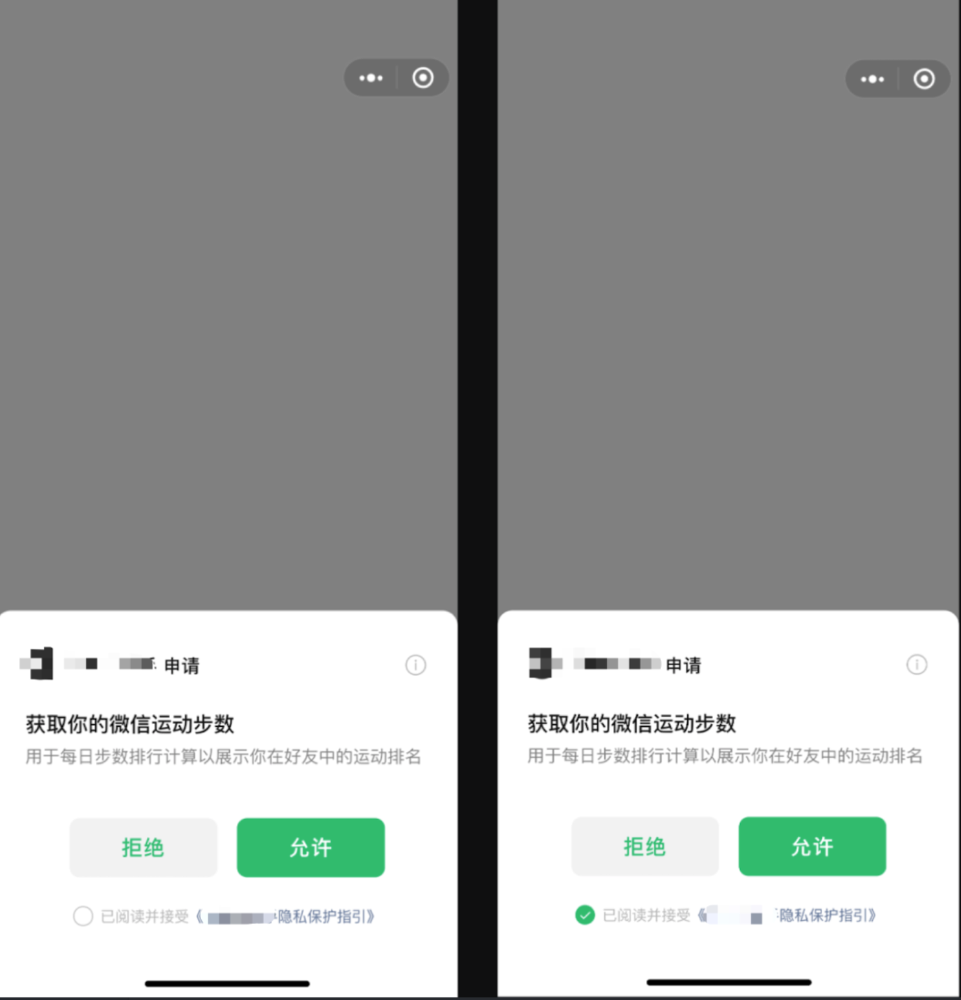
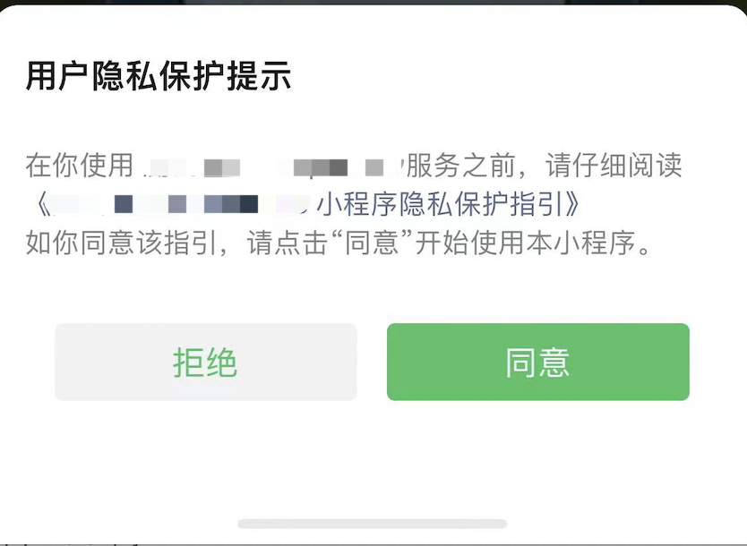

<!-- 来源: https://developers.weixin.qq.com/miniprogram/dev/framework/user-privacy/PrivacyAuthorize.html -->

# 小程序隐私协议开发指南

## 一、功能介绍

涉及处理用户个人信息的小程序开发者，需通过弹窗等明显方式提示用户阅读隐私政策等收集使用规则。

为规范开发者的用户个人信息处理行为，保障用户合法权益，微信要求开发者主动同步微信当前用户已阅读并同意小程序的隐私政策等收集使用规则，方可调用微信提供的隐私接口。

**特别注意：**

2023.08.22更新：

以下指南中涉及的 getPrivacySetting、onNeedPrivacyAuthorization、requirePrivacyAuthorize 等接口目前可以正常接入调试。调试说明：

1. 在 2023年9月15日之前，在 app.json 中配置 `__usePrivacyCheck__: true` 后，会启用隐私相关功能，如果不配置或者配置为 false 则不会启用。
2. 在 2023年9月15日之后，不论 app.json 中是否有配置 `__usePrivacyCheck__` ，隐私相关功能都会启用。

接口用法可参考下方 [完整示例demo](#%E5%9B%9B%E3%80%81%E5%AE%8C%E6%95%B4%E7%A4%BA%E4%BE%8Bdemo)

2023.09.14更新：

1. 隐私相关功能启用时间延期至 2023年10月17日。在 2023年10月17日之前，在 app.json 中配置 `__usePrivacyCheck__: true` 后，会启用隐私相关功能，如果不配置或者配置为 false 则不会启用。在 2023年10月17日之后，不论 app.json 中是否有配置 `__usePrivacyCheck__` ，隐私相关功能都会启用。
2. 新增官方隐私授权弹窗功能，相关功能参考下方 [官方隐私弹窗功能说明](#%E5%85%AD%E3%80%81%E5%AE%98%E6%96%B9%E9%9A%90%E7%A7%81%E5%BC%B9%E7%AA%97%E5%8A%9F%E8%83%BD%E8%AF%B4%E6%98%8E) 。

## 二、接入流程

### 1. 配置《小程序用户隐私保护指引》

开发者需在「小程序管理后台」配置《小程序用户隐私保护指引》，详细指引可见： [用户隐私保护指引填写说明](./README.md) 。

需要注意的是，仅有在指引中声明所处理的用户信息，才可以调用平台提供的对应接口或组件。若未声明，对应接口或组件将直接禁用。 隐私接口与对应的处理的信息关系可见： [小程序用户隐私保护指引内容介绍](./miniprogram-intro.md) 。

配置完成后，对于每个使用小程序的用户，开发者均需要同步微信当前用户已阅读并同意小程序的隐私政策等收集使用规则后，才可以调用已声明的接口或组件。同步的开发方式见下文。

对于已经同步过的用户，后续若开发者更新了配置，对于旧版本已经有接口或组件，不需要重新同步；对于更新后产生的新的接口或组件，需要重新同步。例如，7月11日更新的版本中包含「收集你选择的位置信息」，7月12日同步用户同意状态，7月13日更新后新增了「收集你的微信运动步数」，则在未再次同步的情况下，可以调用 wx.chooseLocation 接口，无法调用 wx.getWeRunData 接口。

### 2. 主动查询隐私授权同步状态以及展示隐私协议

从基础库 [2.32.3](../compatibility.md) 开始支持

开发者可通过 [wx.getPrivacySetting](https://developers.weixin.qq.com/miniprogram/dev/api/open-api/privacy/wx.getPrivacySetting.html) 接口，查询微信侧记录的用户是否有待同意的隐私政策信息。该信息可通过返回结果 res 中的 needAuthorization 字段获取。

同时， [wx.getPrivacySetting](https://developers.weixin.qq.com/miniprogram/dev/api/open-api/privacy/wx.getPrivacySetting.html) 接口会返回开发者在小程序管理后台配置的《小程序用户隐私保护指引》名称信息，开发者可以调用 [wx.openPrivacyContract](https://developers.weixin.qq.com/miniprogram/dev/api/open-api/privacy/wx.openPrivacyContract.html) 接口打开该页面。

如果存在有待用户同意的隐私政策信息，开发者需要主动提示用户阅读隐私政策等收集使用规则，对于提示方式，小程序开发者可自行设计，同时需要在相关界面中使用 <button open-type="agreePrivacyAuthorization"> 组件，当用户轻触该 <button> 组件后，表示用户已阅读并同意小程序的隐私政策等收集使用规则，微信会收到该同步信息，此时开发者可以在该组件的 `bindagreeprivacyauthorization` 事件回调后调用已声明的隐私接口。

**代码示例**

```html
<!-- page.wxml -->
<view wx:if="{{showPrivacy}}">
  <view>隐私弹窗内容....</view>
  <button bindtap="handleOpenPrivacyContract">查看隐私协议</button>
  <button id="agree-btn" open-type="agreePrivacyAuthorization" bindagreeprivacyauthorization="handleAgreePrivacyAuthorization">同意</button>
</view>
```

```js
// page.js
Page({
  data: {
    showPrivacy: false
  },
  onLoad() {
    wx.getPrivacySetting({
      success: res => {
        console.log(res) // 返回结果为: res = { needAuthorization: true/false, privacyContractName: '《xxx隐私保护指引》' }
        if (res.needAuthorization) {
          // 需要弹出隐私协议
          this.setData({
            showPrivacy: true
          })
        } else {
          // 用户已经同意过隐私协议，所以不需要再弹出隐私协议，也能调用已声明过的隐私接口
          // wx.getUserProfile()
          // wx.chooseMedia()
          // wx.getClipboardData()
          // wx.startRecord()
        }
      },
      fail: () => {},
      complete: () => {}
    })
  },
  handleAgreePrivacyAuthorization() {
    // 用户同意隐私协议事件回调
    // 用户点击了同意，之后所有已声明过的隐私接口和组件都可以调用了
    // wx.getUserProfile()
    // wx.chooseMedia()
    // wx.getClipboardData()
    // wx.startRecord()
  },
  handleOpenPrivacyContract() {
    // 打开隐私协议页面
    wx.openPrivacyContract({
      success: () => {}, // 打开成功
      fail: () => {}, // 打开失败
      complete: () => {}
    })
  }
})
```

从基础库 [2.32.3](../compatibility.md) 版本起， [隐私同意按钮](https://developers.weixin.qq.com/miniprogram/dev/component/button.html) 支持与 [手机号快速验证组件](../open-ability/getPhoneNumber.md) 、 [手机号实时验证组件](../open-ability/getRealtimePhoneNumber.md) 耦合使用，调用方式为 `<button open-type="getPhoneNumber|agreePrivacyAuthorization">` 或 `<button open-type="getRealtimePhoneNumber|agreePrivacyAuthorization">` 。

也支持 [隐私同意按钮](https://developers.weixin.qq.com/miniprogram/dev/component/button.html) 与 [获取用户信息组件](https://developers.weixin.qq.com/miniprogram/dev/component/button.html) 耦合使用，调用方式为 `<button open-type="getUserInfo|agreePrivacyAuthorization">`

**示例代码**

```html
<!-- page.wxml -->
<button id="agree-btn1" open-type="getPhoneNumber|agreePrivacyAuthorization" bindgetphonenumber="handleGetPhoneNumber" bindagreeprivacyauthorization="handleAgreePrivacyAuthorization">同意隐私协议并授权手机号</button>

<button id="agree-btn2" open-type="getRealtimePhoneNumber|agreePrivacyAuthorization" bindgetrealtimephonenumber="handleGetRealtimePhoneNumber" bindagreeprivacyauthorization="handleAgreePrivacyAuthorization">同意隐私协议并授权手机号</button>

<button id="agree-btn3" open-type="getUserInfo|agreePrivacyAuthorization" bindgetuserinfo="handleGetUserInfo" bindagreeprivacyauthorization="handleAgreePrivacyAuthorization">同意隐私协议并获取头像昵称信息</button>
```

```js
// page.js
Page({
  handleAgreePrivacyAuthorization() {
    // 用户同意隐私协议事件回调
    // 用户点击了同意，之后所有已声明过的隐私接口和组件都可以调用了
    // wx.getUserProfile()
    // wx.chooseMedia()
    // wx.getClipboardData()
    // wx.startRecord()
  },
  handleGetPhoneNumber(e) {
    // 获取手机号成功
    console.log(e)
  },
  handleGetRealtimePhoneNumber(e) {
    // 获取实时手机号成功
    console.log(e)
  },
  handleGetUserInfo(e) {
    // 获取头像昵称成功
    console.log(e)
  }
})
```

### 3. 被动监听隐私接口需要用户授权事件

从基础库 [2.32.3](../compatibility.md) 开始支持

小程序开发者除了可以自行判断时机，提示用户阅读隐私政策等收集使用规则外，也可以通过 [wx.onNeedPrivacyAuthorization](https://developers.weixin.qq.com/miniprogram/dev/api/open-api/privacy/wx.onNeedPrivacyAuthorization.html) 接口来监听何时需要提示用户阅读隐私政策。当用户触发了一个微信侧未记录过同意的隐私接口调用，则会触发该事件。开发者可在该事件触发时提示用户阅读隐私政策。

需要注意的是，对于 <input type="nickname"> 组件，由于 <input> 的特殊性，如果用户未同意隐私协议，则 `<input type="nickname">` 聚焦时不会触发 onNeedPrivacyAuthorization 事件，而是降级为 <input type="text"> 。

此外，微信还提供了 [wx.requirePrivacyAuthorize](https://developers.weixin.qq.com/miniprogram/dev/api/open-api/privacy/wx.requirePrivacyAuthorize.html) 接口，可用于模拟隐私接口调用。

**代码示例**

```html
// page.wxml
<view wx:if="{{showPrivacy}}">
  <view>隐私弹窗内容....</view>
  <button id="agree-btn" open-type="agreePrivacyAuthorization" bindagreeprivacyauthorization="handleAgreePrivacyAuthorization">同意</button>
</view>
```

```js
// page.js
Page({
  data: {
    showPrivacy: false
  },
  onLoad() {
    wx.onNeedPrivacyAuthorization((resolve, eventInfo) => {
      console.log('触发本次事件的接口是：' + eventInfo.referrer)
      // 需要用户同意隐私授权时
      // 弹出开发者自定义的隐私授权弹窗
      this.setData({
        showPrivacy: true
      })
      this.resolvePrivacyAuthorization = resolve
    })

    wx.getUserProfile({
      success: console.log,
      fail: console.error
    })
  },
  handleAgreePrivacyAuthorization() {
    // 用户点击同意按钮后
    this.resolvePrivacyAuthorization({ buttonId: 'agree-btn', event: 'agree' })
    // 用户点击同意后，开发者调用 resolve({ buttonId: 'agree-btn', event: 'agree' })  告知平台用户已经同意，参数传同意按钮的id
    // 用户点击拒绝后，开发者调用 resolve({ event:'disagree' }) 告知平台用户已经拒绝
  }
})
```

### 4. 清空历史同步状态

当用户从「微信下拉-最近-最近使用的小程序」中删除小程序，将清空历史同步状态。下次访问小程序后，需要重新同步微信当前用户已阅读并同意小程序的隐私政策等收集使用规则。

开发者可通过此方式进行调试，也可以在开发者工具中「清除模拟器缓存-清除授权数据」清空历史同步状态。

## 三、其他说明

- 低于 2.32.3 版本的基础库未集成隐私相关功能，也不会拦截隐私接口调用。

## 四、完整示例demo

demo1: 演示使用 `wx.getPrivacySetting` 和 `<button open-type="agreePrivacyAuthorization">` 在首页处理隐私弹窗逻辑 [https://developers.weixin.qq.com/s/gi71sGm67hK0](https://developers.weixin.qq.com/s/gi71sGm67hK0)

demo2: 演示使用 `wx.onNeedPrivacyAuthorization` 和 `<button open-type="agreePrivacyAuthorization">` 在多个页面处理隐私弹窗逻辑，同时演示了如何处理多个隐私接口同时调用。 [https://developers.weixin.qq.com/s/hndZUOmA7gKn](https://developers.weixin.qq.com/s/hndZUOmA7gKn)

demo3: 演示 `wx.onNeedPrivacyAuthorization` 、 `wx.requirePrivacyAuthorize` 、 `<button open-type="agreePrivacyAuthorization">` 和 `<input type="nickname">` 组件如何结合使用 [https://developers.weixin.qq.com/s/jX7xWGmA7UKa](https://developers.weixin.qq.com/s/jX7xWGmA7UKa)

demo4: 演示使用 `wx.onNeedPrivacyAuthorization` 和 `<button open-type="agreePrivacyAuthorization">` 在多个 tabBar 页面处理隐私弹窗逻辑 [https://developers.weixin.qq.com/s/g6BWZGmt7XK9](https://developers.weixin.qq.com/s/g6BWZGmt7XK9)

## 五、常见错误说明

- `{ "errMsg": "A:fail api scope is not declared in the privacy agreement", "errno": 112 }` 使用到了 A 隐私接口，但是开发者未在「MP后台-设置-服务内容声明-用户隐私保护指引」中声明收集 A 接口对应的隐私类型。补充的隐私类型声明, 将在5分钟后生效。
- `{ "errMsg": "A:fail appid privacy api banned" }` 使用到了 A 隐私接口，但是开发者在 mp 提审时勾选了“未采集隐私”，或者未声明隐私协议，被平台回收了接口调用权限。

## 六、官方隐私弹窗功能说明

为了让开发者能更便利地完成小程序隐私合规要求，除了通过以上指引进行隐私协议开发外，平台还提供了官方隐私授权弹窗。此弹窗在隐私相关功能启用后（2023年10月17日后或开发者在 app.json 中配置 `__usePrivacyCheck__: true` 后），无需开发者适配开发，自动向 C 端用户展示。具体逻辑为：

当开发者调用隐私相关接口时，微信会判断此次调用是否需要触发 wx.onNeedPrivacyAuthorization 事件，若触发后开发者未进行响应，微信将主动弹出官方弹窗。若用户同意，该接口将正常执行后续调用逻辑；若用户拒绝，将进行报错。

需要注意的是，用户可能拒绝官方隐私授权弹窗，为了避免过度弹窗打扰用户，开发者再次调用隐私相关接口时，若距上次用户拒绝不足10秒，将不再触发弹窗，直接给到开发者用户拒绝隐私授权弹窗的报错。

官方隐私弹窗将有两种样式：

1. 与授权弹窗耦合样式：用户在此弹窗下需要勾选隐私协议才可以进行允许操作，若用户在弹窗中拒绝，报错信息为用户拒绝（错误码为 103）。



1. 直接弹窗样式：用户侧直接针对隐私协议的授权，若用户在弹窗中拒绝，报错信息为用户未同意隐私协议（错误码为 104）。



与授权弹窗耦合样式将会在后续版本的基础库中支持（支持版本将在后续更新），在低版本基础库中所有弹窗均将采用直接弹窗样式。
