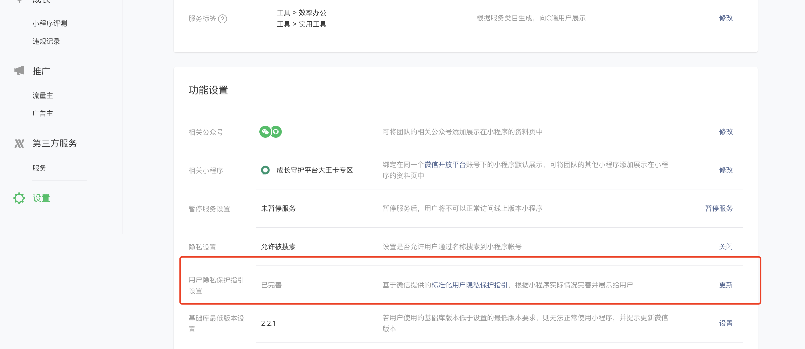
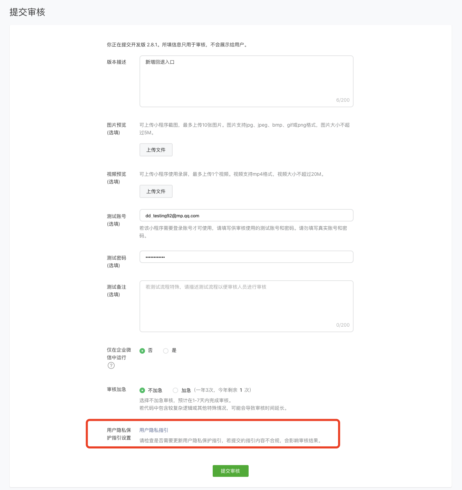
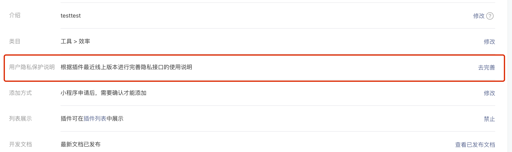
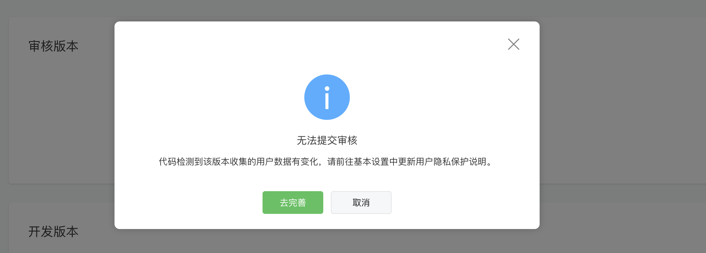

<!-- 来源: https://developers.weixin.qq.com/miniprogram/dev/framework/user-privacy/ -->

# 用户隐私保护指引填写说明

为规范开发者的用户个人信息处理行为，保障用户合法权益，小程序、插件中涉及处理用户个人信息的开发者，均需补充相应用户隐私保护指引。

具体填写内容说明可见 [小程序用户隐私保护指引内容介绍](./miniprogram-intro.md) 、 [插件用户隐私保护说明内容介绍](./plugin-intro.md) 。

## 一、小程序用户隐私保护指引

### 1、填写现网版本用户隐私保护指引

**入口1：账号设置-服务内容声明-用户隐私保护指引-去完善**

开发者可随时基于小程序现网版本进行隐私协议的完善或更新，审核通过后即可生效。用户可在小程序更多资料页和弹窗中查看隐私指引。

### 2. 填写提审版本用户隐私保护指引

**入口2：管理—版本管理—提交代码审核—信息填写页面**

开发者每次提交代码审核时，平台默认拉取小程序现网版本隐私协议，作为开发版本的隐私协议进入平台审核。若提交审核的开发版本，其隐私接口调用情况与隐私协议内容有出入，或隐私协议内容为空，则在提审时会提醒开发者进行更新。

在此入口对开发版本隐私协议内容的修改不会对现网版本的隐私协议产生影响。同样，入口1的修改仅针对现网版本隐私协议。若开发版本审核通过且发布现网，该版本的隐私协议会同时发布现网覆盖前一个版本的隐私协议。

注意：若提审版本时被拦截，请在当前入口，即入口2对隐私协议内容进行更新。

### 3. 代开发小程序通过接口配置用户隐私保护指引

代开发的小程序则只能通过接口配置用户隐私保护指引，可以参考 [第三方平台的指引文档](https://developers.weixin.qq.com/doc/oplatform/Third-party_Platforms/2.0/product/privacy_setting.html) 。

## 二、插件用户隐私保护说明填写

### 1、填写线上版本用户隐私保护说明

**入口1：小程序插件—设置—用户隐私保护说明**

开发者可随时对插件最新的线上版本进行隐私说明的完善或更新，审核通过后即可生效。用户可在引用了该版本的小程序更多资料页、隐私指引中查看。

暂不支持对线上非最新版本进行隐私说明的完善或更新。

### 2. 填写提审版本用户隐私保护说明

**入口2：小程序插件—提交审核—无法提交审核弹窗-去完善**

开发者每次提交代码审核时，平台默认拉取插件最新的线上版本隐私说明，与当前提交审核版本隐私接口调用情况对比，若当前提交审核版本调用了最新的线上版本隐私说明不包含的隐私接口，会提醒开发者先提交隐私说明审核。

开发者完善隐私声明后，需等待隐私声明审核通过才可提交版本。隐私声明审核通过会通过服务通知告知插件开发者。

注意：若提审版本时被拦截，请在当前入口，即入口2对隐私协议内容进行更新

若当前提交审核版本删除了最新的线上版本隐私说明中包含的隐私接口，无法在提审时进行编辑，建议开发者在版本发布后通过入口1进行修改。

