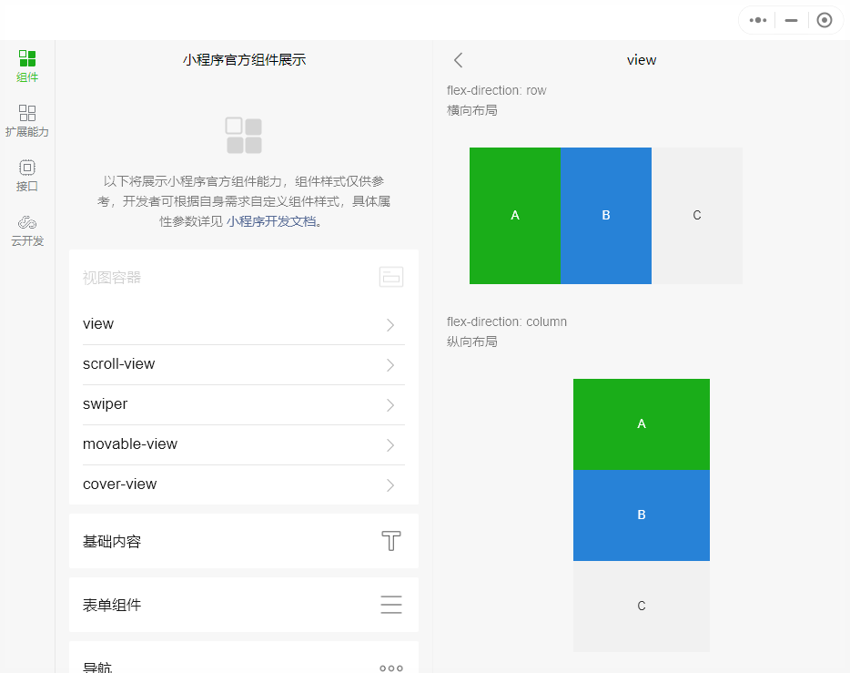

<!-- 来源: https://developers.weixin.qq.com/miniprogram/dev/framework/view/frameset.html -->

# 分栏模式

在 PC 等能够以较大屏幕显示小程序的环境下，小程序支持以分栏模式展示。分栏模式可以将微信窗口分为左右两半，各展示一个页面。



目前， Windows 微信 3.3 以上版本支持分栏模式。对于其他版本微信，分栏模式不会生效。

## 启用分栏模式

在 app.json 中同时添加 `"resizable": true` 和 `"frameset": true` 两个配置项就可以启用分栏模式。

**代码示例：**

```json
{
  "resizable": true,
  "frameset": true
}
```

启用分栏模式后，可以使用开发者工具的自动预览功能来预览分栏效果。

## 分栏占位图片

当某一栏没有展示任何页面时，会展示一张图片在此栏正中央。

如果代码包中的 `frameset/placeholder.png` 文件存在，这张图片将作为此时展示的图片。

## 分栏适配要点

启用分栏模式后，一些已有代码逻辑可能出现问题。可能需要更改代码来使其能够在分栏模式下正确运行。

### 避免使用更改页面展示效果的接口

更改当前页面展示效果的接口，总是对最新打开的页面生效。

例如，在右栏打开一个新页面后，更改页面标题的接口 [wx.setNavigationBarTitle](https://developers.weixin.qq.com/miniprogram/dev/api/ui/navigation-bar/wx.setNavigationBarTitle.html) 即使是在左栏的页面中调用，也将更改右栏内页面的标题！

因此，应当尽量避免使用这样的接口，而是改用 [page-meta](https://developers.weixin.qq.com/miniprogram/dev/component/page-meta.html) 和 [navigation-bar](https://developers.weixin.qq.com/miniprogram/dev/component/navigation-bar.html) 组件代替。

### 变更路由接口调用

如果在路由接口中使用相对路径，总是相对于最新打开的页面路径。

例如，在右栏打开一个新页面后，路由接口 [wx.navigateTo](https://developers.weixin.qq.com/miniprogram/dev/api/route/wx.navigateTo.html) 即使是在左栏的页面中调用，跳转路径也将相对于右栏内页面的路径！

因此，应当将这样的路由接口改成 [Router](https://developers.weixin.qq.com/miniprogram/dev/reference/api/Router.html) 接口调用，如 `this.pageRouter.navigateTo` 。

### 页面大小不是固定值

启用分栏模式的同时，页面大小也是可能动态变化的了。请使用 [响应显示区域变化](./resizable.md) 的方法来处理页面大小变化时的响应方式。
