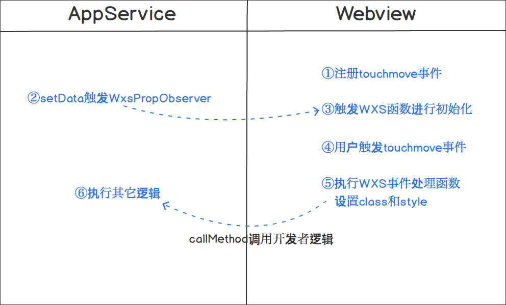

<!-- 来源: https://developers.weixin.qq.com/miniprogram/dev/framework/view/interactive-animation.html -->

# WXS响应事件

> 基础库 2.4.4 开始支持，低版本需做 [兼容处理](../compatibility.md) 。

## 背景

有频繁用户交互的效果在小程序上表现是比较卡顿的，例如页面有 2 个元素 A 和 B，用户在 A 上做 touchmove 手势，要求 B 也跟随移动， [movable-view](https://developers.weixin.qq.com/miniprogram/dev/component/movable-view.html) 就是一个典型的例子。一次 touchmove 事件的响应过程为：

a、touchmove 事件从视图层（Webview）抛到逻辑层（App Service）

b、逻辑层（App Service）处理 touchmove 事件，再通过 setData 来改变 B 的位置

一次 touchmove 的响应需要经过 2 次的逻辑层和渲染层的通信以及一次渲染，通信的耗时比较大。此外 setData 渲染也会阻塞其它脚本执行，导致了整个用户交互的动画过程会有延迟。

## 实现方案

本方案基本的思路是减少通信的次数，让事件在视图层（Webview）响应。小程序的框架分为视图层（Webview）和逻辑层（App Service），这样分层的目的是管控，开发者的代码只能运行在逻辑层（App Service），而这个思路就必须要让开发者的代码运行在视图层（Webview），如下图所示的流程：



使用 [WXS](./wxs/README.md) 函数用来响应小程序事件，目前只能响应内置组件的事件，不支持自定义组件事件。WXS 函数的除了纯逻辑的运算，还可以通过封装好的 `ComponentDescriptor` 实例来访问以及设置组件的 class 和样式，对于交互动画，设置 style 和 class 足够了。WXS 函数的例子如下：

```javascript
var wxsFunction = function(event, ownerInstance) {
    var instance = ownerInstance.selectComponent('.classSelector') // 返回组件的实例
    instance.setStyle({
        "font-size": "14px" // 支持rpx
    })
    instance.getDataset()
    instance.setClass(className)
    // ...
    return false // 不往上冒泡，相当于调用了同时调用了stopPropagation和preventDefault
}
```

其中入参 `event` 是小程序 [事件对象](./wxml/event.md) 基础上多了 `event.instance` 来表示触发事件的组件的 `ComponentDescriptor` 实例。 `ownerInstance` 表示的是触发事件的组件所在的组件的 `ComponentDescriptor` 实例，如果触发事件的组件是在页面内的， `ownerInstance` 表示的是页面实例。

`ComponentDescriptor` 的定义如下：

<table><thead><tr><th>方法</th> <th>参数</th> <th>描述</th> <th>最低版本</th></tr></thead> <tbody><tr><td>selectComponent</td> <td>selector对象</td> <td>返回组件的 <code>ComponentDescriptor</code> 实例。</td> <td></td></tr> <tr><td>selectAllComponents</td> <td>selector对象数组</td> <td>返回组件的 <code>ComponentDescriptor</code> 实例数组。</td> <td></td></tr> <tr><td>setStyle</td> <td>Object/string</td> <td>设置组件样式，支持<code>rpx</code>。设置的样式优先级比组件 wxml 里面定义的样式高。不能设置最顶层页面的样式。</td> <td></td></tr> <tr><td>addClass/removeClass/hasClass</td> <td>string</td> <td>设置组件的 class。设置的 class 优先级比组件 wxml 里面定义的 class 高。不能设置最顶层页面的 class。</td> <td></td></tr> <tr><td>getDataset</td> <td>无</td> <td>返回当前组件/页面的 dataset 对象</td> <td></td></tr> <tr><td>callMethod</td> <td>(funcName:string, args:object)</td> <td>调用当前组件/页面在逻辑层（App Service）定义的函数。funcName表示函数名称，args表示函数的参数。</td> <td></td></tr> <tr><td>requestAnimationFrame</td> <td>Function</td> <td>和原生 <code>requestAnimationFrame</code> 一样。用于设置动画。</td> <td></td></tr> <tr><td>getState</td> <td>无</td> <td>返回一个object对象，当有局部变量需要存储起来后续使用的时候用这个方法。</td> <td></td></tr> <tr><td>triggerEvent</td> <td>(eventName, detail)</td> <td>和组件的<a href="./../custom-component/events.html">triggerEvent</a>一致。</td> <td></td></tr> <tr><td>getComputedStyle</td> <td>Array.&lt;string&gt;</td> <td>参数与 <a href="../../api/wxml/NodesRef.fields.html">SelectorQuery</a> 的 <code>computedStyle</code> 一致。</td> <td><a href="../compatibility.html">2.11.2</a></td></tr> <tr><td>setTimeout</td> <td>(Function, Number)</td> <td>与原生 <code>setTimeout</code> 一致。用于创建定时器。</td> <td><a href="../compatibility.html">2.14.2</a></td></tr> <tr><td>clearTimeout</td> <td>Number</td> <td>与原生 <code>clearTimeout</code> 一致。用于清除定时器。</td> <td><a href="../compatibility.html">2.14.2</a></td></tr> <tr><td>getBoundingClientRect</td> <td><em>webview</em>: 无 <br> <em>skyline</em>: (rect: BoundingClientRect) =&gt; void</td> <td>webview 中，返回值与 <a href="../../api/wxml/NodesRef.boundingClientRect.html">SelectorQuery</a> 的 <code>boundingClientRect</code> 一致； <br> skyline 中此调用无法同步返回，会以回调形式异步返回</td> <td><a href="../compatibility.html">2.14.2</a></td></tr></tbody></table>

WXS 运行在视图层（Webview），里面的逻辑毕竟能做的事件比较少，需要有一个机制和逻辑层（App Service）开发者的代码通信，上面的 `callMethod` 是 WXS 里面调用逻辑层（App Service）开发者的代码的方法，而 `WxsPropObserver` 是逻辑层（App Service）开发者的代码调用 WXS 逻辑的机制。

## 使用方法

- WXML定义事件：

```html
<wxs module="test" src="./test.wxs"></wxs>
<view change:prop="{{test.propObserver}}" prop="{{propValue}}" bindtouchmove="{{test.touchmove}}" class="movable"></view>
```

上面的 `change:prop` （属性前面带change:前缀）是在 prop 属性被设置的时候触发 WXS 函数，值必须用 `{{}}` 括起来。类似 Component 定义的 properties 里面的 observer 属性，在 `setData({propValue: newValue})` 调用之后会触发。

**注意** ：WXS函数必须用 `{{}}` 括起来。当 prop 的值被设置 WXS 函数就会触发，而不只是值发生改变，所以在页面初始化的时候会调用一次 `WxsPropObserver` 的函数。

- WXS文件 `test.wxs` 里面定义并导出事件处理函数和属性改变触发的函数：

```wxs
module.exports = {
    touchmove: function(event, instance) {
        console.log('log event', JSON.stringify(event))
    },
    propObserver: function(newValue, oldValue, ownerInstance, instance) {
        console.log('prop observer', newValue, oldValue)
    }
}
```

更多示例请查看 [在开发者工具中预览效果](https://developers.weixin.qq.com/s/L1G0Dkmc7G8a)

## Tips

1. 目前还不支持 [原生组件](https://developers.weixin.qq.com/miniprogram/dev/component/native-component.html) 的事件、 [input](https://developers.weixin.qq.com/miniprogram/dev/component/input.html) 和 [textarea](https://developers.weixin.qq.com/miniprogram/dev/component/textarea.html) 组件的 bindinput 事件
2. 1.02.1901170及以后版本的开发者工具上支持交互动画，最低版本基础库是2.4.4
3. 目前在WXS函数里面仅支持console.log方式打日志定位问题，注意连续的重复日志会被过滤掉。
