<!-- 来源: https://developers.weixin.qq.com/miniprogram/dev/framework/xr-frame/ -->

# 开始

**xr-frame** 是一套小程序官方提供的XR/3D应用解决方案，基于混合方案实现，性能逼近原生、效果好、易用、强扩展、渐进式、遵循小程序开发标准。

在这一章中，我们将会带大家从头开始，用它构建一个XR小程序。

本文只是开始指南，更加详细的信息请见 [**组件框架文档**](https://developers.weixin.qq.com/miniprogram/dev/component/xr-frame/overview/) 和 [**API文档**](https://developers.weixin.qq.com/miniprogram/dev/api/xr-frame/modules.html) 。

> ⚠️ `xr-frame` 在基础库 `v2.32.0` 开始基本稳定，发布为正式版，但仍有一些功能还在开发，请见 [限制和展望](https://developers.weixin.qq.com/miniprogram/dev/component/xr-frame/overview/#%E9%99%90%E5%88%B6%E5%92%8C%E5%B1%95%E6%9C%9B) 。

## 新建一个XR组件

首先创建项目，让我们选择小程序工程：

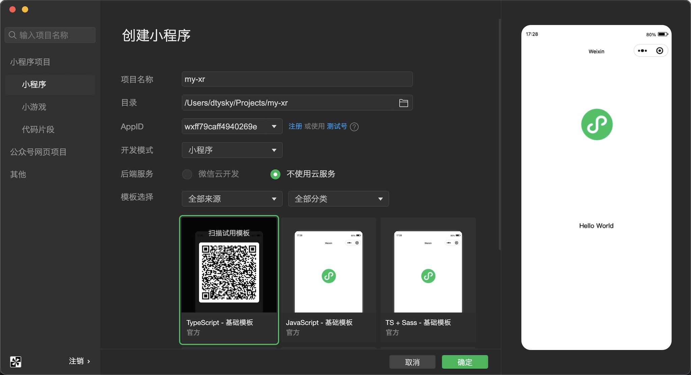

之后先在 `app.json` 加上一行配置： `"lazyCodeLoading": "requiredComponents"` 。然后创建好组件文件夹，新建一个组件，然后修改组件的内容：

index.json:

```json
{
  "component": true,
  "renderer": "xr-frame",
  "usingComponents": {}
}
```

index.wxml:

```xml
<xr-scene>
  <xr-camera clear-color="0.4 0.8 0.6 1" />
</xr-scene>
```

在 `index.json` 中，我们指定了这个组件的渲染器是 `xr-frame` ；在 `index.wxml` 中，我们创建了一个场景 `xr-scene` ，并在其下添加了一个相机 `xr-camera` 。

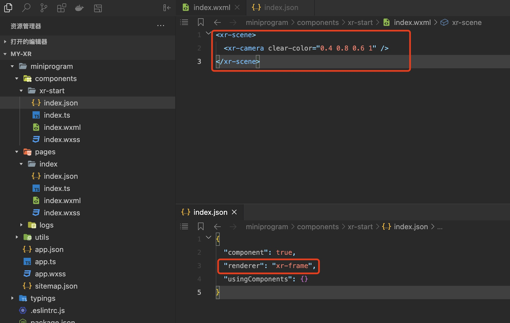

## 在页面中使用这个组件

创建完组件后，便可以在页面中使用它，让我们进入 `pages/index` ，修改它的 `json` 、 `wxml` 和 `ts` 文件：

在 `json` 中：

```json
{
  "usingComponents": {
    "xr-start": "../../components/xr-start/index"
  },
  "disableScroll": true
}
```

在 `ts` 脚本中：

```ts
Page({
  data: {
    width: 300,
    height: 300,
    renderWidth: 300,
    renderHeight: 300,
  },
  onLoad() {
    const info = wx.getSystemInfoSync();
    const width = info.windowWidth;
    const height = info.windowHeight;
    const dpi = info.pixelRatio;
    this.setData({
      width, height,
      renderWidth: width * dpi,
      renderHeight: height * dpi
    });
  },
})
```

在 `wxml` 中：

```xml
<view>
  <xr-start
    disable-scroll
    id="main-frame"
    width="{{renderWidth}}"
    height="{{renderHeight}}"
    style="width:{{width}}px;height:{{height}}px;"
  />
</view>
```

这里我们在脚本中设置了 `xr-frame` 组件需要渲染的宽高，然后传入 `wxml` ，并在其中使用了 `json` 中引用的组件进行渲染，目前效果如下，可见整个画布被 `xr-camera` 上设置的清屏颜色清屏了：

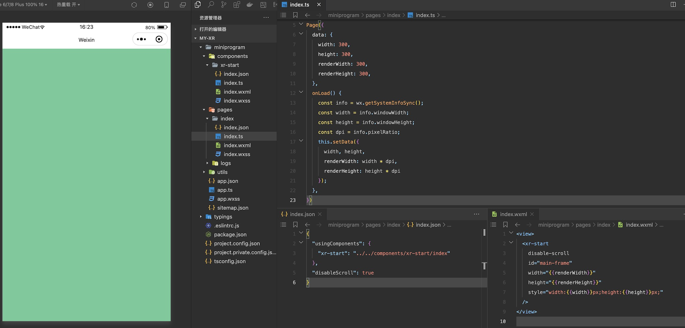

## 添加一个物体

接下来我们给场上添加一个物体，直接使用 `xr-mesh` 以及内置的几何数据、材质，创建一个立方体：

```xml
<xr-scene>
  <xr-mesh node-id="cube" geometry="cube" />
  <xr-camera clear-color="0.4 0.8 0.6 1" position="0 1 4" target="cube" camera-orbit-control />
</xr-scene>
```

这里我们给物体指定了一个 `node-id` ，作为节点的索引，之后修改 `xr-camera` 的 `position` 和 `target` ，让其始终看向这个立方体，最后再给相机加上 `camera-orbit-control` 属性，使得我们能对相机进行控制。

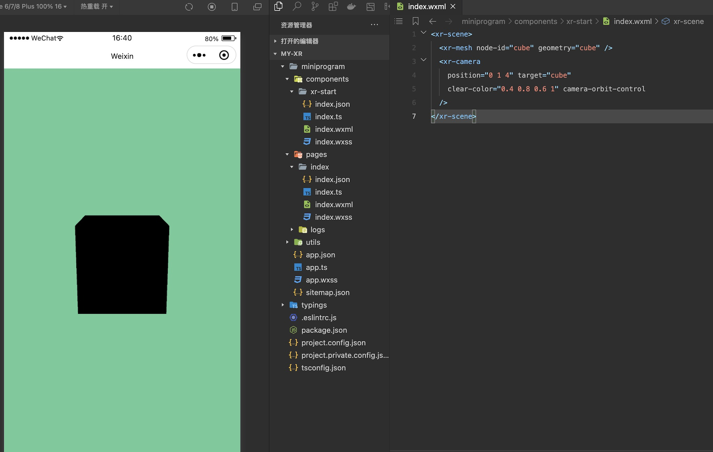

至此，一个立方体是渲染了出来，不过...为什么是黑色的？

## 来点颜色和灯光

物体黑色是因为在我们没有给 `xr-mesh` 指定材质时，用的是基于PBR效果的默认材质，需要光照，解决这个问题有两种方法，其一是不需要光照的物体，可以使用 `simple` 材质，这里就引入了材质定义：

```xml
<xr-asset-material asset-id="simple" effect="simple" uniforms="u_baseColorFactor:0.8 0.4 0.4 1" />
<xr-mesh node-id="cube" geometry="cube" material="simple" />
```

效果如下：

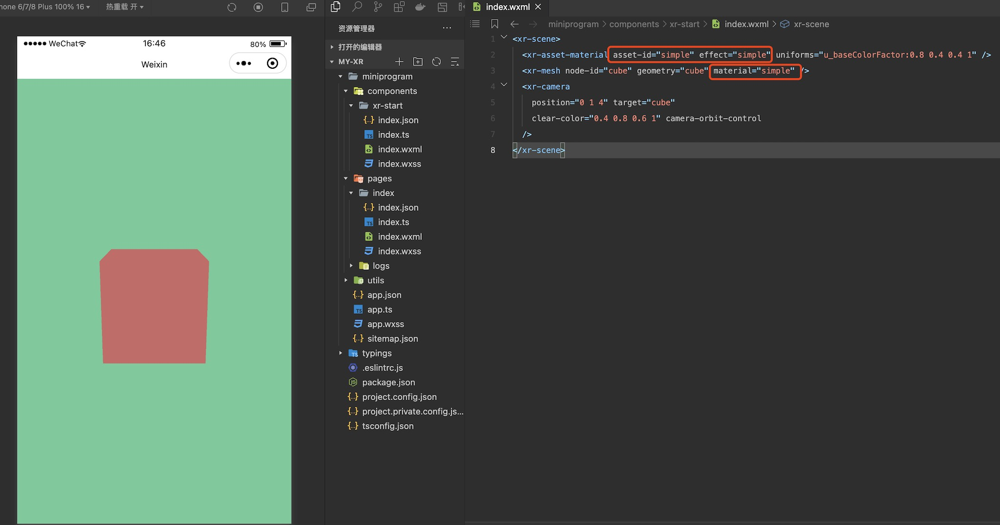

虽然这可以解决一些问题，但大部分情况下我们还是需要灯光的，就让我们把材质改回去，然后加上一些灯光吧：

```xml
<xr-light type="ambient" color="1 1 1" intensity="1" />
<xr-light type="directional" rotation="40 70 0" color="1 1 1" intensity="3" cast-shadow />

<xr-mesh
  node-id="cube" cast-shadow
  geometry="cube" uniforms="u_baseColorFactor:0.8 0.4 0.4 1"
/>
<xr-mesh
  position="0 -1 0" scale="4 1 4" receive-shadow
  geometry="plane" uniforms="u_baseColorFactor:0.4 0.6 0.8 1"
/>
```

这里我们加入了一个环境光和一个主平行光，调整了亮度和方向，同时加上了一个新的物体，再通过各个组件的 `caster-shadow` 和 `receive-shadow` 开启了阴影，效果如下：

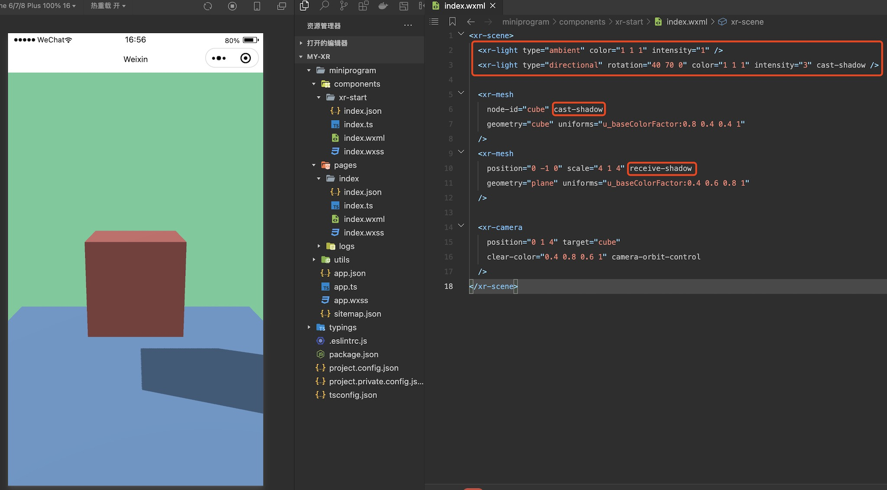

## 有点寡淡，加上图像

虽然有了灯光，但只有纯色还是有一些寡淡，接下来我们尝试加入纹理，让场景的色彩更加丰富一些，这里需要用到资源加载器 `xr-asset-load` 和 `xr-assets` ：

```xml
<xr-assets bind:progress="handleAssetsProgress" bind:loaded="handleAssetsLoaded">
  <xr-asset-load type="texture" asset-id="waifu" src="https://mmbizwxaminiprogram-1258344707.cos.ap-guangzhou.myqcloud.com/xr-frame/demo/waifu.png" />
</xr-assets>

<xr-mesh
  node-id="cube" cast-shadow
  geometry="cube" uniforms="u_baseColorMap: waifu"
/>
```

注意到我们在 `xr-assets` 上绑定了两个事件 `progress` 和 `loaded` ，这便于开发者监听资源加载进度，然后按需做一些操作，比如资源加载完成后和 `wx:if` 协作再显示物体。默认情况下，我们采用渐进式策略，当资源加载完成后会自动应用到物体上：

```ts
methods: {
  handleAssetsProgress: function ({detail}) {
    console.log('assets progress', detail.value);
  },
  handleAssetsLoaded: function ({detail}) {
    console.log('assets loaded', detail.value);
  }
}
```

这次的修改效果如下：

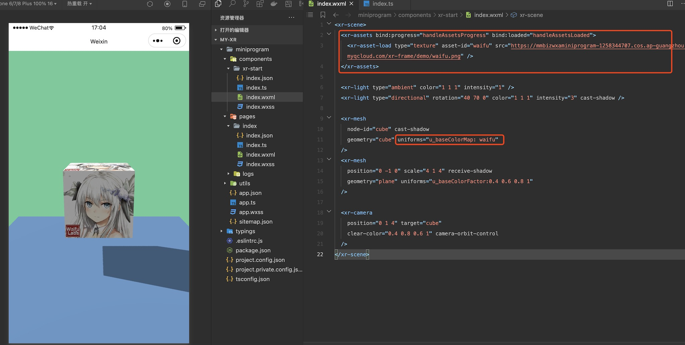

当然，我们还可以用代码动态加载一张纹理，然后将其设置到物体上，这里以获取用户信息的头像为例：

```ts
data: {
  avatarTextureId: 'white'
},

methods: {
  handleReady: function ({detail}) {
    this.scene = detail.value;
    // 该接口已废弃，请授权后，采用 getUserInfo 代替。
    wx.getUserProfile({
      desc: '获取头像',
      success: (res) => {
        this.scene.assets.loadAsset({
          type: 'texture', assetId: 'avatar', src: res.userInfo.avatarUrl
        }).then(() => this.setData({avatarTextureId: 'avatar'}));
      }
    })
  }
}
```

根据 [小程序用户头像昵称获取规则调整公告](https://developers.weixin.qq.com/community/develop/doc/00022c683e8a80b29bed2142b56c01) wx.getUserProfile 于 2022 年 10 月 25 日 24 时后，被废弃

注意这里的 `handleReady` ，我们可以在 `xr-scene` 上绑定 `bind:ready="handleReady"` 触发。完成头像获取后，将数据设置为 `uniforms` 的来源：

```xml
<xr-mesh
  position="0 -1 0" scale="4 1 4" receive-shadow
  geometry="plane" uniforms="u_baseColorMap: {{avatarTextureId}}"
/>
```

效果如下：

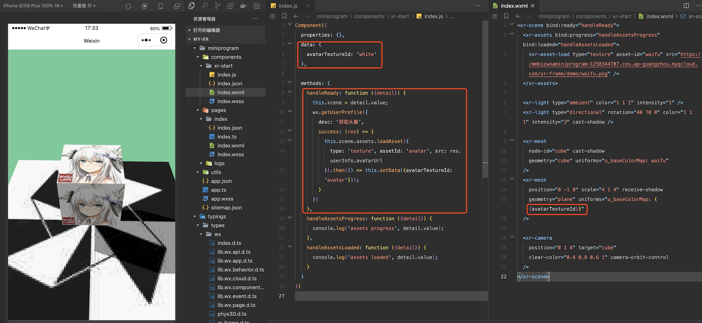

## 让场景更丰富，环境数据

物体有了纹理，那么背景能不能也有纹理呢？当然可以。我们提供了环境元素 `xr-env` 来定义环境信息，配合以相机可以渲染天空盒，这里以框架内置的一个环境数据 `xr-frame-team-workspace-day` 为例：

```xml
<xr-env env-data="xr-frame-team-workspace-day" />

<xr-mesh
  node-id="cube" cast-shadow
  geometry="cube" uniforms="u_baseColorMap: waifu,u_metallicRoughnessValues:1 0.1"
/>

<xr-camera
  position="0 1 4" target="cube" background="skybox"
  clear-color="0.4 0.8 0.6 1" camera-orbit-control
/>
```

这里我们将 `xr-camera` 的 `backgournd` 设置为了 `skybox` ，同时调整了立方体的金属粗糙度，效果如下：

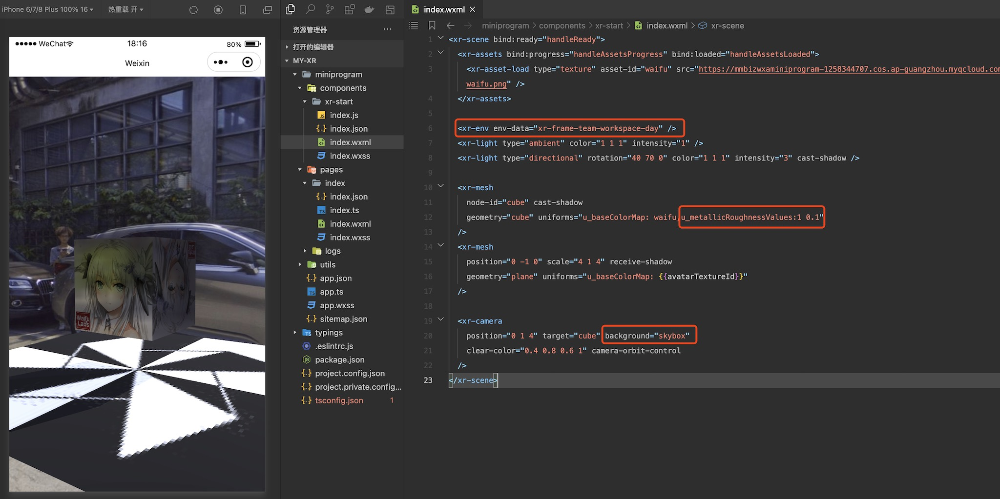

同时可以看到场景中的物体相机叠加了一层反射，就像是被环境影响了一样，这是因为环境数据里还包括一些IBL的信息，当然这个我们不在这里赘述了，有兴趣的可以详细阅读后面的章节。

天空盒除了图像，还支持视频，我们可以先加载一个视频纹理，然后覆盖掉环境信息中的 `sky-map` ：

```xml
<xr-asset-load type="video-texture" asset-id="office" src="https://mmbizwxaminiprogram-1258344707.cos.ap-guangzhou.myqcloud.com/xr-frame/demo/videos/office-skybox.mp4" options="autoPlay:true,loop:true" />

<xr-env env-data="xr-frame-team-workspace-day" sky-map="video-office" />
```

效果如下：

同时除了这种天空盒，我们还支持2D背景，这个在做一些商品展示的时候会比较有用：

```xml
<xr-asset-load type="texture" asset-id="weakme" src="https://mmbizwxaminiprogram-1258344707.cos.ap-guangzhou.myqcloud.com/xr-frame/demo/weakme.jpg" />

<xr-env env-data="xr-frame-team-workspace-day" sky-map="weakme" is-sky2d />
```

效果如下：

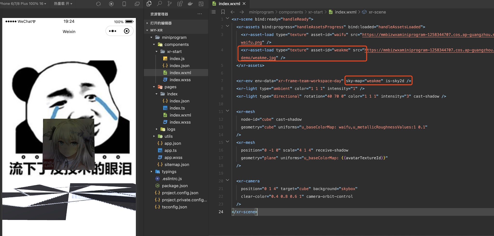

## 动起来，加入动画

目前我们的整个场景还是静态的，接下来我们会加入一些动画让其丰富起来。这里要使用帧动画资源，让我们先创建一个资源目录，在其下创建一个 `json` 文件：

```json
{
  "keyframe": {
    "plane": {
      "0": {
        "rotation.y": 0,
        "material.u_baseColorFactor": [0.2, 0.6, 0.8, 1]
      },
      "50": {
        "material.u_baseColorFactor": [0.2, 0.8, 0.6, 1]
      },
      "100": {
        "rotation.y": 6.28,
        "material.u_baseColorFactor": [0.2, 0.6, 0.8, 1]
      }
    },
    "cube": {
      "0": {
        "position": [-1, 0, 0]
      },
      "25": {
        "position": [-1, 1, 0]
      },
      "50": {
        "position": [1, 1, 0]
      },
      "75": {
        "position": [1, 0, 0]
      }
    }
  },
  "animation": {
    "plane": {
      "keyframe": "plane",
      "duration": 4,
      "ease": "ease-in-out",
      "loop": -1
    },
    "cube": {
      "keyframe": "cube",
      "duration": 4,
      "ease": "steps",
      "loop": -1,
      "direction": "both"
    }
  }
}
```

然后加载它，并引用到场上的两个物体中：

```xml
<xr-asset-load asset-id="anim" type="keyframe" src="/assets/animation.json"/>

<xr-mesh
  node-id="cube" cast-shadow anim-keyframe="anim" anim-autoplay="clip:cube,speed:2"
  geometry="cube" uniforms="u_baseColorMap: waifu,u_metallicRoughnessValues:1 0.1"
/>
<xr-mesh
  node-id="plane" position="0 -1 0" scale="4 1 4" receive-shadow anim-keyframe="anim" anim-autoplay="clip:plane"
  geometry="plane" uniforms="u_baseColorMap: {{avatarTextureId}}"
/>

<xr-camera
  position="0 1 6" target="plane" background="skybox"
  clear-color="0.4 0.8 0.6 1" camera-orbit-control
/>
```

这里我们将 `xr-camera` 的 `target` 设置到了 `plane` 上，以防其跟随 `cube` 乱动。

> 注意因为是包内的 `json` 文件，所以需要在 **project.config.json** 的 `setting` 字段中增加 `"ignoreDevUnusedFiles": false` 和 `"ignoreUploadUnusedFiles": false` 配置参数！ 效果如下：

## 还是不够，放个模型

看着这个场景，你可能也觉得缺了点什么，不错——都是方方正正的几何体，还是太单调了。所以在这里，我们将加载并使用glTF模型，来让场景更加丰富。为了让场景简洁，我们去掉原场景的所有物体，调整相机的 `target` ：

```xml
<xr-asset-load type="gltf" asset-id="damage-helmet" src="https://mmbizwxaminiprogram-1258344707.cos.ap-guangzhou.myqcloud.com/xr-frame/demo/damage-helmet/index.glb" />
<xr-asset-load type="gltf" asset-id="miku" src="https://mmbizwxaminiprogram-1258344707.cos.ap-guangzhou.myqcloud.com/xr-frame/demo/miku.glb" />

<xr-gltf node-id="damage-helmet" model="damage-helmet" />
<xr-gltf model="miku" position="-0.15 0.75 0" scale="0.07 0.07 0.07" rotation="0 180 0" anim-autoplay />

<xr-camera
  position="0 1.5 4" target="damage-helmet" background="skybox"
  clear-color="0.4 0.8 0.6 1" camera-orbit-control
/>
```

这里我们加载了两个模型：一个静态但支持了所有PBR渲染的特性，一个简单一些但有动画，最后的效果如下：

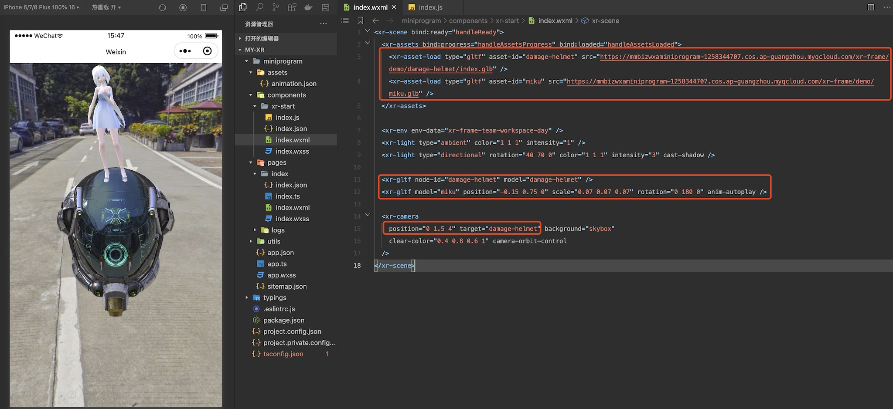

## 再来点交互

渲染部分到这里说的就差不多了，但作为一个应用，和用户的交互必不可少。很多场景下开发者可能需要点击场景中的物体来做一些逻辑，所以我们提供了 `shape` 系列组件：

```xml
<xr-gltf
  node-id="damage-helmet" model="damage-helmet"
  id="helmet" mesh-shape bind:touch-shape="handleTouchModel"
/>
<xr-gltf
  model="miku" position="-0.15 0.75 0" scale="0.07 0.07 0.07" rotation="0 180 0" anim-autoplay
  id="miku" cube-shape="autoFit:true" shape-gizmo bind:touch-shape="handleTouchModel"
/>
```

我们给几个模型设置了 `id` ，添加上了不同形状的 `shape` ，一个 `mesh-shape` 可以完全匹配模型，但开销较高并有顶点限制，一个 `cube-shape` 开销较低，还可以打开debug开关 `shape-gizmo` 将它显示出来。最后，我们并绑定了对应的点击事件，之后便可以在脚本里写逻辑，完成相应的操作了：

```ts
handleTouchModel: function ({detail}) {
  const {target} = detail.value;
  const id = target.id;

  wx.showToast({title: `点击了模型： ${id}`});
}
```

之后在点击到对应物体时，便会弹出提示：

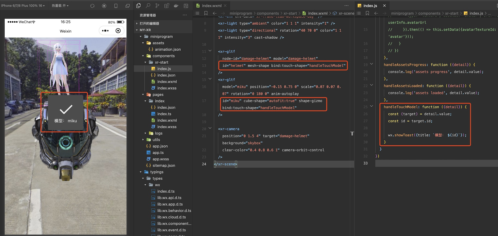

## 组件通信，加上HUD

虽然有了交互，但总不能让交互都是这种弹窗吧。很多时候我们会让交互和UI元素互相影响，但目前 `xr-frame` 尚未支持和小程序的UI元素混写（会在未来版本支持），但我们可以使用同层方案，而同层方案，就必然涉及到组件通信了。

`xr-frame` 组件和父级的通信与传统组件基本一致，这里让我们用小程序的UI元素实现一下 `HUD` 。这里可能会有一些3D变换的知识，但不要紧，只是调用接口而已。

首先，让我们修改组件的 `wxml` ，为场景添加 `tick` 事件，并且为模型和相机都加上 `id` 方便索引。

```xml
<xr-scene bind:ready="handleReady" bind:tick="handleTick">
......
<xr-gltf
  node-id="damage-helmet" model="damage-helmet"
  id="helmet" mesh-shape bind:touch-shape="handleTouchModel"
/>
<xr-gltf
  model="miku" position="-0.15 0.75 0" scale="0.07 0.07 0.07" rotation="0 180 0" anim-autoplay
  id="miku" cube-shape="autoFit:true" shape-gizmo bind:touch-shape="handleTouchModel"
/>
<xr-camera
  id="camera" position="0 1.5 4" target="damage-helmet" background="skybox"
  clear-color="0.4 0.8 0.6 1" camera-orbit-control
/>
</xr-scene>
```

之后在组件的脚本中处理事件，编写逻辑：

```ts
handleReady: function ({detail}) {
  this.scene = detail.value;
  const xrFrameSystem = wx.getXrFrameSystem();
  this.camera = this.scene.getElementById('camera').getComponent(xrFrameSystem.Camera);
  this.helmet = {el: this.scene.getElementById('helmet'), color: 'rgba(44, 44, 44, 0.5)'};
  this.miku = {el: this.scene.getElementById('miku'), color: 'rgba(44, 44, 44, 0.5)'};
  this.tmpV3 = new (xrFrameSystem.Vector3)();
},
handleAssetsLoaded: function ({detail}) {
  this.triggerEvent('assetsLoaded', detail.value);
},
handleTick: function({detail}) {
  this.helmet && this.triggerEvent('syncPositions', [
    this.getScreenPosition(this.helmet),
    this.getScreenPosition(this.miku)
  ]);
},
handleTouchModel: function ({detail}) {
  const {target} = detail.value;
  this[target.id].color = `rgba(${Math.random()*255}, ${Math.random()*255}, ${Math.random()*255}, 0.5)`;
},
getScreenPosition: function(value) {
  const {el, color} = value;
  const xrFrameSystem = wx.getXrFrameSystem();
  this.tmpV3.set(el.getComponent(xrFrameSystem.Transform).worldPosition);
  const clipPos = this.camera.convertWorldPositionToClip(this.tmpV3);
  const {frameWidth, frameHeight} = this.scene;
  return [((clipPos.x + 1) / 2) * frameWidth, (1 - (clipPos.y + 1) / 2) * frameHeight, color, el.id];
}
```

这里我们在 `ready` 事件中通过 `id` 索引获取了需要的实例并存了下来，然后在每帧的 `tick` 事件中实时获取物体的世界坐标，将其转换为屏幕的位置，并且还加上了在用户点击时改变颜色 `color` 的效果。在最后，我们通过 `this.triggerEvent` ，从组件向页面发起了通信，一个是资源加载完成的事件 `assetsLoaded` ，一个是坐标更新的事件 `syncPositions` 。让我们看看在场景的脚本中是如何处理这些事件的：

```ts
data: {
  width: 300, height: 300,
  renderWidth: 300, renderHeight: 300,
  loaded: false,
  positions: [[0, 0, 'rgba(44, 44, 44, 0.5)', ''], [0, 0, 'rgba(44, 44, 44, 0.5)', '']],
},
handleLoaded: function({detail}) {
  this.setData({loaded: true});
},
handleSyncPositions: function({detail}) {
  this.setData({positions: detail});
},
```

可见只是简单地接受了事件，然后将其设置为 `data` 而已，那么这个 `data` 用在哪里呢，来看看页面的 `wxml` ：

```xml
<view>
  <xr-start
    disable-scroll
    id="main-frame"
    width="{{renderWidth}}"
    height="{{renderHeight}}"
    style="width:{{width}}px;height:{{height}}px;"
    bind:assetsLoaded="handleLoaded"
    bind:syncPositions="handleSyncPositions"
  />

  <block wx:if="{{loaded}}" wx:for="{{positions}}" wx:for-item="pos" wx:key="*this">
    <view style="display: block; position: absolute;left: {{pos[0]}}px;top: {{pos[1]}}px;background: {{pos[2]}};transform: translate(-50%, -50%);">
      <view style="text-align: center;color: white;font-size: 24px;padding: 8px;">{{pos[3]}}</view>
    </view>
  </block>
</view>
```

也很简单，就是在 `xr-start` 组件上加上了事件的绑定，然后下面多了一些UI，在模型加载完毕后显示，并按照位置和颜色跟随模型移动，这可以认为是基于DOM的 `HUD` 。整个完成了，用户点击物体，会让这些HUD变色，效果如下：

> 注意这里的左侧效果截图是 **真机截图** P上去的，因为工具暂不支持同层渲染！ 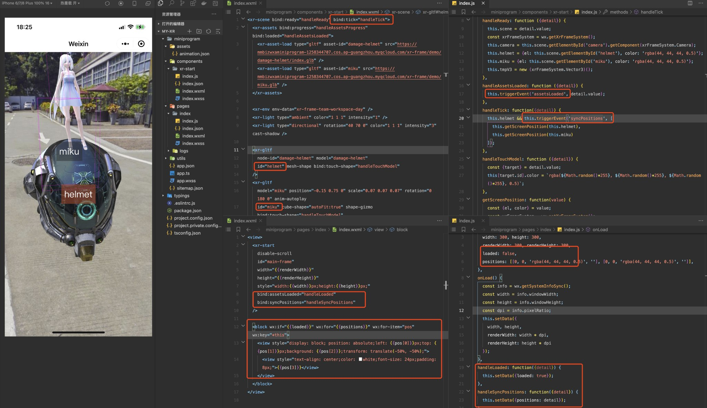

## 虚拟 x 现实，追加AR能力

到这里，我们实现了3D场景的渲染和交互，但框架毕竟是叫做 **XR** -frame，所以接下来我们就用内置的AR系统来改造一下这个场景，让它具有AR能力吧。改造非常简单，我们首先将所有的无关物体移除，然后使用 `ar-system` 和 `ar-tracker` ，并修改一下 `xr-camera` 的相关属性 `is-ar-camera` 和 `background="ar"` 就好：

```xml
<xr-scene ar-system="modes:Plane" bind:ready="handleReady">
  <xr-assets bind:loaded="handleAssetsLoaded">
    <xr-asset-load type="gltf" asset-id="anchor" src="https://mmbizwxaminiprogram-1258344707.cos.ap-guangzhou.myqcloud.com/xr-frame/demo/ar-plane-marker.glb" />
    <xr-asset-load type="gltf" asset-id="miku" src="https://mmbizwxaminiprogram-1258344707.cos.ap-guangzhou.myqcloud.com/xr-frame/demo/miku.glb" />
  </xr-assets>

  <xr-env env-data="xr-frame-team-workspace-day" />
  <xr-light type="ambient" color="1 1 1" intensity="1" />
  <xr-light type="directional" rotation="40 70 0" color="1 1 1" intensity="3" cast-shadow />

  <xr-ar-tracker mode="Plane">
    <xr-gltf model="anchor"></xr-gltf>
  </xr-ar-tracker>
  <xr-node node-id="setitem" visible="false">
    <xr-gltf model="miku" anim-autoplay scale="0.08 0.08 0.08" rotation="0 180 0"/>
  </xr-node>

  <xr-camera clear-color="0.4 0.8 0.6 1" background="ar" is-ar-camera />
</xr-scene>
```

注意这里我们开启的 `ar-system` 的模式为 `Plane` ，即平面识别，这种模式下相机不能被用户控制，需要将控制器、 `target` 等都删掉，同时 `ar-tracker` 的 `mode` 要和 `ar-system` 的完全一致。之后再脚本中写一点简单的逻辑：

```ts
handleAssetsLoaded: function({detail}) {
  wx.showToast({title: '点击屏幕放置'});
  this.scene.event.add('touchstart', () => {
    this.scene.ar.placeHere('setitem', true);
  });
}
```

## 识别人脸，给自己戴个面具

在初步了解了AR系统后，我们便可以尝试更多不同的模式来玩做一些好玩的效果。接下来的是人脸识别模式，为此我们只需要在上面的代码中改几句，就可以给自己带上Joker的面具（逃）：

> ⚠️ 手势、人脸、躯体识别都需要基础库 **v2.28.1** 以上。

```xml
<xr-scene ar-system="modes:Face;camera:Front" bind:ready="handleReady" bind:tick="handleTick">
  <xr-assets bind:loaded="handleAssetsLoaded">
    <xr-asset-load type="gltf" asset-id="mask" src="https://mmbizwxaminiprogram-1258344707.cos.ap-guangzhou.myqcloud.com/xr-frame/demo/jokers_mask_persona5.glb" />
  </xr-assets>

  <xr-env env-data="xr-frame-team-workspace-day" />
  <xr-light type="ambient" color="1 1 1" intensity="1" />
  <xr-light type="directional" rotation="40 70 0" color="1 1 1" intensity="3" />

  <xr-ar-tracker mode="Face" auto-sync="43">
    <xr-gltf model="mask" rotation="0 180 0" scale="0.5 0.5 0.5" />
  </xr-ar-tracker>

  <xr-camera clear-color="0.4 0.8 0.6 1" background="ar" is-ar-camera />
</xr-scene>
```

这里我们将 `ar-system` 的 `modes` 改为了 `Face` ，并且新增设置了 `camera` 属性为 `Front` ，表示开启前置相机（ 注意前置相机在客户端 **8.0.31** 后才支持 ，这里仅做演示）。同时在 `ar-tracker` 这边，我们将 `mode` 改为了和 `ar-system` 一样的 `Face` ，并追加了属性 `auto-sync` ，这是一个数字数组，表示将 **识别出的面部特征点和对应顺序的子节点绑定** 并自动同步，具体的特征点可见组件文档详细描述。

## 手势，给喜欢的作品点赞

除了人脸之外，我们也提供了 **躯体** 和 **人手** 识别，用法都大同小异，但人手除了上面所属的特征点同步，还提供了“手势”识别，这个比较有趣，让我们来看看：

```xml
<xr-scene ar-system="modes:Hand" bind:ready="handleReady" bind:tick="handleTick">
  <xr-assets bind:loaded="handleAssetsLoaded">
    <xr-asset-load type="gltf" asset-id="cool-star" src="https://mmbizwxaminiprogram-1258344707.cos.ap-guangzhou.myqcloud.com/xr-frame/demo/cool-star.glb" />
  </xr-assets>

  <xr-env env-data="xr-frame-team-workspace-day" />
  <xr-light type="ambient" color="1 1 1" intensity="1" />
  <xr-light type="directional" rotation="40 70 0" color="1 1 1" intensity="3" cast-shadow />

  <xr-ar-tracker id="tracker" mode="Hand" auto-sync="4">
    <xr-gltf model="cool-star" anim-autoplay />
  </xr-ar-tracker>

  <xr-camera clear-color="0.4 0.8 0.6 1" background="ar" is-ar-camera />
</xr-scene>
```

`wxml` 这里我们换了个模型，并且将 `ar-system` 和 `ar-tracker` 的模式都换成了 `Hand` ，并修改了 `ar-tracker` 的特征点还加上了个 `id` 方便索引，最后还给 `scene` 绑定了 `tick` 事件，而接下来就是 `js` 逻辑了：

```ts
handleAssetsLoaded: function ({detail}) {
  this.setData({loaded: true});

  const el = this.scene.getElementById('tracker');
  this.tracker = el.getComponent(wx.getXrFrameSystem().ARTracker);
  this.gesture = -1;
},
handleTick: function() {
  if (!this.tracker) return;
  const {gesture, score} = this.tracker;
  if (score < 0.5 || gesture === this.gesture) {
    return;
  }

  this.gesture = gesture;
  gesture === 6 && wx.showToast({title: '好！'});
  gesture === 14 && wx.showToast({title: '唉...'});
}
```

最重要的是 `handleTick` 方法，在每一帧我们拿到 `tracker` 的引用，然后获得它的属性 `gesture` 和 `score` ，其中 `gesture` 为手势编号而 `score` 为置信度。具体的手势编号可见组件文档，这里我先用置信度过滤了一遍，随后依据手势 `gesture` 的值（6为赞，14为踩）来提示不同信息，效果如下：

## OSDMarker，给现实物体做标记

人体之外还有的能力就是两个 `marker` 了。其一是OSD Marker，一般以一个现实中物体的照片作为识别源，来识别出这个物体的在屏幕中的二维区域，我们已经做好了到三维空间的转换，但开发者需要自己保证 `tracker` 下模型的比例是符合识别源的。OSD模式在识别那些二维的、特征清晰的物体效果最好，比如广告牌。

> 这里是默认示例资源，你可以换成自己的照片和视频，如果只是想要尝试，直接复制访问 `src` 的地址到浏览器打开即可。

```xml
<xr-scene ar-system="modes:OSD" bind:ready="handleReady">
  <xr-assets bind:loaded="handleAssetsLoaded">
    <xr-asset-material asset-id="mat" effect="simple" uniforms="u_baseColorFactor: 0.8 0.6 0.4 0.7" states="alphaMode:BLEND" />
  </xr-assets>

  <xr-node>
    <xr-ar-tracker
      mode="OSD" src="https://mmbizwxaminiprogram-1258344707.cos.ap-guangzhou.myqcloud.com/xr-frame/demo/marker/osdmarker-test.jpg"
    >
      <xr-mesh geometry="plane" material="mat" rotation="-90 0 0" />
    </xr-ar-tracker>
  </xr-node>

  <xr-camera clear-color="0.4 0.8 0.6 1" background="ar" is-ar-camera />
</xr-scene>
```

这里我们把 `ar-system` 的模式改为了 `OSD` ，相应的 `ar-tracker` 的模式也改为了 `OSD` ，这种模式下需要提供 `src` ，也就是要识别的图像。并且这次我们使用了一个效果为 `simple` 的材质，因为不需要灯光，同时为了更好看效果，在 `material` 的 `states` 设置了 `alphaMode:BLEND` ，即开启透明混合，然后将 `uniforms` 设置颜色 `u_baseColorFactor` ，并且注意其透明度为 `0.7` 。最终效果如下：

## 2DMarker+视频，让照片动起来

最后的能力就是2D Marker，其用于精准识别有一定纹理的矩形平面，我们可以将其配合视频纹理，只需要非常简单的代码就可以完成一个效果，首先是 `wxml` ：

> 这里是默认示例资源，你可以换成自己的照片和视频，如果只是想要尝试，直接复制访问 `src` 的地址到浏览器打开即可。

```xml
<xr-scene ar-system="modes:Marker" bind:ready="handleReady">
  <xr-assets bind:loaded="handleAssetsLoaded">
    <xr-asset-load
      type="video-texture" asset-id="hikari" options="loop:true"
      src="https://mmbizwxaminiprogram-1258344707.cos.ap-guangzhou.myqcloud.com/xr-frame/demo/xr-frame-team/2dmarker/hikari-v.mp4"
    />
    <xr-asset-material asset-id="mat" effect="simple" uniforms="u_baseColorMap: video-hikari" />
  </xr-assets>

  <xr-node wx:if="{{loaded}}">
    <xr-ar-tracker
      mode="Marker" bind:ar-tracker-switch="handleTrackerSwitch"
      src="https://mmbizwxaminiprogram-1258344707.cos.ap-guangzhou.myqcloud.com/xr-frame/demo/xr-frame-team/2dmarker/hikari.jpg"
    >
      <xr-mesh node-id="mesh-plane" geometry="plane" material="mat" />
    </xr-ar-tracker>
  </xr-node>

  <xr-camera clear-color="0.4 0.8 0.6 1" background="ar" is-ar-camera />
</xr-scene>
```

这里我们把 `ar-system` 的模式改成了 `Marker` ，随后将 `ar-tracker` 的类型也改为了 `Marker` ，并且换了一个识别源，然后加载一个准备好的视频纹理，并将 `simple` 材质的颜色换为了纹理 `u_baseColorMap` ，同时关闭了混合。注意我们使用了变量 `loaded` 来控制 `ar-tracker` 的显示并绑定了事件 `ar-tracker-switch` ，这是为了在脚本中处理：

```ts
handleAssetsLoaded: function ({detail}) {
  this.setData({loaded: true});
},
handleTrackerSwitch: function ({detail}) {
  const active = detail.value;
  const video = this.scene.assets.getAsset('video-texture', 'hikari');
  active ? video.play() : video.stop();
}
```

在视频加载完成后再显示内容，并且在 `ar-tracker-switch` 事件也就是识别成功后在播放视频，优化体验，最终效果如下：

## 加上魔法，来点粒子

光是播放视频似乎还是有点单调，这里我们可以请出粒子系统制造一些魔法来让整个场景更加生动：

```xml
  ......
  <xr-asset-load type="texture" asset-id="point" src="https://mmbizwxaminiprogram-1258344707.cos.ap-guangzhou.myqcloud.com/xr-frame/demo/particles/point.png" />
  ......
  <xr-node wx:if="{{loaded}}">
    <xr-ar-tracker
      mode="Marker" bind:ar-tracker-switch="handleTrackerSwitch"
      src="https://mmbizwxaminiprogram-1258344707.cos.ap-guangzhou.myqcloud.com/xr-frame/demo/xr-frame-team/2dmarker/hikari.jpg"
    >
      <xr-mesh node-id="mesh-plane" geometry="plane" material="mat" />
      <xr-particle
        capacity="500" emit-rate="20"
        size="0.03 0.06" life-time="2 3" speed="0.04 0.1"
        start-color="1 1 1 0.8" end-color="1 1 1 0.2"
        emitter-type="BoxShape"
        emitter-props="minEmitBox:-0.5 0 0.5,maxEmitBox:0.5 0.2 0,direction:0 0 -1,direction2:0 0 -1"
        texture="point"
      />
    </xr-ar-tracker>
  </xr-node>
......
```

在上一步2DMarker视频的基础上，我们加上了 `xr-particle` 元素，使用了新加载的贴图 `point` 和 `boxShape` 发射器以及其他参数来生成粒子，最终效果如下（当然限于本人美术功底效果非常一般，相信你可以随便调一调完爆我233）：

## 后处理，让画面更加好玩

在主体渲染结束后，好像还是有些单调，缺乏一种和现实世界的明确分离感，这时候就可以用全屏后处理来实现一些更好玩的效果：

```xml
  ......
  <xr-asset-load asset-id="anim" type="keyframe" src="/assets/animation.json"/>
  ......
  <xr-asset-post-process
    asset-id="vignette" type="vignette" data="intensity:1,smoothness:4,color:1 0 0 1"
    anim-keyframe="anim" anim-autoplay
  />
  <xr-camera clear-color="0.4 0.8 0.6 1" background="ar" is-ar-camera post-process="vignette" />
```

这里我为相机应用了一个渐晕 `vignette` 后处理效果，并为其加上了帧动画控制参数：

```json
{
  "keyframe": {
    "vignette": {
      "0": {
        "asset-post-process.assetData.intensity": 0
      },
      "100": {
        "asset-post-process.assetData.intensity": 1
      }
    }
  },
  "animation": {
    "vignette": {
      "keyframe": "vignette",
      "duration": 2,
      "ease": "ease-in-out",
      "loop": -1,
      "direction": "both"
    }
  }
}
```

最终效果如下：

## 分享给你的好友吧！

好，终于到了这里，当我们做出了一些令人满意的效果后最重要的什么？当然是分享给好友！下面就让我们用 `xr-frame` 内置的分享系统来完成这个功能：

```xml
......
<xr-mesh node-id="mesh-plane" geometry="plane" material="mat" cube-shape="autoFit:true" bind:touch-shape="handleShare" />
......
```

```ts
handleShare: function() {
  this.scene.share.captureToFriends();
}
```

给识别后显示的视频 `Mesh` 加上了上面说过的 `shape` 绑定了触摸事件，然后在事件处理函数中直接用 `this.scene.share.captureToFriends()` 即可，效果如下：

> 当然，很多时候我们只是需要图片，然后用它接入微信的其他分享接口比如 `onShareAppMessage` 生命周期，此时使用 `share.captureToLocalPath` 接口即可，详细可见组件文档。

## 之后的，就交给你的创意

至此，我们简单体验了一下框架的各种能力，但主要是 `wxml` 为主，逻辑很少。对于入门的开发者，我们倾向于提供给开发者非常简单就能实现不错的效果，这也是 **渐进式开发** 的基础。更多详细的文档教程可见 [组件文档](https://developers.weixin.qq.com/miniprogram/dev/component/xr-frame/overview/) 。

但除了这些简单的用法外，框架还提供了高度灵活的组件化特性。开发者可以按照自身需求，定制属于自己的组件、元素、所有的资源等等，甚至如果有需求，我们还可以开放底层的RenderGraph来定制渲染流程。详细的定制开发能力可见接下来各个部分的文档，我们都做了比较详细的说明和引导。

好，入门就到此为止了，技术始终只是一个工具，剩下的就交给身为创作者的你了！在此之前，不如先看看这些DEMO吧：


