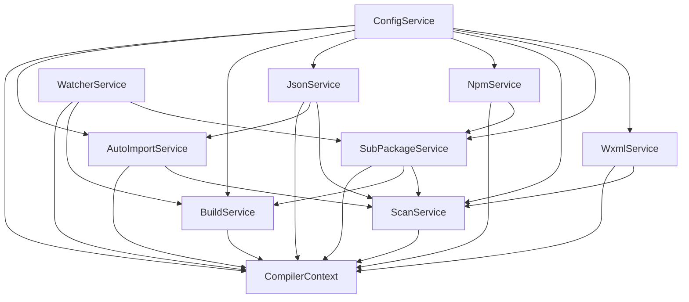

```mermaid
flowchart TB
  CompilerContext
  AutoImportService --> CompilerContext
  ConfigService --> CompilerContext
  BuildService --> CompilerContext
  JsonService --> CompilerContext
  NpmService --> CompilerContext
  ScanService --> CompilerContext
  SubPackageService --> CompilerContext
  WatcherService --> CompilerContext
  WxmlService --> CompilerContext
  ConfigService --> AutoImportService
  JsonService --> AutoImportService
  ConfigService --> BuildService
  WatcherService --> BuildService
  SubPackageService --> BuildService
  ConfigService --> JsonService
  ConfigService --> NpmService
  ConfigService --> ScanService
  JsonService --> ScanService
  SubPackageService --> ScanService
  AutoImportService --> ScanService
  WxmlService --> ScanService
  ConfigService --> SubPackageService
  NpmService --> SubPackageService
  WatcherService --> SubPackageService
  ConfigService --> WxmlService
```
