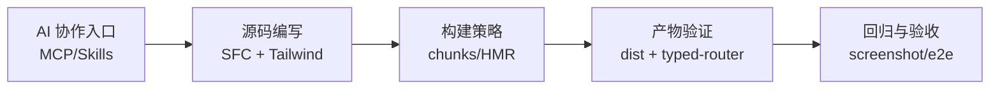

<!-- eslint-disable markdown/no-multiple-h1 -->

# Weapp-vite: 对小程序工程化的重新思考

## 案例演示完整版（20-30 分钟）

<div class="pt-8">
  讲者：{{你的名字}}<br>
  日期：2026-03-04
</div>

<!--
时间：1 分钟
这份 deck 不是概念版，而是“能现场演示”的案例版。
-->

---

# 这版分享解决什么问题

- 把“工程理念”变成“可执行演示”
- 每个案例都有配置和产物，不靠口头描述
- 你讲完后，团队可以按 slide 直接复现

<v-clicks>

- 案例 1：AI 协作验收（MCP + screenshot）
- 案例 2：原子化样式（Tailwind 动态类）
- 案例 3：超强分包（duplicate vs hoist）
- 案例 4：快速热更新（auto-routes HMR）
- 案例 5：语法重写（defineAppJson + autoRoutes）

</v-clicks>

<!--
时间：1 分钟
先明确你不是讲功能全家桶，而是讲 5 条可落地链路。
-->

---

# 演示约定

- 所有案例都来自仓库真实路径
- 命令优先使用仓库已有 e2e / fixture
- 结果产出分三类：
  - 文件产出
  - 内容产出
  - 日志/状态产出

<!--
时间：40 秒
统一听众预期，避免中途追问“这个是不是伪造示例”。
-->

---

## layout: section

# 案例 1

AI 协作验收：MCP 驱动截图

<!--
时间：20 秒
-->

---

# 案例 1 - 演示目标

目标：让 AI 从“聊天建议”变成“可验收执行者”

场景：

- 构建一个 e2e app
- 调用 `weapp-vite screenshot`
- 产出截图文件并给出机器可读结果

来源文档：`website/guide/ai.md`

<!--
时间：40 秒
-->

---

# 案例 1 - 演示步骤

```bash
# 1) 启动 MCP（本地）
weapp-vite mcp --transport streamable-http --host 127.0.0.1 --port 3088 --endpoint /mcp
```

把下面提示词交给接入 MCP 的 AI 客户端：

```text
你现在连接的是 weapp-vite MCP。
1. 构建 e2e-apps/auto-routes-define-app-json（platform=weapp）。
2. 执行 weapp-vite screenshot：
   - project: e2e-apps/auto-routes-define-app-json/dist/build/mp-weixin
   - page: pages/home/index
   - output: .tmp/mcp-screenshot.png
3. 存在输出 screenshot-ok，不存在输出 screenshot-missing。
```

<!--
时间：1 分钟
这是典型“AI + 工程命令 + 验收结果”闭环。
-->

---

# 案例 1 - 配置点

默认配置（源码）：`packages/weapp-vite/src/defaults.ts`

```ts
const weappConfig = {
  mcp: {
    enabled: true,
    autoStart: false,
    host: '127.0.0.1',
    port: 3088,
    endpoint: '/mcp',
  },
}
```

命令入口（源码）：

- `packages/weapp-vite/src/mcp.ts`
- `packages/weapp-vite/src/cli/commands/mcp.ts`

<!--
时间：1 分钟
强调：不是“文档建议”，而是默认能力。
-->

---

# 案例 1 - 结果产出

预期结果：

1. AI 返回 `screenshot-ok`
2. 工作区出现 `.tmp/mcp-screenshot.png`

验收价值：

- 有“状态值”（ok/missing）
- 有“制品文件”（png）
- 可直接接 CI 或自动化验收

<!--
时间：40 秒
-->

---

## layout: section

# 案例 2

原子化样式：Tailwind 动态类编译

<!--
时间：20 秒
-->

---

# 案例 2 - 演示目标

目标：证明动态 class 在小程序产物中可控落地

示例项目：`e2e-apps/issue-814-tailwind4`

源码页面：

- `e2e-apps/issue-814-tailwind4/src/pages/index/index.vue`

核心源码片段：

```vue
<view :class="[`flex${bbb} gap-[17px]`, aaa]">
```

<!--
时间：1 分钟
这页先说明“为什么选这个 case”：真实 issue + 回归用例。
-->

---

# 案例 2 - 演示步骤

```bash
node packages/weapp-vite/bin/weapp-vite.js \
  build e2e-apps/issue-814-tailwind4 \
  --platform weapp \
  --skipNpm
```

然后查看产物：

- `dist/pages/index/index.wxml`
- `dist/pages/index/index.js`

<!--
时间：40 秒
-->

---

# 案例 2 - 配置

`e2e-apps/issue-814-tailwind4/weapp-vite.config.ts`

```ts
import { defineConfig } from 'weapp-vite/config'

export default defineConfig({
  weapp: {
    srcRoot: 'src',
  },
})
```

补充：开发态样式热重载可用

- `weapp.hmr.touchAppWxss: 'auto'`
- 检测到 `weapp-tailwindcss` 时自动启用（源码：`touchAppWxss.ts`）

<!--
时间：1 分钟
解释“编译正确 + 开发体验”两条线。
-->

---

# 案例 2 - 结果产出

`index.wxml`（真实产物）

```html
<view class="flex gap-_b24px_B">...</view>
<view class="{{__wv_cls_0}}">...</view>
```

`index.js`（真实产物片段）

```js
const classExpr = `flex${this.bbb} gap-_b17px_B`
```

结果说明：

- 动态类被编译到运行时表达式
- 任意值 `gap-[17px]` 转义为 `gap-_b17px_B`

<!--
时间：1 分钟
-->

---

## layout: section

# 案例 3

超强分包：`duplicate` vs `hoist`

<!--
时间：20 秒
-->

---

# 案例 3 - 演示目标

目标：让“分包策略”可视化，而不是口头解释

示例 fixture：

- `packages/weapp-vite/test/fixtures/subpackage-dayjs`

验证用例：

- `packages/weapp-vite/test/subpackage-dayjs.test.ts`

<!--
时间：40 秒
-->

---

# 案例 3 - 演示步骤

你可以直接跑这个测试：

```bash
pnpm vitest run packages/weapp-vite/test/subpackage-dayjs.test.ts
```

这个测试会分别构建两种模式：

- `sharedStrategy: 'duplicate'` -> 输出到 `dist-duplicate`
- `sharedStrategy: 'hoist'` -> 输出到 `dist-hoist`

<!--
时间：1 分钟
-->

---

# 案例 3 - 配置

测试里用的是内联配置（简化后）：

```ts
weapp: {
  chunks: {
    sharedStrategy: 'duplicate' // 或 'hoist'
  }
}
```

策略含义：

- `duplicate`：共享模块复制到分包
- `hoist`：共享模块提炼到主包 `common.js`

<!--
时间：1 分钟
-->

---

# 案例 3 - 结果产出（产物差异）

`duplicate` 模式下：

- `packageA/weapp-shared/common.js`
- `packageB/weapp-shared/common.js`

`hoist` 模式下：

- 主包 `common.js`
- 分包不再有 `weapp-shared/common.js`

<!--
时间：50 秒
-->

---

# 案例 3 - 结果产出（代码差异）

`duplicate` 的页面引用（真实产物）：

```js
require('../weapp-shared/common.js')
```

`hoist` 的页面引用（真实产物）：

```js
require('../../common.js')
```

这就是“超强分包”的可验证证据。

<!--
时间：1 分钟
-->

---

## layout: section

# 案例 4

快速热更新：auto-routes HMR

<!--
时间：20 秒
-->

---

# 案例 4 - 演示目标

目标：展示 HMR 不只是快，还要“结构同步正确”

示例用例：

- `e2e/ci/auto-routes-hmr.test.ts`
- 项目：`e2e-apps/auto-routes-define-app-json`

验证内容：

- 新增/删除页面后，`typed-router.d.ts` 同步
- `app.json` 与 `app.js` 路由快照同步

<!--
时间：1 分钟
-->

---

# 案例 4 - 演示步骤

```bash
node --import tsx packages/weapp-vite/bin/weapp-vite.js \
  dev e2e-apps/auto-routes-define-app-json \
  --platform weapp \
  --skipNpm
```

然后在运行中：

1. 新建 `src/pages/logs/hmr-added.vue`
2. 观察 `typed-router.d.ts`
3. 删除该文件，观察回滚

<!--
时间：1 分钟
-->

---

# 案例 4 - 配置

`e2e-apps/auto-routes-define-app-json/weapp-vite.config.ts`

```ts
export default defineConfig({
  weapp: {
    srcRoot: 'src',
    autoRoutes: true,
  },
})
```

HMR 默认策略（源码默认值）：

```ts
const hmr = {
  sharedChunks: 'auto',
  touchAppWxss: 'auto',
}
```

<!--
时间：1 分钟
-->

---

# 案例 4 - 结果产出

来自 e2e 断言的结果：

- `typed-router.d.ts` 包含新增路由后再移除
- `dist/app.json` 的 `pages` 与 `subPackages` 保持正确
- `dist/app.js` 的 `__autoRoutesPages/__entries/__subPackages` 同步

关键点：

- 快，不是唯一目标
- 快 + 同步正确，才是可用 HMR

<!--
时间：1 分钟
-->

---

## layout: section

# 案例 5

语法重写：`defineAppJson` + `autoRoutes`

<!--
时间：20 秒
-->

---

# 案例 5 - 演示目标

目标：证明“语法重写”是编译链路行为，不是魔法

示例源码：

- `e2e-apps/auto-routes-define-app-json/src/app.vue`

关键写法：

```ts
defineAppJson({
  pages: routes.pages,
  subPackages: routes.subPackages,
})
```

<!--
时间：1 分钟
-->

---

# 案例 5 - 演示步骤

```bash
node packages/weapp-vite/bin/weapp-vite.js \
  build e2e-apps/auto-routes-define-app-json \
  --platform weapp \
  --skipNpm
```

重点查看三个产物：

- `dist/app.json`
- `dist/app.js`
- `typed-router.d.ts`

<!--
时间：40 秒
-->

---

# 案例 5 - 配置

`weapp-vite.config.ts`

```ts
export default defineConfig({
  weapp: {
    autoRoutes: true,
  },
})
```

编译侧关键事实：

- `defineAppJson` 在编译期提取
- 路由列表来自 `weapp-vite/auto-routes`
- 类型文件 `typed-router.d.ts` 自动生成

<!--
时间：1 分钟
-->

---

# 案例 5 - 结果产出（真实文件）

`dist/app.json`：

```json
{
  "pages": [
    "pages/dashboard/index",
    "pages/detail/index",
    "pages/home/index",
    "pages/logs/index"
  ],
  "subPackages": [
    { "root": "subpackages/lab", "pages": ["pages/state-playground/index"] },
    { "root": "subpackages/marketing", "pages": ["pages/campaign/index"] }
  ]
}
```

<!--
时间：1 分钟
-->

---

# 案例 5 - 结果产出（运行时快照）

`dist/app.js`（真实片段）包含：

```js
const globalData = {
  __autoRoutesPages: ['pages/home/index'],
  __autoRoutesEntries: ['pages/home/index', 'subpackages/marketing/pages/campaign/index'],
  __autoRoutesSubPackages: [{ root: 'subpackages/marketing', pages: ['pages/campaign/index'] }],
}
```

`typed-router.d.ts`（真实片段）包含：

```ts
export type AutoRoutesPages = [
  'pages/dashboard/index',
  'pages/detail/index',
  'pages/home/index',
  'pages/logs/index'
]
```

<!--
时间：1 分钟
-->

---

## layout: section

# 把 5 个案例串成一条链路

<!--
时间：20 秒
-->

---

# 一张图看完整工程化链路



结论：

- 单点能力不会自动形成工程系统
- 把能力串成闭环，团队效率才会稳定增长

<!--
时间：1 分钟
-->

---

# 附：5 个案例可直接复用的最小命令

```bash
# 案例1：AI + MCP
weapp-vite mcp --transport streamable-http --host 127.0.0.1 --port 3088 --endpoint /mcp

# 案例2：Tailwind 动态类
node packages/weapp-vite/bin/weapp-vite.js build e2e-apps/issue-814-tailwind4 --platform weapp --skipNpm

# 案例3：分包策略验证
pnpm vitest run packages/weapp-vite/test/subpackage-dayjs.test.ts

# 案例4：HMR 路由同步
node --import tsx packages/weapp-vite/bin/weapp-vite.js dev e2e-apps/auto-routes-define-app-json --platform weapp --skipNpm

# 案例5：语法重写产物
node packages/weapp-vite/bin/weapp-vite.js build e2e-apps/auto-routes-define-app-json --platform weapp --skipNpm
```

<!--
时间：1 分钟
-->

---

## layout: center

# 总结

## 工程化不是“工具堆叠”

## 是“可演示 + 可配置 + 可验证”的系统能力

- 每个案例都有配置
- 每个案例都有结果产出
- 每个案例都能在仓库复现

<!--
时间：1 分钟
-->

---

## layout: center

# Q&A

<div class="pt-6 text-sm opacity-80">
补充材料：
`website/blog/drafts/weapp-vite-rethinking-release.md`<br>
`website/blog/drafts/weapp-vite-rethinking-deep-dive.md`<br>
`website/blog/drafts/weapp-vite-rethinking-slidev.md`
</div>

<!--
时间：3-5 分钟
总时长：约 26-30 分钟
-->
