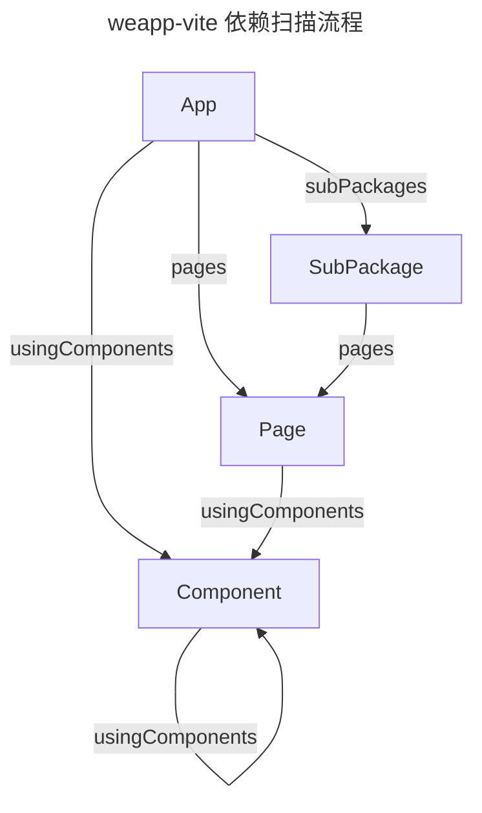

# 依赖分析扫描流程

## 判断是否是 app 入口节点

app: js + json

## 判断是否是 page 入口节点

page: js + wxml

## 判断是否是 component 入口节点

component: js + wxml + json + `json.component === true`

## wxml fragment

wxml, 通过 import / include 引入

## 依赖扫描

