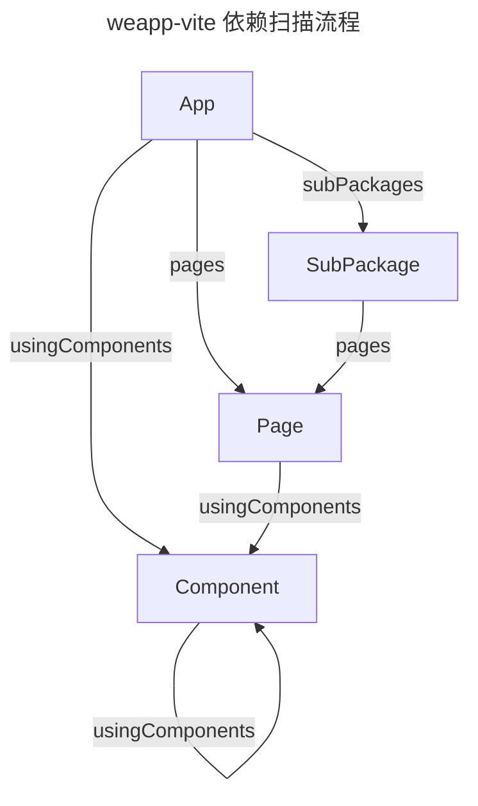

# 依赖分析扫描流程

当 weapp-vite 启动构建或监听时，会先确定哪些文件属于入口，然后递归分析它们之间的引用关系。理解这一流程有助于调试“页面没有被构建”“组件样式缺失”等问题。本页以文字和示意图梳理扫描逻辑，方便贡献者和高级用户参考。

## 入口类型判定

1. **应用入口（App）**
   - 同时存在 `app.js` 与 `app.json`。
   - `app.json` 中的 `pages`、`subPackages`、`usingComponents` 会作为后续扫描起点。
2. **页面入口（Page）**
   - 必须匹配 `page.js`/`.ts` 与同名 `page.wxml`。
   - 若存在 `page.json` 与 `page.wxss` 会一并纳入构建。
3. **组件入口（Component）**
   - 需要具备 `.js/.ts`、`.wxml`、`.json` 三个文件。
   - 且 `json.component === true` 才会被视为自定义组件。
4. **WXML 片段（Fragment）**
   - 通过 `import` / `include` 引入的 `.wxml` 文件。
   - 若未被自动发现，可借助 [`weapp.isAdditionalWxml`](/config/paths-and-generators.md#weapp-isadditionalwxml) 手动纳入。

## 引用边与递归规则

- App → Page：来自 `app.json.pages`。
- App → Component：来自 `app.json.usingComponents`。
- App → SubPackage：来自 `app.json.subPackages`。（分包内再递归页面与组件。）
- Page → Component：来自页面 `json` 的 `usingComponents`。
- Component → 子组件：同样来自组件 `json` 的 `usingComponents`。

weapp-vite 使用静态分析完成上述递归，因此运行时动态拼接的路径不会被自动识别。

## 调试建议

- **确认入口是否完整**：缺少 `.json` 或 `json.component === true` 会导致节点被跳过。
- **关注静态路径**：尽量避免在运行时拼接 `import` 路径；若必须使用，结合 `isAdditionalWxml` 或自定义脚本补充产物。
- **结合 `weapp.debug`**：使用 [`watchFiles`、`resolveId`](/config/enhance-and-debug.md#weapp-debug) 查看是否扫描到对应文件，快速定位异常。
