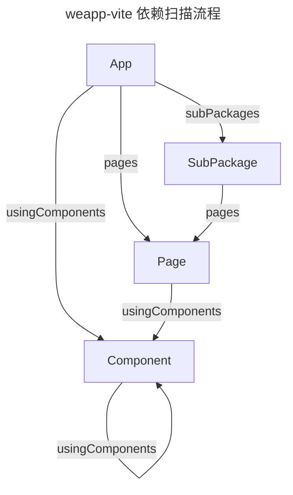

# 依赖分析扫描流程

当 Weapp-vite 启动构建或监听时，会先确定哪些文件属于入口，然后递归分析它们之间的引用关系。理解这一流程有助于调试“页面没有被构建”“组件样式缺失”等问题。本页以文字和示意图梳理扫描逻辑，方便贡献者和高级用户参考。

## 入口类型判定

1. **应用入口（App）**
   - 默认查找 `app.json`（支持 `.json/.jsonc/.json.ts/.json.js`），并解析其中的 `pages`、`subPackages`、`usingComponents` 作为后续扫描起点。
   - 入口脚本优先解析 `app.ts/js`；若不存在则回退到 `app.vue`，并尝试从 `<json>` 提取配置。
2. **页面入口（Page）**
   - 由 `app.json.pages` / `subPackages.pages` 提供的路径决定（若路径无扩展名，会优先解析到 `.vue`，其次是 `.ts/.js`）。
   - 若同目录存在 `page.json` / `page.wxss` / `page.wxml` 会一并纳入构建；`.vue` 内的 `<json>` 也可作为页面配置来源。
3. **组件入口（Component）**
   - 来自 `usingComponents` / 自动导入 / `<script setup>` 自动注册。
   - 组件通常具备 `*.json` 且 `component: true`；缺失时可从 `.vue` 中的 `<json>` 提取。
4. **WXML 片段（Fragment）**
   - 通过 `import` / `include` 引入的 `.wxml` 文件。
   - 动态拼接路径不会被静态分析捕获，需保证模板能被固定路径引用或在构建阶段手动补充产物。

## 引用边与递归规则

- App → Page：来自 `app.json.pages`。
- App → Component：来自 `app.json.usingComponents`。
- App → SubPackage：来自 `app.json.subPackages`。（分包内再递归页面与组件。）
- Page → Component：来自页面 `json` 的 `usingComponents`。
- Component → 子组件：同样来自组件 `json` 的 `usingComponents`。

Weapp-vite 使用静态分析完成上述递归，因此运行时动态拼接的路径不会被自动识别。

## 调试建议

- **确认入口是否完整**：缺少 `.json` 或 `json.component === true` 会导致节点被跳过。
- **关注静态路径**：尽量避免在运行时拼接 `import` 路径；若必须使用，建议提供固定入口或自定义构建脚本补充产物。
- **结合 `weapp.debug`**：使用 [`watchFiles`、`resolveId`](/config/shared.md#weapp-debug) 查看是否扫描到对应文件，快速定位异常。
