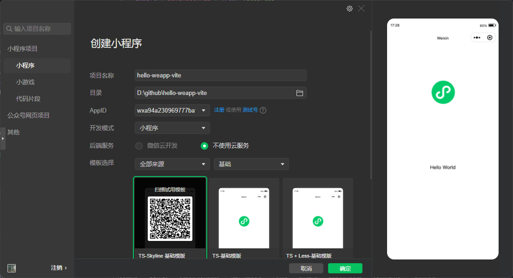

---
outline:
  - 2
  - 4
title: 快速开始
description: 从零创建或接入 weapp-vite 项目，快速跑通开发、构建、IDE 打开、CLI 透传与后续能力扩展。
keywords:
  - Weapp-vite
  - 微信小程序
  - guide
  - 快速开始
  - CLI
  - weapp-ide-cli
  - Vue SFC
---

# 快速开始 {#getting-started}

`weapp-vite` 当前已经不只是“把原生小程序改成 Vite 构建”这么简单。围绕一个项目，你通常会同时用到这几层能力：

- `weapp-vite`：开发、构建、分包策略、自动导入组件、自动路由、Web 预览、MCP。
- `weapp-ide-cli`：打开 IDE、预览、上传、automator 自动化，以及 CI 场景下的命令透传。
- `wevu`：当你使用 Vue SFC 或组合式运行时时，负责响应式、生命周期与最小化 `setData` 更新。
- `create-weapp-vite`：通过官方模板快速创建项目，并对齐目录、脚本与依赖。

如果你只是第一次接触，按本页流程走完即可。想深入某个功能时，再跳到后续专题页。

> [!TIP]
> `weapp-vite` CLI 同时支持完整命令 `weapp-vite` 与简写命令 `wv`，两者完全等价。模板脚本通常会封装成 `pnpm dev` / `pnpm build` / `pnpm open`，如果你直接调用 CLI，可以任选其一。

> [!IMPORTANT]
> 使用前请确保安装 **Node.js `>=22.12.0`**。文档与脚手架场景统一以 **Node.js 22 LTS（至少 `22.12.0`）** 作为最低版本基线，并要求使用原生稳定支持 **ESM** 的版本，同时建议全局安装 `pnpm`（`npm i -g pnpm`）。

## 0. 准备工作

1. 下载并安装最新版 [微信开发者工具](https://developers.weixin.qq.com/miniprogram/dev/devtools/download.html)。
2. 启动开发者工具，在「设置 > 安全设置」中勾选 **服务端口**。这是 `pnpm dev --open`、`pnpm open` 等命令能唤起 IDE 的前提。
3. 第一次使用建议先手动打开一次项目，确认开发者工具可用，避免后续命令行提示 _“请先在微信开发者工具中开启服务端口”_。

## 1. 使用官方模板

### 1. 创建项目

执行以下命令，创建一个集成了 `weapp-vite` 的项目：

::: code-group

```sh [pnpm]
pnpm create weapp-vite
```

```sh [yarn]
yarn create weapp-vite
```

```sh [npm]
npm create weapp-vite@latest
```

```sh [bun]
bun create weapp-vite
```

:::

::: details 生成的 `my-app` 项目中，默认包含以下内容:

```sh
.
├── README.md
├── package.json
├── project.config.json
├── project.private.config.json
├── src
│   ├── app.json
│   ├── app.scss
│   ├── app.ts
│   ├── components
│   │   └── HelloWorld
│   │       ├── HelloWorld.json
│   │       ├── HelloWorld.scss
│   │       ├── HelloWorld.ts
│   │       └── HelloWorld.wxml
│   ├── pages
│   │   └── index
│   │       ├── index.json
│   │       ├── index.scss
│   │       ├── index.ts
│   │       └── index.wxml
│   ├── sitemap.json
│   ├── theme.json
│   ├── utils
│   │   └── util.ts
│   └── vite-env.d.ts
├── tsconfig.json
├── tsconfig.node.json
└── vite.config.ts
```

:::

脚手架当前会根据你选择的模板，生成原生小程序、Wevu、TailwindCSS、TDesign 等不同组合。新项目建议优先用脚手架，而不是手动拷模板。

### 2. 安装依赖

::: code-group

```sh [pnpm]
pnpm i
```

```sh [yarn]
yarn
```

```sh [npm]
npm i
```

```sh [bun]
bun i
```

:::

### 3. 开始开发

#### 执行 `dev` 命令（已开启服务端口后再添加 `--open`）

::: code-group

```sh [pnpm]
pnpm dev
pnpm dev --open # 已开启服务端口时自动打开微信开发者工具
```

```sh [yarn]
yarn dev --open # 已开启服务端口时自动打开微信开发者工具
```

```sh [npm]
npm run dev -- --open # 已开启服务端口时自动打开微信开发者工具
```

```sh [bun]
bun dev --open # 已开启服务端口时自动打开微信开发者工具
```

:::

> [!TIP]
> 如果你当前是在 Codex、Claude Code、Cursor CLI 这类 AI 终端里工作，且配置保持默认 `weapp.forwardConsole.enabled = 'auto'`，那么 `pnpm dev --open` 在打开微信开发者工具后还会自动尝试把小程序 `console` 日志桥接回当前终端。
>
> 想手动进入持续监听模式时，可直接执行：
>
> ```sh
> weapp-vite ide logs --open
> # 或
> wv ide logs --open
> ```

### 4. 打开开发者工具

#### 执行 `open` 命令

::: code-group

```sh [pnpm]
pnpm open
```

```sh [yarn]
yarn open
```

```sh [npm]
npm run open
```

```sh [bun]
bun open
```

:::

> [!TIP]
> 如果命令行提示 “请先在微信开发者工具中开启服务端口”，请回到「微信开发者工具 → 设置 → 安全设置」重新勾选该选项，并重启开发者工具后再次运行命令。

## 2. 手动接入现有项目

### 1. 先准备一个原生项目

如果你不想用脚手架，也可以先用开发者工具创建一个“原生小程序”，再手动接入 Weapp-vite：

打开微信开发者工具 → 点击 `+` → 依次选择：

- `开发模式: 小程序`
- `后端服务: 不使用云服务`
- `模板选择: 基础（JS）`

> 使用 `JS` 基础模板创建项目，依然可以使用 `TypeScript`



> 如果你创建的是 **TS 模板项目**，请在 `vite.config.ts` 中设置 [`weapp.srcRoot`](../config/paths.md#weapp-srcroot) 为 `'./miniprogram'`。

### 2. 接入 `weapp-vite`

如果你已经有运行中的小程序，希望在原目录上直接接入 Weapp-vite，请跳转到[《手动集成》](/guide/manual-integration)查看完整步骤（依赖安装、脚本配置、目录迁移等）。这里的快速开始章节仅演示模板创建流程。

完成依赖与脚本配置后，执行一次安装命令，确保 `node_modules` 就绪：

::: code-group

```sh [pnpm]
pnpm i
```

```sh [yarn]
yarn
```

```sh [npm]
npm i
```

```sh [bun]
bun i
```

:::

完成后，小程序 API 类型声明、`weapp-vite` 生成的支持文件，以及后续可选的自动路由 / 自动导入组件类型文件，都会逐步接入到编辑器提示体系里。

> 想要一步步把现有项目接入 Weapp-vite：参考[《手动集成》](/guide/manual-integration)。想知道 CLI 初始化做了哪些改动：阅读 [`weapp-vite init 做了什么?`](/deep/init)。

## 常用命令

完整参数、透传规则与更多示例可查看 [CLI 命令参考](/guide/cli)。

### 开发命令

```sh
pnpm dev
pnpm dev --open # 已开启服务端口时自动打开微信开发者工具
pnpm dev -o # 已开启服务端口时自动打开微信开发者工具
weapp-vite ide logs --open # 持续监听 DevTools console，并桥接回终端
wv ide logs --open # 与 weapp-vite ide logs --open 等价
```

命令会启动监听构建。保存后会自动重新编译并同步到开发目录；如果已开启服务端口，也可以配合 `--open` 直接拉起微信开发者工具。

### 构建命令

```sh
pnpm build
pnpm build --open # 打开微信开发者工具，见下方
pnpm build -o # 打开微信开发者工具，见下方
```

此时会执行生产构建，重新生成输出目录，并应用压缩、静态资源处理和分包产物整理。

### 打开微信开发者工具命令

```sh
pnpm open
```

使用该命令直接打开微信开发者工具（需要先开启服务端口）。

也可以通过 `weapp-vite` 直接调用 `weapp-ide-cli` 的完整命令能力（预览、上传、automator、config 等）：

```sh
# 直接透传（推荐在脚本中使用）
weapp-vite preview --project ./dist/build/mp-weixin
weapp-vite upload --project ./dist/build/mp-weixin -v 1.0.0 -d "release"
weapp-vite config lang en
weapp-vite screenshot --project ./dist/build/mp-weixin --json
weapp-vite compare --project ./dist/build/mp-weixin --baseline .screenshots/baseline/index.png --max-diff-pixels 100 --json
wv preview --project ./dist/build/mp-weixin

# 或使用命名空间透传
weapp-vite ide preview --project ./dist/build/mp-weixin
weapp-vite ide config show
wv ide preview --project ./dist/build/mp-weixin
```

> [!WARNING]
> `weapp-vite` 会优先执行自己的原生命令；只有未命中时，才会回退透传到 `weapp-ide-cli`。因此 `build/dev/open/analyze/generate/mcp/prepare` 这些命令不会被官方 IDE CLI 覆盖。

## 下一步建议

- 想了解命令行能力边界：看 [CLI 命令参考](/guide/cli)。
- 想开始使用 Vue 单文件组件：看 [Vue SFC 开发](/guide/vue-sfc/) 和 [Wevu 概览](/wevu/)。
- 想减少手写 `app.json.pages` 与 `usingComponents`：看 [自动路由](/guide/auto-routes) 与 [自动导入组件](/guide/auto-import)。
- 想做 AI 协作或本地 MCP：看 [AI 协作](/guide/ai) 与 [@weapp-vite/mcp](/packages/mcp)。
  > 请在 `微信开发者工具` → `设置` → `安全设置` → 勾选 `服务端口`。

> [!WARNING]
> Linux 目前没有官方微信开发者工具，请安装社区版：[msojocs/wechat-web-devtools-linux](https://github.com/msojocs/wechat-web-devtools-linux)，并把 `wechat-devtools-cli` 链接到系统 `PATH`，例如：

```sh
sudo ln -s /opt/apps/io.github.msojocs.wechat-devtools-linux/files/bin/bin/wechat-devtools-cli /usr/local/bin/
```

### 生成组件命令

```sh
pnpm g [filename]
```

用于快速生成页面/组件/App 等基础文件，详见 [生成脚手架](/guide/generate)。

## 简易配置项

如果你用微信开发者工具创建的是 **TypeScript 模板**（源码目录为 `miniprogram/`），需要把 `weapp.srcRoot` 指向它；否则按模板默认的 `src/` 即可。

配置项可以与 `vite` 通用，同时加入了 `weapp-vite` 的扩展:

`vite.config.[m]ts`:

```ts
import { defineConfig } from 'weapp-vite/config'

export default defineConfig({
  weapp: {
    // 让 weapp-vite 知道 app.json / pages/ 在哪个目录下
    srcRoot: './miniprogram',
  },
})
```

你也可以在 `defineConfig` 里继续使用其他 Vite 插件（例如 `weapp-tailwindcss`）。

更多配置见：[/config/](/config/)
